<div align="center">

<!-- COMPLETAR: logo de la universidad en assets/img/logo-upc.png -->


**UNIVERSIDAD PERUANA DE CIENCIAS APLICADAS**

**Ingeniería de Software**

**Ciclo 2026-20**

**1ASI0732 — Diseño de Experimentos de Ingeniería de Software**

**NRC:** 9108 <!-- COMPLETAR: número de referencia del curso -->

**Profesor:** Julio Manuel Noriega Melendez <!-- COMPLETAR: nombre del profesor -->

# Informe de Trabajo Final

**Startup:** SST Solutions <!-- COMPLETAR: nombre del startup -->

**Producto:** Resguardo — Sistema de Gestión de Seguridad y Salud en el Trabajo

### Integrantes

| Código | Apellidos y Nombres |
|---|---|
|u202310837| Esquirva León Miguel Juan Diego|
|u20231c069| Mora Blas Diego Alonzo|
|U202310670| Villafuerte Tapia Renzo Alonso|

**Septiembre de 2026**

</div>

---

## Registro de Versiones del Informe

| Versión | Fecha | Autor | Descripción de modificación |
|---|---|---|---|
| 1.0 | 2026-09-13 | Esquirva León Miguel Juan Diego | Creación del repositorio del informe y de la estructura completa de capítulos según el enunciado del trabajo final. |
| 1.1 | 2026-10-07 | Villafuerte Tapia Renzo Alonso | Especificación de requisitos del Capítulo III: diecinueve épicas, 128 historias de usuario con criterios de aceptación en Gherkin y columna de plataforma, 34 historias técnicas y Product Backlog priorizado de 162 elementos con sus Story Points. Capítulo V: Sprint Backlogs desglosados en work-items con estimación en horas y área responsable, acuerdo de nivel de servicio del producto como SaaS, y documentación del flujo de trabajo con GitFlow y Conventional Commits. Capítulo IV: arquitectura de información y sistema de navegación verificados contra el código, y diagrama entidad-relación completo contrastado con los modelos de datos. Desarrollo del API REST, del panel web y de la aplicación Android. |

---

## Project Report Collaboration Insights

**Repositorio del informe:** https://github.com/sst-peru/sst-report
**Organización de GitHub:** https://github.com/sst-peru

El informe se elabora de forma incremental en este repositorio, aplicando **GitFlow** y
**Conventional Commits**, las mismas convenciones que se usan en los tres repositorios de
producto. La rama `main` conserva únicamente las versiones entregadas; `develop` integra el
trabajo en curso, y cada sección del informe se redacta en una rama `docs/<sección>` que se
incorpora mediante Pull Request.

<!-- COMPLETAR en cada entrega: descripción de cómo se desarrollaron las actividades de
     elaboración del informe, más capturas de los analíticos de colaboración y commits de
     GitHub (pestaña Insights → Contributors y Commits). Las capturas van en assets/img/. -->

---

## Contenido

<!-- TOC:inicio -->

- [Capítulo I: Introducción](#capítulo-i-introducción)
  - [1.1. Startup Profile](#11-startup-profile)
    - [1.1.1. Descripción de la Startup](#111-descripción-de-la-startup)
    - [1.1.2. Perfiles de integrantes del equipo](#112-perfiles-de-integrantes-del-equipo)
  - [1.2. Solution Profile](#12-solution-profile)
    - [1.2.1. Antecedentes y problemática](#121-antecedentes-y-problemática)
      - [1.2.1.1. The 5 'W's and 2 'H's](#1211-the-5-ws-and-2-hs)
    - [1.2.2. Lean UX Process](#122-lean-ux-process)
      - [1.2.2.1. Lean UX Problem Statements](#1221-lean-ux-problem-statements)
      - [1.2.2.2. Lean UX Assumptions](#1222-lean-ux-assumptions)
      - [1.2.2.3. Lean UX Hypothesis Statements](#1223-lean-ux-hypothesis-statements)
      - [1.2.2.4. Lean UX Canvas](#1224-lean-ux-canvas)
  - [1.3. Segmentos objetivo](#13-segmentos-objetivo)
- [Capítulo II: Requirements Elicitation & Analysis](#capítulo-ii-requirements-elicitation--analysis)
  - [2.1. Competidores](#21-competidores)
    - [2.1.1. Análisis competitivo](#211-análisis-competitivo)
    - [2.1.2. Estrategias y tácticas frente a competidores](#212-estrategias-y-tácticas-frente-a-competidores)
  - [2.2. Entrevistas](#22-entrevistas)
    - [2.2.1. Diseño de entrevistas](#221-diseño-de-entrevistas)
    - [2.2.2. Registro de entrevistas](#222-registro-de-entrevistas)
    - [2.2.3. Análisis de entrevistas](#223-análisis-de-entrevistas)
  - [2.3. Needfinding](#23-needfinding)
    - [2.3.1. User Personas](#231-user-personas)
    - [2.3.2. User Task Matrix](#232-user-task-matrix)
    - [2.3.3. User Journey Mapping](#233-user-journey-mapping)
    - [2.3.4. Empathy Mapping](#234-empathy-mapping)
    - [2.3.5. As-is Scenario Mapping](#235-as-is-scenario-mapping)
  - [2.4. Ubiquitous Language](#24-ubiquitous-language)
- [Capítulo III: Requirements Specification](#capítulo-iii-requirements-specification)
  - [3.1. To-Be Scenario Mapping](#31-to-be-scenario-mapping)
  - [3.2. User Stories](#32-user-stories)
    - [Épicas](#épicas)
    - [EP01 — Acceso y cuentas](#ep01--acceso-y-cuentas)
    - [EP02 — Reporte de actos y condiciones inseguras](#ep02--reporte-de-actos-y-condiciones-inseguras)
    - [EP03 — Gestión del hallazgo](#ep03--gestión-del-hallazgo)
    - [EP04 — Matriz IPERC](#ep04--matriz-iperc)
    - [EP05 — Control de EPP](#ep05--control-de-epp)
    - [EP06 — Inspecciones periódicas](#ep06--inspecciones-periódicas)
    - [EP07 — Comité de SST](#ep07--comité-de-sst)
    - [EP08 — Métricas y evidencia](#ep08--métricas-y-evidencia)
    - [EP09 — Experimento A/B](#ep09--experimento-ab)
    - [EP10 — Calidad de uso y operación](#ep10--calidad-de-uso-y-operación)
    - [EP11 — Accidentes e incidentes](#ep11--accidentes-e-incidentes)
    - [EP12 — Capacitación e inducción](#ep12--capacitación-e-inducción)
    - [EP13 — Mapa de riesgos y señalización](#ep13--mapa-de-riesgos-y-señalización)
    - [EP14 — Documentación del SGSST](#ep14--documentación-del-sgsst)
    - [EP15 — Monitoreo de agentes ocupacionales](#ep15--monitoreo-de-agentes-ocupacionales)
    - [EP16 — Contratistas y terceros](#ep16--contratistas-y-terceros)
    - [EP17 — Notificaciones y alertas](#ep17--notificaciones-y-alertas)
    - [EP18 — Cuenta y servicio](#ep18--cuenta-y-servicio)
    - [EP19 — Seguridad y privacidad de datos](#ep19--seguridad-y-privacidad-de-datos)
    - [Ampliaciones propuestas sobre épicas existentes](#ampliaciones-propuestas-sobre-épicas-existentes)
    - [Historias técnicas](#historias-técnicas)
  - [3.3. Product Backlog](#33-product-backlog)
  - [3.4. Impact Mapping](#34-impact-mapping)
- [Capítulo IV: Product Design](#capítulo-iv-product-design)
  - [4.1. Style Guidelines](#41-style-guidelines)
    - [4.1.1. General Style Guidelines](#411-general-style-guidelines)
    - [4.1.2. Web Style Guidelines](#412-web-style-guidelines)
    - [4.1.3. Mobile Style Guidelines](#413-mobile-style-guidelines)
      - [4.1.3.1. iOS Mobile Style Guidelines](#4131-ios-mobile-style-guidelines)
      - [4.1.3.2. Android Mobile Style Guidelines](#4132-android-mobile-style-guidelines)
  - [4.2. Information Architecture](#42-information-architecture)
    - [4.2.1. Organization Systems](#421-organization-systems)
    - [4.2.2. Labeling Systems](#422-labeling-systems)
    - [4.2.3. SEO Tags and Meta Tags](#423-seo-tags-and-meta-tags)
    - [4.2.4. Searching Systems](#424-searching-systems)
    - [4.2.5. Navigation Systems](#425-navigation-systems)
      - [Niveles de navegación](#niveles-de-navegación)
      - [Destinos por rol y plataforma](#destinos-por-rol-y-plataforma)
      - [Reglas de comportamiento](#reglas-de-comportamiento)
      - [Mapa de navegación](#mapa-de-navegación)
  - [4.3. Landing Page UI Design](#43-landing-page-ui-design)
    - [4.3.1. Landing Page Wireframe](#431-landing-page-wireframe)
    - [4.3.2. Landing Page Mock-up](#432-landing-page-mock-up)
  - [4.4. Mobile Applications UX/UI Design](#44-mobile-applications-uxui-design)
    - [4.4.1. Mobile Applications Wireframes](#441-mobile-applications-wireframes)
    - [4.4.2. Mobile Applications Wireflow Diagrams](#442-mobile-applications-wireflow-diagrams)
    - [4.4.3. Mobile Applications Mock-ups](#443-mobile-applications-mock-ups)
    - [4.4.4. Mobile Applications User Flow Diagrams](#444-mobile-applications-user-flow-diagrams)
  - [4.5. Mobile Applications Prototyping](#45-mobile-applications-prototyping)
    - [4.5.1. Android Mobile Applications Prototyping](#451-android-mobile-applications-prototyping)
    - [4.5.2. iOS Mobile Applications Prototyping](#452-ios-mobile-applications-prototyping)
  - [4.6. Web Applications UX/UI Design](#46-web-applications-uxui-design)
    - [4.6.1. Web Applications Wireframes](#461-web-applications-wireframes)
    - [4.6.2. Web Applications Wireflow Diagrams](#462-web-applications-wireflow-diagrams)
    - [4.6.3. Web Applications Mock-ups](#463-web-applications-mock-ups)
    - [4.6.4. Web Applications User Flow Diagrams](#464-web-applications-user-flow-diagrams)
  - [4.7. Web Applications Prototyping](#47-web-applications-prototyping)
  - [4.8. Domain-Driven Software Architecture](#48-domain-driven-software-architecture)
    - [4.8.1. Software Architecture Context Diagram](#481-software-architecture-context-diagram)
    - [4.8.2. Software Architecture Container Diagrams](#482-software-architecture-container-diagrams)
    - [4.8.3. Software Architecture Components Diagrams](#483-software-architecture-components-diagrams)
  - [4.9. Software Object-Oriented Design](#49-software-object-oriented-design)
    - [4.9.1. Class Diagrams](#491-class-diagrams)
    - [4.9.2. Class Dictionary](#492-class-dictionary)
  - [4.10. Database Design](#410-database-design)
    - [4.10.1. Relational/Non-Relational Database Diagram](#4101-relationalnon-relational-database-diagram)
- [Capítulo V: Product Implementation](#capítulo-v-product-implementation)
  - [5.1. Software Configuration Management](#51-software-configuration-management)
    - [5.1.1. Software Development Environment Configuration](#511-software-development-environment-configuration)
    - [5.1.2. Source Code Management](#512-source-code-management)
    - [5.1.3. Source Code Style Guide & Conventions](#513-source-code-style-guide--conventions)
    - [5.1.4. Software Deployment Configuration](#514-software-deployment-configuration)
  - [5.2. Product Implementation & Deployment](#52-product-implementation--deployment)
    - [5.2.1. Sprint Backlogs](#521-sprint-backlogs)
      - [Sprint 1](#sprint-1)
      - [Sprint 2](#sprint-2)
      - [Resumen de los dos sprints](#resumen-de-los-dos-sprints)
    - [5.2.2. Implemented Landing Page Evidence](#522-implemented-landing-page-evidence)
    - [5.2.3. Implemented Frontend-Web Application Evidence](#523-implemented-frontend-web-application-evidence)
    - [5.2.4. Acuerdo de Servicio - SaaS](#524-acuerdo-de-servicio---saas)
    - [5.2.5. Implemented Native-Mobile Application Evidence](#525-implemented-native-mobile-application-evidence)
    - [5.2.6. Implemented RESTful API and/or Serverless Backend Evidence](#526-implemented-restful-api-andor-serverless-backend-evidence)
    - [5.2.7. RESTful API documentation](#527-restful-api-documentation)
    - [5.2.8. Team Collaboration Insights](#528-team-collaboration-insights)
  - [5.3. Video About-the-Product](#53-video-about-the-product)
- [Capítulo VI: Product Verification & Validation](#capítulo-vi-product-verification--validation)
  - [6.1. Testing Suites & Validation](#61-testing-suites--validation)
    - [6.1.1. Core Entities Unit Tests](#611-core-entities-unit-tests)
    - [6.1.2. Core Integration Tests](#612-core-integration-tests)
    - [6.1.3. Core Behavior-Driven Development](#613-core-behavior-driven-development)
    - [6.1.4. Core System Tests](#614-core-system-tests)
  - [6.2. Static testing & Verification](#62-static-testing--verification)
    - [6.2.1. Static Code Analysis](#621-static-code-analysis)
      - [6.2.1.1. Coding standard & Code conventions](#6211-coding-standard--code-conventions)
      - [6.2.1.2. Code Quality & Code Security](#6212-code-quality--code-security)
    - [6.2.2. Reviews](#622-reviews)
  - [6.3. Validation Interviews](#63-validation-interviews)
    - [6.3.1. Diseño de Entrevistas](#631-diseño-de-entrevistas)
    - [6.3.2. Registro de Entrevistas](#632-registro-de-entrevistas)
    - [6.3.3. Evaluaciones según heurísticas](#633-evaluaciones-según-heurísticas)
  - [6.4. Auditoría de Experiencias de Usuario](#64-auditoría-de-experiencias-de-usuario)
    - [6.4.1. Auditoría realizada](#641-auditoría-realizada)
      - [6.4.1.1. Información del grupo auditado](#6411-información-del-grupo-auditado)
      - [6.4.1.2. Cronograma de auditoría realizada](#6412-cronograma-de-auditoría-realizada)
      - [6.4.1.3. Contenido de auditoría realizada](#6413-contenido-de-auditoría-realizada)
    - [6.4.2. Auditoría recibida](#642-auditoría-recibida)
      - [6.4.2.1. Información del grupo auditor](#6421-información-del-grupo-auditor)
      - [6.4.2.2. Cronograma de auditoría recibida](#6422-cronograma-de-auditoría-recibida)
      - [6.4.2.3. Contenido de auditoría recibida](#6423-contenido-de-auditoría-recibida)
      - [6.4.2.4. Resumen de modificaciones para subsanar hallazgos](#6424-resumen-de-modificaciones-para-subsanar-hallazgos)
- [Capítulo VII: DevOps Practices](#capítulo-vii-devops-practices)
  - [7.1. Continuous Integration](#71-continuous-integration)
    - [7.1.1. Tools and Practices](#711-tools-and-practices)
    - [7.1.2. Build & Test Suite Pipeline Components](#712-build--test-suite-pipeline-components)
  - [7.2. Continuous Delivery](#72-continuous-delivery)
    - [7.2.1. Tools and Practices](#721-tools-and-practices)
    - [7.2.2. Stages Deployment Pipeline Components](#722-stages-deployment-pipeline-components)
  - [7.3. Continuous Deployment](#73-continuous-deployment)
    - [7.3.1. Tools and Practices](#731-tools-and-practices)
    - [7.3.2. Production Deployment Pipeline Components](#732-production-deployment-pipeline-components)
  - [7.4. Continuous Monitoring](#74-continuous-monitoring)
    - [7.4.1. Tools and Practices](#741-tools-and-practices)
    - [7.4.2. Monitoring Pipeline Components](#742-monitoring-pipeline-components)
    - [7.4.3. Alerting Pipeline Components](#743-alerting-pipeline-components)
    - [7.4.4. Notification Pipeline Components](#744-notification-pipeline-components)
- [Capítulo VIII: Experiment-Driven Development](#capítulo-viii-experiment-driven-development)
  - [8.1. Experiment Planning](#81-experiment-planning)
    - [8.1.1. As-Is Summary](#811-as-is-summary)
    - [8.1.2. Raw Material: Assumptions, Knowledge Gaps, Ideas, Claims](#812-raw-material-assumptions-knowledge-gaps-ideas-claims)
    - [8.1.3. Experiment-Ready Questions](#813-experiment-ready-questions)
    - [8.1.4. Question Backlog](#814-question-backlog)
    - [8.1.5. Experiment Cards](#815-experiment-cards)
  - [8.2. Experiment Design](#82-experiment-design)
    - [8.2.1. Hypotheses](#821-hypotheses)
    - [8.2.2. Domain Business Metrics](#822-domain-business-metrics)
    - [8.2.3. Measures](#823-measures)
    - [8.2.4. Conditions](#824-conditions)
    - [8.2.5. Scale Calculations and Decisions](#825-scale-calculations-and-decisions)
    - [8.2.6. Methods Selection](#826-methods-selection)
    - [8.2.7. Data Analytics: Goals, KPIs and Metrics Selection](#827-data-analytics-goals-kpis-and-metrics-selection)
    - [8.2.8. Web and Mobile Tracking Plan](#828-web-and-mobile-tracking-plan)
  - [8.3. Experimentation](#83-experimentation)
    - [8.3.1. To-Be User Stories](#831-to-be-user-stories)
    - [8.3.2. To-Be Product Backlog](#832-to-be-product-backlog)
    - [8.3.3. Pipeline-supported, Experiment-Driven To-Be Software Platform Lifecycle](#833-pipeline-supported-experiment-driven-to-be-software-platform-lifecycle)
    - [8.3.4. To-Be Sprint Backlogs](#834-to-be-sprint-backlogs)
    - [8.3.5. Implemented To-Be Landing Page Evidence](#835-implemented-to-be-landing-page-evidence)
    - [8.3.6. Implemented To-Be Frontend-Web Application Evidence](#836-implemented-to-be-frontend-web-application-evidence)
    - [8.3.7. Implemented To-Be Native-Mobile Application Evidence](#837-implemented-to-be-native-mobile-application-evidence)
    - [8.3.8. Implemented To-Be RESTful API and/or Serverless Backend Evidence](#838-implemented-to-be-restful-api-andor-serverless-backend-evidence)
    - [8.3.9. Team Collaboration Insights](#839-team-collaboration-insights)
  - [8.4. To-Be Validation Interviews](#84-to-be-validation-interviews)
    - [8.4.1. Diseño de Entrevistas](#841-diseño-de-entrevistas)
    - [8.4.2. Registro de Entrevistas](#842-registro-de-entrevistas)
  - [8.5. Experiment Aftermath & Analysis](#85-experiment-aftermath--analysis)
    - [8.5.1. Analysis and Interpretation of Results](#851-analysis-and-interpretation-of-results)
    - [8.5.2. Re-scored and Re-prioritized Question Backlog](#852-re-scored-and-re-prioritized-question-backlog)
  - [8.6. Continuous Learning](#86-continuous-learning)
    - [8.6.1. Shareback Session Artifacts: Learning Workflow](#861-shareback-session-artifacts-learning-workflow)
  - [8.7. To-Be Software Platform Pre-launch](#87-to-be-software-platform-pre-launch)
    - [8.7.1. About-the-Product Intro Video](#871-about-the-product-intro-video)
    - [8.7.2. Resumen usando Gees Framework](#872-resumen-usando-gees-framework)
  - [8.8. Matriz de Evaluación Ética y de Impacto](#88-matriz-de-evaluación-ética-y-de-impacto)
- [Conclusiones](#conclusiones)
  - [Avance de conclusiones](#avance-de-conclusiones)
  - [Conclusiones y recomendaciones](#conclusiones-y-recomendaciones)
  - [Video App Validation](#video-app-validation)
  - [Video About-the-Team](#video-about-the-team)
- [Bibliografía](#bibliografía)
- [Anexos](#anexos)
  - [Anexo A. Videos de Exposiciones](#anexo-a-videos-de-exposiciones)
  - [Anexo B. Enlaces del proyecto](#anexo-b-enlaces-del-proyecto)
  - [Anexo C. Credenciales de demostración](#anexo-c-credenciales-de-demostración)
  - [Anexo D. Cálculo del tamaño de muestra](#anexo-d-cálculo-del-tamaño-de-muestra)
  - [Anexo E. Estructura del repositorio del informe](#anexo-e-estructura-del-repositorio-del-informe)
  - [Anexo F. Student Outcome](#anexo-f-student-outcome)
  - [Anexo G. Corte de evidencia técnica](#anexo-g-corte-de-evidencia-técnica)
  - [Anexo H. Matriz de evidencias del avance](#anexo-h-matriz-de-evidencias-del-avance)

<!-- TOC:fin -->

---

## Student Outcome

Cada participante del equipo debe sustentar evidencia de cómo las actividades realizadas en el
trabajo final han ayudado a desarrollar las dimensiones del student outcome. Por ello en esta
sección debe haber una subsección por cada alumno donde éste describa por escrito la relación
entre el outcome, sus dimensiones y el trabajo que ha realizado. Esto se complementa con lo
reflejado en los testimonios expuestos que forman parte del video About The Team.

El curso contribuye al cumplimiento del Student Outcome ABET:

**ABET – EAC - Student Outcome 4**

**Criterio:** La capacidad de reconocer responsabilidades éticas y profesionales en situaciones
de ingeniería y hacer juicios informados, que deben considerar el impacto de las soluciones de
ingeniería en contextos globales, económicos, ambientales y sociales.

En el siguiente cuadro se describe las acciones realizadas y enunciados de conclusiones por
parte del grupo, que permiten sustentar el haber alcanzado el logro del ABET – EAC - Student
Outcome 4.

| Criterio específico | Acciones realizadas | Conclusiones |
|---|---|---|
| **4.c.1** Reconoce responsabilidad ética y profesional en situaciones de ingeniería de software | **Esquirva León Miguel Juan Diego**<br>**TF:** <!-- COMPLETAR: acciones concretas y verificables --><br><br>**Mora Blas Diego Alonzo**<br>**TF:** <!-- COMPLETAR: acciones concretas y verificables --><br><br>**Villafuerte Tapia Renzo Alonso**<br>**TF:** <!-- COMPLETAR: acciones concretas y verificables --> | <!-- COMPLETAR: conclusiones del grupo, acumulables entre entregas --> |
| **4.c.2** Emite juicios informados considerando el impacto de las soluciones de ingeniería de software en contextos globales, económicos, ambientales y sociales | **Esquirva León Miguel Juan Diego**<br>**TF:** <!-- COMPLETAR: acciones concretas y verificables --><br><br>**Mora Blas Diego Alonzo**<br>**TF:** <!-- COMPLETAR: acciones concretas y verificables --><br><br>**Villafuerte Tapia Renzo Alonso**<br>**TF:** <!-- COMPLETAR: acciones concretas y verificables --> | <!-- COMPLETAR: conclusiones del grupo, acumulables entre entregas --> |

El enunciado del trabajo final pide, además del cuadro anterior, **una subsección por cada
integrante** en la que describa por escrito la relación entre el outcome, sus dimensiones y el
trabajo que ha realizado. Esas subsecciones son las que siguen; cada integrante redacta la suya.

### Esquirva León Miguel Juan Diego

<!-- COMPLETAR: redacción propia del integrante sobre los criterios 4.c.1 y 4.c.2. -->

### Mora Blas Diego Alonzo

<!-- COMPLETAR: redacción propia del integrante sobre los criterios 4.c.1 y 4.c.2. -->

### Villafuerte Tapia Renzo Alonso

<!-- COMPLETAR: redacción propia del integrante sobre los criterios 4.c.1 y 4.c.2. -->

---

## Estructura del repositorio

| Archivo | Contenido |
|---|---|
| `README.md` | Informe completo: carátula, registro de versiones, índice, Student Outcome, capítulos, conclusiones, bibliografía y anexos. |
| `assets/img/` | Imágenes: capturas, diagramas exportados, fotos del equipo, logos. |
| `assets/diagrams/` | Fuentes editables de los diagramas (`.drawio`, `.puml`, `.mmd`). |
| `tools/build.py` | Actualiza el índice del README e informa las marcas pendientes antes de exportar a PDF. |
| `CONTRIBUTING.md` | GitFlow, Conventional Commits y flujo de trabajo del informe. |

## Cómo actualizar y exportar el informe

```bash
python tools/build.py toc     # regenera el índice dentro del README
python tools/build.py         # actualiza el índice y muestra las marcas pendientes
```

Para el PDF de la entrega, exportar `README.md` respetando la nomenclatura del
enunciado: `upc-pre-202620-1asi0732-<NRC>-<startup>-report-tf.pdf`

---

# Capítulo I: Introducción

## 1.1. Startup Profile

### 1.1.1. Descripción de la Startup

<!-- COMPLETAR: nombre del startup. Reemplazar [NOMBRE DEL STARTUP] en todo el documento. -->

**Dangery** es una startup de software peruana dedicada a llevar la gestión de
la seguridad y salud en el trabajo del papel al dato en tiempo real. Nace de una observación
concreta: en la mayoría de empresas medianas y pequeñas del país el sistema de gestión de SST
existe formalmente —hay matriz IPERC, hay comité, hay registros— pero funciona con semanas de
retraso respecto de lo que realmente ocurre en el frente de trabajo.

**Misión.** Reducir el tiempo entre que un trabajador detecta un peligro y la persona que puede
corregirlo se entera, entregando a las empresas peruanas herramientas que hagan del cumplimiento
de la Ley N° 29783 una consecuencia de operar bien, y no un trámite que se resuelve el día antes
de una inspección.

**Visión.** Ser la plataforma de referencia para la gestión operativa de SST en la mediana
empresa peruana, en los sectores donde el riesgo es alto y la digitalización es baja:
construcción, manufactura, minería de menor escala y logística.

**Producto.** *Resguardo*, un sistema de gestión de SST compuesto por una aplicación móvil
Android para el trabajador de campo, un panel web para el supervisor y el comité de SST, y una
API REST que ambos consumen.

### 1.1.2. Perfiles de integrantes del equipo

<!-- IMAGEN REQUERIDA: una foto por integrante, cuadrada y de aproximadamente 400x400 px, en
     assets/img/perfil-1.jpg, perfil-2.jpg y perfil-3.jpg -->

**Integrante 1**

| | |
|---|---|
|  | **<!-- COMPLETAR: Esquirva León Miguel Juan Diego -->**<br>**Código:60752953** <!-- COMPLETAR --><br>**Carrera: Ingenieria de Software** <!-- COMPLETAR --><br><br><!-- COMPLETAR: párrafo de resumen. Indicar los principales conocimientos técnicos y habilidades que aporta al equipo, siendo concreto: lenguajes, frameworks, herramientas y experiencias previas relevantes. --> |

**Integrante 2**

| | |
|---|---|
|  | **<!-- COMPLETAR: Apellidos y Nombres -->**<br>**Código:** <!-- COMPLETAR --><br>**Carrera:** <!-- COMPLETAR --><br><br><!-- COMPLETAR: párrafo de resumen con los conocimientos técnicos y habilidades que aporta al equipo. --> |

**Integrante 3**

| | |
|---|---|
|  | **Villafuerte Tapia Renzo Alonso**<br>**Código:** U202310670<br>**Carrera:** Ingeniería de Software<br><br>Aporta al equipo el desarrollo de extremo a extremo de las tres piezas del producto: el API REST en Python con Django y Django REST Framework, incluida la autenticación con JWT y el aislamiento de datos entre empresas; el panel web en React con TypeScript y Vite; y la aplicación Android nativa en Kotlin con Jetpack Compose, donde implementó la operación sin conexión con Room y WorkManager. Se encargó también de la configuración del flujo de trabajo del equipo —GitFlow, Conventional Commits con validación por hooks e integración continua en GitHub Actions— y de la especificación del backlog y de los Sprint Backlogs del informe. |

## 1.2. Solution Profile

### 1.2.1. Antecedentes y problemática

La Ley N° 29783, Ley de Seguridad y Salud en el Trabajo, y su reglamento, el D.S. N° 005-2012-TR,
obligan a toda empresa peruana a implementar un Sistema de Gestión de Seguridad y Salud en el
Trabajo. Ese sistema incluye, como mínimo, un comité de SST —o un supervisor cuando la empresa
tiene menos de veinte trabajadores—, una matriz IPERC de identificación de peligros y evaluación
de riesgos, el registro de actos y condiciones inseguras, el control de entrega de equipos de
protección personal y un programa de inspecciones periódicas.

En la práctica, en la mediana y pequeña empresa ese sistema opera así:

1. Un trabajador detecta una condición peligrosa —una escalera rota, un cable expuesto, un piso
   mojado sin señalizar— pero **no tiene una forma simple de reportarla**. Debe llenar un
   formato en papel, o avisar verbalmente a su jefe inmediato, que puede olvidarlo.
2. Cuando el reporte sí se registra, **queda en una hoja de cálculo o en un cuaderno físico**,
   sin hora exacta, sin fotografía y sin ubicación.
3. La matriz IPERC, que debería alimentarse de lo que ocurre en campo, **se actualiza en
   revisiones esporádicas**, a veces con meses de diferencia respecto de los hechos.
4. Ante una inspección de SUNAFIL, la empresa **no puede evidenciar** que gestiona sus riesgos:
   tiene los documentos, pero no la trazabilidad entre el hallazgo, la acción correctiva y su
   verificación.
5. Cuando ocurre un accidente grave, se descubre que el peligro **ya había sido advertido** y
   que nadie le hizo seguimiento.

El problema, resumido: **el dato de seguridad existe en la cabeza de los trabajadores o en
papel, pero no fluye a tiempo hacia quien puede actuar.**

**Objetivos del proyecto**

| # | Objetivo |
|---|---|
| O1 | Reducir a menos de un minuto de trabajo del operario el tiempo entre la detección de un peligro y su registro formal, incluso sin conectividad en obra, mina o planta. |
| O2 | Dar al comité de SST trazabilidad completa del hallazgo: quién reportó, quién fue asignado, qué se hizo y cuándo se cerró. |
| O3 | Mantener la matriz IPERC alimentada por hallazgos reales de campo y no solo por revisiones periódicas. |
| O4 | Producir, en un clic, la evidencia documental que una inspección de SUNAFIL requiere. |

**Restricciones y alcance**

| # | Restricción |
|---|---|
| R1 | La aplicación móvil se desarrolla para Android nativo. iOS queda fuera del alcance por la distribución de dispositivos del segmento objetivo. |
| R2 | El producto cubre la gestión operativa del SGSST; no incluye vigilancia médica ocupacional ni exámenes médicos ocupacionales (EMO). |
| R3 | El experimento del curso se limita a una hipótesis sobre el formulario de reporte; el resto de funcionalidades no forma parte del diseño experimental. |
| R4 | El desarrollo lo ejecuta un equipo de un integrante en un ciclo académico, lo que acota el alcance a un producto mínimo funcional y verificable. |

#### 1.2.1.1. The 5 'W's and 2 'H's

| Pregunta | Respuesta |
|---|---|
| **Who** (¿Quién?) | Trabajadores de campo (operarios) que detectan peligros; supervisores de SST y miembros del comité de SST que deben gestionarlos; la empresa, como sujeto obligado ante SUNAFIL. |
| **What** (¿Qué?) | El dato de seguridad —actos y condiciones inseguras, inspecciones, entregas de EPP, acuerdos del comité— no llega a tiempo ni de forma verificable a quien puede actuar sobre él. |
| **Where** (¿Dónde?) | En frentes de trabajo de empresas medianas y pequeñas peruanas: obras de construcción, plantas, almacenes y unidades mineras, donde además la conectividad es intermitente. |
| **When** (¿Cuándo?) | Desde la entrada en vigor de la Ley N° 29783 (2011) la obligación existe, pero el problema se manifiesta en el día a día: en cada turno en que se detecta un peligro y no se registra. |
| **Why** (¿Por qué?) | Porque el canal de reporte disponible —papel o aviso verbal— impone un costo de tiempo y fricción mayor que el beneficio percibido por el trabajador, y porque el registro resultante no es trazable ni auditable. |
| **How** (¿Cómo?) | Con una aplicación móvil que permite reportar en segundos con foto y geolocalización, funcionando sin conexión y sincronizando después, y un panel web donde el comité asigna, cierra y evidencia. |
| **How much** (¿Cuánto?) | El costo del problema se mide en dos dimensiones: el tiempo de exposición al riesgo mientras el peligro no se corrige (MTTR), y la exposición económica ante multas de SUNAFIL por no evidenciar la gestión del riesgo. <!-- COMPLETAR: rango de multas vigente según la escala de infracciones de SUNAFIL, citando la norma --> |

### 1.2.2. Lean UX Process

#### 1.2.2.1. Lean UX Problem Statements

**Dominio.** Gestión operativa de la seguridad y salud en el trabajo en empresas peruanas
obligadas por la Ley N° 29783.

**Segmentos de clientes.**
- Trabajadores de campo (operarios) de empresas medianas y pequeñas de alto riesgo.
- Supervisores de SST y miembros del comité de SST de esas mismas empresas.

**Pain points.**
- Reportar un peligro cuesta más esfuerzo del que el trabajador está dispuesto a invertir.
- El registro en papel o en hoja de cálculo carece de fecha exacta, evidencia fotográfica y
  ubicación, por lo que no sirve como prueba ante una inspección.
- El comité de SST descubre los peligros tarde y no tiene forma de demostrar el seguimiento.
- La matriz IPERC envejece y deja de reflejar los riesgos reales de la operación.

**Gap.** Las soluciones disponibles en el mercado están construidas alrededor del profesional de
SST y de sus obligaciones documentales, no alrededor del operario que detecta el peligro. El
formulario de reporte típico exige más de diez campos y presupone conectividad permanente.

**Visión / estrategia.** Convertir al trabajador de campo en el sensor principal del sistema de
gestión, bajando la fricción del reporte hasta que reportar sea más barato que no reportar, y
usando ese flujo de datos para mantener vivo el resto del sistema.

**Segmento inicial.** Empresas constructoras medianas de Lima Metropolitana, de entre 20 y 200
trabajadores, con comité de SST constituido y operaciones en obra.

#### 1.2.2.2. Lean UX Assumptions

**Business assumptions**

1. Creemos que nuestros clientes son empresas medianas obligadas por la Ley N° 29783 que ya
   tienen un comité de SST constituido.
2. Estos clientes pueden ser atendidos con una solución SaaS por suscripción mensual según
   número de trabajadores.
3. El valor principal que el cliente quiere de nuestro producto es reducir su exposición a
   sanciones y accidentes, evidenciando gestión real y no solo documentación.
4. El cliente también obtiene reducción del tiempo administrativo que hoy consume consolidar
   registros dispersos.
5. Conseguiremos la mayoría de clientes a través de consultoras de SST y de referencias en el
   sector construcción.
6. Haremos dinero mediante suscripción mensual por empresa, escalonada por número de
   trabajadores activos.
7. Nuestra competencia principal en el mercado son plataformas SST orientadas al profesional de
   salud ocupacional, como SELERIA y GISSAT.
8. Los venceremos por la experiencia del operario en campo: reporte en segundos y operación sin
   conexión.
9. El mayor riesgo del producto es que los trabajadores no adopten la aplicación y el sistema
   quede tan vacío como el cuaderno que reemplaza.
10. Resolveremos esto midiendo la adopción como métrica de producto desde el primer día, y
    experimentando sobre la fricción del formulario de reporte.

**User assumptions**

| Pregunta | Supuesto |
|---|---|
| ¿Quién es el usuario? | El operario de campo, con casco y guantes, que usa su propio celular de gama media o baja. |
| ¿Dónde encaja el producto en su trabajo? | En el momento exacto en que ve el peligro, sin interrumpir su tarea más de un minuto. |
| ¿Qué problemas tiene? | Reportar le cuesta tiempo, no ve resultado de haber reportado antes, y a veces teme la reacción del supervisor. |
| ¿Cuándo y cómo lo usa? | De pie, con una mano, en exteriores, con conectividad intermitente. |
| ¿Qué funcionalidades son importantes? | Tomar foto, elegir el tipo de peligro y enviar. Todo lo demás es opcional. |
| ¿Cómo debe verse y comportarse? | Objetivos táctiles grandes, texto corto, confirmación inmediata de que el reporte quedó guardado. |

**Feature assumptions**

1. Creemos que un formulario de tres pasos aumentará la frecuencia de reportes de los operarios.
2. Creemos que guardar el reporte localmente antes de enviarlo evitará la pérdida de reportes en
   zonas sin cobertura.
3. Creemos que la fotografía obligatoria mejorará la capacidad del comité de priorizar sin ir al
   lugar.
4. Creemos que mostrar al operario el estado de sus reportes anteriores sostendrá la adopción en
   el tiempo.
5. Creemos que exportar la evidencia a Excel reducirá el tiempo de preparación ante una
   inspección de SUNAFIL.

#### 1.2.2.3. Lean UX Hypothesis Statements

**H1 — Fricción del reporte (hipótesis central del experimento)**

> **Creemos que** un aumento en la frecuencia de reportes de actos y condiciones inseguras
> **se logrará si** el operario de campo **obtiene** un flujo de reporte de tres a cuatro toques
> con fotografía **con** un formulario tipo asistente en lugar del formulario tradicional de
> diez o más campos.
> **Sabremos que** hemos tenido éxito **cuando** el grupo expuesto al formulario rápido registre
> una cantidad de reportes por usuario significativamente mayor que el grupo expuesto al
> formulario largo, durante el periodo de medición.

**H2 — Operación sin conexión**

> **Creemos que** la reducción de reportes perdidos **se logrará si** el operario **obtiene**
> la certeza de que su reporte quedó guardado **con** un almacenamiento local que sincroniza
> automáticamente al recuperar la señal.
> **Sabremos que** hemos tenido éxito **cuando** la proporción de reportes creados sin conexión
> que llegan al servidor sea cercana al total, sin duplicados.

**H3 — Trazabilidad del hallazgo**

> **Creemos que** una reducción del tiempo de cierre de hallazgos **se logrará si** el supervisor
> de SST **obtiene** visibilidad inmediata y asignación de responsable **con** un panel web que
> concentra los reportes en tiempo real.
> **Sabremos que** hemos tenido éxito **cuando** el MTTR de hallazgos disminuya respecto de la
> línea base del proceso en papel.

**H4 — Evidencia ante la autoridad**

> **Creemos que** una reducción del tiempo de preparación ante inspecciones **se logrará si**
> el responsable de SST **obtiene** los registros consolidados **con** exportaciones a Excel de
> reportes, IPERC, EPP, inspecciones y actas del comité.
> **Sabremos que** hemos tenido éxito **cuando** el tiempo declarado para armar el expediente se
> reduzca respecto del procedimiento manual actual.

#### 1.2.2.4. Lean UX Canvas

<!-- IMAGEN REQUERIDA: exportar el Lean UX Canvas desde UXPressia, Miro o Figma a
     assets/img/lean-ux-canvas.png -->


| Bloque | Contenido |
|---|---|
| **1. Business Problem** | Las empresas peruanas obligadas por la Ley N° 29783 no logran que el dato de seguridad fluya desde el frente de trabajo hasta quien puede actuar, lo que las expone a accidentes evitables y a sanciones por no evidenciar gestión del riesgo. |
| **2. Business Outcomes** | Aumento de reportes por trabajador activo; reducción del MTTR de hallazgos; aumento de la tasa de cumplimiento de inspecciones programadas; reducción del tiempo de preparación de evidencia. |
| **3. Users** | Operario de campo; supervisor de SST; miembro del comité de SST. |
| **4. User Outcomes & Benefits** | El operario reporta sin perder tiempo y ve que su reporte tuvo consecuencia. El supervisor deja de perseguir papeles y prioriza por severidad. El comité sustenta su gestión con evidencia trazable. |
| **5. Solutions** | App Android con reporte en tres pasos y operación sin conexión; panel web de seguimiento; matriz IPERC alimentada por hallazgos; control de EPP; programa de inspecciones; actas del comité; exportación de evidencia. |
| **6. Hypotheses** | Las hipótesis H1 a H4 de la sección anterior. |
| **7. What's the most important thing we need to learn first?** | Si la fricción del formulario es realmente el factor que determina la frecuencia de reporte del operario. |
| **8. What's the least amount of work to learn the next most important thing?** | Implementar las dos variantes del formulario tras una asignación determinística por usuario y comparar reportes por usuario entre ambos grupos. |

## 1.3. Segmentos objetivo

**Segmento 1 — Trabajador de campo (operario)**

Hombres y mujeres de entre 20 y 55 años que desempeñan labores operativas en obra, planta,
almacén o unidad minera. Usan teléfonos Android de gama media o baja como principal —y con
frecuencia único— dispositivo digital. Su jornada transcurre de pie, con equipos de protección
puestos, y su interacción con sistemas de la empresa se limita a marcar asistencia y firmar
formatos. Son quienes primero ven el peligro y, hoy, quienes menos herramientas tienen para
comunicarlo.

**Segmento 2 — Supervisor de SST y miembro del comité**

Profesionales o técnicos en seguridad, entre 25 y 50 años, responsables de que el sistema de
gestión funcione y de responder ante la autoridad. Trabajan con computadora y celular, manejan
hojas de cálculo y formatos, y dedican una parte sustancial de su tiempo a consolidar
información dispersa en lugar de a intervenir sobre el riesgo. Son el usuario que decide la
compra o la recomienda.

---

# Capítulo II: Requirements Elicitation & Analysis

## 2.1. Competidores

Se identificaron tres competidores con oferta digital para la gestión de SST en el mercado
peruano y regional. Los dos primeros son competidores directos que operan en Perú y declaran
cumplimiento de la Ley N° 29783; el tercero es un competidor indirecto orientado a la
normativa colombiana, relevante porque marca la tendencia regional del segmento.

| Competidor | Tipo | Posicionamiento declarado |
|---|---|---|
| **SELERIA** | Directo | Software de salud y seguridad en el trabajo diseñado específicamente para la normativa peruana. Declara más de 200 empresas clientes y más de 15 años de experiencia en el sector. Cubre salud ocupacional (EMO, vigilancia médica, triaje) y seguridad (IPERC, actos y condiciones inseguras, capacitaciones, inspecciones, investigación de incidentes, entrega de EPP y comité de SST). Cuenta con aplicación móvil propia, *Seleria+*, para iOS y Android, con la que el trabajador registra checklists, inspecciones y cargos de EPP. |
| **GISSAT Perú** | Directo | Plataforma para la gestión integral de SST que combina software SaaS con un servicio de gestión ejecutado por un equipo profesional. Declara más de 260 empresas clientes y 120 000 trabajadores registrados, desde organizaciones de 70 hasta 17 000 trabajadores, con manejo de contratistas y múltiples sedes. Menciona vigilancia médica, mapas de riesgo, registro de accidentes, IPER/IPERC, inspecciones, comité de SST y programa anual. No declara explícitamente aplicación móvil. |
| **SG-SST APP** | Indirecto | Plataforma colombiana orientada a profesionales de salud ocupacional para el diseño e implementación del SG-SST bajo normativa colombiana. Cubre planeación anual, capacitaciones, exámenes ocupacionales, investigación de incidentes, registros de trabajadores, informes estadísticos y conformación del COPASST. No declara aplicación móvil, modo sin conexión, IPERC ni gestión de EPP. |

### 2.1.1. Análisis competitivo

| **Competitive Analysis Landscape** | | | | |
|---|---|---|---|---|
| **¿Por qué llevar a cabo este análisis?** | Entender si el mercado peruano de software SST ya resuelve la captura del dato en el frente de trabajo, o si las soluciones existentes se concentran en la gestión documental del profesional de SST, para determinar dónde puede competir un entrante con recursos limitados. | | | |
| | **[NOMBRE DEL STARTUP] — Resguardo** | **SELERIA** | **GISSAT Perú** | **SG-SST APP** |
| **Overview** | Plataforma de gestión operativa de SST centrada en la captura del hallazgo en campo. App Android + panel web + API REST. | Suite integral de salud ocupacional y seguridad para el mercado peruano, con app móvil complementaria. | Plataforma SaaS de gestión integral de SST combinada con servicio profesional de acompañamiento. | Plataforma documental para el diseño e implementación del SG-SST colombiano. |
| **Ventaja competitiva: ¿qué valor ofrece a los clientes?** | Reporte en tres toques con foto y GPS, operación sin conexión con sincronización posterior sin duplicados, y trazabilidad completa del hallazgo hasta su cierre. | Amplitud funcional: integra la dimensión médico-ocupacional que la mayoría de competidores no cubre. | Software más servicio: la empresa no solo compra una herramienta, subcontrata parte de la gestión. | Simplifica el cumplimiento documental para el profesional de SST colombiano. |
| **Mercado objetivo** | Empresas medianas peruanas de 20 a 200 trabajadores en sectores de alto riesgo, con comité de SST constituido. | Empresas peruanas de diverso tamaño; declara más de 200 clientes. | Empresas peruanas de 70 a 17 000 trabajadores, incluidas las de múltiples sedes y contratistas. | Empresas colombianas de cualquier tamaño y actividad económica. |
| **Estrategias de marketing** | Alianza con consultoras de SST y referencia sectorial en construcción. | Trayectoria y cartera de clientes como prueba social. | Escala declarada (260 empresas, 120 000 trabajadores) y propuesta de servicio gestionado. | Especialización normativa y orientación al profesional independiente. |
| **Productos y servicios** | Reportes de actos y condiciones inseguras, matriz IPERC versionada, control de EPP, inspecciones programadas, comité y actas, métricas y exportación de evidencia. | Salud ocupacional completa más módulos de seguridad; app móvil para trabajadores. | Vigilancia médica, mapas de riesgo, accidentes, IPERC, inspecciones, comité, programa anual. | Planeación anual, capacitaciones, exámenes, investigación de incidentes, COPASST. |
| **Precios y costos** | Suscripción mensual escalonada por número de trabajadores activos. <!-- COMPLETAR: definir rango --> | No publicado; comercialización por cotización. | No publicado; comercialización por cotización. | No publicado en el sitio consultado. |
| **Canales de distribución (web y/o móvil)** | Web (panel) y móvil Android nativo. | Web y móvil (iOS y Android). | Web; no declara canal móvil. | Web. |

**Análisis FODA frente a la competencia**

| | **[NOMBRE DEL STARTUP] — Resguardo** | **SELERIA** | **GISSAT Perú** | **SG-SST APP** |
|---|---|---|---|---|
| **Fortalezas** | Experiencia de reporte diseñada para el operario y no para el profesional de SST; operación sin conexión con idempotencia comprobada; trazabilidad del hallazgo hasta su cierre; evidencia exportable. | Cobertura funcional más amplia del mercado, incluyendo salud ocupacional; trayectoria y cartera consolidada; app móvil propia. | Escala comprobada y capacidad de atender operaciones multisede y con contratistas; combina producto con servicio. | Foco normativo claro y producto sencillo para un profesional que trabaja solo. |
| **Debilidades** | Producto nuevo sin cartera ni trayectoria; alcance acotado (no cubre salud ocupacional); equipo mínimo. | El peso de la suite puede traducirse en formularios extensos, poco aptos para uso en campo; no declara operación sin conexión. | Sin canal móvil declarado, la captura del dato sigue dependiendo del escritorio. | No aplica a la normativa peruana; sin móvil, sin IPERC ni EPP. |
| **Oportunidades** | La conectividad intermitente en obra y mina es un problema real que ningún competidor declara resolver; la fiscalización de SUNAFIL empuja la demanda de evidencia trazable. | Profundizar su app móvil hacia la captura en campo. | Incorporar canal móvil aprovechando su base instalada. | Expandirse a Perú adaptando su producto a la Ley N° 29783. |
| **Amenazas** | Que un competidor con cartera instalada replique el flujo de reporte rápido antes de que el producto gane tracción. | Entrantes especializados en la experiencia de campo. | Competidores con canal móvil nativo. | Regulación local que dificulta la expansión regional. |

### 2.1.2. Estrategias y tácticas frente a competidores

**Estrategia 1 — Competir donde el tamaño no protege: la experiencia del operario.**
Ninguno de los competidores declara operación sin conexión ni un flujo de reporte de pocos
toques. Táctica: sostener el flujo de tres pasos como decisión de producto no negociable y
medirla experimentalmente, de modo que la ventaja esté sustentada en datos y no en opinión.

**Estrategia 2 — No competir en amplitud funcional.**
Intentar igualar la cobertura de una suite con quince años de desarrollo sería perder por
definición. Táctica: declarar explícitamente fuera de alcance la vigilancia médica ocupacional
y concentrar el producto en el ciclo hallazgo → asignación → cierre → evidencia.

**Estrategia 3 — Hacer de la evidencia el argumento de venta.**
El comprador no compra una app, compra tranquilidad ante una inspección. Táctica: exportación
a Excel de los cinco registros obligatorios y trazabilidad demostrable de cada hallazgo, con
la documentación del API abierta como prueba de seriedad técnica.

**Estrategia 4 — Entrar por el canal del consultor.**
Las consultoras de SST atienden varias empresas medianas a la vez y sufren en carne propia la
consolidación manual de registros. Táctica: modelo de referidos con las consultoras como primer
canal, en lugar de venta directa.

## 2.2. Entrevistas

### 2.2.1. Diseño de entrevistas

**Objetivo general.** Comprender cómo se detecta, comunica y gestiona hoy un peligro en el
frente de trabajo, y qué impide que ese circuito funcione, antes de proponer solución alguna.

**Segmento 1 — Trabajador de campo (operario)**

*Preguntas demográficas y de contexto*

1. ¿Cuál es tu nombre, tu edad y en qué distrito vives?
2. ¿Qué haces exactamente en tu trabajo y desde hace cuánto tiempo?
3. ¿Qué celular usas? ¿Lo llevas contigo durante la jornada?
4. ¿Cómo es la señal en el lugar donde trabajas?

*Preguntas principales*

5. Cuéntame de la última vez que viste algo peligroso en tu trabajo. ¿Qué era y qué hiciste?
6. ¿A quién se lo comunicaste? ¿Cómo? ¿Qué pasó después?
7. ¿Alguna vez viste algo peligroso y decidiste no reportarlo? ¿Qué te hizo decidir eso?
8. ¿Cómo se reportan formalmente los actos y condiciones inseguras en tu empresa?
9. ¿Cuánto tiempo te toma llenar ese formato? ¿Qué es lo más incómodo de hacerlo?
10. ¿Te enteras de si lo que reportaste se corrigió? ¿Cómo?
11. Si reportar te tomara menos de un minuto desde tu celular, ¿lo harías más seguido? ¿Qué te
    haría dudar?

*Preguntas complementarias*

12. ¿Qué te preocupa cuando reportas algo que hizo mal un compañero o un jefe?
13. ¿Qué equipos de protección te entregan y cómo firmas que los recibiste?
14. ¿Participas o has participado en el comité de SST? ¿Sabes qué se acuerda ahí?

**Segmento 2 — Supervisor de SST / miembro del comité**

*Preguntas demográficas y de contexto*

1. ¿Cuál es tu nombre, tu edad, tu formación y tu cargo?
2. ¿De cuántos trabajadores y cuántas sedes eres responsable?
3. ¿Qué herramientas usas hoy para gestionar el sistema de SST?

*Preguntas principales*

4. Descríbeme qué pasa desde que un trabajador detecta un peligro hasta que se corrige.
5. ¿Cuánto tiempo pasa, en promedio, entre el reporte y el cierre del hallazgo? ¿Cómo lo sabes?
6. ¿Cómo mantienes actualizada la matriz IPERC? ¿Cada cuánto la revisas realmente?
7. ¿Cómo controlas el programa de inspecciones y qué tan seguido se cumple?
8. ¿Cómo registras la entrega de EPP y cómo demuestras que el trabajador la recibió?
9. Cuéntame de la última inspección de SUNAFIL o auditoría interna. ¿Qué te pidieron y cuánto
   tiempo te tomó reunirlo?
10. ¿Qué información te falta hoy para tomar mejores decisiones de seguridad?
11. Si tuvieras los reportes entrando en tiempo real con foto y ubicación, ¿qué cambiaría en tu
    trabajo?

*Preguntas complementarias*

12. ¿Qué software de SST has evaluado o usado? ¿Por qué lo dejaste o no lo adoptaste?
13. ¿Quién decide la compra de una herramienta así en tu empresa y qué argumento pesa más?
14. ¿Cómo se convoca y documenta el comité de SST?

**Buenas prácticas aplicadas en el diseño.** Las preguntas evitan inducir la respuesta (no se
pregunta "¿te gustaría una app?" sino qué hizo la última vez), parten de lo concreto y
reciente antes de lo general, y dejan las preguntas sobre la solución para el final, de modo
que no contaminen el relato del problema.

### 2.2.2. Registro de entrevistas

### 2.2.3. Análisis de entrevistas

## 2.3. Needfinding

### 2.3.1. User Personas

<!-- IMAGEN REQUERIDA: exportar cada User Persona desde UXPressia a
     assets/img/persona-operario.png y assets/img/persona-supervisor.png -->

> **Nota de método.** Los arquetipos que siguen son **hipótesis de trabajo** construidas a
> partir del análisis del dominio y de la normativa, y deben ser **confirmados o corregidos con
> las entrevistas reales** antes de la entrega. Se incluyen aquí para orientar el diseño, no
> como resultado de investigación ya realizada.


| | **Persona 1 (hipótesis): el operario que ve el peligro** |
|---|---|
| Nombre | <!-- COMPLETAR tras las entrevistas --> |
| Edad / Distrito | <!-- COMPLETAR --> |
| Ocupación | Operario de obra civil |
| Dispositivos | Android de gama media, plan prepago con datos limitados |
| Objetivos | Terminar su jornada sin accidentes; que lo que advierte se corrija; no tener problemas con su supervisor |
| Frustraciones | Llenar formatos le quita tiempo; no sabe si lo que reportó se atendió; a veces no hay señal donde trabaja |
| Motivaciones | La seguridad propia y la de sus compañeros; evitar la pérdida de días de trabajo por una lesión |
| Cómo se relaciona con el producto | Lo abre solo cuando ve algo; espera resolverlo en menos de un minuto |


| | **Persona 2 (hipótesis): el responsable de que el sistema funcione** |
|---|---|
| Nombre | <!-- COMPLETAR tras las entrevistas --> |
| Edad / Distrito | <!-- COMPLETAR --> |
| Ocupación | Supervisor de SST / miembro del comité |
| Dispositivos | Laptop de trabajo y celular; usa Excel a diario |
| Objetivos | Que no ocurran accidentes; poder demostrar ante una inspección que el sistema opera |
| Frustraciones | Consolidar información dispersa; enterarse tarde de los peligros; matriz IPERC desactualizada |
| Motivaciones | Responsabilidad profesional y legal; reducir la exposición de la empresa |
| Cómo se relaciona con el producto | Lo usa a diario desde el panel web y ocasionalmente desde el celular en obra |

### 2.3.2. User Task Matrix

| Tarea | Operario (frecuencia / importancia) | Supervisor de SST (frecuencia / importancia) |
|---|---|---|
| Detectar un peligro en el frente de trabajo | Alta / Alta | Media / Alta |
| Reportar un acto o condición insegura | Media / Alta | Baja / Media |
| Adjuntar evidencia fotográfica del hallazgo | Media / Alta | Baja / Media |
| Consultar el estado de un hallazgo propio | Media / Media | Alta / Alta |
| Asignar responsable de la acción correctiva | Nunca / — | Alta / Alta |
| Cerrar el hallazgo con la acción aplicada | Nunca / — | Alta / Alta |
| Consultar la matriz IPERC de su puesto | Baja / Media | Media / Alta |
| Actualizar la matriz IPERC | Nunca / — | Baja / Alta |
| Recibir EPP y dar conformidad | Baja / Alta | Media / Media |
| Registrar la entrega de EPP | Nunca / — | Media / Alta |
| Ejecutar una inspección con checklist | Baja / Media | Alta / Alta |
| Programar inspecciones periódicas | Nunca / — | Baja / Alta |
| Revisar indicadores (MTTR, cumplimiento) | Nunca / — | Alta / Alta |
| Registrar el acta del comité y sus acuerdos | Baja / Baja | Media / Alta |
| Preparar evidencia para una inspección de SUNAFIL | Nunca / — | Baja / Muy alta |

### 2.3.3. User Journey Mapping

<!-- IMAGEN REQUERIDA: exportar el User Journey Map desde UXPressia a
     assets/img/journey-operario.png y assets/img/journey-supervisor.png -->


**Journey as-is del operario ante un peligro detectado**

| Fase | Acción | Punto de contacto | Pensamiento | Emoción | Oportunidad |
|---|---|---|---|---|---|
| Detección | Ve una escalera en mal estado | Entorno físico | "Esto se va a caer con alguien encima" | Alerta | — |
| Decisión | Evalúa si reportar o seguir trabajando | — | "Me va a quitar tiempo y capaz ni lo arreglan" | Duda | Reducir el costo de reportar |
| Comunicación | Avisa verbalmente al capataz | Conversación | "Ya avisé, es problema de él" | Alivio parcial | Dejar registro del aviso |
| Registro | El aviso no se formaliza o se anota en papel | Formato físico | — | Indiferencia | Registro automático con hora, foto y lugar |
| Seguimiento | No recibe información de qué pasó | — | "Para qué reporto si no pasa nada" | Frustración | Visibilidad del estado del hallazgo |
| Reincidencia | Ve el mismo peligro semanas después | Entorno físico | "Aquí nada cambia" | Resignación | Trazabilidad y cierre verificado |


**Journey as-is del supervisor ante una inspección de SUNAFIL**

| Fase | Acción | Punto de contacto | Pensamiento | Emoción | Oportunidad |
|---|---|---|---|---|---|
| Aviso | Se anuncia la inspección | Correo / visita | "Espero que esté todo" | Tensión | — |
| Búsqueda | Reúne formatos, cuadernos y hojas de cálculo | Archivador, Excel | "¿Dónde quedó el registro de marzo?" | Estrés | Registro único y consultable |
| Consolidación | Arma el expediente a mano | Word, Excel | "Esto me va a tomar dos días" | Agobio | Exportación automática |
| Sustentación | Responde ante el inspector | Reunión | "No puedo demostrar el seguimiento" | Vulnerabilidad | Trazabilidad hallazgo → cierre |
| Resultado | Observaciones o multa | Acta de inspección | "Teníamos el dato, pero no la prueba" | Impotencia | Evidencia generada por la operación diaria |

### 2.3.4. Empathy Mapping

<!-- IMAGEN REQUERIDA: exportar los Empathy Maps desde UXPressia a
     assets/img/empathy-operario.png y assets/img/empathy-supervisor.png -->


| Cuadrante | Operario | Supervisor de SST |
|---|---|---|
| **¿Qué piensa y siente?** | Que su seguridad depende de él mismo; que reportar rara vez cambia algo | Que la responsabilidad legal recae sobre él; que trabaja con información incompleta |
| **¿Qué ve?** | Peligros que se repiten; formatos que nadie revisa | Hojas de cálculo desactualizadas; reportes que llegan tarde |
| **¿Qué oye?** | "Avísale al capataz"; "así siempre se ha trabajado" | "Necesitamos el expediente para mañana"; "¿por qué no se corrigió?" |
| **¿Qué dice y hace?** | Avisa verbalmente; a veces resuelve el peligro él mismo | Persigue registros; arma reportes manualmente |
| **Esfuerzos** | Tiempo perdido en formatos; temor a incomodar | Consolidación manual; falta de trazabilidad |
| **Resultados** | Trabajar sin accidentarse | Demostrar gestión y evitar sanciones |

### 2.3.5. As-is Scenario Mapping

<!-- IMAGEN REQUERIDA: exportar el As-is Scenario Map a assets/img/as-is-scenario-map.png -->


| Fase | Detección | Comunicación | Registro | Corrección | Evidencia |
|---|---|---|---|---|---|
| **Acciones** | El trabajador identifica el peligro | Aviso verbal al supervisor inmediato | Anotación en formato físico o en Excel, si ocurre | Se corrige según disponibilidad y criterio | Se arma un expediente cuando hay inspección |
| **Pensamientos** | "Esto es peligroso" | "Ya avisé" | "Otro papel más" | "¿Esto ya se atendió?" | "¿Dónde está el registro?" |
| **Puntos de dolor** | Nada registra lo que vio | El aviso se pierde si el supervisor lo olvida | Sin hora, sin foto, sin ubicación | Sin responsable ni plazo definido | Reconstrucción manual y tardía |

## 2.4. Ubiquitous Language

Lenguaje ubicuo del dominio, compartido entre el código, el informe y la conversación con el
cliente. Los términos en inglés indican el nombre exacto que reciben en el modelo de datos.

| Término | Definición |
|---|---|
| **SGSST** | Sistema de Gestión de Seguridad y Salud en el Trabajo. Conjunto de elementos que una empresa debe implementar según la Ley N° 29783 para prevenir riesgos laborales. |
| **Acto inseguro** (`ACTO`) | Comportamiento de una persona que se aparta del procedimiento seguro y puede causar un accidente. Ejemplo: trabajar en altura sin arnés. |
| **Condición insegura** (`CONDICION`) | Situación del ambiente de trabajo, ajena al comportamiento individual, capaz de causar un accidente. Ejemplo: cable eléctrico expuesto. |
| **Reporte** (`Report`) | Registro de un acto o condición insegura levantado por un trabajador, con su tipo, categoría, área, severidad, evidencia fotográfica y ubicación. |
| **Hallazgo** | Un reporte que ha sido aceptado por el responsable de SST y entra en el ciclo de gestión hasta su cierre. |
| **Severidad** (`severity`) | Gravedad potencial del hallazgo: baja, media, alta o crítica. Determina la prioridad de atención. |
| **Estado del hallazgo** (`status`) | Abierto, en proceso, cerrado o descartado. |
| **Acción correctiva** (`closure_note`) | Medida aplicada para eliminar o controlar el peligro, registrada al cerrar el hallazgo. Es la evidencia de que el ciclo se completó. |
| **Bitácora** (`ReportAction`) | Secuencia de acciones registradas sobre un hallazgo —asignación, comentarios, cierre— con autor y fecha. Constituye la trazabilidad exigible ante una auditoría. |
| **IPERC** | Identificación de Peligros, Evaluación de Riesgos y determinación de Controles. Matriz obligatoria que relaciona cada puesto o tarea con sus peligros, sus riesgos y los controles aplicados. |
| **Peligro** (`hazard`) | Fuente con potencial de causar daño. Ejemplo: trabajo en altura. |
| **Riesgo** (`risk`) | Combinación de la probabilidad de que ocurra el daño y su severidad. Ejemplo: caída a distinto nivel. |
| **Nivel de riesgo** (`risk_level`) | Resultado de probabilidad × consecuencia: trivial, tolerable, moderado, importante o intolerable. |
| **Control** | Medida que elimina o reduce el riesgo. Se distinguen los controles existentes de los propuestos. |
| **EPP** | Equipo de Protección Personal: casco, guantes, arnés, lentes, calzado de seguridad. |
| **Entrega de EPP** (`EppDelivery`) | Registro de la entrega de un EPP a un trabajador, con fecha, cantidad, vencimiento según vida útil y conformidad del trabajador. Registro obligatorio de la ley. |
| **Vida útil** (`lifespan_days`) | Duración en días tras la cual un EPP debe reponerse. |
| **Inspección** (`Inspection`) | Revisión programada de un área contra un checklist, con fecha prevista, ejecución y hallazgos. |
| **Programa de inspecciones** (`InspectionSchedule`) | Definición de qué se inspecciona, con qué frecuencia y quién es responsable. |
| **Tasa de cumplimiento** | Proporción de inspecciones realizadas sobre las programadas en un periodo. |
| **Comité de SST** (`Committee`) | Órgano paritario obligatorio desde 20 trabajadores, con igual número de representantes del empleador y de los trabajadores. Por debajo de ese umbral la ley admite un supervisor de SST. |
| **Acta de reunión** (`Meeting`) | Documento numerado correlativamente que registra una sesión del comité: fecha, asistentes, agenda, desarrollo y acuerdos. |
| **Quórum** (`quorum_reached`) | Mitad más uno de los miembros titulares. Sin quórum el acta no es válida y la reunión se reprograma. |
| **Acuerdo** (`Agreement`) | Compromiso adoptado en una reunión del comité, con responsable, plazo y estado de cumplimiento. |
| **MTTR** | *Mean Time To Repair*. Tiempo promedio transcurrido entre el registro de un hallazgo y su cierre. Métrica principal de la capacidad de respuesta del sistema. |
| **SUNAFIL** | Superintendencia Nacional de Fiscalización Laboral, autoridad que fiscaliza el cumplimiento de la normativa de SST en el Perú. |
| **Sincronización offline** (`synced_offline`) | Envío diferido de reportes creados sin conexión, una vez restablecida la red. |
| **UUID de cliente** (`client_uuid`) | Identificador generado por el dispositivo antes de enviar un reporte, que permite reintentar el envío sin crear duplicados. |
| **Variante** (`form_variant`) | Versión del formulario de reporte asignada a un usuario dentro del experimento A/B: `rapido` o `largo`. |

---

# Capítulo III: Requirements Specification

Este capítulo especifica el comportamiento esperado de Resguardo y relaciona el escenario de
uso con las historias, la prioridad del backlog y los resultados que se quieren medir. La
especificación incluye capacidades futuras; su presencia en estas tablas no acredita por sí
sola que estén implementadas.

**Corte de evidencia: 6 de octubre de 2026.** Se conserva la planificación de los dos sprints
del informe. Las etiquetas de sprint y las declaraciones históricas de entrega se deben
contrastar con las versiones de código del [Anexo G](#anexo-g-corte-de-evidencia-técnica).
Esa revisión encontró diferencias en el backend, el cliente móvil y las pruebas. Las secciones
5.2 y 6.1 detallan el alcance verificable, sin convertir una estimación en evidencia de entrega.

## 3.1. To-Be Scenario Mapping

**Escenario objetivo.** Un operario detecta una condición insegura durante su jornada y la
registra desde Android. El supervisor revisa la bandeja web, asigna la corrección y documenta
el cierre. La empresa conserva el historial para revisar su gestión. Se presupone una cuenta
activa, un área registrada y una sesión móvil iniciada antes de perder la conectividad.

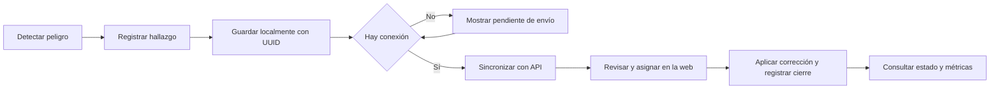

| Fase | Detección | Reporte | Asignación | Corrección | Evidencia |
|---|---|---|---|---|---|
| **Acciones** | El trabajador identifica el peligro | Abre la app y reporta en tres toques con foto; si no hay señal, queda guardado y se envía solo | El supervisor ve el hallazgo en el panel y asigna responsable con un comentario | Se aplica la acción correctiva y se cierra el hallazgo describiéndola | El sistema exporta a Excel el registro completo con su trazabilidad |
| **Pensamientos** | "Esto es peligroso" | "Listo, quedó registrado" | "Esto es crítico, va primero" | "Queda documentado quién, qué y cuándo" | "Tengo cómo demostrarlo" |
| **Mejoras respecto del as-is** | — | Registro con hora exacta, foto y GPS; sin dependencia de la señal | Priorización por severidad en lugar de por quién insiste más | Responsable y plazo explícitos; bitácora automática | Expediente generado por la operación diaria, no reconstruido a mano |

## 3.2. User Stories

**Criterio de aceptación transversal.** Una historia se acepta cuando sus escenarios positivos
y de error son reproducibles con el rol indicado, conserva el aislamiento de la empresa y
cuenta con una evidencia vinculada a la versión evaluada. Para historias de sincronización
también se verifica la recuperación tras pérdida de red y el reintento sin duplicados. La
paridad entre clientes es un requisito que se valida por tarea; compartir API no basta para
demostrarla.

El catálogo completo son **128 historias de usuario** agrupadas en **diecinueve épicas**, más
**34 historias técnicas**. Los criterios de aceptación siguen el formato Gherkin
(Dado / Cuando / Entonces).

Dos columnas ordenan la lectura:

- **Plataforma** indica dónde vive cada historia: `Web`, `Móvil`, `Ambas` o `—` cuando no tiene
  interfaz propia. Esa columna es la evidencia de la paridad exigida: para un mismo rol, ninguna
  capacidad existe en una plataforma y falta en la otra. Las historias marcadas con una sola
  plataforma lo están por una razón de dominio que se explica en la propia fila, no por una
  funcionalidad faltante. El reparto no es arbitrario: lo que ocurre en campo y con las manos
  ocupadas —reportar, consultar la matriz, ejecutar la inspección, firmar la entrega de EPP— es
  del operario y vive en el móvil; lo que exige pantalla grande y decisión —configurar el IPERC,
  redactar un acta, administrar usuarios, leer el tablero— es del supervisor y del comité, y vive
  en la web. Ambas plataformas comparten todo lo que un mismo rol necesita en los dos sitios.
- **Estado** separa tres situaciones. *Sprint 1* marca los quince elementos comprometidos y
  entregados en el primer sprint: el ciclo de vida completo de un hallazgo. *Sprint 2* marca los
  setenta y un elementos del segundo sprint, que construyen el resto del sistema de gestión sobre
  ese ciclo. Los dos juntos son el alcance efectivamente construido y son los que detallan los
  Sprint Backlogs del Capítulo V. *Propuesta* marca lo que está escrito y estimado pero todavía no
  se construye. Un backlog contiene siempre más de lo que cabe en un ciclo; declarar por escrito
  cuál es cuál evita atribuirle al prototipo capacidades que no tiene.

Las historias técnicas (TS) corresponden a trabajo de infraestructura
sin valor directo para el usuario final pero necesario para sostener el producto.

### Épicas

| ID | Épica | Descripción | Historias | Alcance |
|---|---|---|---|---|
| EP01 | Acceso y cuentas | Registro, autenticación y administración de usuarios y roles. | 8 | Construida (2 en el Sprint 1 y 6 en el Sprint 2) |
| EP02 | Reporte de actos y condiciones inseguras | Captura del hallazgo en campo, con evidencia y operación sin conexión. | 14 | 13 construidas, 1 propuesta |
| EP03 | Gestión del hallazgo | Seguimiento desde la recepción hasta el cierre verificado. | 8 | Construida (4 en el Sprint 1 y 4 en el Sprint 2) |
| EP04 | Matriz IPERC | Identificación de peligros, evaluación de riesgos y controles. | 7 | Construida (7 en el Sprint 2) |
| EP05 | Control de EPP | Catálogo, entregas, vencimientos y conformidad del trabajador. | 6 | 5 construidas, 1 propuesta |
| EP06 | Inspecciones periódicas | Programación, ejecución con checklist y cumplimiento. | 7 | 5 construidas, 2 propuestas |
| EP07 | Comité de SST | Constitución, miembros, actas de reunión y acuerdos. | 10 | 8 construidas, 2 propuestas |
| EP08 | Métricas y evidencia | Indicadores de gestión y exportación para auditorías. | 8 | 6 construidas, 2 propuestas |
| EP09 | Experimento A/B | Asignación de variantes y medición de resultados. | 6 | 4 construidas, 2 propuestas |
| EP10 | Calidad de uso y operación | Atributos transversales: consistencia visual, uso en campo, manejo de errores y respuesta ante fallos de red. | 8 | 6 construidas, 2 propuestas |
| EP11 | Accidentes e incidentes | Registro e investigación de accidentes de trabajo, incidentes peligrosos y enfermedades ocupacionales, con notificación a la autoridad. | 8 | Propuesta |
| EP12 | Capacitación e inducción | Registro de inducción, capacitación, entrenamiento y simulacros de emergencia. | 6 | Propuesta |
| EP13 | Mapa de riesgos y señalización | Representación gráfica de los riesgos por área y control de la señalización obligatoria. | 4 | Propuesta |
| EP14 | Documentación del SGSST | Política de SST, Reglamento Interno, plan y programa anual, y su control de versiones. | 4 | Propuesta |
| EP15 | Monitoreo de agentes ocupacionales | Mediciones de agentes físicos, químicos, biológicos, ergonómicos y psicosociales. | 3 | Propuesta |
| EP16 | Contratistas y terceros | Gestión de empresas contratistas, sus trabajadores y su documentación de seguridad. | 4 | Propuesta |
| EP17 | Notificaciones y alertas | Avisos automáticos sobre hallazgos críticos, vencimientos y compromisos del comité. | 6 | Propuesta |
| EP18 | Cuenta y servicio | Alta de empresas, suscripción, respaldo y continuidad del servicio. | 5 | Propuesta |
| EP19 | Seguridad y privacidad de datos | Protección de datos personales, trazabilidad de accesos y control de sesiones. | 6 | Propuesta |

Las épicas EP01 a EP10 son las que el equipo construyó en este ciclo. Las épicas EP11 a EP19 cubren las obligaciones de la Ley N° 29783 y su Reglamento que el producto todavía no atiende —registro e investigación de accidentes, capacitación, mapa de riesgos, documentación del sistema de gestión, monitoreo de agentes, contratistas, notificaciones, gestión de la cuenta y protección de datos personales— y quedan especificadas para los siguientes ciclos.

### EP01 — Acceso y cuentas

| ID | Título | Descripción | Criterios de aceptación | Plataforma | Estado | Épica |
|---|---|---|---|---|---|---|
| US01 | Registro de trabajador | **Como** trabajador **quiero** crear mi cuenta indicando el RUC de mi empresa **para** empezar a reportar sin depender de que alguien me la cree. | **Escenario: registro exitoso**<br>**Dado** que ingreso al formulario de registro<br>**Cuando** completo mis datos y el RUC de una empresa registrada<br>**Entonces** el sistema crea mi cuenta con rol operario y me deja dentro de la aplicación<br><br>**Escenario: RUC inexistente**<br>**Dado** que ingreso un RUC no registrado<br>**Cuando** envío el formulario<br>**Entonces** el sistema me indica que debo solicitar el RUC a mi supervisor y no crea la cuenta | Ambas | Sprint 2 | EP01|
| US02 | Inicio de sesión | **Como** usuario **quiero** iniciar sesión con usuario y contraseña **para** acceder a la información de mi empresa. | **Escenario: credenciales válidas**<br>**Dado** que tengo una cuenta activa<br>**Cuando** ingreso mis credenciales correctas<br>**Entonces** el sistema me autentica y me lleva a la pantalla inicial de mi rol<br><br>**Escenario: credenciales inválidas**<br>**Cuando** ingreso credenciales incorrectas<br>**Entonces** el sistema muestra un mensaje de error sin revelar si el usuario existe | Ambas | Sprint 1 | EP01|
| US03 | Sesión persistente en campo | **Como** operario **quiero** permanecer autenticado varios días **para** no tener que iniciar sesión cuando estoy en una zona sin señal. | **Escenario: renovación automática**<br>**Dado** que mi token de acceso expiró<br>**Cuando** la aplicación realiza una petición<br>**Entonces** el sistema renueva el token automáticamente y la petición se completa sin pedirme la contraseña | Ambas | Sprint 2 | EP01|
| US04 | Administración de usuarios | **Como** supervisor de SST **quiero** crear usuarios y asignarles rol **para** incorporar al equipo de seguridad con los permisos correctos. | **Escenario: alta de supervisor**<br>**Dado** que tengo rol de supervisor<br>**Cuando** creo un usuario con rol supervisor<br>**Entonces** el usuario queda creado en mi empresa con ese rol<br><br>**Escenario: operario sin permiso**<br>**Dado** que tengo rol operario<br>**Cuando** intento listar los usuarios<br>**Entonces** el sistema deniega el acceso | Web | Sprint 2 | EP01|
| US05 | Gestión de áreas | **Como** supervisor **quiero** registrar las áreas o frentes de trabajo **para** clasificar los hallazgos por ubicación organizativa. | **Escenario: alta de área**<br>**Cuando** registro un área con nombre y descripción<br>**Entonces** queda disponible para clasificar reportes, inspecciones y entradas IPERC | Web | Sprint 2 | EP01|
| US41 | Cambio de rol de un usuario | **Como** supervisor **quiero** cambiar el rol de un usuario existente **para** incorporarlo al comité sin crearle una cuenta nueva. | **Cuando** cambio el rol desde la pantalla de usuarios<br>**Entonces** el usuario pasa a tener los permisos de ese rol en web y en móvil | Web | Sprint 2 | EP01|
| US42 | Cierre de sesión | **Como** usuario **quiero** cerrar sesión **para** que nadie use mi cuenta en un equipo compartido. | **Cuando** cierro sesión<br>**Entonces** el sistema descarta mis credenciales y me devuelve a la pantalla de acceso | Ambas | Sprint 2 | EP01|
| US43 | Menú según mi rol | **Como** operario **quiero** ver solo las opciones que me corresponden **para** no perderme entre funciones que no puedo usar. | **Dado** que tengo rol operario<br>**Entonces** el menú muestra únicamente reportar, mis reportes, mis EPP y las consultas, y no las opciones de gestión | Ambas | Sprint 1 | EP01|
### EP02 — Reporte de actos y condiciones inseguras

| ID | Título | Descripción | Criterios de aceptación | Plataforma | Estado | Épica |
|---|---|---|---|---|---|---|
| US06 | Reporte rápido desde el celular | **Como** operario **quiero** reportar un peligro en tres toques con una foto **para** no perder tiempo de trabajo. | **Escenario: reporte en tres pasos**<br>**Dado** que estoy en el frente de trabajo<br>**Cuando** elijo el tipo de hallazgo, la categoría y tomo la foto<br>**Entonces** el sistema registra el reporte y me confirma que quedó guardado<br><br>**Escenario: descripción opcional**<br>**Cuando** envío el reporte sin escribir descripción<br>**Entonces** el sistema lo acepta igualmente | Ambas | Sprint 1 | EP02|
| US07 | Reporte sin conexión | **Como** operario en obra o mina **quiero** que mi reporte se guarde aunque no haya señal **para** no perderlo. | **Escenario: sin conectividad**<br>**Dado** que el dispositivo no tiene conexión<br>**Cuando** envío el reporte<br>**Entonces** se almacena localmente y se muestra como pendiente de envío<br><br>**Escenario: recuperación de señal**<br>**Cuando** el dispositivo recupera la conexión<br>**Entonces** el sistema sincroniza los reportes pendientes sin intervención del usuario | Móvil | Sprint 2 | EP02|
| US08 | Sincronización sin duplicados | **Como** responsable de SST **quiero** que un reintento de envío no genere reportes repetidos **para** que las métricas sean confiables. | **Escenario: reintento del mismo reporte**<br>**Dado** un reporte con un identificador de cliente ya recibido<br>**Cuando** el dispositivo reintenta el envío<br>**Entonces** el sistema devuelve el reporte existente y no crea uno nuevo | Ambas | Sprint 2 | EP02|
| US09 | Evidencia fotográfica | **Como** miembro del comité **quiero** ver la foto del hallazgo **para** entender el peligro sin desplazarme al lugar. | **Escenario: foto adjunta**<br>**Cuando** abro el detalle de un reporte con foto<br>**Entonces** veo la imagen y puedo ampliarla a pantalla completa | Ambas | Sprint 1 | EP02|
| US10 | Geolocalización del hallazgo | **Como** supervisor **quiero** saber dónde ocurrió el hallazgo **para** ubicarlo dentro de la operación. | **Escenario: captura de coordenadas**<br>**Cuando** el operario autoriza la ubicación al tomar la foto<br>**Entonces** el reporte guarda latitud y longitud y el panel ofrece verlas en un mapa<br><br>**Escenario: permiso denegado**<br>**Cuando** el operario no autoriza la ubicación<br>**Entonces** el reporte se envía igualmente, sin coordenadas | Ambas | Sprint 1 | EP02|
| US11 | Fecha real de ocurrencia | **Como** analista **quiero** que el reporte conserve la fecha en que ocurrió el hecho **para** que el indicador de tiempo de respuesta no se distorsione. | **Escenario: sincronización diferida**<br>**Dado** un reporte creado sin conexión el lunes<br>**Cuando** se sincroniza el miércoles<br>**Entonces** conserva la fecha de ocurrencia del lunes y registra además su fecha de recepción | Ambas | Sprint 1 | EP02|
| US12 | Reporte desde la web | **Como** trabajador administrativo **quiero** reportar desde el navegador **para** no depender del celular. | **Escenario: paridad de canal**<br>**Cuando** reporto desde la web<br>**Entonces** el hallazgo se crea con los mismos campos y reglas que desde la aplicación móvil | Web | Sprint 2 | EP02|
| US13 | Consulta de mis reportes | **Como** operario **quiero** ver los reportes que hice y su estado **para** saber si se atendieron. | **Escenario: alcance por rol**<br>**Dado** que tengo rol operario<br>**Cuando** consulto la lista de reportes<br>**Entonces** veo únicamente los míos | Ambas | Sprint 1 | EP02|
| US44 | Vista previa de la evidencia | **Como** quien reporta **quiero** ver en pequeño la foto que elegí **para** confirmar que subí la correcta antes de enviar. | **Cuando** elijo una imagen<br>**Entonces** se muestra una miniatura con el nombre y el peso del archivo | Web | Sprint 2 | EP02|
| US45 | Ampliar la evidencia | **Como** miembro del comité **quiero** ampliar la foto a pantalla completa **para** distinguir el detalle del peligro. | **Cuando** toco la imagen<br>**Entonces** se abre a pantalla completa y se cierra con Escape o tocando fuera | Web | Sprint 2 | EP02|
| US46 | Reemplazar la foto elegida | **Como** quien reporta **quiero** quitar la foto y elegir otra **para** corregirme sin perder lo ya escrito. | **Cuando** quito la foto<br>**Entonces** el formulario conserva el resto de los datos y admite elegir una imagen nueva, incluso la misma | Web | Sprint 2 | EP02|
| US47 | Categorías según el tipo de hallazgo | **Como** quien reporta **quiero** ver solo las categorías que aplican **para** no equivocarme entre actos y condiciones. | **Dado** que elegí condición insegura<br>**Entonces** solo se ofrecen categorías de condición | Ambas | Sprint 1 | EP02|
| US48 | Estado de envío de mis reportes | **Como** operario **quiero** saber cuántos reportes tengo sin enviar **para** confiar en que no se perdieron. | **Dado** que hay reportes en la cola local<br>**Entonces** la pantalla muestra cuántos esperan señal, y cada uno indica si ya se envió | Móvil | Sprint 2 | EP02|
### EP03 — Gestión del hallazgo

| ID | Título | Descripción | Criterios de aceptación | Plataforma | Estado | Épica |
|---|---|---|---|---|---|---|
| US14 | Bandeja de hallazgos | **Como** supervisor **quiero** ver todos los hallazgos de la empresa filtrados por estado, tipo y área **para** priorizar mi trabajo. | **Escenario: filtro por estado**<br>**Cuando** filtro por estado abierto<br>**Entonces** la lista muestra solo los hallazgos sin atender | Ambas | Sprint 1 | EP03|
| US15 | Asignación de responsable | **Como** supervisor **quiero** asignar un responsable al hallazgo **para** que alguien se haga cargo de la corrección. | **Escenario: asignación**<br>**Cuando** asigno un responsable<br>**Entonces** el hallazgo pasa a estado en proceso y queda registrado en la bitácora quién asignó, a quién y cuándo | Ambas | Sprint 1 | EP03|
| US16 | Cierre con acción correctiva | **Como** supervisor **quiero** cerrar el hallazgo describiendo la acción aplicada **para** dejar evidencia de la corrección. | **Escenario: cierre**<br>**Cuando** cierro el hallazgo con la acción correctiva<br>**Entonces** el sistema registra la fecha de cierre y calcula el tiempo de resolución | Ambas | Sprint 1 | EP03|
| US17 | Separación de responsabilidades | **Como** empresa **quiero** que quien reporta no sea quien valida el cierre **para** cumplir el control que exige la normativa. | **Escenario: operario intenta cerrar**<br>**Dado** que tengo rol operario<br>**Cuando** intento cerrar un hallazgo<br>**Entonces** el sistema deniega la operación | Ambas | Sprint 2 | EP03|
| US18 | Bitácora del hallazgo | **Como** auditor interno **quiero** ver la secuencia completa de acciones sobre un hallazgo **para** verificar la trazabilidad. | **Escenario: historial**<br>**Cuando** abro el detalle de un hallazgo<br>**Entonces** veo en orden cronológico el reporte, las asignaciones, los comentarios y el cierre, cada uno con su autor y fecha | Ambas | Sprint 1 | EP03|
| US49 | Descartar un reporte | **Como** supervisor **quiero** descartar un reporte que no corresponde a un hallazgo de SST **para** que no distorsione los indicadores. | **Cuando** descarto un reporte<br>**Entonces** pasa a estado descartado, queda registrado en la bitácora y deja de contarse como hallazgo abierto | Web | Sprint 2 | EP03|
| US50 | Filtrar la bandeja | **Como** supervisor **quiero** filtrar por estado, tipo y área **para** trabajar por lotes en lugar de revisar todo. | **Cuando** aplico un filtro<br>**Entonces** la lista se reduce a los hallazgos que lo cumplen y el total se actualiza | Ambas | Sprint 2 | EP03|
| US51 | Ubicar el hallazgo en el mapa | **Como** supervisor **quiero** abrir la ubicación del hallazgo en un mapa **para** llegar al punto exacto. | **Dado** que el reporte tiene coordenadas<br>**Entonces** el detalle ofrece un enlace que abre esa posición en un mapa | Web | Sprint 2 | EP03|
### EP04 — Matriz IPERC

| ID | Título | Descripción | Criterios de aceptación | Plataforma | Estado | Épica |
|---|---|---|---|---|---|---|
| US19 | Consulta de la matriz en campo | **Como** operario **quiero** consultar los peligros y controles de mi puesto desde el celular **para** saber cómo trabajar seguro. | **Escenario: consulta**<br>**Cuando** abro la matriz IPERC<br>**Entonces** veo los peligros con su nivel de riesgo y los controles existentes | Ambas | Sprint 2 | EP04|
| US20 | Registro de peligros | **Como** supervisor **quiero** agregar y editar entradas de la matriz **para** mantenerla actualizada. | **Escenario: cálculo del nivel**<br>**Cuando** registro una entrada con probabilidad y consecuencia<br>**Entonces** el sistema calcula el puntaje y el nivel de riesgo resultante | Web | Sprint 2 | EP04|
| US21 | Versionado de la matriz | **Como** responsable de SST **quiero** que la matriz se versione **para** mostrar su histórico ante una auditoría. | **Escenario: nueva versión**<br>**Cuando** creo una nueva matriz<br>**Entonces** el sistema le asigna el número de versión siguiente y conserva la anterior | Web | Sprint 2 | EP04|
| US22 | Trazabilidad con el hallazgo de origen | **Como** miembro del comité **quiero** saber qué entradas de la matriz nacieron de un hallazgo real **para** demostrar que la matriz se alimenta del campo. | **Escenario: origen**<br>**Cuando** una entrada proviene de un reporte<br>**Entonces** el sistema muestra el número de ese reporte y permite abrirlo | Ambas | Sprint 2 | EP04|
| US52 | Consultar versiones anteriores de la matriz | **Como** auditor interno **quiero** consultar versiones anteriores de la IPERC **para** verificar cómo evolucionaron los controles. | **Cuando** elijo una versión en el selector<br>**Entonces** la tabla muestra las entradas de esa versión y advierte que es histórica | Web | Sprint 2 | EP04|
| US53 | Publicar una nueva versión de la matriz | **Como** responsable de SST **quiero** crear una versión nueva y ponerla vigente **para** actualizar la matriz sin borrar la anterior. | **Cuando** pongo vigente una versión<br>**Entonces** la anterior pasa a histórica y solo queda una vigente<br><br>**Escenario: versión histórica**<br>**Dado** que consulto una versión histórica<br>**Entonces** el sistema no permite editarla | Web | Sprint 2 | EP04|
| US54 | Retirar un peligro de la matriz | **Como** responsable de SST **quiero** quitar una entrada que ya no aplica **para** que la matriz refleje la operación actual. | **Cuando** quito una entrada de la versión vigente<br>**Entonces** desaparece de la matriz y las versiones históricas la conservan | Web | Sprint 2 | EP04|
### EP05 — Control de EPP

| ID | Título | Descripción | Criterios de aceptación | Plataforma | Estado | Épica |
|---|---|---|---|---|---|---|
| US23 | Catálogo de EPP | **Como** supervisor **quiero** registrar los EPP con su vida útil **para** controlar reposiciones. | **Escenario: alta de EPP**<br>**Cuando** registro un EPP con su vida útil en días<br>**Entonces** queda disponible para registrar entregas | Web | Sprint 2 | EP05|
| US24 | Registro de entrega | **Como** supervisor **quiero** registrar la entrega de un EPP a un trabajador **para** cumplir el registro obligatorio de la ley. | **Escenario: vencimiento automático**<br>**Cuando** registro una entrega<br>**Entonces** el sistema calcula la fecha de vencimiento a partir de la vida útil del EPP | Web | Sprint 2 | EP05|
| US25 | Conformidad del trabajador | **Como** operario **quiero** dar conformidad de la entrega desde mi celular **para** que quede constancia sin firmar papeles. | **Escenario: conformidad**<br>**Dado** que soy el trabajador de la entrega<br>**Cuando** doy conformidad<br>**Entonces** la entrega queda marcada como conforme con la fecha | Ambas | Sprint 2 | EP05|
| US26 | Alerta de EPP vencido | **Como** supervisor **quiero** identificar los EPP vencidos **para** reponerlos antes de que generen un riesgo. | **Escenario: marca de vencido**<br>**Cuando** la fecha de vencimiento es anterior a hoy<br>**Entonces** la entrega se muestra destacada como vencida | Ambas | Sprint 2 | EP05|
| US55 | Control de stock del catálogo | **Como** supervisor **quiero** ver el stock y la vida útil de cada EPP **para** anticipar reposiciones. | **Cuando** abro el catálogo<br>**Entonces** veo por cada EPP su vida útil, su stock y cuántas entregas acumula | Web | Sprint 2 | EP05|
### EP06 — Inspecciones periódicas

| ID | Título | Descripción | Criterios de aceptación | Plataforma | Estado | Épica |
|---|---|---|---|---|---|---|
| US27 | Programa de inspecciones | **Como** supervisor **quiero** definir qué se inspecciona, cada cuánto y con qué checklist **para** sistematizar el programa anual. | **Escenario: alta de programa**<br>**Cuando** creo un programa con área, frecuencia y checklist<br>**Entonces** queda disponible para generar sus ocurrencias | Web | Sprint 2 | EP06|
| US28 | Ejecución con checklist | **Como** inspector **quiero** realizar la inspección marcando el checklist desde el celular **para** registrarla en el lugar y no después. | **Escenario: ejecución**<br>**Cuando** marco los ítems y registro los hallazgos<br>**Entonces** la inspección queda como realizada con su fecha y responsable | Ambas | Sprint 2 | EP06|
| US29 | Inspecciones vencidas | **Como** responsable de SST **quiero** ver las inspecciones que pasaron su fecha sin realizarse **para** actuar sobre el incumplimiento. | **Escenario: vencida**<br>**Dado** que la fecha programada ya pasó y la inspección sigue pendiente<br>**Entonces** el sistema la marca como vencida | Ambas | Sprint 2 | EP06|
| US56 | Programar la siguiente inspección | **Como** supervisor **quiero** generar la siguiente ocurrencia según la frecuencia **para** no calcular fechas a mano. | **Cuando** genero la siguiente<br>**Entonces** el sistema crea la ocurrencia con la fecha que corresponde a la frecuencia del programa | Web | Sprint 2 | EP06|
| US57 | Cumplimiento por área | **Como** responsable de SST **quiero** ver el cumplimiento desagregado por área **para** actuar sobre la que incumple. | **Cuando** consulto el indicador<br>**Entonces** veo programadas, realizadas y porcentaje por cada área | Web | Sprint 2 | EP06|
### EP07 — Comité de SST

| ID | Título | Descripción | Criterios de aceptación | Plataforma | Estado | Épica |
|---|---|---|---|---|---|---|
| US30 | Constitución del comité | **Como** responsable de SST **quiero** registrar el comité y su periodo **para** documentar su vigencia. | **Escenario: modo supervisor**<br>**Dado** que la empresa tiene menos de 20 trabajadores<br>**Cuando** registro el comité<br>**Entonces** el sistema lo marca como modo supervisor, conforme admite la ley | Web | Sprint 2 | EP07|
| US31 | Miembros y paridad | **Como** responsable de SST **quiero** registrar los miembros con su cargo y representación **para** verificar que el comité sea paritario. | **Escenario: verificación de paridad**<br>**Cuando** el número de representantes del empleador difiere del de los trabajadores<br>**Entonces** el sistema advierte que el comité no es paritario | Web | Sprint 2 | EP07|
| US32 | Acta de reunión | **Como** secretario del comité **quiero** registrar el acta con agenda, asistentes y desarrollo **para** cumplir con el registro obligatorio. | **Escenario: numeración correlativa**<br>**Cuando** registro una nueva acta<br>**Entonces** el sistema le asigna el número consecutivo siguiente, sin aceptarlo del cliente | Web | Sprint 2 | EP07|
| US33 | Control de quórum | **Como** miembro del comité **quiero** saber si la reunión alcanzó quórum **para** conocer la validez del acta. | **Escenario: sin quórum**<br>**Dado** que asistieron menos de la mitad más uno de los titulares<br>**Entonces** el acta se muestra marcada como sin quórum | Ambas | Sprint 2 | EP07|
| US34 | Acuerdos con responsable y plazo | **Como** presidente del comité **quiero** registrar los acuerdos con responsable y plazo **para** hacerles seguimiento. | **Escenario: seguimiento**<br>**Cuando** actualizo el estado de un acuerdo a cumplido<br>**Entonces** el indicador de cumplimiento de acuerdos se recalcula | Web | Sprint 2 | EP07|
| US58 | Advertencia de comité no paritario | **Como** responsable de SST **quiero** que el sistema me advierta si el comité no es paritario **para** corregirlo antes de una fiscalización. | **Dado** que los representantes del empleador y de los trabajadores no son iguales en número<br>**Entonces** la pantalla muestra una advertencia explicando qué exige la ley | Web | Sprint 2 | EP07|
| US59 | Seguimiento del estado de los acuerdos | **Como** presidente del comité **quiero** actualizar el estado de cada acuerdo **para** reflejar su avance real. | **Cuando** cambio el estado de un acuerdo<br>**Entonces** el indicador de cumplimiento del comité se recalcula | Web | Sprint 2 | EP07|
| US60 | Consultar las actas desde el celular | **Como** trabajador **quiero** leer las actas y acuerdos del comité desde mi celular **para** enterarme de lo que se decidió. | **Cuando** abro la sección del comité<br>**Entonces** veo las actas con su fecha, quórum y acuerdos | Móvil | Sprint 2 | EP07|
### EP08 — Métricas y evidencia

| ID | Título | Descripción | Criterios de aceptación | Plataforma | Estado | Épica |
|---|---|---|---|---|---|---|
| US35 | Indicador MTTR | **Como** responsable de SST **quiero** conocer el tiempo promedio entre el reporte y el cierre **para** evaluar la capacidad de respuesta. | **Escenario: cálculo**<br>**Cuando** consulto el tablero<br>**Entonces** veo el MTTR del periodo, total y desagregado por severidad | Ambas | Sprint 2 | EP08|
| US36 | Tasa de cumplimiento de inspecciones | **Como** responsable de SST **quiero** conocer qué proporción de inspecciones programadas se realizó **para** detectar áreas que incumplen. | **Escenario: desagregación**<br>**Cuando** consulto el indicador<br>**Entonces** veo el total y el detalle por área | Ambas | Sprint 2 | EP08|
| US37 | Exportación de evidencia | **Como** responsable de SST **quiero** exportar a Excel los registros obligatorios **para** preparar el expediente de una inspección de SUNAFIL. | **Escenario: exportación**<br>**Cuando** exporto el registro de actos y condiciones inseguras<br>**Entonces** obtengo un archivo .xlsx con los campos del registro y su trazabilidad<br><br>**Escenario: permiso**<br>**Dado** que tengo rol operario<br>**Cuando** intento exportar<br>**Entonces** el sistema deniega la operación | Web | Sprint 2 | EP08|
| US61 | MTTR por severidad | **Como** responsable de SST **quiero** ver el MTTR desagregado por severidad **para** distinguir si los críticos se atienden rápido. | **Cuando** consulto el tablero<br>**Entonces** veo el MTTR total y una fila por severidad con su promedio y cantidad de cerrados | Ambas | Sprint 2 | EP08|
| US62 | Exportar cada registro obligatorio | **Como** responsable de SST **quiero** exportar por separado reportes, IPERC, EPP, inspecciones y actas **para** armar el expediente por tipo de registro. | **Cuando** exporto cualquiera de los cinco<br>**Entonces** obtengo un archivo .xlsx con la cabecera y los datos de ese registro | Web | Sprint 2 | EP08|
| US63 | Resumen de hallazgos | **Como** responsable de SST **quiero** un resumen por estado, tipo, severidad y área **para** ver la distribución del riesgo de un vistazo. | **Cuando** consulto el resumen<br>**Entonces** obtengo los conteos por cada dimensión y el total de críticos sin atender | Ambas | Sprint 2 | EP08|
### EP09 — Experimento A/B

| ID | Título | Descripción | Criterios de aceptación | Plataforma | Estado | Épica |
|---|---|---|---|---|---|---|
| US38 | Asignación de variante | **Como** equipo de producto **quiero** que cada usuario quede asignado de forma estable a una variante **para** que la comparación sea válida. | **Escenario: estabilidad**<br>**Cuando** el mismo usuario consulta su variante en distintos momentos<br>**Entonces** obtiene siempre la misma | Ambas | Sprint 2 | EP09|
| US39 | Registro de la variante en el reporte | **Como** analista **quiero** saber con qué formulario se creó cada reporte **para** atribuir correctamente los resultados. | **Escenario: atribución**<br>**Cuando** se crea un reporte<br>**Entonces** queda registrada la variante del formulario utilizado | Ambas | Sprint 2 | EP09|
| US40 | Resultados del experimento | **Como** analista **quiero** comparar los reportes por usuario de cada variante **para** contrastar la hipótesis. | **Escenario: comparación**<br>**Cuando** consulto los resultados<br>**Entonces** veo, por variante, el número de usuarios, de reportes, el promedio por usuario y la diferencia porcentual | Web | Sprint 2 | EP09|
| US64 | Variante disponible sin conexión | **Como** operario **quiero** que la aplicación sepa qué formulario mostrarme aunque no tenga señal **para** poder reportar igual. | **Dado** que la variante se guardó al iniciar sesión<br>**Cuando** abro el formulario sin conexión<br>**Entonces** se muestra la variante que me corresponde | Móvil | Sprint 2 | EP09|
### EP10 — Calidad de uso y operación

| ID | Título | Descripción | Criterios de aceptación | Plataforma | Estado | Épica |
|---|---|---|---|---|---|---|
| US65 | Identidad visual consistente | **Como** usuario **quiero** una interfaz sobria y uniforme **para** confiar en que es un sistema de gestión formal y no un prototipo. | **Cuando** navego entre pantallas<br>**Entonces** encuentro la misma paleta, tipografía y tratamiento de estados en todas | Ambas | Sprint 2 | EP10|
| US66 | Navegación siempre accesible | **Como** supervisor **quiero** que el menú permanezca visible al desplazarme **para** cambiar de sección sin volver arriba. | **Cuando** bajo por una tabla larga<br>**Entonces** la navegación sigue en pantalla | Ambas | Sprint 2 | EP10|
| US67 | Uso desde pantallas pequeñas | **Como** supervisor en obra **quiero** usar el panel desde una pantalla angosta **para** no depender de la laptop. | **Cuando** reduzco el ancho de la ventana<br>**Entonces** la navegación pasa a barra superior y las tablas se desplazan sin romper el diseño | Web | Sprint 2 | EP10|
| US68 | Errores comprensibles | **Como** usuario **quiero** entender qué salió mal **para** poder corregirlo yo mismo. | **Cuando** el servidor rechaza una operación<br>**Entonces** la pantalla muestra el motivo en lenguaje claro, indicando el campo cuando corresponde | Ambas | Sprint 2 | EP10|
| US69 | Reintento ante fallo de red | **Como** operario **quiero** reintentar una consulta que falló **para** no tener que reiniciar la aplicación. | **Dado** que una pantalla no pudo cargar<br>**Entonces** muestra el motivo y un botón para reintentar | Móvil | Sprint 2 | EP10|
| US70 | Sesión que no expira en campo | **Como** operario **quiero** seguir trabajando sin volver a iniciar sesión **para** no quedarme fuera en una zona sin señal. | **Cuando** mi token de acceso caduca<br>**Entonces** el sistema lo renueva automáticamente y la operación continúa | Ambas | Sprint 2 | EP10|
### EP11 — Accidentes e incidentes

La Ley N° 29783 obliga a registrar e investigar los accidentes de trabajo, los incidentes
peligrosos y las enfermedades ocupacionales, y a notificar los mortales a la autoridad. Es el
registro obligatorio que el producto aún no cubre y el primero del backlog futuro.

| ID | Título | Descripción | Criterios de aceptación | Plataforma | Estado | Épica |
|---|---|---|---|---|---|---|
| US71 | Registro de accidente de trabajo | **Como** supervisor de SST **quiero** registrar un accidente con fecha, hora, lugar, trabajadores involucrados y descripción **para** cumplir el registro obligatorio. | **Cuando** registro un accidente<br>**Entonces** queda con su número correlativo, su gravedad y los días de descanso médico asociados | Web | Propuesta | EP11 |
| US72 | Registro de incidente peligroso | **Como** supervisor **quiero** registrar un incidente peligroso que no causó lesión **para** actuar antes de que se repita con consecuencias. | **Cuando** registro un incidente peligroso<br>**Entonces** se clasifica como tal y entra al mismo ciclo de investigación | Ambas | Propuesta | EP11 |
| US73 | Reportar un accidente desde el celular | **Como** operario **quiero** dar aviso de un accidente desde el celular **para** que la ayuda y el registro empiecen de inmediato. | **Cuando** reporto un accidente<br>**Entonces** el supervisor recibe el aviso y el registro queda abierto para completarse | Móvil | Propuesta | EP11 |
| US74 | Investigación de causa raíz | **Como** miembro del comité **quiero** documentar la investigación con el método de los cinco porqués **para** llegar a la causa real y no a la aparente. | **Cuando** completo la investigación<br>**Entonces** el accidente queda con sus causas inmediatas, básicas y de gestión, y sus medidas correctivas | Web | Propuesta | EP11 |
| US75 | Medidas correctivas con responsable y plazo | **Como** supervisor **quiero** que cada medida correctiva tenga responsable y plazo **para** poder hacerles seguimiento. | **Cuando** registro una medida correctiva<br>**Entonces** aparece en el seguimiento con su estado hasta que se cierra | Web | Propuesta | EP11 |
| US76 | Aviso de accidente mortal dentro del plazo legal | **Como** empresa **quiero** que el sistema me alerte del plazo de notificación de un accidente mortal **para** no incurrir en infracción. | **Dado** que registro un accidente mortal<br>**Entonces** el sistema advierte el plazo de 24 horas para notificar a la autoridad y deja constancia de la fecha de aviso | Web | Propuesta | EP11 |
| US77 | Indicadores de accidentabilidad | **Como** responsable de SST **quiero** los índices de frecuencia, gravedad y accidentabilidad **para** reportarlos como exige la norma. | **Cuando** consulto las estadísticas del periodo<br>**Entonces** obtengo los tres índices calculados sobre las horas-hombre trabajadas | Ambas | Propuesta | EP11 |
| US78 | Registro de enfermedad ocupacional | **Como** responsable de SST **quiero** registrar una enfermedad ocupacional diagnosticada **para** completar el registro que la ley exige. | **Cuando** registro una enfermedad ocupacional<br>**Entonces** queda asociada al puesto y al agente que la origina, sin exponer el diagnóstico a usuarios sin autorización | Web | Propuesta | EP11 |

### EP12 — Capacitación e inducción

| ID | Título | Descripción | Criterios de aceptación | Plataforma | Estado | Épica |
|---|---|---|---|---|---|---|
| US79 | Programa anual de capacitación | **Como** responsable de SST **quiero** planificar las capacitaciones del año **para** cumplir las cuatro anuales que exige la ley. | **Cuando** registro el programa<br>**Entonces** cada capacitación queda con su tema, fecha prevista, responsable y público objetivo | Web | Propuesta | EP12 |
| US80 | Registro de asistencia a capacitación | **Como** capacitador **quiero** registrar la asistencia desde el celular **para** no transcribir una hoja de firmas después. | **Cuando** marco a los asistentes<br>**Entonces** cada trabajador queda con su registro de capacitación y la sesión con su lista | Móvil | Propuesta | EP12 |
| US81 | Inducción del personal nuevo | **Como** supervisor **quiero** registrar la inducción de un trabajador que ingresa **para** evidenciar que no empezó a trabajar sin ella. | **Cuando** completo la inducción<br>**Entonces** el trabajador queda habilitado y la fecha se conserva como evidencia | Web | Propuesta | EP12 |
| US82 | Alerta de capacitación vencida | **Como** responsable de SST **quiero** saber qué trabajadores tienen capacitación vencida **para** reprogramarla antes de una fiscalización. | **Dado** que pasó la vigencia de una capacitación<br>**Entonces** el trabajador aparece en la lista de pendientes | Web | Propuesta | EP12 |
| US83 | Consultar mis capacitaciones | **Como** trabajador **quiero** ver qué capacitaciones tengo y cuáles me faltan **para** saber si estoy habilitado. | **Cuando** abro mi perfil<br>**Entonces** veo mis capacitaciones con su fecha y vigencia | Móvil | Propuesta | EP12 |
| US84 | Registro de simulacros | **Como** responsable de SST **quiero** registrar los simulacros de emergencia con sus resultados **para** cumplir el registro obligatorio. | **Cuando** registro un simulacro<br>**Entonces** queda con su tipo, fecha, participantes, tiempo de evacuación y observaciones | Web | Propuesta | EP12 |

### EP13 — Mapa de riesgos y señalización

| ID | Título | Descripción | Criterios de aceptación | Plataforma | Estado | Épica |
|---|---|---|---|---|---|---|
| US85 | Mapa de riesgos por área | **Como** responsable de SST **quiero** publicar el mapa de riesgos de cada área **para** cumplir la obligación de exhibirlo. | **Cuando** subo el plano y ubico los riesgos<br>**Entonces** el mapa queda disponible para consulta y descarga | Web | Propuesta | EP13 |
| US86 | Consultar el mapa de riesgos en campo | **Como** operario **quiero** ver el mapa de riesgos de mi área desde el celular **para** conocer los peligros antes de empezar. | **Cuando** abro mi área<br>**Entonces** veo su mapa de riesgos y los peligros señalados | Móvil | Propuesta | EP13 |
| US87 | Inventario de señalización | **Como** supervisor **quiero** registrar la señalización instalada y su estado **para** detectar la que falta o está deteriorada. | **Cuando** reviso el inventario<br>**Entonces** veo por área qué señales debería haber, cuáles hay y cuáles están observadas | Web | Propuesta | EP13 |
| US88 | Ubicar el área por código QR | **Como** operario **quiero** escanear un código en el área **para** reportar sin tener que buscarla en una lista. | **Cuando** escaneo el código del área<br>**Entonces** el formulario de reporte queda precargado con esa área | Móvil | Propuesta | EP13 |

### EP14 — Documentación del SGSST

| ID | Título | Descripción | Criterios de aceptación | Plataforma | Estado | Épica |
|---|---|---|---|---|---|---|
| US89 | Política de SST publicada | **Como** empresa **quiero** publicar la política de SST firmada por la alta dirección **para** exhibirla como exige la ley. | **Cuando** publico la política<br>**Entonces** queda visible para todos los trabajadores con su fecha de aprobación | Ambas | Propuesta | EP14 |
| US90 | Reglamento Interno de SST | **Como** responsable de SST **quiero** publicar el RISST y registrar su entrega a cada trabajador **para** evidenciar que lo conocen. | **Cuando** un trabajador confirma la recepción<br>**Entonces** queda registrada la fecha y la versión del reglamento entregada | Ambas | Propuesta | EP14 |
| US91 | Plan y programa anual de SST | **Como** responsable de SST **quiero** registrar el plan anual con sus objetivos y actividades **para** hacerle seguimiento durante el año. | **Cuando** consulto el plan<br>**Entonces** veo el avance de cada actividad programada frente a lo ejecutado | Web | Propuesta | EP14 |
| US92 | Control de versiones de documentos | **Como** auditor interno **quiero** ver el histórico de versiones de cada documento del sistema **para** verificar su evolución. | **Cuando** abro un documento<br>**Entonces** veo su versión vigente y las anteriores con su fecha de vigencia | Web | Propuesta | EP14 |

### EP15 — Monitoreo de agentes ocupacionales

| ID | Título | Descripción | Criterios de aceptación | Plataforma | Estado | Épica |
|---|---|---|---|---|---|---|
| US93 | Registro de monitoreo de agentes | **Como** responsable de SST **quiero** registrar las mediciones de agentes físicos, químicos, biológicos, ergonómicos y psicosociales **para** completar el registro obligatorio. | **Cuando** registro una medición<br>**Entonces** queda con su agente, área, valor medido, límite permisible y si lo excede | Web | Propuesta | EP15 |
| US94 | Alerta por exceder el límite permisible | **Como** responsable de SST **quiero** que el sistema señale las mediciones fuera de límite **para** priorizar la intervención. | **Dado** que el valor medido supera el límite<br>**Entonces** la medición se destaca y sugiere generar una entrada en la matriz IPERC | Web | Propuesta | EP15 |
| US95 | Programa de monitoreo | **Como** responsable de SST **quiero** programar los monitoreos periódicos **para** que no se venzan sin aviso. | **Cuando** vence un monitoreo programado<br>**Entonces** aparece como pendiente junto a las inspecciones vencidas | Web | Propuesta | EP15 |

### EP16 — Contratistas y terceros

| ID | Título | Descripción | Criterios de aceptación | Plataforma | Estado | Épica |
|---|---|---|---|---|---|---|
| US96 | Registro de empresa contratista | **Como** responsable de SST **quiero** registrar a las contratistas que operan en mis instalaciones **para** exigirles el mismo estándar. | **Cuando** registro una contratista<br>**Entonces** queda con su RUC, actividad, vigencia del contrato y responsable de SST | Web | Propuesta | EP16 |
| US97 | Documentación de seguridad de la contratista | **Como** responsable de SST **quiero** controlar la vigencia de los documentos de cada contratista **para** no permitir el ingreso de quien no cumple. | **Dado** que un documento está vencido<br>**Entonces** la contratista aparece observada y el sistema lo advierte | Web | Propuesta | EP16 |
| US98 | Trabajadores de contratista reportando | **Como** trabajador de una contratista **quiero** reportar hallazgos con mi propia cuenta **para** que la empresa principal también los vea. | **Cuando** reporto un hallazgo<br>**Entonces** queda asociado a mi contratista y visible para el comité de la empresa principal | Móvil | Propuesta | EP16 |
| US99 | Permiso de trabajo de alto riesgo | **Como** supervisor **quiero** emitir y controlar permisos para trabajos de alto riesgo **para** que no se ejecuten sin autorización. | **Cuando** emito un permiso<br>**Entonces** queda con su vigencia, responsables y las condiciones verificadas antes de autorizar | Ambas | Propuesta | EP16 |

### EP17 — Notificaciones y alertas

| ID | Título | Descripción | Criterios de aceptación | Plataforma | Estado | Épica |
|---|---|---|---|---|---|---|
| US100 | Aviso de hallazgo crítico sin asignar | **Como** supervisor **quiero** recibir aviso de un hallazgo crítico que lleva horas sin responsable **para** que no se quede esperando en la bandeja. | **Dado** que un hallazgo crítico lleva más de 24 horas abierto<br>**Entonces** el sistema me notifica y registra el envío | Ambas | Propuesta | EP17 |
| US101 | Aviso de cierre al reportante | **Como** operario **quiero** enterarme cuando mi hallazgo se cierra **para** saber que sirvió de algo. | **Cuando** se cierra un hallazgo que reporté<br>**Entonces** recibo la notificación con la acción correctiva aplicada | Móvil | Propuesta | EP17 |
| US102 | Aviso de asignación | **Como** responsable asignado **quiero** que me avisen cuando me asignan un hallazgo **para** no depender de que alguien me lo diga. | **Cuando** me asignan un hallazgo<br>**Entonces** recibo la notificación con su severidad y plazo | Ambas | Propuesta | EP17 |
| US103 | Resumen diario para el comité | **Como** miembro del comité **quiero** un resumen diario de lo abierto y lo vencido **para** empezar el día sabiendo qué priorizar. | **Cuando** llega la hora configurada<br>**Entonces** recibo por correo el resumen de hallazgos abiertos, inspecciones vencidas y acuerdos por vencer | Web | Propuesta | EP17 |
| US104 | Aviso de acuerdo del comité por vencer | **Como** responsable de un acuerdo **quiero** que me avisen antes del plazo **para** cumplirlo a tiempo. | **Dado** que faltan tres días para el plazo<br>**Entonces** recibo el aviso con el acuerdo y su fecha límite | Ambas | Propuesta | EP17 |
| US105 | Preferencias de notificación | **Como** usuario **quiero** elegir qué avisos recibir y por qué canal **para** que el sistema no se vuelva ruido. | **Cuando** cambio mis preferencias<br>**Entonces** solo recibo los avisos que habilité | Ambas | Propuesta | EP17 |

### EP18 — Cuenta y servicio

| ID | Título | Descripción | Criterios de aceptación | Plataforma | Estado | Épica |
|---|---|---|---|---|---|---|
| US106 | Alta de empresa desde la landing | **Como** responsable de SST de una empresa nueva **quiero** registrar mi empresa por mi cuenta **para** empezar a usar el sistema sin depender de una demostración. | **Cuando** completo el registro con el RUC y los datos de la empresa<br>**Entonces** la empresa queda creada y yo como su primer administrador | Web | Propuesta | EP18 |
| US107 | Datos y configuración de la empresa | **Como** administrador **quiero** editar la razón social, el RUC y el número de trabajadores **para** que el sistema aplique las reglas que me corresponden. | **Cuando** cambio el número de trabajadores a menos de veinte<br>**Entonces** el sistema pasa a admitir supervisor de SST en lugar de comité paritario | Web | Propuesta | EP18 |
| US108 | Planes y suscripción | **Como** administrador **quiero** conocer y cambiar mi plan **para** ajustar el servicio al tamaño de la empresa. | **Cuando** consulto la suscripción<br>**Entonces** veo el plan vigente, el número de trabajadores cubiertos y la fecha de renovación | Web | Propuesta | EP18 |
| US109 | Exportación completa de mis datos | **Como** administrador **quiero** poder llevarme toda la información de mi empresa **para** no quedar atado al proveedor. | **Cuando** solicito la exportación completa<br>**Entonces** recibo todos los registros en formato abierto | Web | Propuesta | EP18 |
| US110 | Respaldo y continuidad | **Como** empresa cliente **quiero** que mis registros estén respaldados **para** no perder la evidencia de años de gestión. | **Cuando** ocurre una falla del servicio<br>**Entonces** la información se restablece desde el último respaldo dentro del tiempo comprometido en el acuerdo de servicio | — | Propuesta | EP18 |

### EP19 — Seguridad y privacidad de datos

| ID | Título | Descripción | Criterios de aceptación | Plataforma | Estado | Épica |
|---|---|---|---|---|---|---|
| US111 | Consentimiento informado de datos personales | **Como** trabajador **quiero** saber qué datos míos guarda el sistema y para qué **para** dar mi consentimiento con información. | **Cuando** creo mi cuenta<br>**Entonces** se me informa qué datos se tratan, con qué finalidad y por cuánto tiempo, conforme a la Ley N° 29733 | Ambas | Propuesta | EP19 |
| US112 | Ubicación opcional y revocable | **Como** trabajador **quiero** poder negar o revocar el permiso de ubicación **para** que no se registre dónde estoy. | **Cuando** niego el permiso<br>**Entonces** el reporte se envía igual, sin coordenadas, y nada se degrada salvo la ubicación | Ambas | Propuesta | EP19 |
| US113 | Registro de auditoría de accesos | **Como** responsable de datos personales **quiero** saber quién consultó o exportó información **para** rendir cuentas de su tratamiento. | **Cuando** un usuario exporta evidencia o consulta datos sensibles<br>**Entonces** queda registrado el usuario, la acción y la fecha | Web | Propuesta | EP19 |
| US114 | Cierre de sesión remoto | **Como** usuario **quiero** cerrar la sesión de un dispositivo que perdí **para** que nadie use mi cuenta. | **Cuando** cierro las sesiones activas<br>**Entonces** los tokens de ese dispositivo dejan de ser válidos | Web | Propuesta | EP19 |
| US115 | Política de retención de evidencia | **Como** responsable de datos **quiero** que las fotografías se eliminen al vencer el plazo legal de conservación **para** no almacenar datos personales más de lo necesario. | **Dado** que un hallazgo cerrado superó el plazo de retención<br>**Entonces** su fotografía se elimina y el registro documental se conserva | — | Propuesta | EP19 |
| US116 | Reporte anónimo de actos inseguros | **Como** trabajador **quiero** poder reportar el acto inseguro de un compañero sin dar mi nombre **para** no exponerme a represalias. | **Cuando** elijo reportar de forma anónima<br>**Entonces** el hallazgo se registra sin identificar al reportante, conservando área, tipo y evidencia | Ambas | Propuesta | EP19 |

### Ampliaciones propuestas sobre épicas existentes

| ID | Título | Descripción | Criterios de aceptación | Plataforma | Estado | Épica |
|---|---|---|---|---|---|---|
| US117 | Reporte por voz | **Como** operario con guantes **quiero** dictar la descripción en lugar de escribirla **para** reportar sin quitarme el equipo. | **Cuando** uso el dictado<br>**Entonces** el texto queda en la descripción y puedo corregirlo antes de enviar | Móvil | Propuesta | EP02 |
| US118 | Firma del trabajador en la entrega de EPP | **Como** supervisor **quiero** capturar la firma del trabajador en pantalla **para** que la conformidad tenga el mismo valor que la del papel. | **Cuando** el trabajador firma en pantalla<br>**Entonces** la firma queda adjunta a la entrega y aparece en la exportación | Móvil | Propuesta | EP05 |
| US119 | Adjuntar evidencia en inspecciones | **Como** inspector **quiero** adjuntar fotos a los ítems observados del checklist **para** sustentar el hallazgo. | **Cuando** marco un ítem como observado<br>**Entonces** puedo adjuntarle una fotografía que queda en el registro | Móvil | Propuesta | EP06 |
| US120 | Generar hallazgo desde una inspección | **Como** inspector **quiero** convertir una observación de la inspección en un hallazgo **para** que entre al ciclo de corrección. | **Cuando** genero el hallazgo desde la observación<br>**Entonces** queda enlazado a la inspección que lo originó | Ambas | Propuesta | EP06 |
| US121 | Convocatoria y asistencia del comité | **Como** secretario del comité **quiero** convocar la reunión y registrar la asistencia efectiva **para** sustentar el quórum. | **Cuando** registro quién asistió<br>**Entonces** el quórum se calcula sobre los asistentes reales y no sobre los miembros activos | Web | Propuesta | EP07 |
| US122 | Elección de representantes de los trabajadores | **Como** empresa **quiero** registrar el proceso de elección de los representantes **para** evidenciar que el comité se constituyó como manda la ley. | **Cuando** registro la elección<br>**Entonces** quedan el acta, los candidatos y los elegidos con su periodo | Web | Propuesta | EP07 |
| US123 | Exportar el tablero a PDF | **Como** responsable de SST **quiero** exportar el tablero de indicadores a PDF **para** adjuntarlo al informe mensual a la gerencia. | **Cuando** exporto el tablero<br>**Entonces** obtengo un PDF con los indicadores del periodo y la fecha de generación | Web | Propuesta | EP08 |
| US124 | Comparar periodos | **Como** responsable de SST **quiero** comparar el MTTR y el cumplimiento con el periodo anterior **para** saber si mejoramos. | **Cuando** elijo comparar<br>**Entonces** veo la variación de cada indicador frente al periodo previo | Web | Propuesta | EP08 |
| US125 | Aviso de datos de demostración | **Como** evaluador **quiero** distinguir los datos de demostración de los reales **para** no interpretar resultados simulados como evidencia. | **Dado** que los datos provienen de la carga de demostración<br>**Entonces** el panel del experimento muestra un aviso visible que lo declara | Web | Propuesta | EP09 |
| US126 | Intervalo de confianza en los resultados | **Como** analista **quiero** ver el intervalo de confianza de la diferencia entre variantes **para** comunicar la precisión y no solo el promedio. | **Cuando** consulto los resultados<br>**Entonces** veo la diferencia estimada con su intervalo al 95 % y el tamaño de cada grupo | Web | Propuesta | EP09 |
| US127 | Interfaz accesible para lectores de pantalla | **Como** trabajador con discapacidad visual **quiero** usar la aplicación con el lector de pantalla **para** poder reportar como cualquiera. | **Cuando** navego con TalkBack<br>**Entonces** cada control tiene una descripción comprensible y el orden de lectura sigue el flujo de la tarea | Ambas | Propuesta | EP10 |
| US128 | Modo de alto contraste | **Como** trabajador que opera bajo el sol **quiero** un modo de alto contraste **para** leer la pantalla en exteriores. | **Cuando** activo el alto contraste<br>**Entonces** la interfaz aumenta el contraste conservando el significado de los colores de estado | Ambas | Propuesta | EP10 |

### Historias técnicas

Trabajo de infraestructura sin valor directo para el usuario final, pero necesario para sostener
el producto y exigido por el curso. La columna **Repositorio** indica dónde vive cada una, y la
columna **Épica** la vincula con la capacidad de negocio que habilita. Las dieciséis primeras
(TS01–TS16) están implementadas; las dieciocho restantes (TS17–TS34) sostienen las épicas
propuestas y quedan en el backlog.

| ID | Título | Descripción | Criterios de aceptación | Repositorio | Estado | Épica |
|---|---|---|---|---|---|---|
| TS01 | Integración continua | **Como** equipo de desarrollo **quiero** que cada Pull Request ejecute pruebas y análisis estático **para** no integrar código roto. | **Escenario: PR con pruebas fallidas**<br>**Cuando** abro un PR cuyas pruebas fallan<br>**Entonces** el pipeline marca el PR en rojo y bloquea la integración | Los cuatro | Sprint 1 | —|
| TS02 | Convenciones de commits | **Como** equipo **quiero** que los mensajes de commit sigan Conventional Commits **para** mantener un historial legible y auditable. | **Escenario: mensaje inválido**<br>**Cuando** intento commitear con un mensaje fuera del formato<br>**Entonces** el hook local lo rechaza y el workflow de CI también | Los cuatro | Sprint 1 | —|
| TS03 | Documentación viva del API | **Como** desarrollador de los clientes **quiero** una especificación OpenAPI generada del código **para** que el contrato no se desactualice. | **Escenario: documentación**<br>**Cuando** accedo a la ruta de documentación<br>**Entonces** obtengo la especificación de todos los endpoints vigentes | sst-api | Sprint 2 | —|
| TS04 | Datos de demostración | **Como** equipo **quiero** un comando que genere datos realistas **para** poder demostrar y probar el sistema. | **Escenario: carga**<br>**Cuando** ejecuto el comando de carga<br>**Entonces** el sistema queda con empresa, usuarios, reportes, IPERC, EPP, inspecciones y actas de ejemplo, claramente identificados como datos de demostración | sst-api | Sprint 2 | —|
| TS05 | Flujo de ramas GitFlow | **Como** equipo **quiero** un flujo de ramas definido y protegido **para** que nada llegue a la línea principal sin revisión. | **Dado** que intento empujar directamente a main o develop<br>**Entonces** la protección de rama lo rechaza y obliga a pasar por Pull Request | Los cuatro | Sprint 1 | —|
| TS06 | Fin de línea normalizado | **Como** equipo que trabaja en Windows **quiero** que el repositorio guarde siempre LF **para** que no aparezcan diferencias falsas en cada archivo. | **Cuando** edito un archivo en Windows y lo commiteo<br>**Entonces** el repositorio lo guarda con LF y el diff muestra solo lo que cambié de verdad | Los cuatro | Sprint 2 | —|
| TS07 | Validación local del mensaje de commit | **Como** desarrollador **quiero** que el formato del commit se valide antes de crearlo **para** enterarme al momento y no en el Pull Request. | **Cuando** intento commitear con un mensaje fuera de formato<br>**Entonces** el hook lo rechaza mostrando los tipos válidos y un ejemplo | Los cuatro | Sprint 2 | —|
| TS08 | Configuración por variables de entorno | **Como** responsable del despliegue **quiero** que la configuración viva fuera del código **para** usar el mismo artefacto en desarrollo y en producción. | **Cuando** cambio la base de datos o el origen permitido<br>**Entonces** basta modificar el archivo de entorno, sin tocar ni reconstruir el código | sst-api | Sprint 2 | —|
| TS09 | Proxy de desarrollo | **Como** desarrollador de la web **quiero** que las peticiones al API pasen por el servidor de desarrollo **para** no lidiar con CORS en local. | **Cuando** levanto la web en desarrollo<br>**Entonces** las llamadas a /api llegan al backend sin error de origen cruzado | sst-web | Sprint 2 | —|
| TS10 | Renovación transparente del token | **Como** usuario **quiero** no perder lo que estoy haciendo cuando expira mi sesión **para** no repetir el trabajo. | **Dado** que varias peticiones fallan a la vez por token expirado<br>**Entonces** el cliente renueva una sola vez y reintenta todas, sin pedir la contraseña | sst-web, sst-mobile | Sprint 2 | —|
| TS11 | Aislamiento entre empresas | **Como** empresa cliente **quiero** que mis datos sean invisibles para otras empresas **para** poder usar un servicio compartido. | **Cuando** un usuario consulta cualquier recurso<br>**Entonces** la consulta se restringe a su empresa en el backend, no en la interfaz | sst-api | Sprint 2 | —|
| TS12 | Idempotencia en la creación de reportes | **Como** equipo de datos **quiero** que un reintento no genere un hallazgo duplicado **para** que las métricas sean confiables. | **Cuando** llega dos veces el mismo identificador de cliente<br>**Entonces** el API devuelve el reporte existente y no crea otro | sst-api | Sprint 2 | —|
| TS13 | Migraciones verificadas en integración | **Como** equipo **quiero** que un modelo cambiado sin migración rompa la construcción **para** no descubrirlo en el despliegue. | **Cuando** abro un Pull Request con un modelo modificado y sin migración<br>**Entonces** el pipeline falla indicando que faltan migraciones | sst-api | Sprint 2 | —|
| TS14 | APK publicado por el pipeline | **Como** equipo **quiero** que cada construcción publique el APK **para** poder instalarlo y probarlo sin compilar. | **Cuando** el pipeline móvil termina correctamente<br>**Entonces** el APK de depuración queda disponible como artefacto de la ejecución | sst-mobile | Sprint 2 | —|
| TS15 | Generación de evidencia en Excel | **Como** responsable de SST **quiero** que la evidencia se genere en el formato que la auditoría espera **para** entregarla sin retrabajo. | **Cuando** solicito una exportación<br>**Entonces** el sistema genera un .xlsx con cabecera formateada, anchos ajustados y los datos del registro | sst-api | Sprint 2 | —|
| TS16 | Informe compilable y con índice verificado | **Como** equipo **quiero** que el informe se arme solo y su índice no se desactualice **para** exportar el PDF sin revisiones manuales. | **Cuando** abro un Pull Request con el índice desfasado<br>**Entonces** el pipeline del informe falla e indica cómo regenerarlo | sst-report | Sprint 2 | —|
| TS17 | Servicio de notificaciones push | **Como** equipo **quiero** un servicio de notificaciones push integrado **para** que el móvil reciba avisos aunque la aplicación esté cerrada. | **Cuando** el backend emite un aviso dirigido a un usuario<br>**Entonces** el dispositivo registrado lo recibe aunque la aplicación no esté en primer plano | sst-api, sst-mobile | Propuesta | EP17 |
| TS18 | Tareas programadas en el servidor | **Como** equipo **quiero** un ejecutor de tareas periódicas **para** calcular vencimientos y enviar recordatorios sin intervención manual. | **Cuando** llega la hora programada<br>**Entonces** la tarea se ejecuta, deja registro de su resultado y reintenta si falla | sst-api | Propuesta | EP17 |
| TS19 | Correo transaccional | **Como** equipo **quiero** un proveedor de correo configurado **para** enviar recuperaciones de contraseña y resúmenes sin depender del cliente. | **Cuando** el sistema necesita enviar un correo<br>**Entonces** sale por el proveedor configurado y el envío queda registrado con su estado | sst-api | Propuesta | EP18 |
| TS20 | Registro de auditoría | **Como** auditor **quiero** que toda operación que modifica datos quede registrada **para** poder reconstruir quién hizo qué y cuándo. | **Cuando** un usuario crea, modifica o elimina un registro<br>**Entonces** se guarda una entrada con usuario, acción, recurso, valores anteriores y fecha, y esa entrada no puede editarse | sst-api | Propuesta | EP19 |
| TS21 | Respaldo automático y restauración probada | **Como** empresa cliente **quiero** respaldos automáticos verificados **para** no perder el expediente de SST ante una falla. | **Cuando** se cumple la ventana de respaldo<br>**Entonces** se genera una copia cifrada y, en la prueba periódica, se restaura en un entorno aparte con éxito verificado | sst-api | Propuesta | EP19 |
| TS22 | Almacenamiento de archivos en servicio de objetos | **Como** equipo **quiero** que las fotos vivan en un servicio de objetos y no en el disco del servidor **para** poder escalar y respaldar la evidencia. | **Cuando** se sube una fotografía<br>**Entonces** queda en el servicio de objetos y el API entrega un enlace temporal firmado | sst-api | Propuesta | EP19 |
| TS23 | Observabilidad del backend | **Como** responsable de operación **quiero** registros estructurados y trazas **para** diagnosticar un problema sin reproducirlo a ciegas. | **Cuando** una petición falla<br>**Entonces** el registro incluye identificador de correlación, usuario, recurso y tiempo de respuesta | sst-api | Propuesta | EP10 |
| TS24 | Reporte de errores del cliente | **Como** equipo **quiero** que los errores no controlados de los clientes lleguen a un panel **para** enterarme antes de que el usuario reclame. | **Cuando** ocurre un error no controlado en la web o en el móvil<br>**Entonces** se reporta con versión, plataforma y traza, sin datos personales del reporte | sst-web, sst-mobile | Propuesta | EP10 |
| TS25 | Limitación de tasa de peticiones | **Como** responsable del servicio **quiero** limitar la tasa por usuario y por IP **para** que un cliente defectuoso no degrade el servicio de los demás. | **Cuando** un origen supera el límite configurado<br>**Entonces** el API responde 429 indicando cuándo reintentar | sst-api | Propuesta | EP19 |
| TS26 | Pruebas de extremo a extremo de la web | **Como** equipo **quiero** pruebas automatizadas que recorran los flujos críticos en un navegador real **para** detectar regresiones de integración. | **Cuando** se ejecuta el pipeline<br>**Entonces** se recorren los flujos de inicio de sesión, reporte, asignación y cierre, y el fallo de cualquiera bloquea la integración | sst-web | Propuesta | EP10 |
| TS27 | Pruebas instrumentadas del cliente móvil | **Como** equipo **quiero** pruebas instrumentadas sobre el flujo de reporte y sincronización **para** verificar el comportamiento sin conexión de forma automática. | **Cuando** se ejecuta el pipeline móvil<br>**Entonces** se ejecutan las pruebas instrumentadas en un emulador, incluido el caso sin conexión y su posterior sincronización | sst-mobile | Propuesta | EP10 |
| TS28 | Despliegue automatizado al entorno de pruebas | **Como** equipo **quiero** que cada integración en develop despliegue sola **para** que el cliente valide sobre la versión vigente. | **Cuando** un Pull Request se integra a develop<br>**Entonces** el pipeline despliega el API y la web al entorno de pruebas y publica la URL en la ejecución | sst-api, sst-web | Propuesta | EP10 |
| TS29 | Cifrado de datos personales en reposo | **Como** empresa cliente **quiero** que los datos personales estén cifrados en reposo **para** cumplir la Ley 29733 de protección de datos personales. | **Cuando** se almacenan documento de identidad, teléfono o fotografía de una persona<br>**Entonces** quedan cifrados en reposo y solo se descifran para el usuario autorizado | sst-api | Propuesta | EP19 |
| TS30 | Versionado del API | **Como** equipo de los clientes **quiero** que el API esté versionado **para** que una versión antigua del móvil siga funcionando tras un cambio. | **Cuando** se publica un cambio incompatible<br>**Entonces** convive bajo una nueva versión de ruta y la anterior sigue respondiendo durante el periodo de transición | sst-api | Propuesta | EP19 |
| TS31 | Resolución de conflictos de sincronización | **Como** equipo de datos **quiero** una regla explícita de resolución de conflictos **para** que dos ediciones simultáneas no se pisen en silencio. | **Cuando** llega una actualización sobre un registro modificado después de la copia local<br>**Entonces** el API rechaza el cambio indicando el conflicto y el cliente muestra ambas versiones | sst-api, sst-mobile | Propuesta | EP02 |
| TS32 | Accesibilidad verificada en el pipeline | **Como** equipo **quiero** que el pipeline revise contraste y etiquetas accesibles **para** que la accesibilidad no dependa de acordarse. | **Cuando** se ejecuta el pipeline de la web<br>**Entonces** falla si aparecen violaciones de contraste o controles sin nombre accesible | sst-web, sst-mobile | Propuesta | EP10 |
| TS33 | Textos externalizados para traducción | **Como** empresa con personal quechuahablante **quiero** que los textos estén externalizados **para** poder ofrecer la aplicación en otro idioma sin recompilar la lógica. | **Cuando** se agrega un idioma<br>**Entonces** basta añadir el archivo de textos y la interfaz cambia según la preferencia del usuario | sst-web, sst-mobile | Propuesta | EP18 |
| TS34 | Entorno reproducible con contenedores | **Como** nuevo integrante del equipo **quiero** levantar todo el entorno con un comando **para** empezar a trabajar el primer día. | **Cuando** ejecuto el comando de composición<br>**Entonces** quedan corriendo el API, la base de datos y la web, con datos de demostración cargados | sst-api, sst-web | Propuesta | EP10 |

## 3.3. Product Backlog

**Gestión de prioridad.** El orden se revisa considerando valor para el operario, dependencia
técnica, riesgo de pérdida de información y esfuerzo estimado. El acceso y el registro del
hallazgo preceden a la asignación y al cierre; las métricas dependen de esos registros. Los
Story Points expresan esfuerzo relativo y no representan horas observadas ni productividad.

**Definición de preparado (Ready).** Actor, necesidad, criterios de aceptación, dependencias y
estimación acordados. **Definición de terminado (Done).** Código integrado, revisión registrada,
pruebas pertinentes aprobadas, documentación actualizada y demostración del escenario. Hasta
reunir esa evidencia, una etiqueta de sprint identifica planificación o entrega declarada.

El backlog reúne los 162 elementos del producto: las 128 historias de usuario, agrupadas en
diecinueve épicas, y las 34 historias técnicas. El orden es de prioridad de negocio, no
cronológico: primero lo que hace que el sistema capture el hallazgo, después lo que permite
gestionarlo, luego lo que sostiene la operación, y al final lo que amplía la cobertura legal del
sistema de gestión.

La columna **Estado** distingue tres situaciones que conviene no confundir:

| Estado | Significado |
|---|---|
| **Sprint 1** | Comprometido y entregado en el Sprint 1: el ciclo de vida completo de un hallazgo |
| **Sprint 2** | Comprometido y entregado en el Sprint 2: los registros obligatorios del SGSST y el resto del producto construido |
| **Propuesta** | Especificado y estimado, pero cuya construcción todavía no ha empezado |

Los dos sprints juntos son el alcance efectivamente construido en este ciclo: 86 elementos y 319
Story Points. Lo marcado como *Propuesta* es el backlog que da continuidad al producto y no se
construyó, de modo que declararlo por escrito evita atribuirle al prototipo capacidades que
todavía no tiene.

La columna **Plataforma** se repite aquí para que la paridad web/móvil sea verificable sin
volver a la sección anterior. El guion (`—`) marca los elementos sin interfaz propia: trabajo de
backend o de infraestructura.

| # | ID | Historia | Épica | Plataforma | Estado | Story Points |
|---|---|---|---|---|---|---|
| 1 | US02 | Inicio de sesión | EP01 | Ambas | Sprint 1 | 3 |
| 2 | US06 | Reporte rápido desde el celular | EP02 | Ambas | Sprint 1 | 8 |
| 3 | US07 | Reporte sin conexión | EP02 | Móvil | Sprint 2 | 13 |
| 4 | US08 | Sincronización sin duplicados | EP02 | Ambas | Sprint 2 | 8 |
| 5 | US13 | Consulta de mis reportes | EP02 | Ambas | Sprint 1 | 3 |
| 6 | US43 | Menú según mi rol | EP01 | Ambas | Sprint 1 | 3 |
| 7 | US70 | Sesión que no expira en campo | EP10 | Ambas | Sprint 2 | 5 |
| 8 | US14 | Bandeja de hallazgos | EP03 | Ambas | Sprint 1 | 5 |
| 9 | US16 | Cierre con acción correctiva | EP03 | Ambas | Sprint 1 | 5 |
| 10 | US15 | Asignación de responsable | EP03 | Ambas | Sprint 1 | 5 |
| 11 | US17 | Separación de responsabilidades | EP03 | Ambas | Sprint 2 | 3 |
| 12 | US18 | Bitácora del hallazgo | EP03 | Ambas | Sprint 1 | 3 |
| 13 | US09 | Evidencia fotográfica | EP02 | Ambas | Sprint 1 | 5 |
| 14 | US35 | Indicador MTTR | EP08 | Ambas | Sprint 2 | 5 |
| 15 | US50 | Filtrar la bandeja | EP03 | Ambas | Sprint 2 | 3 |
| 16 | US49 | Descartar un reporte | EP03 | Web | Sprint 2 | 2 |
| 17 | US10 | Geolocalización del hallazgo | EP02 | Ambas | Sprint 1 | 5 |
| 18 | US11 | Fecha real de ocurrencia | EP02 | Ambas | Sprint 1 | 3 |
| 19 | US12 | Reporte desde la web | EP02 | Web | Sprint 2 | 5 |
| 20 | US44 | Vista previa de la evidencia | EP02 | Web | Sprint 2 | 3 |
| 21 | US45 | Ampliar la evidencia | EP02 | Web | Sprint 2 | 3 |
| 22 | US46 | Reemplazar la foto elegida | EP02 | Web | Sprint 2 | 2 |
| 23 | US47 | Categorías según el tipo de hallazgo | EP02 | Ambas | Sprint 1 | 2 |
| 24 | US48 | Estado de envío de mis reportes | EP02 | Móvil | Sprint 2 | 3 |
| 25 | US51 | Ubicar el hallazgo en el mapa | EP03 | Web | Sprint 2 | 1 |
| 26 | US38 | Asignación de variante | EP09 | Ambas | Sprint 2 | 5 |
| 27 | US39 | Registro de la variante en el reporte | EP09 | Ambas | Sprint 2 | 2 |
| 28 | US40 | Resultados del experimento | EP09 | Web | Sprint 2 | 5 |
| 29 | US64 | Variante disponible sin conexión | EP09 | Móvil | Sprint 2 | 3 |
| 30 | US01 | Registro de trabajador | EP01 | Ambas | Sprint 2 | 5 |
| 31 | US03 | Sesión persistente en campo | EP01 | Ambas | Sprint 2 | 3 |
| 32 | US05 | Gestión de áreas | EP01 | Web | Sprint 2 | 2 |
| 33 | US04 | Administración de usuarios | EP01 | Web | Sprint 2 | 5 |
| 34 | US41 | Cambio de rol de un usuario | EP01 | Web | Sprint 2 | 2 |
| 35 | US42 | Cierre de sesión | EP01 | Ambas | Sprint 2 | 1 |
| 36 | US19 | Consulta de la matriz en campo | EP04 | Ambas | Sprint 2 | 3 |
| 37 | US20 | Registro de peligros | EP04 | Web | Sprint 2 | 5 |
| 38 | US21 | Versionado de la matriz | EP04 | Web | Sprint 2 | 5 |
| 39 | US22 | Trazabilidad con el hallazgo de origen | EP04 | Ambas | Sprint 2 | 3 |
| 40 | US52 | Consultar versiones anteriores de la matriz | EP04 | Web | Sprint 2 | 5 |
| 41 | US53 | Publicar una nueva versión de la matriz | EP04 | Web | Sprint 2 | 5 |
| 42 | US54 | Retirar un peligro de la matriz | EP04 | Web | Sprint 2 | 2 |
| 43 | US23 | Catálogo de EPP | EP05 | Web | Sprint 2 | 3 |
| 44 | US24 | Registro de entrega | EP05 | Web | Sprint 2 | 3 |
| 45 | US25 | Conformidad del trabajador | EP05 | Ambas | Sprint 2 | 3 |
| 46 | US26 | Alerta de EPP vencido | EP05 | Ambas | Sprint 2 | 2 |
| 47 | US55 | Control de stock del catálogo | EP05 | Web | Sprint 2 | 2 |
| 48 | US27 | Programa de inspecciones | EP06 | Web | Sprint 2 | 5 |
| 49 | US28 | Ejecución con checklist | EP06 | Ambas | Sprint 2 | 5 |
| 50 | US29 | Inspecciones vencidas | EP06 | Ambas | Sprint 2 | 3 |
| 51 | US56 | Programar la siguiente inspección | EP06 | Web | Sprint 2 | 3 |
| 52 | US36 | Tasa de cumplimiento de inspecciones | EP08 | Ambas | Sprint 2 | 5 |
| 53 | US57 | Cumplimiento por área | EP06 | Web | Sprint 2 | 3 |
| 54 | US30 | Constitución del comité | EP07 | Web | Sprint 2 | 3 |
| 55 | US31 | Miembros y paridad | EP07 | Web | Sprint 2 | 5 |
| 56 | US32 | Acta de reunión | EP07 | Web | Sprint 2 | 5 |
| 57 | US33 | Control de quórum | EP07 | Ambas | Sprint 2 | 3 |
| 58 | US34 | Acuerdos con responsable y plazo | EP07 | Web | Sprint 2 | 3 |
| 59 | US58 | Advertencia de comité no paritario | EP07 | Web | Sprint 2 | 2 |
| 60 | US59 | Seguimiento del estado de los acuerdos | EP07 | Web | Sprint 2 | 2 |
| 61 | US60 | Consultar las actas desde el celular | EP07 | Móvil | Sprint 2 | 3 |
| 62 | US37 | Exportación de evidencia | EP08 | Web | Sprint 2 | 8 |
| 63 | US61 | MTTR por severidad | EP08 | Ambas | Sprint 2 | 3 |
| 64 | US62 | Exportar cada registro obligatorio | EP08 | Web | Sprint 2 | 3 |
| 65 | US63 | Resumen de hallazgos | EP08 | Ambas | Sprint 2 | 3 |
| 66 | US65 | Identidad visual consistente | EP10 | Ambas | Sprint 2 | 5 |
| 67 | US66 | Navegación siempre accesible | EP10 | Ambas | Sprint 2 | 2 |
| 68 | US67 | Uso desde pantallas pequeñas | EP10 | Web | Sprint 2 | 5 |
| 69 | US68 | Errores comprensibles | EP10 | Ambas | Sprint 2 | 3 |
| 70 | US69 | Reintento ante fallo de red | EP10 | Móvil | Sprint 2 | 3 |
| 71 | TS02 | Convenciones de commits | — | Los cuatro | Sprint 1 | 2 |
| 72 | TS07 | Validación local del mensaje de commit | — | Los cuatro | Sprint 2 | 2 |
| 73 | TS05 | Flujo de ramas GitFlow | — | Los cuatro | Sprint 1 | 3 |
| 74 | TS06 | Fin de línea normalizado | — | Los cuatro | Sprint 2 | 2 |
| 75 | TS01 | Integración continua | — | Los cuatro | Sprint 1 | 5 |
| 76 | TS13 | Migraciones verificadas en integración | — | sst-api | Sprint 2 | 2 |
| 77 | TS03 | Documentación viva del API | — | sst-api | Sprint 2 | 2 |
| 78 | TS08 | Configuración por variables de entorno | — | sst-api | Sprint 2 | 3 |
| 79 | TS09 | Proxy de desarrollo | — | sst-web | Sprint 2 | 2 |
| 80 | TS10 | Renovación transparente del token | — | sst-web, sst-mobile | Sprint 2 | 5 |
| 81 | TS11 | Aislamiento entre empresas | — | sst-api | Sprint 2 | 5 |
| 82 | TS12 | Idempotencia en la creación de reportes | — | sst-api | Sprint 2 | 5 |
| 83 | TS04 | Datos de demostración | — | sst-api | Sprint 2 | 5 |
| 84 | TS14 | APK publicado por el pipeline | — | sst-mobile | Sprint 2 | 3 |
| 85 | TS15 | Generación de evidencia en Excel | — | sst-api | Sprint 2 | 5 |
| 86 | TS16 | Informe compilable y con índice verificado | — | sst-report | Sprint 2 | 3 |
| 87 | US71 | Registro de accidente de trabajo | EP11 | Web | Propuesta | 8 |
| 88 | US72 | Registro de incidente peligroso | EP11 | Ambas | Propuesta | 5 |
| 89 | US73 | Reportar un accidente desde el celular | EP11 | Móvil | Propuesta | 5 |
| 90 | US74 | Investigación de causa raíz | EP11 | Web | Propuesta | 8 |
| 91 | US75 | Medidas correctivas con responsable y plazo | EP11 | Web | Propuesta | 5 |
| 92 | US76 | Aviso de accidente mortal dentro del plazo legal | EP11 | Web | Propuesta | 3 |
| 93 | US77 | Indicadores de accidentabilidad | EP11 | Ambas | Propuesta | 5 |
| 94 | US78 | Registro de enfermedad ocupacional | EP11 | Web | Propuesta | 5 |
| 95 | US79 | Programa anual de capacitación | EP12 | Web | Propuesta | 5 |
| 96 | US80 | Registro de asistencia a capacitación | EP12 | Móvil | Propuesta | 5 |
| 97 | US81 | Inducción del personal nuevo | EP12 | Web | Propuesta | 5 |
| 98 | US82 | Alerta de capacitación vencida | EP12 | Web | Propuesta | 3 |
| 99 | US83 | Consultar mis capacitaciones | EP12 | Móvil | Propuesta | 3 |
| 100 | US84 | Registro de simulacros | EP12 | Web | Propuesta | 3 |
| 101 | US85 | Mapa de riesgos por área | EP13 | Web | Propuesta | 8 |
| 102 | US86 | Consultar el mapa de riesgos en campo | EP13 | Móvil | Propuesta | 3 |
| 103 | US87 | Inventario de señalización | EP13 | Web | Propuesta | 3 |
| 104 | US88 | Ubicar el área por código QR | EP13 | Móvil | Propuesta | 5 |
| 105 | US89 | Política de SST publicada | EP14 | Ambas | Propuesta | 3 |
| 106 | US90 | Reglamento Interno de SST | EP14 | Ambas | Propuesta | 3 |
| 107 | US91 | Plan y programa anual de SST | EP14 | Web | Propuesta | 5 |
| 108 | US92 | Control de versiones de documentos | EP14 | Web | Propuesta | 5 |
| 109 | US93 | Registro de monitoreo de agentes | EP15 | Web | Propuesta | 5 |
| 110 | US94 | Alerta por exceder el límite permisible | EP15 | Web | Propuesta | 3 |
| 111 | US95 | Programa de monitoreo | EP15 | Web | Propuesta | 3 |
| 112 | US96 | Registro de empresa contratista | EP16 | Web | Propuesta | 5 |
| 113 | US97 | Documentación de seguridad de la contratista | EP16 | Web | Propuesta | 5 |
| 114 | US98 | Trabajadores de contratista reportando | EP16 | Móvil | Propuesta | 5 |
| 115 | US99 | Permiso de trabajo de alto riesgo | EP16 | Ambas | Propuesta | 8 |
| 116 | US100 | Aviso de hallazgo crítico sin asignar | EP17 | Ambas | Propuesta | 3 |
| 117 | US101 | Aviso de cierre al reportante | EP17 | Móvil | Propuesta | 2 |
| 118 | US102 | Aviso de asignación | EP17 | Ambas | Propuesta | 2 |
| 119 | US103 | Resumen diario para el comité | EP17 | Web | Propuesta | 3 |
| 120 | US104 | Aviso de acuerdo del comité por vencer | EP17 | Ambas | Propuesta | 2 |
| 121 | US105 | Preferencias de notificación | EP17 | Ambas | Propuesta | 3 |
| 122 | US106 | Alta de empresa desde la landing | EP18 | Web | Propuesta | 8 |
| 123 | US107 | Datos y configuración de la empresa | EP18 | Web | Propuesta | 3 |
| 124 | US108 | Planes y suscripción | EP18 | Web | Propuesta | 5 |
| 125 | US109 | Exportación completa de mis datos | EP18 | Web | Propuesta | 5 |
| 126 | US110 | Respaldo y continuidad | EP18 | — | Propuesta | 5 |
| 127 | US111 | Consentimiento informado de datos personales | EP19 | Ambas | Propuesta | 3 |
| 128 | US112 | Ubicación opcional y revocable | EP19 | Ambas | Propuesta | 3 |
| 129 | US113 | Registro de auditoría de accesos | EP19 | Web | Propuesta | 5 |
| 130 | US114 | Cierre de sesión remoto | EP19 | Web | Propuesta | 3 |
| 131 | US115 | Política de retención de evidencia | EP19 | — | Propuesta | 5 |
| 132 | US116 | Reporte anónimo de actos inseguros | EP19 | Ambas | Propuesta | 5 |
| 133 | US117 | Reporte por voz | EP02 | Móvil | Propuesta | 8 |
| 134 | US118 | Firma del trabajador en la entrega de EPP | EP05 | Móvil | Propuesta | 5 |
| 135 | US119 | Adjuntar evidencia en inspecciones | EP06 | Móvil | Propuesta | 3 |
| 136 | US120 | Generar hallazgo desde una inspección | EP06 | Ambas | Propuesta | 3 |
| 137 | US121 | Convocatoria y asistencia del comité | EP07 | Web | Propuesta | 3 |
| 138 | US122 | Elección de representantes de los trabajadores | EP07 | Web | Propuesta | 5 |
| 139 | US123 | Exportar el tablero a PDF | EP08 | Web | Propuesta | 5 |
| 140 | US124 | Comparar periodos | EP08 | Web | Propuesta | 3 |
| 141 | US125 | Aviso de datos de demostración | EP09 | Web | Propuesta | 1 |
| 142 | US126 | Intervalo de confianza en los resultados | EP09 | Web | Propuesta | 3 |
| 143 | US127 | Interfaz accesible para lectores de pantalla | EP10 | Ambas | Propuesta | 8 |
| 144 | US128 | Modo de alto contraste | EP10 | Ambas | Propuesta | 3 |
| 145 | TS17 | Servicio de notificaciones push | EP17 | sst-api, sst-mobile | Propuesta | 5 |
| 146 | TS18 | Tareas programadas en el servidor | EP17 | sst-api | Propuesta | 5 |
| 147 | TS19 | Correo transaccional | EP18 | sst-api | Propuesta | 3 |
| 148 | TS20 | Registro de auditoría | EP19 | sst-api | Propuesta | 5 |
| 149 | TS21 | Respaldo automático y restauración probada | EP19 | sst-api | Propuesta | 5 |
| 150 | TS22 | Almacenamiento de archivos en servicio de objetos | EP19 | sst-api | Propuesta | 5 |
| 151 | TS23 | Observabilidad del backend | EP10 | sst-api | Propuesta | 3 |
| 152 | TS24 | Reporte de errores del cliente | EP10 | sst-web, sst-mobile | Propuesta | 3 |
| 153 | TS25 | Limitación de tasa de peticiones | EP19 | sst-api | Propuesta | 2 |
| 154 | TS26 | Pruebas de extremo a extremo de la web | EP10 | sst-web | Propuesta | 8 |
| 155 | TS27 | Pruebas instrumentadas del cliente móvil | EP10 | sst-mobile | Propuesta | 8 |
| 156 | TS28 | Despliegue automatizado al entorno de pruebas | EP10 | sst-api, sst-web | Propuesta | 5 |
| 157 | TS29 | Cifrado de datos personales en reposo | EP19 | sst-api | Propuesta | 8 |
| 158 | TS30 | Versionado del API | EP19 | sst-api | Propuesta | 5 |
| 159 | TS31 | Resolución de conflictos de sincronización | EP02 | sst-api, sst-mobile | Propuesta | 8 |
| 160 | TS32 | Accesibilidad verificada en el pipeline | EP10 | sst-web, sst-mobile | Propuesta | 3 |
| 161 | TS33 | Textos externalizados para traducción | EP18 | sst-web, sst-mobile | Propuesta | 5 |
| 162 | TS34 | Entorno reproducible con contenedores | EP10 | sst-api, sst-web | Propuesta | 3 |

**Total:** 162 elementos (128 historias de usuario y 34 historias técnicas), 660 Story Points.

| Alcance | Elementos | Historias de usuario | Historias técnicas | Story Points |
|---|---|---|---|---|
| Comprometido y entregado en el Sprint 1 | 15 | 12 | 3 | 60 |
| Comprometido y entregado en el Sprint 2 | 71 | 58 | 13 | 259 |
| Propuesto (sin construir) | 76 | 58 | 18 | 341 |
| **Backlog completo** | **162** | **128** | **34** | **660** |

Los dos sprints suman 319 Story Points, el 48 % del backlog. Lo propuesto no es relleno: cada elemento pendiente corresponde a una obligación de la Ley N° 29783 o de su Reglamento que el producto debe cubrir para reemplazar por completo el expediente en papel, y por eso queda especificado y estimado aunque no se construya en este ciclo.

## 3.4. Impact Mapping

El mapa conecta la inversión de desarrollo con cambios observables en el trabajo de cada
actor. Los impactos siguientes son hipótesis de producto que requieren medición con usuarios.

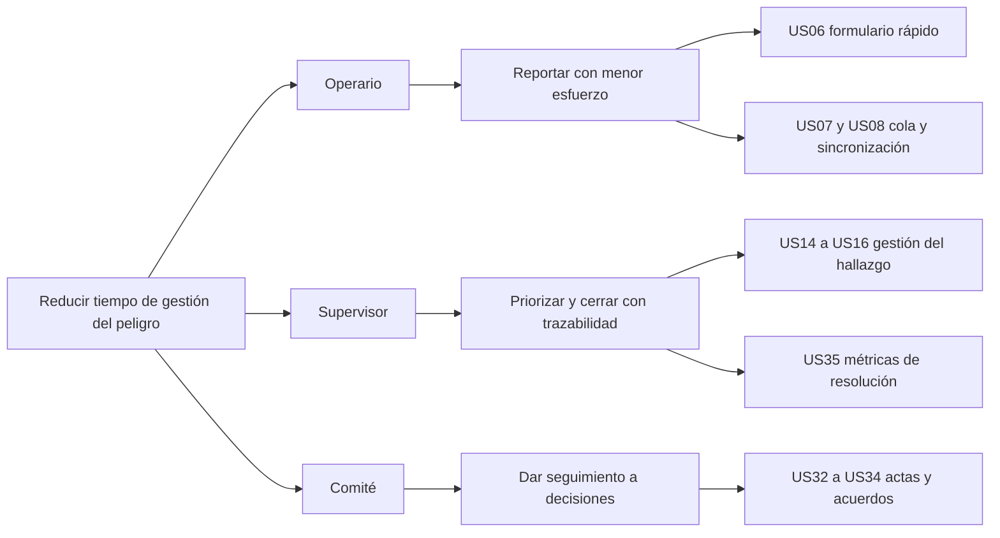

| Goal (¿Por qué?) | Actor (¿Quién?) | Impact (¿Cómo?) | Deliverable (¿Qué?) |
|---|---|---|---|
| **Reducir el tiempo entre la detección de un peligro y su corrección, evidenciando la gestión ante la autoridad** | Operario de campo | Reporta más seguido porque le cuesta poco | Formulario de tres pasos con foto (US06) |
| | | No pierde reportes por falta de señal | Cola local y sincronización automática (US07, US08) |
| | | Sostiene el hábito porque ve resultados | Consulta del estado de sus reportes (US13) |
| | Supervisor de SST | Se entera de inmediato y prioriza por severidad | Bandeja de hallazgos filtrable (US14) |
| | | Hace responsable a alguien con plazo | Asignación y cierre con acción correctiva (US15, US16) |
| | | Mide en lugar de suponer | Indicadores MTTR y cumplimiento (US35, US36) |
| | Comité de SST | Documenta sus decisiones y les da seguimiento | Actas con quórum y acuerdos (US32, US33, US34) |
| | | Mantiene viva la matriz IPERC | Entradas con origen en hallazgos reales (US20, US22) |
| | Empresa ante SUNAFIL | Demuestra gestión en lugar de solo documentación | Exportación de los registros obligatorios (US37) |

---

# Capítulo IV: Product Design

## 4.1. Style Guidelines

### 4.1.1. General Style Guidelines

**Marca.** El producto se llama **Resguardo**. El nombre se eligió porque reúne los dos sentidos
que definen al sistema: proteger y dejar constancia. Se escribe en versalitas en la barra lateral
y acompañado siempre del descriptor "Sistema de Gestión de Seguridad y Salud en el Trabajo".

**Principio rector.** La interfaz es institucional, no comercial. El usuario que la abre está
gestionando riesgos laborales y respondiendo ante una autoridad fiscalizadora; el producto debe
transmitir formalidad y precisión, no entusiasmo. De ahí tres reglas que atraviesan todo el
diseño:

1. **El color solo aparece cuando significa algo.** El azul es la institución; el gris, la
   estructura. Verde, ámbar y rojo se reservan para estados: cerrado, en proceso, vencido o
   crítico. No hay color decorativo.
2. **Sin gradientes, sin sombras de color y con esquinas de 4 píxeles.** Es lo que separa
   visualmente una herramienta corporativa de una aplicación de consumo.
3. **La densidad es una función, no un defecto.** El supervisor revisa decenas de hallazgos por
   sesión; las tablas son compactas a propósito.

**Paleta cromática**

| Token | Valor | Uso |
|---|---|---|
| `--navy-900` | `#0c1d33` | Títulos y textos de mayor jerarquía |
| `--navy-800` | `#12304f` | Barra lateral, fondo de la pantalla de acceso |
| `--navy-700` | `#1b4570` | Acciones primarias, filetes superiores de tarjetas |
| `--navy-600` | `#24578a` | Estados hover, enlaces |
| `--blue-500` | `#2f6db0` | Indicador de la opción de menú activa |
| `--blue-100` | `#e7eff7` | Realce de fila de tabla, halo de foco |
| `--blue-050` | `#f2f6fa` | Filas alternadas de tabla |
| `--gray-900` | `#1c2530` | Texto base |
| `--gray-500` | `#5e6a78` | Texto secundario |
| `--gray-200` | `#dce1e7` | Bordes |
| `--gray-100` | `#eaeef2` | Cabeceras de tabla, separadores |
| `--gray-050` | `#f4f6f8` | Fondo de trabajo |
| `--ok-700` | `#1f6b47` | Estado cerrado / conforme |
| `--warn-700` | `#8a6100` | Estado en proceso |
| `--danger-700` | `#a02a2a` | Vencido, crítico, acciones destructivas |

**Tipografía**

| Rol | Familia | Justificación |
|---|---|---|
| Títulos y cifras de indicadores | Serif del sistema (`ui-serif`, Georgia, Palatino) | Aporta el peso de documento formal, sin cargar una fuente externa que retrase la carga en conexiones lentas |
| Texto de interfaz | Sans del sistema (Segoe UI, system-ui) | Legibilidad en pantalla y cero descarga adicional |
| Etiquetas y cabeceras de tabla | Sans en versalitas, 11 px, `letter-spacing` 0.06em | Jerarquía sin recurrir al color |

**Espaciado e iconografía.** Radio de esquina uniforme de 4 px; bordes de 1 px; separación base
de 8 px con múltiplos de 4. No se usan emojis ni iconos decorativos en la web; en la aplicación
móvil los iconos provienen de Material Icons, limitados a la navegación inferior.

**Tono de voz.** Español peruano formal pero directo. Se prefiere el vocabulario del dominio
("hallazgo", "acción correctiva", "quórum") sobre el vocabulario genérico de software
("ítem", "elemento"). Los mensajes de error explican qué hacer, no solo qué falló.

<!-- IMAGEN REQUERIDA: captura de la paleta y la tipografía aplicadas, o tabla de color
     exportada desde Figma, en assets/img/style-guide-paleta.png -->

### 4.1.2. Web Style Guidelines

| Elemento | Definición |
|---|---|
| Estructura | Barra lateral fija de 236 px, barra superior de 52 px con razón social y fecha, contenido con ancho máximo de 1320 px y pie de página con la referencia normativa |
| Navegación | Vertical en la barra lateral, filtrada por rol; la opción activa se marca con filete azul a la izquierda |
| Tablas | Cabecera gris en versalitas, filas alternadas, realce al pasar el cursor, desbordamiento horizontal contenido en el propio bloque |
| Indicadores | Tarjeta con filete superior azul, etiqueta en versalitas y cifra en serif de 32 px; el filete se vuelve rojo cuando el valor exige atención |
| Formularios | Etiqueta en versalitas sobre el control, rejilla que se adapta de una a varias columnas, controles de elección con estilo propio (la casilla se llena de azul marino con el check en blanco) |
| Modales | Superficie blanca con filete superior azul sobre fondo azul marino translúcido |
| Estados | Píldoras rectangulares de 2 px de radio, con fondo y borde del color del estado |
| Puntos de quiebre | 980 px: la barra lateral pasa a barra horizontal superior; 720 px: las rejillas colapsan a una columna |

### 4.1.3. Mobile Style Guidelines

| Elemento | Definición |
|---|---|
| Sistema de diseño | Material 3 (Jetpack Compose), con esquema de color propio derivado de la paleta institucional |
| Navegación | Barra inferior de cuatro destinos, distinta según rol, más una pantalla "Más" que agrupa el resto |
| Objetivos táctiles | Mínimo 48 dp; en el formulario rápido, tarjetas de selección de ancho completo y 56 dp de alto en las acciones principales |
| Tipografía | Escala tipográfica de Material 3, sin fuentes externas |
| Retroalimentación | Confirmación inmediata al guardar un reporte, con indicador visible de cuántos quedan pendientes de envío |
| Modo sin conexión | Estado explícito en la lista: "Enviado" o "Pendiente", nunca un error silencioso |

#### 4.1.3.1. iOS Mobile Style Guidelines

Fuera del alcance del proyecto. La decisión se sustenta en el segmento objetivo: el operario de
campo peruano usa mayoritariamente dispositivos Android de gama media o baja, y desarrollar
para iOS habría consumido la mitad del presupuesto de desarrollo del ciclo sin atender a ese
usuario. Se documenta como decisión consciente y no como omisión.

<!-- COMPLETAR: respaldar la afirmación sobre distribución de sistemas operativos con una
     fuente citable (OSIPTEL, StatCounter Perú o similar). -->

#### 4.1.3.2. Android Mobile Style Guidelines

| Elemento | Definición |
|---|---|
| Color primario | Azul marino institucional, consistente con la web |
| Modo oscuro | Soportado mediante el esquema oscuro de Material 3 |
| Icono de aplicación | Icono adaptativo con triángulo de advertencia, símbolo universal de peligro en SST |
| Componentes | `Card`, `FilterChip`, `NavigationBar`, `AlertDialog` y `Checkbox` de Material 3, sin componentes personalizados innecesarios |
| Permisos | Cámara y ubicación se solicitan en el momento de uso, no al abrir la aplicación |

## 4.2. Information Architecture

### 4.2.1. Organization Systems

La información se organiza por **proceso del sistema de gestión**, no por tipo de dato: el
usuario piensa en "reportar", "inspeccionar" o "revisar la matriz", no en "entidades". Dentro de
cada proceso, el orden es cronológico descendente para lo operativo (los hallazgos más recientes
primero) y por severidad cuando la prioridad manda.

| Esquema | Aplicación |
|---|---|
| Secuencial | Formulario rápido de reporte: tres pasos con avance explícito |
| Cronológico | Bandeja de hallazgos, bitácora, actas del comité |
| Por tópico | Menú principal: reportes, IPERC, inspecciones, EPP, comité |
| Por audiencia | El menú se filtra por rol: en la web el operario ve seis opciones y el supervisor nueve; en el móvil, cuatro destinos en la barra inferior más una pantalla "Más" |

### 4.2.2. Labeling Systems

Las etiquetas usan el vocabulario del dominio definido en el Ubiquitous Language, no traducciones
literales del inglés técnico.

| En la interfaz | En el modelo | Por qué esa etiqueta |
|---|---|---|
| Reportar | `Report.create` | Verbo de la acción del operario, no "nuevo registro" |
| Hallazgo | `Report` gestionado | Es el término que usa el profesional de SST |
| Matriz IPERC | `IpercMatrix` | Nombre normativo, reconocible sin explicación |
| Equipos de protección | `EppItem` / `EppDelivery` | Se evita la sigla en el menú y se usa en el detalle |
| Comité de SST | `Committee` | Nombre normativo |
| Acta N° | `Meeting.number` | Formato documental esperado por el auditor |
| Cerrar hallazgo | `Report.close` | Acción con consecuencia explícita |

### 4.2.3. SEO Tags and Meta Tags

Aplican a la landing page y a la pantalla de acceso de la aplicación web; el interior del panel
no se indexa por requerir autenticación.

| Etiqueta | Contenido |
|---|---|
| `<title>` | Resguardo — Sistema de Gestión de SST |
| `<meta name="description">` | Resguardo — Sistema de Gestión de Seguridad y Salud en el Trabajo (Ley N° 29783) |
| `<html lang>` | `es-PE` |
| `<meta name="viewport">` | `width=device-width, initial-scale=1.0` |
| Open Graph | <!-- COMPLETAR en la landing page, que vive en su propio repositorio: og:title, og:description, og:image, og:url -->

Las etiquetas `title`, `description`, `lang` y `viewport` están declaradas en el `index.html` de `sst-web`. Las de Open Graph y Twitter Card corresponden a la landing page y se declararán en su repositorio.

### 4.2.4. Searching Systems

El sistema no ofrece un buscador global. La búsqueda es **contextual y por filtros**, porque el
usuario no busca texto libre sino subconjuntos: los hallazgos abiertos de un área, las
inspecciones vencidas, las entregas de EPP de un trabajador.

| Pantalla | Mecanismo |
|---|---|
| Bandeja de hallazgos | Filtros por estado, tipo y área; ordenamiento por fecha y severidad |
| API | Filtros por campo, búsqueda textual en descripción y nota de cierre, y ordenamiento, provistos por el backend |
| Matriz IPERC | Búsqueda por peligro, riesgo y puesto |

### 4.2.5. Navigation Systems

La navegación responde a una sola pregunta: **qué puede hacer este rol, aquí y ahora**. No hay un
menú universal que luego deshabilite opciones; cada rol recibe únicamente los destinos que le
corresponden, y esa filtración ocurre en el mismo lugar en las dos plataformas.

#### Niveles de navegación

| Nivel | Web | Móvil | Propósito |
|---|---|---|---|
| **Global** | Barra lateral fija de 236 px, siempre visible | Barra inferior de cuatro destinos más una pantalla "Más" | Moverse entre procesos del sistema de gestión |
| **Local** | Acciones dentro de la pantalla: *Asignar*, *Cerrar*, *Nueva versión*, *Registrar entrega* | Las mismas acciones, como botones de ancho completo | Actuar sobre el registro que se está viendo |
| **Contextual** | Filtros de la bandeja (estado, tipo, área) y selector de versión de la matriz | Filtros equivalentes en chips | Reducir un listado sin cambiar de pantalla |
| **De retorno** | El título del detalle enlaza a su listado; el logotipo lleva al inicio del rol | Botón de retroceso del sistema y de la barra superior | Volver sin perder el contexto |

No hay migas de pan (*breadcrumbs*): la jerarquía tiene como máximo dos niveles —listado y
detalle—, y un rastro de migas de dos escalones ocupa espacio sin aportar orientación.

#### Destinos por rol y plataforma

La tabla siguiente es la verificación de la paridad exigida al proyecto. Cada fila es un destino
real del código: la barra lateral de la web se arma desde una lista con marca `managerOnly`, y la
barra inferior del móvil desde dos listas de pestañas, una por rol.

| Destino | Ruta web | Operario (web) | Operario (móvil) | Supervisor y comité (web) | Supervisor y comité (móvil) |
|---|---|---|---|---|---|
| Tablero de indicadores | `/` | — | — | Barra lateral | Barra inferior |
| Reportar un hallazgo | `/reportes/nuevo` | Barra lateral | Barra inferior | Barra lateral | Menú "Más" |
| Reportes | `/reportes` | Barra lateral | Barra inferior | Barra lateral | Barra inferior |
| Detalle del hallazgo | `/reportes/:id` | Desde el listado | Desde el listado | Desde el listado | Desde el listado |
| Matriz IPERC | `/iperc` | Barra lateral | Menú "Más" | Barra lateral | Menú "Más" |
| Inspecciones | `/inspecciones` | Barra lateral | Menú "Más" | Barra lateral | Barra inferior |
| Equipos de protección | `/epp` | Barra lateral | Barra inferior ("Mis EPP") | Barra lateral | Menú "Más" |
| Comité de SST | `/comite` | Barra lateral | Menú "Más" | Barra lateral | Menú "Más" |
| Reportes guardados en el equipo | — | — | Menú "Más" | — | Menú "Más" |
| Experimento A/B | `/experimento` | — | — | Barra lateral | — |
| Usuarios y áreas | `/usuarios` | — | — | Barra lateral | — |

Tres lecturas de esa tabla:

1. **Para el operario la paridad es completa.** Los seis destinos que ve en la web son los
   mismos que alcanza en el móvil. Cambia dónde está cada uno: lo que hace todos los días
   —reportar, ver sus reportes, ver sus EPP— ocupa la barra inferior, y lo que consulta de vez en
   cuando queda un toque más adentro, en "Más". Priorizar por frecuencia de uso es el criterio
   de una barra de cuatro destinos; ocultar capacidades no lo es.
2. **Para el supervisor hay dos destinos solo en la web**, *Usuarios y áreas* y *Experimento A/B*.
   No es un pendiente: son las historias US04, US05, US41 y US40, especificadas como web desde el
   Capítulo III. Dar de alta usuarios, definir áreas y leer los resultados de un experimento son
   tareas de escritorio, con formularios largos y tablas comparativas; nadie las hace con una mano
   mientras sostiene un casco con la otra. La regla de paridad aplica a las capacidades de campo
   y de gestión del hallazgo, y estas dos quedan documentadas como excepción razonada.
3. **Un destino existe solo en el móvil**, *Reportes guardados en el equipo*, porque solo el móvil
   tiene una cola local: es la lista de lo que se capturó sin señal y aún no se ha sincronizado.
   En la web no tendría contenido que mostrar.

#### Reglas de comportamiento

| Regla | Comportamiento | Por qué |
|---|---|---|
| Destino inicial según rol | El operario entra a *Reportar*; el supervisor y el comité, al *Tablero* | La primera pantalla debe ser la tarea más probable de ese rol, no una bienvenida |
| Ruta no autorizada | Un operario que escriba `/usuarios` es redirigido a sus reportes | Un 403 en pantalla no le sirve de nada a quien no puede estar ahí |
| Ruta inexistente | Cualquier otra ruta redirige al inicio del rol | Evita pantallas en blanco por un enlace viejo o un error de tipeo |
| Sesión no iniciada | El acceso a una ruta privada lleva a la pantalla de acceso, no a un error | Quien llega por un enlace sin sesión debe poder iniciarla y continuar |
| Opción activa | Filete azul a la izquierda en la web; destino resaltado en la barra inferior del móvil | Ubicación permanente sin recurrir a migas de pan |
| Estado al volver | El móvil conserva el estado de cada pestaña al cambiar entre ellas | Volver a una lista y encontrarla al inicio obliga a repetir el trabajo de búsqueda |
| Cierre de sesión | Siempre en el pie de la barra lateral y en la pantalla "Más" | Una acción con consecuencia se coloca lejos de la navegación frecuente |

#### Mapa de navegación

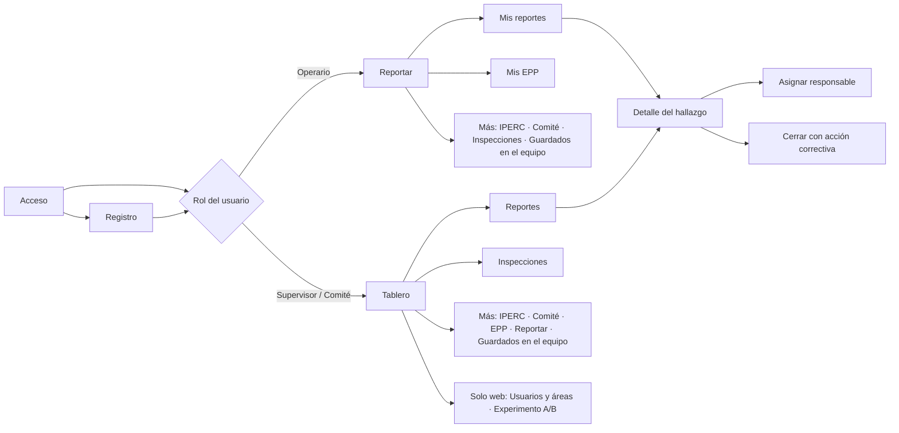

El diagrama vale para las dos plataformas: lo que cambia es el mecanismo —barra lateral en la web,
barra inferior más pantalla "Más" en el móvil—, no el conjunto de destinos ni el camino entre
ellos. Un supervisor que aprendió a moverse en la web no tiene que volver a aprender nada al
abrir el celular.

## 4.3. Landing Page UI Design

La página pública **no forma parte de la aplicación web**. Vive en su propio repositorio, separada
del panel de gestión, por dos razones que conviene declarar:

| Razón | Consecuencia |
|---|---|
| Audiencias distintas | La landing se dirige a quien todavía no es cliente; el panel, a quien ya lo es y trabaja en él todos los días. Son dos productos con métricas y ritmos de cambio diferentes |
| Despliegue independiente | Un cambio de texto comercial no debería obligar a reconstruir y volver a desplegar la aplicación de gestión, ni arrastrar su código al navegador de un visitante |

Comparte, eso sí, la identidad visual definida en 4.1: los mismos tokens de color, la misma
tipografía y el mismo tono institucional, de modo que quien pase de la página al acceso no sienta
que entró a otro producto.

### 4.3.1. Landing Page Wireframe

Estructura prevista de arriba hacia abajo, con la intención de cada bloque:

| # | Bloque | Contenido | Qué debe lograr |
|---|---|---|---|
| 1 | Barra de navegación | Logotipo, anclas a las secciones y botón *Ingresar* | Que el usuario que ya es cliente llegue al acceso en un clic, sin leer nada |
| 2 | Encabezado | Referencia normativa, titular, propuesta de valor y dos llamadas a la acción | Decir en una frase qué resuelve y para quién |
| 3 | Recorrido del hallazgo | Los cinco pasos: se detecta, se registra, se asigna, se cierra, se documenta | Mostrar el producto como un proceso completo, no como una lista de pantallas |
| 4 | El problema | Tres bloques: el reporte no llega, el peligro sigue ahí, no hay cómo demostrarlo | Que el visitante se reconozca antes de que se le ofrezca nada |
| 5 | El sistema | Reporte en campo, seguimiento, evidencia, IPERC, EPP e inspecciones, comité | Responder qué hace, con el vocabulario del dominio |
| 6 | Cumplimiento | Tabla obligación → base normativa → dónde queda registrado | Convertir la promesa en trazabilidad verificable |
| 7 | Planes | Tres niveles según número de trabajadores | Que el visitante se ubique sin pedir una cotización |
| 8 | Contacto | Vía de contacto y solicitud de demostración | Cerrar con una acción concreta |
| 9 | Pie | Referencia a la Ley N° 29783 y su Reglamento | Reforzar el encuadre institucional |

**Restricciones autoimpuestas al contenido**

| Restricción | Razón |
|---|---|
| Solo se anuncian capacidades implementadas | Ninguna historia marcada *Propuesta* en el Capítulo III puede aparecer en la página: publicitar lo que no existe es la forma más rápida de perder al primer cliente |
| Sin precios publicados en los planes | El precio depende del número de trabajadores y del acompañamiento; una cifra inventada es peor que ninguna |
| Sin formulario que no envíe a ningún servidor | Un formulario que no llega a nadie es una promesa falsa; mientras no haya backend de contacto, se usa una vía de contacto directa |
| La cifra del MTPE solo se publica con su fuente | Mismo criterio que el Capítulo I: antes que un número sin respaldo, ninguno |
| La tabla de cumplimiento cita el artículo | Un responsable de SST evalúa el producto por su cobertura normativa, no por adjetivos |

<!-- IMAGEN REQUERIDA: wireframe de la landing page en assets/img/landing-wireframe.png.
     Puede dibujarse en Figma sobre la estructura de nueve bloques de la tabla anterior. -->

### 4.3.2. Landing Page Mock-up

<!-- IMAGEN REQUERIDA: mock-up o capturas de la landing page en
     assets/img/landing-mockup-*.png, una vez construida en su repositorio. -->

**Aplicación de la guía de estilo.** La página debe reutilizar los tokens definidos en 4.1 sin
introducir colores nuevos: azul marino para la marca, las acciones y el bloque de contacto; gris
para estructura y texto secundario; blanco para las superficies. El titular y los nombres de los
planes, en la serif del sistema, igual que los títulos del panel.

## 4.4. Mobile Applications UX/UI Design

### 4.4.1. Mobile Applications Wireframes

<!-- IMAGEN REQUERIDA: wireframes de las pantallas móviles en
     assets/img/mobile-wireframes.png. Pantallas: acceso, registro, formulario rápido
     (3 pasos), formulario largo, lista de reportes, detalle del hallazgo, IPERC, mis EPP,
     inspecciones, tablero. -->

### 4.4.2. Mobile Applications Wireflow Diagrams

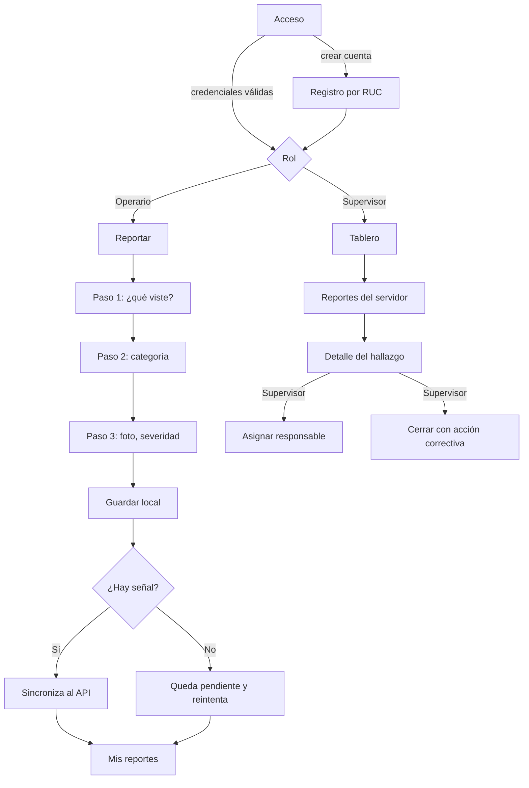

### 4.4.3. Mobile Applications Mock-ups

<!-- IMAGEN REQUERIDA: capturas reales de la aplicación Android en ejecución en
     assets/img/mobile-mockup-*.png -->

### 4.4.4. Mobile Applications User Flow Diagrams

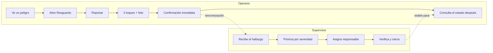

## 4.5. Mobile Applications Prototyping

### 4.5.1. Android Mobile Applications Prototyping

<!-- COMPLETAR: enlace al prototipo navegable en Figma. Si el prototipo se sustituye por la
     aplicación real compilada, dejarlo indicado y enlazar el APK de depuración generado por
     el pipeline. -->

### 4.5.2. iOS Mobile Applications Prototyping

Fuera del alcance, conforme a lo justificado en 4.1.3.1.

## 4.6. Web Applications UX/UI Design

### 4.6.1. Web Applications Wireframes

<!-- IMAGEN REQUERIDA: wireframes del panel web en assets/img/web-wireframes.png.
     Pantallas: acceso, registro, tablero, bandeja de hallazgos, detalle, matriz IPERC,
     inspecciones, EPP, comité, usuarios, experimento. -->

### 4.6.2. Web Applications Wireflow Diagrams

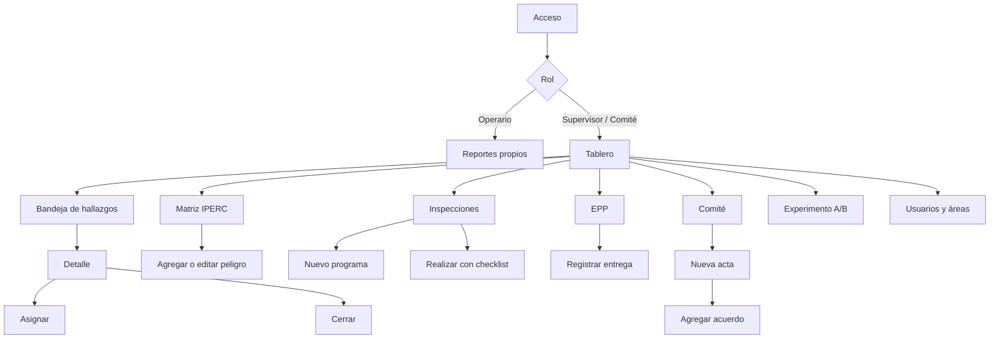

### 4.6.3. Web Applications Mock-ups

<!-- IMAGEN REQUERIDA: capturas reales del panel web en assets/img/web-mockup-*.png -->

### 4.6.4. Web Applications User Flow Diagrams

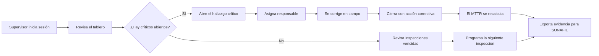

## 4.7. Web Applications Prototyping

<!-- COMPLETAR: enlace al prototipo navegable en Figma, o indicación de que el prototipo se
     sustituye por la aplicación web desplegada, con su URL. -->

## 4.8. Domain-Driven Software Architecture

La arquitectura sigue el enfoque C4. El sistema se organiza en **bounded contexts** que
corresponden a los procesos del sistema de gestión: identidad y organización, reportes,
IPERC, EPP, inspecciones, comité y experimentación.

### 4.8.1. Software Architecture Context Diagram

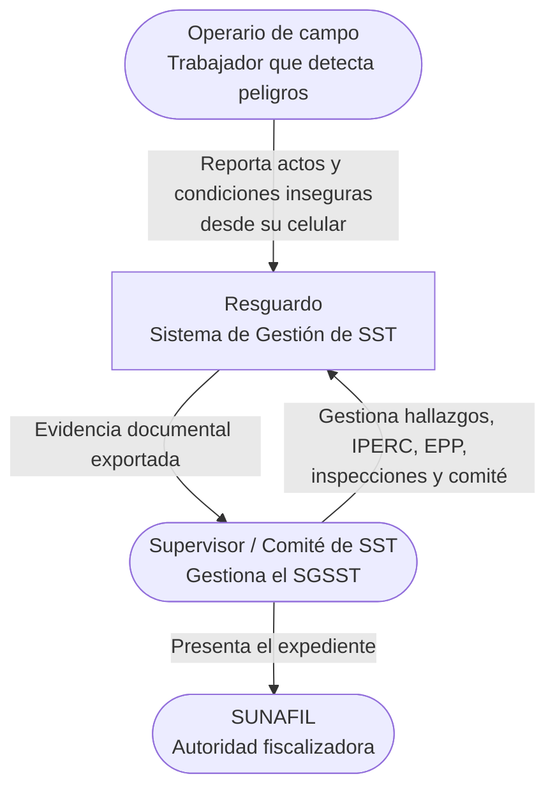

### 4.8.2. Software Architecture Container Diagrams

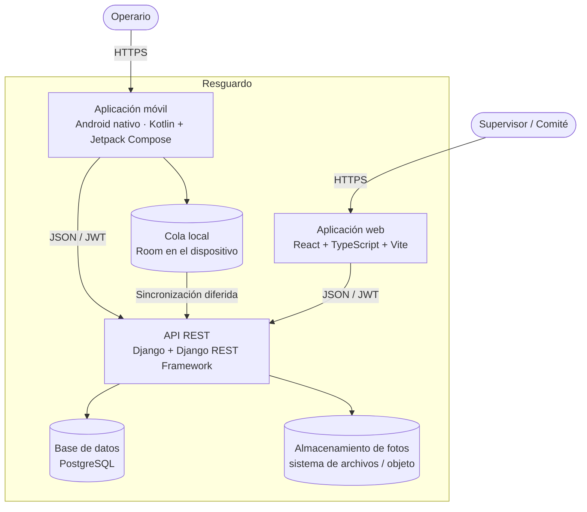

**Decisión de arquitectura.** Ambos clientes consumen exactamente el mismo API. Esto no es un
detalle de implementación: es lo que garantiza la paridad funcional exigida, porque no existen
dos implementaciones de la misma regla de negocio que puedan divergir. La lógica —qué puede
hacer cada rol, cómo se calcula el nivel de riesgo, cuándo se considera cerrado un hallazgo—
vive una sola vez, en el backend.

### 4.8.3. Software Architecture Components Diagrams

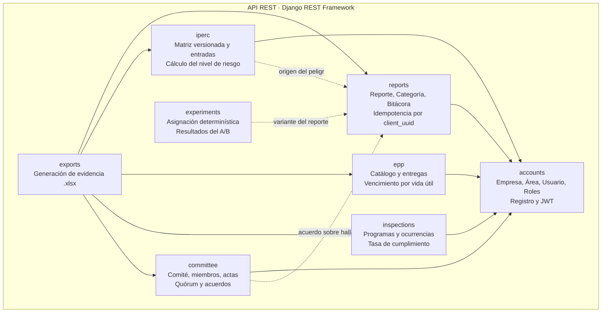

## 4.9. Software Object-Oriented Design

### 4.9.1. Class Diagrams

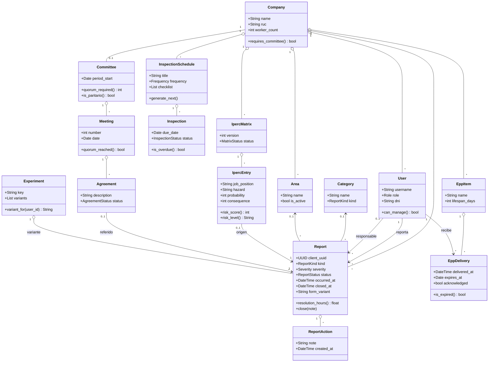

### 4.9.2. Class Dictionary

| Clase | Responsabilidad | Atributos y métodos destacados |
|---|---|---|
| `Company` | Empresa obligada por la Ley N° 29783. Raíz de agregado de todo el sistema: nada existe fuera de una empresa. | `ruc` único; `requires_committee()` devuelve verdadero desde 20 trabajadores, umbral que la ley fija para exigir comité paritario |
| `Area` | Área, sede o frente de trabajo donde se ubican los peligros. | Único por nombre dentro de la empresa |
| `User` | Usuario del sistema. El rol determina qué puede hacer, en web y en móvil por igual. | `role` en {OPERARIO, SUPERVISOR, COMITE, ADMIN}; `can_manage()` centraliza la regla de quién puede asignar y cerrar |
| `Category` | Categoría de peligro configurable por empresa, asociada al tipo de hallazgo. | `kind` restringe qué categorías aplican a actos y cuáles a condiciones |
| `Report` | Reporte de un acto o condición insegura. Entidad central del sistema. | `client_uuid` habilita la sincronización sin duplicados; `occurred_at` separa la fecha del hecho de la de recepción; `resolution_hours()` es el insumo del MTTR |
| `ReportAction` | Entrada de la bitácora del hallazgo. | Registra autor, nota, estado resultante y fecha; es la evidencia de trazabilidad |
| `IpercMatrix` | Versión de la matriz IPERC. | `version` correlativa por empresa; `status` en {BORRADOR, VIGENTE, HISTORICA} |
| `IpercEntry` | Fila de la matriz: peligro de un puesto y sus controles. | `risk_score()` = probabilidad × consecuencia; `risk_level()` traduce el puntaje a la escala normativa; `source_report` documenta el origen en campo |
| `EppItem` | EPP del catálogo de la empresa. | `lifespan_days` determina el vencimiento de cada entrega |
| `EppDelivery` | Entrega de un EPP a un trabajador. Registro obligatorio. | Calcula `expires_at` al guardar; `acknowledged` guarda la conformidad del trabajador |
| `InspectionSchedule` | Programa de inspecciones: qué, cada cuánto y quién. | `checklist` en JSON; `generate_next()` crea la siguiente ocurrencia según la frecuencia |
| `Inspection` | Ocurrencia concreta de una inspección programada. | `is_overdue()` marca el incumplimiento cuando pasó la fecha sin ejecución |
| `Committee` | Comité de SST de la empresa, o supervisor único si tiene menos de 20 trabajadores. | `quorum_required()` = mitad más uno de los titulares; `is_paritario()` verifica la igualdad de representaciones |
| `Meeting` | Acta de reunión del comité. | `number` correlativo asignado por el servidor; `quorum_reached()` determina la validez del acta |
| `Agreement` | Acuerdo adoptado en una reunión, con responsable y plazo. | Puede referenciar el hallazgo o la entrada IPERC que lo originó |
| `Experiment` / `Assignment` | Experimento A/B y la asignación de cada usuario. | `variant_for()` usa un hash estable de clave + identificador de usuario, de modo que la asignación es reproducible y calculable sin conexión |

## 4.10. Database Design

### 4.10.1. Relational/Non-Relational Database Diagram

Base de datos relacional **PostgreSQL** en despliegue y SQLite en desarrollo, con el mismo
esquema: no se usa ninguna característica propietaria de PostgreSQL más allá del tipo JSON, que
SQLite emula. El esquema no se escribe a mano; lo generan las migraciones de Django a partir de
los modelos, de modo que el diagrama siguiente es un reflejo del código y no un documento
paralelo que pueda desactualizarse.

Son **quince tablas**, más la tabla intermedia de asistencia a las reuniones del comité.

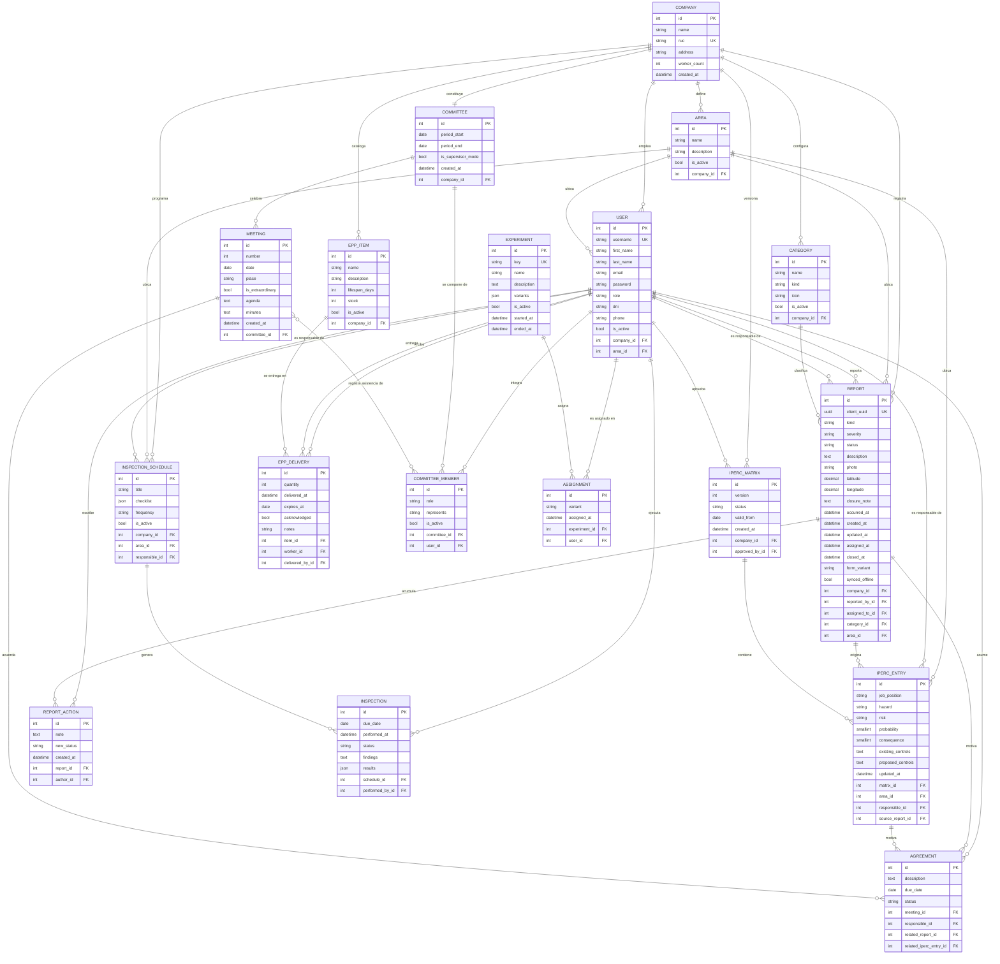

**Restricciones de integridad declaradas en la base de datos**

No son validaciones de formulario: son restricciones del motor, de modo que ni un error de la
aplicación ni una carga directa pueden dejar el dato inconsistente.

| Restricción | Tabla | Qué impide |
|---|---|---|
| `ruc` único | `COMPANY` | Dos empresas con el mismo RUC |
| `client_uuid` único | `REPORT` | Que un reintento de sincronización cree un hallazgo duplicado |
| `(company, name)` único | `AREA` | Dos áreas con el mismo nombre en una empresa |
| `(company, version)` único | `IPERC_MATRIX` | Dos matrices con la misma versión |
| `(committee, number)` único | `MEETING` | Dos actas con el mismo número correlativo |
| `(committee, user)` único | `COMMITTEE_MEMBER` | Que una persona figure dos veces en el mismo comité |
| `(experiment, user)` único | `ASSIGNMENT` | Que un usuario quede asignado a dos variantes |
| `company` uno a uno | `COMMITTEE` | Más de un comité vigente por empresa |
| Índices `(company, status)` y `(company, -created_at)` | `REPORT` | No impiden nada: aceleran las dos consultas más frecuentes del panel |

**Comportamiento al borrar**

| Relación | Regla | Razón |
|---|---|---|
| `REPORT.reported_by`, `REPORT_ACTION.author`, `EPP_DELIVERY.delivered_by` | `PROTECT` | Un usuario con evidencia asociada no se puede borrar: eso destruiría la trazabilidad que la ley exige conservar |
| `EPP_DELIVERY.item` | `PROTECT` | Un EPP entregado no puede desaparecer del catálogo |
| `REPORT.assigned_to`, `REPORT.area`, `REPORT.category`, `IPERC_ENTRY.source_report`, `AGREEMENT.responsible` | `SET NULL` | El registro sobrevive aunque el dato referenciado deje de existir; se pierde el enlace, no el hallazgo |
| Todo lo que cuelga de `COMPANY`, y `MEETING` de `COMMITTEE` | `CASCADE` | Son partes de un agregado: sin su raíz no significan nada |

**Decisiones de diseño de datos**

| Decisión | Justificación |
|---|---|
| `client_uuid` único en `REPORT` | Permite que el cliente móvil reintente el envío sin crear duplicados: la unicidad la garantiza la base de datos, no la lógica de aplicación |
| `occurred_at` separado de `created_at` | Un reporte creado sin conexión conserva su fecha real; sin esta separación el MTTR quedaría distorsionado |
| `latitude` y `longitude` con `decimal(9,6)` | Seis decimales dan precisión de unos 11 cm, suficiente para ubicar un peligro dentro de una planta; `float` introduciría error de redondeo en un dato que puede ser evidencia |
| `source_report_id` en `IPERC_ENTRY` | Documenta que la matriz se alimenta de hallazgos reales, que es la diferencia entre una matriz viva y una de escritorio |
| `related_report_id` y `related_iperc_entry_id` en `AGREEMENT` | El acuerdo del comité queda trazado hasta el hallazgo o el peligro que lo originó, que es justo lo que hoy se pierde en el cuaderno de actas |
| `results` y `checklist` como JSON | El checklist varía por programa de inspección; normalizarlo exigiría dos tablas más sin ninguna consulta que lo aproveche |
| `variants` como JSON en `EXPERIMENT` | El número de variantes es propiedad del experimento, no del esquema; así se puede correr un experimento de tres variantes sin migrar |
| `form_variant` en `REPORT` | La atribución del experimento queda en el propio dato, no en un sistema de analítica externo |
| Sin borrado físico de hallazgos | El estado `DESCARTADO` reemplaza al borrado: la decisión de descartar también es evidencia |
| `risk_score` y `risk_level` no se almacenan | Se calculan desde `probability` y `consequence`; guardarlos crearía un dato que puede contradecir a su origen |

**Nota sobre lo no relacional.** El sistema no usa base de datos documental. La información de
SST es fuertemente relacional —un hallazgo pertenece a una empresa, un área, una categoría y un
responsable, y debe poder consultarse por cualquiera de ellos— y los recuentos del tablero son
agregaciones que el motor relacional resuelve mejor. Los dos casos con forma libre, el checklist
de la inspección y las variantes del experimento, se resuelven con columnas JSON dentro del mismo
esquema, sin introducir un segundo motor que habría que respaldar, migrar y mantener consistente.

---

# Capítulo V: Product Implementation

Se documentan la configuración, el alcance declarado de los sprints y la evidencia técnica
disponible. La inspección de código del Anexo G respalda la existencia de componentes, pero
no sustituye una compilación exitosa, una prueba de aceptación o un despliegue público.

## 5.1. Software Configuration Management

La línea base de cada entrega debe identificar el commit de API, web, Android e informe, las
versiones de dependencias y las variables de configuración del entorno. Los cambios de
contrato requieren revisar ambos clientes antes de promover una versión. El registro de
entrega debe conservar esas referencias junto con sus resultados de construcción y pruebas.

### 5.1.1. Software Development Environment Configuration

| Propósito | Herramienta | Versión | Justificación |
|---|---|---|---|
| Control de versiones | Git | 2.45 | Estándar del curso; requerido para GitFlow y Conventional Commits |
| Alojamiento y colaboración | GitHub (organización pública `sst-peru`) | — | Exigido por el enunciado: organización pública con evidencia de commits |
| Automatización | GitHub Actions | — | Integrado al repositorio, sin infraestructura adicional |
| Backend | Python | 3.11 | Versión configurada en el workflow del API consultado |
| Framework backend | Django + Django REST Framework | 5.1.4 / 3.15.2 | Django aporta ORM, migraciones, autenticación y panel de administración; DRF añade el API REST |
| Documentación del API | drf-spectacular | 0.28.0 | Genera OpenAPI desde el código, evitando que el contrato se desactualice |
| Autenticación | djangorestframework-simplejwt | 5.3.1 | JWT consumido igual por web y móvil |
| Exportación de evidencia | openpyxl | 3.1.5 | Generación de .xlsx sin dependencias externas |
| Base de datos | PostgreSQL / SQLite | 16 / 3 | PostgreSQL en despliegue; SQLite en desarrollo local |
| Frontend web | React + TypeScript + Vite | 18.3 / 5.7 / 6.0 | TypeScript da verificación estática del contrato del API; Vite acelera el ciclo de desarrollo |
| Estado del servidor en la web | TanStack Query | 5.62 | Manejo de caché e invalidación sin escribir un reducer por pantalla |
| Cliente HTTP web | Axios | 1.7 | Interceptores para JWT y renovación de token |
| Móvil | Kotlin + Jetpack Compose | 2.0.21 / BOM 2024.12 | Android nativo con interfaz declarativa |
| Persistencia local móvil | Room | 2.6.1 | Cola de reportes pendientes de envío |
| Sincronización móvil | WorkManager | 2.10.0 | Reintento con backoff al recuperar la conectividad |
| Red móvil | Retrofit + OkHttp | 2.11 / 4.12 | Cliente HTTP con interceptor de autenticación |
| Entorno de desarrollo | Visual Studio Code / Android Studio | — | Edición del backend y la web; compilación y emulación Android |
| Pruebas backend | pytest + pytest-django | 8.3 / 4.9 | Suite de pruebas del API |
| Análisis estático | ruff / ESLint / TypeScript | 0.8 / 9.17 / 5.7 | Verificación sin ejecutar el código |

**Preparación reproducible del entorno.** Los comandos siguientes se ejecutan en el
repositorio de cada componente, después de clonar la versión que se va a evaluar.

```bash
# Backend: terminal Bash, dentro de sst-api
python3.11 -m venv .venv
source .venv/bin/activate
pip install -r requirements-dev.txt
cp .env.example .env
python manage.py migrate
python manage.py seed_demo
python manage.py runserver 0.0.0.0:8000
```

`seed_demo` se reserva para una base local de demostración. En una segunda terminal, dentro de
`sst-web`, ejecutar `npm ci`, copiar `.env.example` a `.env` y ejecutar `npm run dev`. Android
se abre en Android Studio con JDK 17, SDK 35 y dispositivo o emulador API 26 o superior; el
workflow consultado utiliza Gradle 8.11.1. La configuración del emulador apunta al mismo API.
Los archivos de dependencias y el commit fijan la versión evaluada; esta tabla no implica una
recomendación de usar esas versiones para un nuevo producto.

### 5.1.2. Source Code Management

**Repositorios.** El producto se organiza en tres repositorios independientes más el del informe,
todos dentro de la organización pública `sst-peru`:

| Repositorio | Contenido |
|---|---|
| `sst-api` | API REST en Django; concentra el modelo de dominio y las reglas de negocio |
| `sst-web` | Panel web en React |
| `sst-mobile` | Aplicación Android nativa |
| `sst-report` | Este informe |

La separación responde a que cada uno tiene su propio ciclo de construcción, su propio pipeline
y su propio lenguaje; un monorepo habría obligado a ejecutar los tres pipelines ante cualquier
cambio.

**Modelo de ramas.**

| Rama | Propósito | Sale de | Vuelve a |
|---|---|---|---|
| `main` | Solo versiones entregables, etiquetadas | — | — |
| `develop` | Integración del trabajo en curso | main | — |
| `feature/*` | Nueva funcionalidad | develop | develop |
| `fix/*` | Corrección de defecto | develop | develop |
| `docs/*` | Redacción del informe | develop | develop |
| `chore/*` | Infraestructura y configuración | develop | develop |

**Política de protección prevista:** impedir push directo y force push a `main` y `develop`,
y exigir Pull Request con verificaciones aprobadas. El repositorio permite inspeccionar código
y workflows, pero no se adjunta evidencia de la configuración efectiva de esas protecciones.
Las versiones de producto consultadas corresponden a la rama `develop`.

**Conventional Commits.** Todos los mensajes siguen `tipo(alcance): descripción`. Ejemplos
reales del historial del proyecto:

```
feat(auth): agregar empresa, areas, usuario con roles y endpoints de registro y login
feat(reports): agregar reportes de actos y condiciones inseguras con cierre y bitacora
feat(sync): subir reportes pendientes con workmanager cuando vuelve la red
fix(reports): redondear la latitud y longitud del gps antes de validar
fix(auth)!: impedir que el registro publico elija su propio rol y agregar endpoint de usuarios
test(reports): cubrir creacion offline, permisos por rol y calculo de mttr
ci: agregar workflows de tests, lint y validacion de conventional commits
```

El signo `!` marca un cambio que rompe el contrato del API, como ocurrió al retirar el campo
`role` del registro público.

La convención se verifica en dos momentos: un hook `commit-msg` local la rechaza antes de crear
el commit, y un workflow de GitHub Actions la valida sobre todos los commits del Pull Request.
Tener ambas capas importa porque el hook local puede no estar instalado en una máquina nueva.

### 5.1.3. Source Code Style Guide & Conventions

| Ámbito | Convención | Verificación |
|---|---|---|
| Python | PEP 8 con línea de 100 caracteres; `ruff` con las reglas E, F, I, UP, B y DJ | `ruff check .` en CI |
| Nombres en Python | `snake_case` para funciones y variables, `PascalCase` para clases, español para el vocabulario de dominio y inglés para los nombres del framework | Revisión en PR |
| TypeScript | ESLint con reglas recomendadas más `react-hooks`; modo estricto de TypeScript con `noUnusedLocals` y `noUnusedParameters` | `npm run lint` y `npm run typecheck` en CI |
| Nombres en TypeScript | `camelCase` para variables y funciones, `PascalCase` para componentes y tipos | Revisión en PR |
| Kotlin | Estilo oficial de Kotlin (`kotlin.code.style=official`); composables en `PascalCase` | Compilación en CI |
| CSS | Propiedades personalizadas para toda la paleta; sin valores de color literales fuera de `:root` | Revisión en PR |
| Comentarios | Se comenta el **porqué**, no el qué. Un comentario que repite el código se elimina en revisión | Revisión en PR |
| Fin de línea | LF en el repositorio, forzado por `.gitattributes`; CRLF solo en `.bat`, `.cmd` y `.ps1` | `.gitattributes` |
| Idioma | Código y mensajes de commit sin tildes ni eñes; interfaz y documentación en español correcto | Revisión en PR |

**Criterios de revisión.** Las validaciones de permisos pertenecen al backend; ocultar un botón
no reemplaza la autorización. Los cambios de contrato deben actualizar los tipos del cliente,
los serializadores y los ejemplos del API. Kotlin requiere revisión de estilo o un linter
específico: compilar verifica la construcción, pero no demuestra cumplimiento del estilo.
Para el informe, `CONTRIBUTING.md`, `.gitattributes` y el hook `commit-msg` son los archivos
locales que formalizan el flujo y las convenciones.

### 5.1.4. Software Deployment Configuration

| Componente | Configuración |
|---|---|
| API | Variables de entorno mediante archivo `.env` (`DEBUG`, `SECRET_KEY`, `ALLOWED_HOSTS`, `DATABASE_URL`, `CORS_ALLOWED_ORIGINS`). `DATABASE_URL` vacío usa SQLite; con valor, PostgreSQL |
| Web | `VITE_API_URL` define el API consumido. En desarrollo, Vite hace proxy de `/api` al backend, evitando CORS |
| Móvil | `API_BASE_URL` se inyecta como `buildConfigField` en Gradle. En emulador, `http://10.0.2.2:8000/api/v1/`, que es la dirección con la que el emulador alcanza el `localhost` del anfitrión |
| Tráfico en claro | `network_security_config.xml` permite HTTP sin cifrar únicamente contra direcciones de desarrollo; en producción el API va por HTTPS |
| Secretos | Ningún secreto se versiona: `.env` está en `.gitignore` y se distribuye `.env.example` con los nombres de variable |

**Entornos y condición de publicación.**

| Entorno | Uso | Estado de evidencia |
|---|---|---|
| Desarrollo | API local, web con Vite y Android en emulador | Configuración localizada en los tres repositorios |
| Pruebas compartidas | Validación integrada de una versión candidata con datos sintéticos | Sin URL ni registro de despliegue adjunto |
| Producción | Servicio para empresas con HTTPS, respaldo y monitoreo | Sin despliegue acreditado en este informe |

Antes de habilitar un entorno compartido se debe configurar el API con `DEBUG=False`, clave
propia, hosts y orígenes autorizados, base PostgreSQL y almacenamiento persistente de fotografías.
El procedimiento previsto es respaldar, revisar el plan de migraciones, aplicarlas, iniciar la
versión y comprobar autenticación, creación de un reporte y lectura de métricas. No se considera
publicado un componente solo porque su build termine correctamente.

En Vite, las variables `VITE_*` quedan incorporadas al bundle durante la construcción. Cambiar
`VITE_API_URL` entre entornos exige otro build, salvo que se use una ruta relativa común con
proxy o se implemente configuración en tiempo de ejecución. No deben contener secretos.
Véase [Vite: variables de entorno y modos](https://vite.dev/guide/env-and-mode).

## 5.2. Product Implementation & Deployment

**Alcance de la evidencia.** Las tablas de pantallas describen el producto documentado; las
notas de cada componente precisan qué se pudo localizar en el código público. No hay capturas
de ejecución, APK, registros de despliegue ni videos del producto incorporados en `assets/`
al cierre de esta revisión.

### 5.2.1. Sprint Backlogs

El ciclo se organizó en dos sprints. El Capítulo III contiene el catálogo completo de las 128
historias de usuario y las 34 historias técnicas, con su Product Backlog priorizado; esta sección
toma de ese backlog únicamente lo que cada sprint se comprometió a entregar y lo **desglosa en
work-items**: la tarea concreta, su estimación en horas y el área responsable.

**Criterio de división.** El Sprint 1 cierra el **ciclo de vida de un hallazgo** de extremo a
extremo: que el operario lo registre con evidencia y que el supervisor lo reciba, lo asigne y lo
cierre. El Sprint 2 construye sobre ese cimiento **el resto del sistema de gestión**: la matriz
IPERC, el control de EPP, las inspecciones, el comité, las métricas y la evidencia exportable, más
las cuentas, los roles y la calidad de uso. Sin el ciclo del hallazgo funcionando, ninguno de los
registros del Sprint 2 tendría de dónde alimentarse.

**Cómo se desglosó cada historia.** Una historia de usuario no es una tarea: atraviesa el API, la
web y el móvil. El desglose sigue esa estructura, de modo que cada work-item cae en un único
repositorio y en una única área responsable:

| Plataforma de la historia | Work-items que genera |
|---|---|
| `Ambas` | Lógica y endpoint en el API · interfaz en el panel web · interfaz en Android · pruebas automatizadas |
| `Web` | Lógica y endpoint en el API · interfaz en el panel web · pruebas automatizadas |
| `Móvil` | Lógica y endpoint en el API · interfaz en Android · pruebas automatizadas |
| `—` (sin interfaz) | Lógica en el API · pruebas automatizadas |
| Historia técnica | Configuración · verificación en el pipeline |

**Cómo se estimaron las horas.** Cada Story Point equivale a **2 horas** de trabajo, y las horas
de la historia se reparten entre sus work-items según el peso de cada capa. La conversión es una
regla declarada, no una medición: sirve para dimensionar el esfuerzo relativo entre tareas, no para
afirmar cuánto tardó realmente cada una.

---

#### Sprint 1

| Campo | Valor |
|---|---|
| Objetivo | Cerrar el ciclo del hallazgo de extremo a extremo: registrarlo en campo con evidencia, recibirlo, asignarlo y cerrarlo con la acción correctiva aplicada. |
| Elementos del backlog comprometidos | 15 |
| Story Points | 60 |
| Work-items | 54 |
| Horas estimadas | 120 |
| Incremento entregable | Un operario registra un acto o condición insegura con foto, ubicación y fecha real desde el celular o la web; el supervisor lo ve en su bandeja, lo asigna y lo cierra; la bitácora queda con quién hizo qué y cuándo. |

Las doce historias de usuario de este sprint están marcadas `Ambas` en el Capítulo III: el
incremento es demostrable tanto desde el panel web como desde la aplicación Android, que es la
condición de paridad que el proyecto se impuso.

| Sprint | User Story | Título | Work-Item | Descripción de la tarea | Estimación (h) | Área responsable | Estado |
|---|---|---|---|---|---|---|---|
| Sprint 1 | US02 | Inicio de sesión | Sprint1-T01 | Implementar en el API la lógica y el endpoint de «Inicio de sesión» | 1 | Backend | Terminado |
| Sprint 1 | US02 | Inicio de sesión | Sprint1-T02 | Construir en el panel web la interfaz de «Inicio de sesión» | 2 | Web | Terminado |
| Sprint 1 | US02 | Inicio de sesión | Sprint1-T03 | Construir en la aplicación Android la interfaz de «Inicio de sesión» | 2 | Móvil | Terminado |
| Sprint 1 | US02 | Inicio de sesión | Sprint1-T04 | Cubrir «Inicio de sesión» con pruebas automatizadas | 1 | QA | Terminado |
| Sprint 1 | US06 | Reporte rápido desde el celular | Sprint1-T05 | Implementar en el API la lógica y el endpoint de «Reporte rápido desde el celular» | 4 | Backend | Terminado |
| Sprint 1 | US06 | Reporte rápido desde el celular | Sprint1-T06 | Construir en el panel web la interfaz de «Reporte rápido desde el celular» | 5 | Web | Terminado |
| Sprint 1 | US06 | Reporte rápido desde el celular | Sprint1-T07 | Construir en la aplicación Android la interfaz de «Reporte rápido desde el celular» | 5 | Móvil | Terminado |
| Sprint 1 | US06 | Reporte rápido desde el celular | Sprint1-T08 | Cubrir «Reporte rápido desde el celular» con pruebas automatizadas | 2 | QA | Terminado |
| Sprint 1 | US13 | Consulta de mis reportes | Sprint1-T09 | Implementar en el API la lógica y el endpoint de «Consulta de mis reportes» | 1 | Backend | Terminado |
| Sprint 1 | US13 | Consulta de mis reportes | Sprint1-T10 | Construir en el panel web la interfaz de «Consulta de mis reportes» | 2 | Web | Terminado |
| Sprint 1 | US13 | Consulta de mis reportes | Sprint1-T11 | Construir en la aplicación Android la interfaz de «Consulta de mis reportes» | 2 | Móvil | Terminado |
| Sprint 1 | US13 | Consulta de mis reportes | Sprint1-T12 | Cubrir «Consulta de mis reportes» con pruebas automatizadas | 1 | QA | Terminado |
| Sprint 1 | US43 | Menú según mi rol | Sprint1-T13 | Implementar en el API la lógica y el endpoint de «Menú según mi rol» | 1 | Backend | Terminado |
| Sprint 1 | US43 | Menú según mi rol | Sprint1-T14 | Construir en el panel web la interfaz de «Menú según mi rol» | 2 | Web | Terminado |
| Sprint 1 | US43 | Menú según mi rol | Sprint1-T15 | Construir en la aplicación Android la interfaz de «Menú según mi rol» | 2 | Móvil | Terminado |
| Sprint 1 | US43 | Menú según mi rol | Sprint1-T16 | Cubrir «Menú según mi rol» con pruebas automatizadas | 1 | QA | Terminado |
| Sprint 1 | US14 | Bandeja de hallazgos | Sprint1-T17 | Implementar en el API la lógica y el endpoint de «Bandeja de hallazgos» | 3 | Backend | Terminado |
| Sprint 1 | US14 | Bandeja de hallazgos | Sprint1-T18 | Construir en el panel web la interfaz de «Bandeja de hallazgos» | 3 | Web | Terminado |
| Sprint 1 | US14 | Bandeja de hallazgos | Sprint1-T19 | Construir en la aplicación Android la interfaz de «Bandeja de hallazgos» | 3 | Móvil | Terminado |
| Sprint 1 | US14 | Bandeja de hallazgos | Sprint1-T20 | Cubrir «Bandeja de hallazgos» con pruebas automatizadas | 1 | QA | Terminado |
| Sprint 1 | US16 | Cierre con acción correctiva | Sprint1-T21 | Implementar en el API la lógica y el endpoint de «Cierre con acción correctiva» | 3 | Backend | Terminado |
| Sprint 1 | US16 | Cierre con acción correctiva | Sprint1-T22 | Construir en el panel web la interfaz de «Cierre con acción correctiva» | 3 | Web | Terminado |
| Sprint 1 | US16 | Cierre con acción correctiva | Sprint1-T23 | Construir en la aplicación Android la interfaz de «Cierre con acción correctiva» | 3 | Móvil | Terminado |
| Sprint 1 | US16 | Cierre con acción correctiva | Sprint1-T24 | Cubrir «Cierre con acción correctiva» con pruebas automatizadas | 1 | QA | Terminado |
| Sprint 1 | US15 | Asignación de responsable | Sprint1-T25 | Implementar en el API la lógica y el endpoint de «Asignación de responsable» | 3 | Backend | Terminado |
| Sprint 1 | US15 | Asignación de responsable | Sprint1-T26 | Construir en el panel web la interfaz de «Asignación de responsable» | 3 | Web | Terminado |
| Sprint 1 | US15 | Asignación de responsable | Sprint1-T27 | Construir en la aplicación Android la interfaz de «Asignación de responsable» | 3 | Móvil | Terminado |
| Sprint 1 | US15 | Asignación de responsable | Sprint1-T28 | Cubrir «Asignación de responsable» con pruebas automatizadas | 1 | QA | Terminado |
| Sprint 1 | US18 | Bitácora del hallazgo | Sprint1-T29 | Implementar en el API la lógica y el endpoint de «Bitácora del hallazgo» | 1 | Backend | Terminado |
| Sprint 1 | US18 | Bitácora del hallazgo | Sprint1-T30 | Construir en el panel web la interfaz de «Bitácora del hallazgo» | 2 | Web | Terminado |
| Sprint 1 | US18 | Bitácora del hallazgo | Sprint1-T31 | Construir en la aplicación Android la interfaz de «Bitácora del hallazgo» | 2 | Móvil | Terminado |
| Sprint 1 | US18 | Bitácora del hallazgo | Sprint1-T32 | Cubrir «Bitácora del hallazgo» con pruebas automatizadas | 1 | QA | Terminado |
| Sprint 1 | US09 | Evidencia fotográfica | Sprint1-T33 | Implementar en el API la lógica y el endpoint de «Evidencia fotográfica» | 3 | Backend | Terminado |
| Sprint 1 | US09 | Evidencia fotográfica | Sprint1-T34 | Construir en el panel web la interfaz de «Evidencia fotográfica» | 3 | Web | Terminado |
| Sprint 1 | US09 | Evidencia fotográfica | Sprint1-T35 | Construir en la aplicación Android la interfaz de «Evidencia fotográfica» | 3 | Móvil | Terminado |
| Sprint 1 | US09 | Evidencia fotográfica | Sprint1-T36 | Cubrir «Evidencia fotográfica» con pruebas automatizadas | 1 | QA | Terminado |
| Sprint 1 | US10 | Geolocalización del hallazgo | Sprint1-T37 | Implementar en el API la lógica y el endpoint de «Geolocalización del hallazgo» | 3 | Backend | Terminado |
| Sprint 1 | US10 | Geolocalización del hallazgo | Sprint1-T38 | Construir en el panel web la interfaz de «Geolocalización del hallazgo» | 3 | Web | Terminado |
| Sprint 1 | US10 | Geolocalización del hallazgo | Sprint1-T39 | Construir en la aplicación Android la interfaz de «Geolocalización del hallazgo» | 3 | Móvil | Terminado |
| Sprint 1 | US10 | Geolocalización del hallazgo | Sprint1-T40 | Cubrir «Geolocalización del hallazgo» con pruebas automatizadas | 1 | QA | Terminado |
| Sprint 1 | US11 | Fecha real de ocurrencia | Sprint1-T41 | Implementar en el API la lógica y el endpoint de «Fecha real de ocurrencia» | 1 | Backend | Terminado |
| Sprint 1 | US11 | Fecha real de ocurrencia | Sprint1-T42 | Construir en el panel web la interfaz de «Fecha real de ocurrencia» | 2 | Web | Terminado |
| Sprint 1 | US11 | Fecha real de ocurrencia | Sprint1-T43 | Construir en la aplicación Android la interfaz de «Fecha real de ocurrencia» | 2 | Móvil | Terminado |
| Sprint 1 | US11 | Fecha real de ocurrencia | Sprint1-T44 | Cubrir «Fecha real de ocurrencia» con pruebas automatizadas | 1 | QA | Terminado |
| Sprint 1 | US47 | Categorías según el tipo de hallazgo | Sprint1-T45 | Implementar en el API la lógica y el endpoint de «Categorías según el tipo de hallazgo» | 1 | Backend | Terminado |
| Sprint 1 | US47 | Categorías según el tipo de hallazgo | Sprint1-T46 | Construir en el panel web la interfaz de «Categorías según el tipo de hallazgo» | 1 | Web | Terminado |
| Sprint 1 | US47 | Categorías según el tipo de hallazgo | Sprint1-T47 | Construir en la aplicación Android la interfaz de «Categorías según el tipo de hallazgo» | 1 | Móvil | Terminado |
| Sprint 1 | US47 | Categorías según el tipo de hallazgo | Sprint1-T48 | Cubrir «Categorías según el tipo de hallazgo» con pruebas automatizadas | 1 | QA | Terminado |
| Sprint 1 | TS02 | Convenciones de commits | Sprint1-T49 | Configurar «Convenciones de commits» | 3 | DevOps | Terminado |
| Sprint 1 | TS02 | Convenciones de commits | Sprint1-T50 | Verificar «Convenciones de commits» en el pipeline | 1 | DevOps | Terminado |
| Sprint 1 | TS05 | Flujo de ramas GitFlow | Sprint1-T51 | Configurar «Flujo de ramas GitFlow» | 4 | DevOps | Terminado |
| Sprint 1 | TS05 | Flujo de ramas GitFlow | Sprint1-T52 | Verificar «Flujo de ramas GitFlow» en el pipeline | 2 | DevOps | Terminado |
| Sprint 1 | TS01 | Integración continua | Sprint1-T53 | Configurar «Integración continua» | 7 | DevOps | Terminado |
| Sprint 1 | TS01 | Integración continua | Sprint1-T54 | Verificar «Integración continua» en el pipeline | 3 | DevOps | Terminado |

---

#### Sprint 2

| Campo | Valor |
|---|---|
| Objetivo | Completar el sistema de gestión sobre el ciclo del hallazgo ya funcionando: matriz IPERC, control de EPP, inspecciones, comité de SST, métricas, evidencia exportable, cuentas y calidad de uso. |
| Elementos del backlog comprometidos | 71 |
| Story Points | 259 |
| Work-items | 220 |
| Horas estimadas | 518 |
| Incremento entregable | El supervisor y el comité disponen de los registros obligatorios de la Ley N° 29783 en el sistema: peligros evaluados y versionados, entregas de EPP con conformidad, inspecciones programadas y ejecutadas con checklist, actas del comité con quórum y acuerdos, indicadores de gestión y exportación de la evidencia a Excel. |

| Sprint | User Story | Título | Work-Item | Descripción de la tarea | Estimación (h) | Área responsable | Estado |
|---|---|---|---|---|---|---|---|
| Sprint 2 | US07 | Reporte sin conexión | Sprint2-T01 | Implementar en el API la lógica y el endpoint de «Reporte sin conexión» | 9 | Backend | Terminado |
| Sprint 2 | US07 | Reporte sin conexión | Sprint2-T02 | Construir en la aplicación Android la interfaz de «Reporte sin conexión» | 12 | Móvil | Terminado |
| Sprint 2 | US07 | Reporte sin conexión | Sprint2-T03 | Cubrir «Reporte sin conexión» con pruebas automatizadas | 5 | QA | Terminado |
| Sprint 2 | US08 | Sincronización sin duplicados | Sprint2-T04 | Implementar en el API la lógica y el endpoint de «Sincronización sin duplicados» | 4 | Backend | Terminado |
| Sprint 2 | US08 | Sincronización sin duplicados | Sprint2-T05 | Construir en el panel web la interfaz de «Sincronización sin duplicados» | 5 | Web | Terminado |
| Sprint 2 | US08 | Sincronización sin duplicados | Sprint2-T06 | Construir en la aplicación Android la interfaz de «Sincronización sin duplicados» | 5 | Móvil | Terminado |
| Sprint 2 | US08 | Sincronización sin duplicados | Sprint2-T07 | Cubrir «Sincronización sin duplicados» con pruebas automatizadas | 2 | QA | Terminado |
| Sprint 2 | US70 | Sesión que no expira en campo | Sprint2-T08 | Implementar en el API la lógica y el endpoint de «Sesión que no expira en campo» | 3 | Backend | Terminado |
| Sprint 2 | US70 | Sesión que no expira en campo | Sprint2-T09 | Construir en el panel web la interfaz de «Sesión que no expira en campo» | 3 | Web | Terminado |
| Sprint 2 | US70 | Sesión que no expira en campo | Sprint2-T10 | Construir en la aplicación Android la interfaz de «Sesión que no expira en campo» | 3 | Móvil | Terminado |
| Sprint 2 | US70 | Sesión que no expira en campo | Sprint2-T11 | Cubrir «Sesión que no expira en campo» con pruebas automatizadas | 1 | QA | Terminado |
| Sprint 2 | US17 | Separación de responsabilidades | Sprint2-T12 | Implementar en el API la lógica y el endpoint de «Separación de responsabilidades» | 1 | Backend | Terminado |
| Sprint 2 | US17 | Separación de responsabilidades | Sprint2-T13 | Construir en el panel web la interfaz de «Separación de responsabilidades» | 2 | Web | Terminado |
| Sprint 2 | US17 | Separación de responsabilidades | Sprint2-T14 | Construir en la aplicación Android la interfaz de «Separación de responsabilidades» | 2 | Móvil | Terminado |
| Sprint 2 | US17 | Separación de responsabilidades | Sprint2-T15 | Cubrir «Separación de responsabilidades» con pruebas automatizadas | 1 | QA | Terminado |
| Sprint 2 | US35 | Indicador MTTR | Sprint2-T16 | Implementar en el API la lógica y el endpoint de «Indicador MTTR» | 3 | Backend | Terminado |
| Sprint 2 | US35 | Indicador MTTR | Sprint2-T17 | Construir en el panel web la interfaz de «Indicador MTTR» | 3 | Web | Terminado |
| Sprint 2 | US35 | Indicador MTTR | Sprint2-T18 | Construir en la aplicación Android la interfaz de «Indicador MTTR» | 3 | Móvil | Terminado |
| Sprint 2 | US35 | Indicador MTTR | Sprint2-T19 | Cubrir «Indicador MTTR» con pruebas automatizadas | 1 | QA | Terminado |
| Sprint 2 | US50 | Filtrar la bandeja | Sprint2-T20 | Implementar en el API la lógica y el endpoint de «Filtrar la bandeja» | 1 | Backend | Terminado |
| Sprint 2 | US50 | Filtrar la bandeja | Sprint2-T21 | Construir en el panel web la interfaz de «Filtrar la bandeja» | 2 | Web | Terminado |
| Sprint 2 | US50 | Filtrar la bandeja | Sprint2-T22 | Construir en la aplicación Android la interfaz de «Filtrar la bandeja» | 2 | Móvil | Terminado |
| Sprint 2 | US50 | Filtrar la bandeja | Sprint2-T23 | Cubrir «Filtrar la bandeja» con pruebas automatizadas | 1 | QA | Terminado |
| Sprint 2 | US49 | Descartar un reporte | Sprint2-T24 | Implementar en el API la lógica y el endpoint de «Descartar un reporte» | 1 | Backend | Terminado |
| Sprint 2 | US49 | Descartar un reporte | Sprint2-T25 | Construir en el panel web la interfaz de «Descartar un reporte» | 2 | Web | Terminado |
| Sprint 2 | US49 | Descartar un reporte | Sprint2-T26 | Cubrir «Descartar un reporte» con pruebas automatizadas | 1 | QA | Terminado |
| Sprint 2 | US12 | Reporte desde la web | Sprint2-T27 | Implementar en el API la lógica y el endpoint de «Reporte desde la web» | 4 | Backend | Terminado |
| Sprint 2 | US12 | Reporte desde la web | Sprint2-T28 | Construir en el panel web la interfaz de «Reporte desde la web» | 4 | Web | Terminado |
| Sprint 2 | US12 | Reporte desde la web | Sprint2-T29 | Cubrir «Reporte desde la web» con pruebas automatizadas | 2 | QA | Terminado |
| Sprint 2 | US44 | Vista previa de la evidencia | Sprint2-T30 | Implementar en el API la lógica y el endpoint de «Vista previa de la evidencia» | 2 | Backend | Terminado |
| Sprint 2 | US44 | Vista previa de la evidencia | Sprint2-T31 | Construir en el panel web la interfaz de «Vista previa de la evidencia» | 3 | Web | Terminado |
| Sprint 2 | US44 | Vista previa de la evidencia | Sprint2-T32 | Cubrir «Vista previa de la evidencia» con pruebas automatizadas | 1 | QA | Terminado |
| Sprint 2 | US45 | Ampliar la evidencia | Sprint2-T33 | Implementar en el API la lógica y el endpoint de «Ampliar la evidencia» | 2 | Backend | Terminado |
| Sprint 2 | US45 | Ampliar la evidencia | Sprint2-T34 | Construir en el panel web la interfaz de «Ampliar la evidencia» | 3 | Web | Terminado |
| Sprint 2 | US45 | Ampliar la evidencia | Sprint2-T35 | Cubrir «Ampliar la evidencia» con pruebas automatizadas | 1 | QA | Terminado |
| Sprint 2 | US46 | Reemplazar la foto elegida | Sprint2-T36 | Implementar en el API la lógica y el endpoint de «Reemplazar la foto elegida» | 1 | Backend | Terminado |
| Sprint 2 | US46 | Reemplazar la foto elegida | Sprint2-T37 | Construir en el panel web la interfaz de «Reemplazar la foto elegida» | 2 | Web | Terminado |
| Sprint 2 | US46 | Reemplazar la foto elegida | Sprint2-T38 | Cubrir «Reemplazar la foto elegida» con pruebas automatizadas | 1 | QA | Terminado |
| Sprint 2 | US48 | Estado de envío de mis reportes | Sprint2-T39 | Implementar en el API la lógica y el endpoint de «Estado de envío de mis reportes» | 2 | Backend | Terminado |
| Sprint 2 | US48 | Estado de envío de mis reportes | Sprint2-T40 | Construir en la aplicación Android la interfaz de «Estado de envío de mis reportes» | 3 | Móvil | Terminado |
| Sprint 2 | US48 | Estado de envío de mis reportes | Sprint2-T41 | Cubrir «Estado de envío de mis reportes» con pruebas automatizadas | 1 | QA | Terminado |
| Sprint 2 | US51 | Ubicar el hallazgo en el mapa | Sprint2-T42 | Implementar en el API la lógica y el endpoint de «Ubicar el hallazgo en el mapa» | 1 | Backend | Terminado |
| Sprint 2 | US51 | Ubicar el hallazgo en el mapa | Sprint2-T43 | Construir en el panel web la interfaz de «Ubicar el hallazgo en el mapa» | 1 | Web | Terminado |
| Sprint 2 | US38 | Asignación de variante | Sprint2-T44 | Implementar en el API la lógica y el endpoint de «Asignación de variante» | 3 | Backend | Terminado |
| Sprint 2 | US38 | Asignación de variante | Sprint2-T45 | Construir en el panel web la interfaz de «Asignación de variante» | 3 | Web | Terminado |
| Sprint 2 | US38 | Asignación de variante | Sprint2-T46 | Construir en la aplicación Android la interfaz de «Asignación de variante» | 3 | Móvil | Terminado |
| Sprint 2 | US38 | Asignación de variante | Sprint2-T47 | Cubrir «Asignación de variante» con pruebas automatizadas | 1 | QA | Terminado |
| Sprint 2 | US39 | Registro de la variante en el reporte | Sprint2-T48 | Implementar en el API la lógica y el endpoint de «Registro de la variante en el reporte» | 1 | Backend | Terminado |
| Sprint 2 | US39 | Registro de la variante en el reporte | Sprint2-T49 | Construir en el panel web la interfaz de «Registro de la variante en el reporte» | 1 | Web | Terminado |
| Sprint 2 | US39 | Registro de la variante en el reporte | Sprint2-T50 | Construir en la aplicación Android la interfaz de «Registro de la variante en el reporte» | 1 | Móvil | Terminado |
| Sprint 2 | US39 | Registro de la variante en el reporte | Sprint2-T51 | Cubrir «Registro de la variante en el reporte» con pruebas automatizadas | 1 | QA | Terminado |
| Sprint 2 | US40 | Resultados del experimento | Sprint2-T52 | Implementar en el API la lógica y el endpoint de «Resultados del experimento» | 4 | Backend | Terminado |
| Sprint 2 | US40 | Resultados del experimento | Sprint2-T53 | Construir en el panel web la interfaz de «Resultados del experimento» | 4 | Web | Terminado |
| Sprint 2 | US40 | Resultados del experimento | Sprint2-T54 | Cubrir «Resultados del experimento» con pruebas automatizadas | 2 | QA | Terminado |
| Sprint 2 | US64 | Variante disponible sin conexión | Sprint2-T55 | Implementar en el API la lógica y el endpoint de «Variante disponible sin conexión» | 2 | Backend | Terminado |
| Sprint 2 | US64 | Variante disponible sin conexión | Sprint2-T56 | Construir en la aplicación Android la interfaz de «Variante disponible sin conexión» | 3 | Móvil | Terminado |
| Sprint 2 | US64 | Variante disponible sin conexión | Sprint2-T57 | Cubrir «Variante disponible sin conexión» con pruebas automatizadas | 1 | QA | Terminado |
| Sprint 2 | US01 | Registro de trabajador | Sprint2-T58 | Implementar en el API la lógica y el endpoint de «Registro de trabajador» | 3 | Backend | Terminado |
| Sprint 2 | US01 | Registro de trabajador | Sprint2-T59 | Construir en el panel web la interfaz de «Registro de trabajador» | 3 | Web | Terminado |
| Sprint 2 | US01 | Registro de trabajador | Sprint2-T60 | Construir en la aplicación Android la interfaz de «Registro de trabajador» | 3 | Móvil | Terminado |
| Sprint 2 | US01 | Registro de trabajador | Sprint2-T61 | Cubrir «Registro de trabajador» con pruebas automatizadas | 1 | QA | Terminado |
| Sprint 2 | US03 | Sesión persistente en campo | Sprint2-T62 | Implementar en el API la lógica y el endpoint de «Sesión persistente en campo» | 1 | Backend | Terminado |
| Sprint 2 | US03 | Sesión persistente en campo | Sprint2-T63 | Construir en el panel web la interfaz de «Sesión persistente en campo» | 2 | Web | Terminado |
| Sprint 2 | US03 | Sesión persistente en campo | Sprint2-T64 | Construir en la aplicación Android la interfaz de «Sesión persistente en campo» | 2 | Móvil | Terminado |
| Sprint 2 | US03 | Sesión persistente en campo | Sprint2-T65 | Cubrir «Sesión persistente en campo» con pruebas automatizadas | 1 | QA | Terminado |
| Sprint 2 | US05 | Gestión de áreas | Sprint2-T66 | Implementar en el API la lógica y el endpoint de «Gestión de áreas» | 1 | Backend | Terminado |
| Sprint 2 | US05 | Gestión de áreas | Sprint2-T67 | Construir en el panel web la interfaz de «Gestión de áreas» | 2 | Web | Terminado |
| Sprint 2 | US05 | Gestión de áreas | Sprint2-T68 | Cubrir «Gestión de áreas» con pruebas automatizadas | 1 | QA | Terminado |
| Sprint 2 | US04 | Administración de usuarios | Sprint2-T69 | Implementar en el API la lógica y el endpoint de «Administración de usuarios» | 4 | Backend | Terminado |
| Sprint 2 | US04 | Administración de usuarios | Sprint2-T70 | Construir en el panel web la interfaz de «Administración de usuarios» | 4 | Web | Terminado |
| Sprint 2 | US04 | Administración de usuarios | Sprint2-T71 | Cubrir «Administración de usuarios» con pruebas automatizadas | 2 | QA | Terminado |
| Sprint 2 | US41 | Cambio de rol de un usuario | Sprint2-T72 | Implementar en el API la lógica y el endpoint de «Cambio de rol de un usuario» | 1 | Backend | Terminado |
| Sprint 2 | US41 | Cambio de rol de un usuario | Sprint2-T73 | Construir en el panel web la interfaz de «Cambio de rol de un usuario» | 2 | Web | Terminado |
| Sprint 2 | US41 | Cambio de rol de un usuario | Sprint2-T74 | Cubrir «Cambio de rol de un usuario» con pruebas automatizadas | 1 | QA | Terminado |
| Sprint 2 | US42 | Cierre de sesión | Sprint2-T75 | Implementar en el API la lógica y el endpoint de «Cierre de sesión» | 1 | Backend | Terminado |
| Sprint 2 | US42 | Cierre de sesión | Sprint2-T76 | Construir en el panel web la interfaz de «Cierre de sesión» | 1 | Web | Terminado |
| Sprint 2 | US19 | Consulta de la matriz en campo | Sprint2-T77 | Implementar en el API la lógica y el endpoint de «Consulta de la matriz en campo» | 1 | Backend | Terminado |
| Sprint 2 | US19 | Consulta de la matriz en campo | Sprint2-T78 | Construir en el panel web la interfaz de «Consulta de la matriz en campo» | 2 | Web | Terminado |
| Sprint 2 | US19 | Consulta de la matriz en campo | Sprint2-T79 | Construir en la aplicación Android la interfaz de «Consulta de la matriz en campo» | 2 | Móvil | Terminado |
| Sprint 2 | US19 | Consulta de la matriz en campo | Sprint2-T80 | Cubrir «Consulta de la matriz en campo» con pruebas automatizadas | 1 | QA | Terminado |
| Sprint 2 | US20 | Registro de peligros | Sprint2-T81 | Implementar en el API la lógica y el endpoint de «Registro de peligros» | 4 | Backend | Terminado |
| Sprint 2 | US20 | Registro de peligros | Sprint2-T82 | Construir en el panel web la interfaz de «Registro de peligros» | 4 | Web | Terminado |
| Sprint 2 | US20 | Registro de peligros | Sprint2-T83 | Cubrir «Registro de peligros» con pruebas automatizadas | 2 | QA | Terminado |
| Sprint 2 | US21 | Versionado de la matriz | Sprint2-T84 | Implementar en el API la lógica y el endpoint de «Versionado de la matriz» | 4 | Backend | Terminado |
| Sprint 2 | US21 | Versionado de la matriz | Sprint2-T85 | Construir en el panel web la interfaz de «Versionado de la matriz» | 4 | Web | Terminado |
| Sprint 2 | US21 | Versionado de la matriz | Sprint2-T86 | Cubrir «Versionado de la matriz» con pruebas automatizadas | 2 | QA | Terminado |
| Sprint 2 | US22 | Trazabilidad con el hallazgo de origen | Sprint2-T87 | Implementar en el API la lógica y el endpoint de «Trazabilidad con el hallazgo de origen» | 1 | Backend | Terminado |
| Sprint 2 | US22 | Trazabilidad con el hallazgo de origen | Sprint2-T88 | Construir en el panel web la interfaz de «Trazabilidad con el hallazgo de origen» | 2 | Web | Terminado |
| Sprint 2 | US22 | Trazabilidad con el hallazgo de origen | Sprint2-T89 | Construir en la aplicación Android la interfaz de «Trazabilidad con el hallazgo de origen» | 2 | Móvil | Terminado |
| Sprint 2 | US22 | Trazabilidad con el hallazgo de origen | Sprint2-T90 | Cubrir «Trazabilidad con el hallazgo de origen» con pruebas automatizadas | 1 | QA | Terminado |
| Sprint 2 | US52 | Consultar versiones anteriores de la matriz | Sprint2-T91 | Implementar en el API la lógica y el endpoint de «Consultar versiones anteriores de la matriz» | 4 | Backend | Terminado |
| Sprint 2 | US52 | Consultar versiones anteriores de la matriz | Sprint2-T92 | Construir en el panel web la interfaz de «Consultar versiones anteriores de la matriz» | 4 | Web | Terminado |
| Sprint 2 | US52 | Consultar versiones anteriores de la matriz | Sprint2-T93 | Cubrir «Consultar versiones anteriores de la matriz» con pruebas automatizadas | 2 | QA | Terminado |
| Sprint 2 | US53 | Publicar una nueva versión de la matriz | Sprint2-T94 | Implementar en el API la lógica y el endpoint de «Publicar una nueva versión de la matriz» | 4 | Backend | Terminado |
| Sprint 2 | US53 | Publicar una nueva versión de la matriz | Sprint2-T95 | Construir en el panel web la interfaz de «Publicar una nueva versión de la matriz» | 4 | Web | Terminado |
| Sprint 2 | US53 | Publicar una nueva versión de la matriz | Sprint2-T96 | Cubrir «Publicar una nueva versión de la matriz» con pruebas automatizadas | 2 | QA | Terminado |
| Sprint 2 | US54 | Retirar un peligro de la matriz | Sprint2-T97 | Implementar en el API la lógica y el endpoint de «Retirar un peligro de la matriz» | 1 | Backend | Terminado |
| Sprint 2 | US54 | Retirar un peligro de la matriz | Sprint2-T98 | Construir en el panel web la interfaz de «Retirar un peligro de la matriz» | 2 | Web | Terminado |
| Sprint 2 | US54 | Retirar un peligro de la matriz | Sprint2-T99 | Cubrir «Retirar un peligro de la matriz» con pruebas automatizadas | 1 | QA | Terminado |
| Sprint 2 | US23 | Catálogo de EPP | Sprint2-T100 | Implementar en el API la lógica y el endpoint de «Catálogo de EPP» | 2 | Backend | Terminado |
| Sprint 2 | US23 | Catálogo de EPP | Sprint2-T101 | Construir en el panel web la interfaz de «Catálogo de EPP» | 3 | Web | Terminado |
| Sprint 2 | US23 | Catálogo de EPP | Sprint2-T102 | Cubrir «Catálogo de EPP» con pruebas automatizadas | 1 | QA | Terminado |
| Sprint 2 | US24 | Registro de entrega | Sprint2-T103 | Implementar en el API la lógica y el endpoint de «Registro de entrega» | 2 | Backend | Terminado |
| Sprint 2 | US24 | Registro de entrega | Sprint2-T104 | Construir en el panel web la interfaz de «Registro de entrega» | 3 | Web | Terminado |
| Sprint 2 | US24 | Registro de entrega | Sprint2-T105 | Cubrir «Registro de entrega» con pruebas automatizadas | 1 | QA | Terminado |
| Sprint 2 | US25 | Conformidad del trabajador | Sprint2-T106 | Implementar en el API la lógica y el endpoint de «Conformidad del trabajador» | 1 | Backend | Terminado |
| Sprint 2 | US25 | Conformidad del trabajador | Sprint2-T107 | Construir en el panel web la interfaz de «Conformidad del trabajador» | 2 | Web | Terminado |
| Sprint 2 | US25 | Conformidad del trabajador | Sprint2-T108 | Construir en la aplicación Android la interfaz de «Conformidad del trabajador» | 2 | Móvil | Terminado |
| Sprint 2 | US25 | Conformidad del trabajador | Sprint2-T109 | Cubrir «Conformidad del trabajador» con pruebas automatizadas | 1 | QA | Terminado |
| Sprint 2 | US26 | Alerta de EPP vencido | Sprint2-T110 | Implementar en el API la lógica y el endpoint de «Alerta de EPP vencido» | 1 | Backend | Terminado |
| Sprint 2 | US26 | Alerta de EPP vencido | Sprint2-T111 | Construir en el panel web la interfaz de «Alerta de EPP vencido» | 1 | Web | Terminado |
| Sprint 2 | US26 | Alerta de EPP vencido | Sprint2-T112 | Construir en la aplicación Android la interfaz de «Alerta de EPP vencido» | 1 | Móvil | Terminado |
| Sprint 2 | US26 | Alerta de EPP vencido | Sprint2-T113 | Cubrir «Alerta de EPP vencido» con pruebas automatizadas | 1 | QA | Terminado |
| Sprint 2 | US55 | Control de stock del catálogo | Sprint2-T114 | Implementar en el API la lógica y el endpoint de «Control de stock del catálogo» | 1 | Backend | Terminado |
| Sprint 2 | US55 | Control de stock del catálogo | Sprint2-T115 | Construir en el panel web la interfaz de «Control de stock del catálogo» | 2 | Web | Terminado |
| Sprint 2 | US55 | Control de stock del catálogo | Sprint2-T116 | Cubrir «Control de stock del catálogo» con pruebas automatizadas | 1 | QA | Terminado |
| Sprint 2 | US27 | Programa de inspecciones | Sprint2-T117 | Implementar en el API la lógica y el endpoint de «Programa de inspecciones» | 4 | Backend | Terminado |
| Sprint 2 | US27 | Programa de inspecciones | Sprint2-T118 | Construir en el panel web la interfaz de «Programa de inspecciones» | 4 | Web | Terminado |
| Sprint 2 | US27 | Programa de inspecciones | Sprint2-T119 | Cubrir «Programa de inspecciones» con pruebas automatizadas | 2 | QA | Terminado |
| Sprint 2 | US28 | Ejecución con checklist | Sprint2-T120 | Implementar en el API la lógica y el endpoint de «Ejecución con checklist» | 3 | Backend | Terminado |
| Sprint 2 | US28 | Ejecución con checklist | Sprint2-T121 | Construir en el panel web la interfaz de «Ejecución con checklist» | 3 | Web | Terminado |
| Sprint 2 | US28 | Ejecución con checklist | Sprint2-T122 | Construir en la aplicación Android la interfaz de «Ejecución con checklist» | 3 | Móvil | Terminado |
| Sprint 2 | US28 | Ejecución con checklist | Sprint2-T123 | Cubrir «Ejecución con checklist» con pruebas automatizadas | 1 | QA | Terminado |
| Sprint 2 | US29 | Inspecciones vencidas | Sprint2-T124 | Implementar en el API la lógica y el endpoint de «Inspecciones vencidas» | 1 | Backend | Terminado |
| Sprint 2 | US29 | Inspecciones vencidas | Sprint2-T125 | Construir en el panel web la interfaz de «Inspecciones vencidas» | 2 | Web | Terminado |
| Sprint 2 | US29 | Inspecciones vencidas | Sprint2-T126 | Construir en la aplicación Android la interfaz de «Inspecciones vencidas» | 2 | Móvil | Terminado |
| Sprint 2 | US29 | Inspecciones vencidas | Sprint2-T127 | Cubrir «Inspecciones vencidas» con pruebas automatizadas | 1 | QA | Terminado |
| Sprint 2 | US56 | Programar la siguiente inspección | Sprint2-T128 | Implementar en el API la lógica y el endpoint de «Programar la siguiente inspección» | 2 | Backend | Terminado |
| Sprint 2 | US56 | Programar la siguiente inspección | Sprint2-T129 | Construir en el panel web la interfaz de «Programar la siguiente inspección» | 3 | Web | Terminado |
| Sprint 2 | US56 | Programar la siguiente inspección | Sprint2-T130 | Cubrir «Programar la siguiente inspección» con pruebas automatizadas | 1 | QA | Terminado |
| Sprint 2 | US36 | Tasa de cumplimiento de inspecciones | Sprint2-T131 | Implementar en el API la lógica y el endpoint de «Tasa de cumplimiento de inspecciones» | 3 | Backend | Terminado |
| Sprint 2 | US36 | Tasa de cumplimiento de inspecciones | Sprint2-T132 | Construir en el panel web la interfaz de «Tasa de cumplimiento de inspecciones» | 3 | Web | Terminado |
| Sprint 2 | US36 | Tasa de cumplimiento de inspecciones | Sprint2-T133 | Construir en la aplicación Android la interfaz de «Tasa de cumplimiento de inspecciones» | 3 | Móvil | Terminado |
| Sprint 2 | US36 | Tasa de cumplimiento de inspecciones | Sprint2-T134 | Cubrir «Tasa de cumplimiento de inspecciones» con pruebas automatizadas | 1 | QA | Terminado |
| Sprint 2 | US57 | Cumplimiento por área | Sprint2-T135 | Implementar en el API la lógica y el endpoint de «Cumplimiento por área» | 2 | Backend | Terminado |
| Sprint 2 | US57 | Cumplimiento por área | Sprint2-T136 | Construir en el panel web la interfaz de «Cumplimiento por área» | 3 | Web | Terminado |
| Sprint 2 | US57 | Cumplimiento por área | Sprint2-T137 | Cubrir «Cumplimiento por área» con pruebas automatizadas | 1 | QA | Terminado |
| Sprint 2 | US30 | Constitución del comité | Sprint2-T138 | Implementar en el API la lógica y el endpoint de «Constitución del comité» | 2 | Backend | Terminado |
| Sprint 2 | US30 | Constitución del comité | Sprint2-T139 | Construir en el panel web la interfaz de «Constitución del comité» | 3 | Web | Terminado |
| Sprint 2 | US30 | Constitución del comité | Sprint2-T140 | Cubrir «Constitución del comité» con pruebas automatizadas | 1 | QA | Terminado |
| Sprint 2 | US31 | Miembros y paridad | Sprint2-T141 | Implementar en el API la lógica y el endpoint de «Miembros y paridad» | 4 | Backend | Terminado |
| Sprint 2 | US31 | Miembros y paridad | Sprint2-T142 | Construir en el panel web la interfaz de «Miembros y paridad» | 4 | Web | Terminado |
| Sprint 2 | US31 | Miembros y paridad | Sprint2-T143 | Cubrir «Miembros y paridad» con pruebas automatizadas | 2 | QA | Terminado |
| Sprint 2 | US32 | Acta de reunión | Sprint2-T144 | Implementar en el API la lógica y el endpoint de «Acta de reunión» | 4 | Backend | Terminado |
| Sprint 2 | US32 | Acta de reunión | Sprint2-T145 | Construir en el panel web la interfaz de «Acta de reunión» | 4 | Web | Terminado |
| Sprint 2 | US32 | Acta de reunión | Sprint2-T146 | Cubrir «Acta de reunión» con pruebas automatizadas | 2 | QA | Terminado |
| Sprint 2 | US33 | Control de quórum | Sprint2-T147 | Implementar en el API la lógica y el endpoint de «Control de quórum» | 1 | Backend | Terminado |
| Sprint 2 | US33 | Control de quórum | Sprint2-T148 | Construir en el panel web la interfaz de «Control de quórum» | 2 | Web | Terminado |
| Sprint 2 | US33 | Control de quórum | Sprint2-T149 | Construir en la aplicación Android la interfaz de «Control de quórum» | 2 | Móvil | Terminado |
| Sprint 2 | US33 | Control de quórum | Sprint2-T150 | Cubrir «Control de quórum» con pruebas automatizadas | 1 | QA | Terminado |
| Sprint 2 | US34 | Acuerdos con responsable y plazo | Sprint2-T151 | Implementar en el API la lógica y el endpoint de «Acuerdos con responsable y plazo» | 2 | Backend | Terminado |
| Sprint 2 | US34 | Acuerdos con responsable y plazo | Sprint2-T152 | Construir en el panel web la interfaz de «Acuerdos con responsable y plazo» | 3 | Web | Terminado |
| Sprint 2 | US34 | Acuerdos con responsable y plazo | Sprint2-T153 | Cubrir «Acuerdos con responsable y plazo» con pruebas automatizadas | 1 | QA | Terminado |
| Sprint 2 | US58 | Advertencia de comité no paritario | Sprint2-T154 | Implementar en el API la lógica y el endpoint de «Advertencia de comité no paritario» | 1 | Backend | Terminado |
| Sprint 2 | US58 | Advertencia de comité no paritario | Sprint2-T155 | Construir en el panel web la interfaz de «Advertencia de comité no paritario» | 2 | Web | Terminado |
| Sprint 2 | US58 | Advertencia de comité no paritario | Sprint2-T156 | Cubrir «Advertencia de comité no paritario» con pruebas automatizadas | 1 | QA | Terminado |
| Sprint 2 | US59 | Seguimiento del estado de los acuerdos | Sprint2-T157 | Implementar en el API la lógica y el endpoint de «Seguimiento del estado de los acuerdos» | 1 | Backend | Terminado |
| Sprint 2 | US59 | Seguimiento del estado de los acuerdos | Sprint2-T158 | Construir en el panel web la interfaz de «Seguimiento del estado de los acuerdos» | 2 | Web | Terminado |
| Sprint 2 | US59 | Seguimiento del estado de los acuerdos | Sprint2-T159 | Cubrir «Seguimiento del estado de los acuerdos» con pruebas automatizadas | 1 | QA | Terminado |
| Sprint 2 | US60 | Consultar las actas desde el celular | Sprint2-T160 | Implementar en el API la lógica y el endpoint de «Consultar las actas desde el celular» | 2 | Backend | Terminado |
| Sprint 2 | US60 | Consultar las actas desde el celular | Sprint2-T161 | Construir en la aplicación Android la interfaz de «Consultar las actas desde el celular» | 3 | Móvil | Terminado |
| Sprint 2 | US60 | Consultar las actas desde el celular | Sprint2-T162 | Cubrir «Consultar las actas desde el celular» con pruebas automatizadas | 1 | QA | Terminado |
| Sprint 2 | US37 | Exportación de evidencia | Sprint2-T163 | Implementar en el API la lógica y el endpoint de «Exportación de evidencia» | 6 | Backend | Terminado |
| Sprint 2 | US37 | Exportación de evidencia | Sprint2-T164 | Construir en el panel web la interfaz de «Exportación de evidencia» | 7 | Web | Terminado |
| Sprint 2 | US37 | Exportación de evidencia | Sprint2-T165 | Cubrir «Exportación de evidencia» con pruebas automatizadas | 3 | QA | Terminado |
| Sprint 2 | US61 | MTTR por severidad | Sprint2-T166 | Implementar en el API la lógica y el endpoint de «MTTR por severidad» | 1 | Backend | Terminado |
| Sprint 2 | US61 | MTTR por severidad | Sprint2-T167 | Construir en el panel web la interfaz de «MTTR por severidad» | 2 | Web | Terminado |
| Sprint 2 | US61 | MTTR por severidad | Sprint2-T168 | Construir en la aplicación Android la interfaz de «MTTR por severidad» | 2 | Móvil | Terminado |
| Sprint 2 | US61 | MTTR por severidad | Sprint2-T169 | Cubrir «MTTR por severidad» con pruebas automatizadas | 1 | QA | Terminado |
| Sprint 2 | US62 | Exportar cada registro obligatorio | Sprint2-T170 | Implementar en el API la lógica y el endpoint de «Exportar cada registro obligatorio» | 2 | Backend | Terminado |
| Sprint 2 | US62 | Exportar cada registro obligatorio | Sprint2-T171 | Construir en el panel web la interfaz de «Exportar cada registro obligatorio» | 3 | Web | Terminado |
| Sprint 2 | US62 | Exportar cada registro obligatorio | Sprint2-T172 | Cubrir «Exportar cada registro obligatorio» con pruebas automatizadas | 1 | QA | Terminado |
| Sprint 2 | US63 | Resumen de hallazgos | Sprint2-T173 | Implementar en el API la lógica y el endpoint de «Resumen de hallazgos» | 1 | Backend | Terminado |
| Sprint 2 | US63 | Resumen de hallazgos | Sprint2-T174 | Construir en el panel web la interfaz de «Resumen de hallazgos» | 2 | Web | Terminado |
| Sprint 2 | US63 | Resumen de hallazgos | Sprint2-T175 | Construir en la aplicación Android la interfaz de «Resumen de hallazgos» | 2 | Móvil | Terminado |
| Sprint 2 | US63 | Resumen de hallazgos | Sprint2-T176 | Cubrir «Resumen de hallazgos» con pruebas automatizadas | 1 | QA | Terminado |
| Sprint 2 | US65 | Identidad visual consistente | Sprint2-T177 | Implementar en el API la lógica y el endpoint de «Identidad visual consistente» | 3 | Backend | Terminado |
| Sprint 2 | US65 | Identidad visual consistente | Sprint2-T178 | Construir en el panel web la interfaz de «Identidad visual consistente» | 3 | Web | Terminado |
| Sprint 2 | US65 | Identidad visual consistente | Sprint2-T179 | Construir en la aplicación Android la interfaz de «Identidad visual consistente» | 3 | Móvil | Terminado |
| Sprint 2 | US65 | Identidad visual consistente | Sprint2-T180 | Cubrir «Identidad visual consistente» con pruebas automatizadas | 1 | QA | Terminado |
| Sprint 2 | US66 | Navegación siempre accesible | Sprint2-T181 | Implementar en el API la lógica y el endpoint de «Navegación siempre accesible» | 1 | Backend | Terminado |
| Sprint 2 | US66 | Navegación siempre accesible | Sprint2-T182 | Construir en el panel web la interfaz de «Navegación siempre accesible» | 1 | Web | Terminado |
| Sprint 2 | US66 | Navegación siempre accesible | Sprint2-T183 | Construir en la aplicación Android la interfaz de «Navegación siempre accesible» | 1 | Móvil | Terminado |
| Sprint 2 | US66 | Navegación siempre accesible | Sprint2-T184 | Cubrir «Navegación siempre accesible» con pruebas automatizadas | 1 | QA | Terminado |
| Sprint 2 | US67 | Uso desde pantallas pequeñas | Sprint2-T185 | Implementar en el API la lógica y el endpoint de «Uso desde pantallas pequeñas» | 4 | Backend | Terminado |
| Sprint 2 | US67 | Uso desde pantallas pequeñas | Sprint2-T186 | Construir en el panel web la interfaz de «Uso desde pantallas pequeñas» | 4 | Web | Terminado |
| Sprint 2 | US67 | Uso desde pantallas pequeñas | Sprint2-T187 | Cubrir «Uso desde pantallas pequeñas» con pruebas automatizadas | 2 | QA | Terminado |
| Sprint 2 | US68 | Errores comprensibles | Sprint2-T188 | Implementar en el API la lógica y el endpoint de «Errores comprensibles» | 1 | Backend | Terminado |
| Sprint 2 | US68 | Errores comprensibles | Sprint2-T189 | Construir en el panel web la interfaz de «Errores comprensibles» | 2 | Web | Terminado |
| Sprint 2 | US68 | Errores comprensibles | Sprint2-T190 | Construir en la aplicación Android la interfaz de «Errores comprensibles» | 2 | Móvil | Terminado |
| Sprint 2 | US68 | Errores comprensibles | Sprint2-T191 | Cubrir «Errores comprensibles» con pruebas automatizadas | 1 | QA | Terminado |
| Sprint 2 | US69 | Reintento ante fallo de red | Sprint2-T192 | Implementar en el API la lógica y el endpoint de «Reintento ante fallo de red» | 2 | Backend | Terminado |
| Sprint 2 | US69 | Reintento ante fallo de red | Sprint2-T193 | Construir en la aplicación Android la interfaz de «Reintento ante fallo de red» | 3 | Móvil | Terminado |
| Sprint 2 | US69 | Reintento ante fallo de red | Sprint2-T194 | Cubrir «Reintento ante fallo de red» con pruebas automatizadas | 1 | QA | Terminado |
| Sprint 2 | TS07 | Validación local del mensaje de commit | Sprint2-T195 | Configurar «Validación local del mensaje de commit» | 3 | DevOps | Terminado |
| Sprint 2 | TS07 | Validación local del mensaje de commit | Sprint2-T196 | Verificar «Validación local del mensaje de commit» en el pipeline | 1 | DevOps | Terminado |
| Sprint 2 | TS06 | Fin de línea normalizado | Sprint2-T197 | Configurar «Fin de línea normalizado» | 3 | DevOps | Terminado |
| Sprint 2 | TS06 | Fin de línea normalizado | Sprint2-T198 | Verificar «Fin de línea normalizado» en el pipeline | 1 | DevOps | Terminado |
| Sprint 2 | TS13 | Migraciones verificadas en integración | Sprint2-T199 | Configurar «Migraciones verificadas en integración» | 3 | DevOps | Terminado |
| Sprint 2 | TS13 | Migraciones verificadas en integración | Sprint2-T200 | Verificar «Migraciones verificadas en integración» en el pipeline | 1 | DevOps | Terminado |
| Sprint 2 | TS03 | Documentación viva del API | Sprint2-T201 | Configurar «Documentación viva del API» | 3 | DevOps | Terminado |
| Sprint 2 | TS03 | Documentación viva del API | Sprint2-T202 | Verificar «Documentación viva del API» en el pipeline | 1 | DevOps | Terminado |
| Sprint 2 | TS08 | Configuración por variables de entorno | Sprint2-T203 | Configurar «Configuración por variables de entorno» | 4 | DevOps | Terminado |
| Sprint 2 | TS08 | Configuración por variables de entorno | Sprint2-T204 | Verificar «Configuración por variables de entorno» en el pipeline | 2 | DevOps | Terminado |
| Sprint 2 | TS09 | Proxy de desarrollo | Sprint2-T205 | Configurar «Proxy de desarrollo» | 3 | DevOps | Terminado |
| Sprint 2 | TS09 | Proxy de desarrollo | Sprint2-T206 | Verificar «Proxy de desarrollo» en el pipeline | 1 | DevOps | Terminado |
| Sprint 2 | TS10 | Renovación transparente del token | Sprint2-T207 | Configurar «Renovación transparente del token» | 7 | DevOps | Terminado |
| Sprint 2 | TS10 | Renovación transparente del token | Sprint2-T208 | Verificar «Renovación transparente del token» en el pipeline | 3 | DevOps | Terminado |
| Sprint 2 | TS11 | Aislamiento entre empresas | Sprint2-T209 | Configurar «Aislamiento entre empresas» | 7 | DevOps | Terminado |
| Sprint 2 | TS11 | Aislamiento entre empresas | Sprint2-T210 | Verificar «Aislamiento entre empresas» en el pipeline | 3 | DevOps | Terminado |
| Sprint 2 | TS12 | Idempotencia en la creación de reportes | Sprint2-T211 | Configurar «Idempotencia en la creación de reportes» | 7 | DevOps | Terminado |
| Sprint 2 | TS12 | Idempotencia en la creación de reportes | Sprint2-T212 | Verificar «Idempotencia en la creación de reportes» en el pipeline | 3 | DevOps | Terminado |
| Sprint 2 | TS04 | Datos de demostración | Sprint2-T213 | Configurar «Datos de demostración» | 7 | DevOps | Terminado |
| Sprint 2 | TS04 | Datos de demostración | Sprint2-T214 | Verificar «Datos de demostración» en el pipeline | 3 | DevOps | Terminado |
| Sprint 2 | TS14 | APK publicado por el pipeline | Sprint2-T215 | Configurar «APK publicado por el pipeline» | 4 | DevOps | Terminado |
| Sprint 2 | TS14 | APK publicado por el pipeline | Sprint2-T216 | Verificar «APK publicado por el pipeline» en el pipeline | 2 | DevOps | Terminado |
| Sprint 2 | TS15 | Generación de evidencia en Excel | Sprint2-T217 | Configurar «Generación de evidencia en Excel» | 7 | DevOps | Terminado |
| Sprint 2 | TS15 | Generación de evidencia en Excel | Sprint2-T218 | Verificar «Generación de evidencia en Excel» en el pipeline | 3 | DevOps | Terminado |
| Sprint 2 | TS16 | Informe compilable y con índice verificado | Sprint2-T219 | Configurar «Informe compilable y con índice verificado» | 4 | DevOps | Terminado |
| Sprint 2 | TS16 | Informe compilable y con índice verificado | Sprint2-T220 | Verificar «Informe compilable y con índice verificado» en el pipeline | 2 | DevOps | Terminado |

---

#### Resumen de los dos sprints

| Sprint | Elementos | Story Points | Work-items | Horas | Objetivo |
|---|---|---|---|---|---|
| Sprint 1 | 15 | 60 | 54 | 120 | Cerrar el ciclo del hallazgo de extremo a extremo. |
| Sprint 2 | 71 | 259 | 220 | 518 | Completar los registros del SGSST sobre ese ciclo. |
| **Total** | **86** | **319** | **274** | **638** | |

**Velocidad.** Los dos sprints completaron la totalidad de lo comprometido; no hubo arrastre de uno
al siguiente. Conviene señalar, sin embargo, que los sprints son marcadamente desiguales: el
Sprint 2 cuadruplica en Story Points al Sprint 1. Eso no es una buena práctica de planificación
—un sprint debe caber en una capacidad estable— y refleja que el alcance se agrupó por afinidad
funcional antes que por capacidad del equipo. Se documenta como lo que es: una decisión de
organización del trabajo, no una velocidad sostenible sobre la cual planificar.

**Sobre el periodo de ejecución.** Conviene decirlo con precisión, porque el historial de los
repositorios es público y cualquiera puede contrastarlo: los sprints **organizan el alcance, no
ventanas de calendario**. El trabajo se ejecutó en sesiones intensivas de desarrollo entre el 12 y
el 16 de septiembre de 2026, que es lo que muestran las fechas de los commits en `sst-api`,
`sst-web`, `sst-mobile` y `sst-report`. Por eso las tablas no declaran fechas de inicio y fin:
declararlas repartidas en semanas sería contradecir un dato verificable en un clic. Por la misma
razón las horas estimadas son una conversión declarada de los Story Points y no un registro de
tiempo real.

> **Limitación reconocida.** Un ciclo de desarrollo comprimido impide observar lo que la práctica
> iterativa busca: retroalimentación del usuario entre iteraciones que reoriente el alcance de la
> siguiente. Los dos sprints se ejecutaron sobre un plan fijado de antemano. Se documenta como
> limitación del trabajo, no como práctica recomendable.

**Validación del cierre de sprint.** El desglose anterior conserva la planificación histórica
(54 y 220 work-items); los estados de tarea no reemplazan las evidencias de aceptación. Para
cerrar cada incremento se propone el siguiente control:

| Incremento | Demostración de aceptación | Evidencia por completar |
|---|---|---|
| Sprint 1 | Crear un hallazgo en Android, verlo en web, asignarlo y cerrarlo | Commit de los tres componentes, prueba ST01 y grabación del flujo |
| Sprint 2 | Sincronizar sin duplicados y comprobar módulos de gestión | Prueba ST02 y evidencia por módulo, incluidas las diferencias del Anexo G |

Las 638 horas son estimadas; no se registra esfuerzo real ni se deduce una velocidad empírica.
La aceptación final debe revisar especialmente la paridad móvil, el comité y las exportaciones,
pues no se encuentran completos en el código público consultado.

### 5.2.2. Implemented Landing Page Evidence

La landing page se encuentra **especificada, sin implementación acreditada** en este corte.
El diseño de 4.3 establece la presentación del problema, la propuesta de valor y el llamado a
la acción. No se ha identificado un repositorio o una URL pública que permita registrar una
captura del sitio funcionando.

| Elemento a demostrar | Criterio de aceptación |
|---|---|
| Propuesta de valor | Explica a quién sirve Resguardo y cómo se registra y gestiona un hallazgo |
| Navegación y llamada a la acción | Los enlaces conducen a destinos válidos y la acción principal tiene un resultado visible |
| Adaptación de pantalla | Contenido legible y navegación utilizable en escritorio y móvil |
| Evidencia de entrega | URL, commit publicado y capturas de ambas resoluciones con fecha |

La evidencia se incorporará a este apartado cuando exista una versión accesible; el wireframe
no se presenta como captura de una implementación.

<!-- IMAGEN REQUERIDA: capturas de la landing page desplegada en
     assets/img/evidencia-landing-*.png, más su URL pública, una vez construida. -->

### 5.2.3. Implemented Frontend-Web Application Evidence

<!-- IMAGEN REQUERIDA: capturas del panel web en ejecución, una por pantalla, en
     assets/img/evidencia-web-<pantalla>.png. Lista sugerida:
     acceso, registro, tablero, bandeja de hallazgos, detalle con bitácora, matriz IPERC,
     inspecciones con checklist, EPP, comité con actas, usuarios, experimento A/B. -->

La aplicación web usa React con TypeScript. El archivo
[App.tsx de la versión consultada](https://github.com/sst-peru/sst-web/blob/2fd0a59df9465c464915b51894a60e5b5a9667c8/src/App.tsx)
contiene las rutas de la tabla. Su presencia acredita una interfaz en el código, no el
funcionamiento completo contra el backend: comité y administración de usuarios requieren
contrastar las diferencias de contrato registradas en el Anexo G.

| Pantalla | Ruta | Funcionalidad descrita por la interfaz |
|---|---|---|
| Acceso | `/login` | Autenticación con JWT |
| Registro | `/registro` | Alta de trabajador por RUC de empresa |
| Tablero | `/` | MTTR, hallazgos abiertos, cumplimiento de inspecciones, vencidas, acuerdos y actas del comité |
| Reportes | `/reportes` | Bandeja filtrable por estado, tipo y área |
| Nuevo reporte | `/reportes/nuevo` | Formulario en sus dos variantes del experimento, con foto, vista previa ampliable y captura de ubicación |
| Detalle | `/reportes/:id` | Datos completos, bitácora, asignación de responsable y cierre con acción correctiva |
| Matriz IPERC | `/iperc` | Consulta y edición de entradas con cálculo del nivel de riesgo |
| Inspecciones | `/inspecciones` | Programas, generación de ocurrencias, ejecución con checklist e indicadores |
| EPP | `/epp` | Catálogo, registro de entregas y conformidad del trabajador |
| Comité | `/comite` | Constitución, miembros, paridad, actas con quórum y acuerdos |
| Usuarios y áreas | `/usuarios` | Alta de usuarios con rol y gestión de áreas |
| Experimento | `/experimento` | Resultados comparados por variante |

**Protocolo de evidencia web.** Iniciar sesión como operario y supervisor, registrar un
hallazgo, capturar su detalle antes y después de asignarlo y cerrarlo, y contrastar el indicador
de resolución. Cada captura debe consignar versión, rol, entorno y resultado. El panel del
experimento debe mostrar explícitamente que los datos de `seed_demo` son simulados.

### 5.2.4. Acuerdo de Servicio - SaaS

Resguardo se ofrece como servicio en la nube: la empresa cliente no instala ni administra
servidores. Eso traslada al proveedor obligaciones que conviene fijar por escrito, sobre todo
tratándose de información que la empresa debe poder exhibir ante una fiscalización de SUNAFIL y
que incluye datos personales de sus trabajadores.

El acuerdo siguiente es el **nivel de servicio propuesto** para el producto. No está en vigor
—el sistema todavía no opera en producción con clientes reales— y se documenta aquí como parte
del diseño del servicio, no como un contrato suscrito.

**1. Alcance del servicio**

| Componente | Qué cubre |
|---|---|
| API y base de datos | Disponibilidad, respaldo y conservación de todos los registros del SGSST |
| Panel web | Acceso desde navegador para supervisor, comité y administrador |
| Aplicación Android | Distribución de la aplicación y compatibilidad con las dos últimas versiones mayores de Android |
| Evidencia documental | Generación de las exportaciones de los registros obligatorios |

**2. Disponibilidad**

| Parámetro | Compromiso |
|---|---|
| Disponibilidad mensual del API y del panel web | 99,5 % |
| Equivalente en indisponibilidad | 3 h 36 min en un mes de 30 días, antes de excluir mantenimiento; varía con los minutos elegibles del mes |
| Medición | Sobre el total de minutos del mes calendario, excluyendo la ventana de mantenimiento programada |
| Ventana de mantenimiento | Domingos de 02:00 a 05:00 (hora de Perú), avisada con 72 horas de anticipación |

La aplicación móvil queda fuera de este cómputo por diseño: opera sin conexión y sincroniza
cuando hay red, de modo que una caída del servicio no impide que el trabajador registre un
hallazgo. Ese es precisamente el motivo de la arquitectura sin conexión.

**3. Atención de incidencias**

| Severidad | Definición | Primera respuesta | Objetivo de solución |
|---|---|---|---|
| **Crítica** | El servicio no está disponible o no se pueden registrar hallazgos | 1 hora | 4 horas |
| **Alta** | Una funcionalidad de un registro obligatorio no opera y no hay forma de sortearla | 4 horas | 1 día hábil |
| **Media** | Funcionalidad degradada con alternativa disponible | 1 día hábil | 5 días hábiles |
| **Baja** | Consulta, mejora o defecto cosmético | 2 días hábiles | Según planificación |

Horario de atención: lunes a viernes de 08:00 a 18:00 (hora de Perú) para severidades media y
baja; veinticuatro horas para severidad crítica.

**4. Respaldo, retención y continuidad**

| Parámetro | Compromiso |
|---|---|
| Frecuencia de respaldo | Diaria, con copia cifrada fuera del servidor principal |
| Retención de respaldos | 30 días de copias diarias y 12 copias mensuales |
| RPO (pérdida máxima de datos) | 24 horas |
| RTO (tiempo máximo de restablecimiento) | 8 horas |
| Prueba de restauración | Trimestral, en entorno separado, con constancia del resultado |
| Conservación de registros del SGSST | Mientras dure el contrato y por el plazo que exige la normativa peruana de conservación de registros de seguridad y salud en el trabajo |

**5. Tratamiento de datos personales**

El sistema almacena DNI, teléfono, fotografías tomadas en campo y coordenadas de geolocalización
de trabajadores. Todo ello es dato personal bajo la **Ley N° 29733, Ley de Protección de Datos
Personales**, y su tratamiento se sujeta a las siguientes condiciones:

| Condición | Compromiso |
|---|---|
| Titularidad | Los datos son de la empresa cliente; el proveedor actúa como encargado del tratamiento, nunca como titular |
| Finalidad | Exclusivamente la gestión del sistema de seguridad y salud en el trabajo; no se usan para ningún otro fin ni se ceden a terceros |
| Aislamiento | Cada empresa accede únicamente a sus propios datos, restricción aplicada en el backend y no en la interfaz |
| Geolocalización | Es opcional y revocable por el trabajador; negarla no impide reportar |
| Subencargados | Se informa a la empresa cliente qué proveedores de infraestructura intervienen y dónde se alojan los datos |
| Incidentes de seguridad | Notificación a la empresa cliente dentro de las 48 horas de detectado un acceso no autorizado a datos personales |

**6. Terminación y devolución de la información**

| Situación | Compromiso |
|---|---|
| Terminación por cualquier causa | La empresa dispone de 60 días para descargar la totalidad de su información |
| Formato de devolución | Formatos abiertos y legibles sin el sistema: hojas de cálculo para los registros y archivos originales para las fotografías |
| Eliminación posterior | Cumplido el plazo, los datos se eliminan de los sistemas activos y de los respaldos en el siguiente ciclo de rotación |
| Sin retención como palanca comercial | La devolución no se condiciona al pago de conceptos distintos de los ya vencidos por el servicio prestado |

**7. Exclusiones**

No quedan cubiertos por los compromisos de disponibilidad: las interrupciones causadas por fallas
de la conexión a internet de la empresa cliente, los eventos de fuerza mayor, las suspensiones por
falta de pago previamente notificadas, y el uso del servicio fuera de las condiciones acordadas.

**8. Reporte de cumplimiento**

El proveedor publica mensualmente la disponibilidad alcanzada y el detalle de las incidencias de
severidad crítica y alta del periodo, con su tiempo de respuesta y de solución. Sin esa
publicación, el compromiso del punto 2 no sería verificable por el cliente y, por tanto, no sería
un compromiso.

**Criterio operativo del acuerdo.** La disponibilidad propuesta se calcula como
`100 × (minutos elegibles − minutos de indisponibilidad) / minutos elegibles`. Las exclusiones
se deben registrar, no asumir. Los objetivos de respuesta, RPO y RTO requieren un canal de
soporte, monitoreo y pruebas de restauración antes de ofrecerse a clientes. Ninguna cifra de
esta propuesta representa un nivel de servicio ya medido.

### 5.2.5. Implemented Native-Mobile Application Evidence

La versión Android consultada contiene tres destinos de navegación: acceso, lista de reportes
y nuevo reporte. Los formularios rápido y largo, la cola Room y el worker de sincronización
aparecen en el código. No se localizan pantallas nativas de detalle, IPERC, EPP, inspecciones o
tablero en esa versión; esas capacidades del alcance declarado requieren otra versión o su
implementación. Fuente: [navegación Android](https://github.com/sst-peru/sst-mobile/blob/aeef3a8b1170d1a4bda12631ae3b2c54e47d3368/app/src/main/java/pe/sst/app/ui/navigation/SstApp.kt).

La evidencia funcional prevista comprende instalar el APK, registrar un hallazgo en modo
avión, reiniciar la app, recuperar la conexión y comprobar que el reporte persiste y llega una
sola vez al API. Debe registrarse versión de Android, dispositivo, commit y resultado.

<!-- IMAGEN REQUERIDA: capturas de la aplicación Android en ejecución en
     assets/img/evidencia-movil-<pantalla>.png. Lista sugerida: acceso, registro, formulario
     rápido en sus tres pasos, formulario largo, lista de reportes con pendientes de envío,
     detalle del hallazgo, IPERC, mis EPP, inspecciones con checklist, tablero. -->

| Pantalla o componente | Estado en el código consultado |
|---|---|
| Acceso | Pantalla de login y persistencia de sesión localizadas; registro nativo no localizado |
| Reportar | Formularios rápido y largo localizados |
| Mis reportes | Lista y cola local de reportes localizadas |
| Sincronización | `ReportSyncWorker` y repositorio de reportes localizados; ejecución por demostrar |
| Detalle, IPERC, EPP, inspecciones y tablero | Descritos en el alcance del informe, sin pantalla localizada en este commit |

### 5.2.6. Implemented RESTful API and/or Serverless Backend Evidence

El API utiliza Django REST Framework y el prefijo `/api/v1/`; no se ha identificado una
implementación serverless. La siguiente relación conserva el contrato descrito en el informe.
La configuración pública consultada incluye autenticación, reportes, IPERC, EPP, inspecciones,
experimento y métricas; no registra rutas de comité, exportaciones o `auth/users/`.
Fuente: [configuración de rutas del API](https://github.com/sst-peru/sst-api/blob/1b5e02e07108b4358f168133ee380563bf2da4c3/config/urls.py).

| Módulo | Endpoints principales |
|---|---|
| Autenticación | `POST auth/register/`, `POST auth/login/`, `POST auth/refresh/`, `GET auth/me/`, CRUD `auth/users/`, CRUD `auth/areas/` |
| Reportes | CRUD `reports/`, `POST reports/{id}/assign/`, `POST reports/{id}/close/`, `POST reports/{id}/change-status/`, CRUD `categories/` |
| IPERC | CRUD `iperc/matrices/`, CRUD `iperc/entries/` |
| EPP | CRUD `epp/items/`, CRUD `epp/deliveries/` |
| Inspecciones | CRUD `inspections/schedules/`, `POST inspections/schedules/{id}/generate-next/`, CRUD `inspections/`, `POST inspections/{id}/complete/` |
| Comité | CRUD `committee/`, `committee/members/`, `committee/meetings/`, `committee/agreements/`, `GET committee-compliance/` |
| Métricas | `GET metrics/mttr/`, `GET metrics/inspection-compliance/`, `GET metrics/reports-summary/` |
| Experimento | `GET experiments/my-variant/`, `GET experiments/{key}/results/` |
| Exportación | `GET exports/reports.xlsx`, `iperc.xlsx`, `epp.xlsx`, `inspections.xlsx`, `committee.xlsx` |

**Dos decisiones de implementación que conviene destacar en la sustentación:**

*Idempotencia en la creación de reportes.* `POST reports/` recibe un `client_uuid` generado por
el dispositivo antes del envío. Si el reporte con ese identificador ya existe, el API responde
`200` con el reporte existente en lugar de crear uno nuevo y responder `201`. Sin esta decisión,
un reintento tras una conexión interrumpida —el caso normal en obra— duplicaría el hallazgo y
distorsionaría todas las métricas.

*Control del rol en el registro.* El requisito exige que el alta pública no permita elegir
privilegios de gestión. Sin embargo, `RegisterSerializer` de la versión consultada incluye
`role` entre los campos de entrada. La corrección descrita en versiones previas del informe
no queda acreditada en ese commit y debe verificarse antes de aceptar US01 y US04.
Fuente: [serializador de registro](https://github.com/sst-peru/sst-api/blob/1b5e02e07108b4358f168133ee380563bf2da4c3/apps/accounts/serializers.py).

<!-- IMAGEN REQUERIDA: captura de la interfaz Swagger en /api/docs/ mostrando los módulos
     desplegados, en assets/img/evidencia-api-swagger.png -->

### 5.2.7. RESTful API documentation

La documentación se genera desde el código con drf-spectacular. El esquema debe validarse y
compararse con las respuestas reales; generarlo automáticamente no garantiza que las
anotaciones de todas las operaciones estén completas. La herramienta ofrece validación del
esquema, descrita en su [documentación de generación de clientes](https://drf-spectacular.readthedocs.io/en/latest/client_generation.html).

| Recurso | Ruta |
|---|---|
| Interfaz interactiva (Swagger UI) | `/api/docs/` |
| Especificación OpenAPI 3 | `/api/schema/` |

Todos los endpoints requieren autenticación JWT mediante la cabecera `Authorization: Bearer
<token>`, con la excepción de `auth/register/`, `auth/login/` y `auth/refresh/`.

**Ejemplo de contrato del ciclo principal.** Las rutas siguientes son relativas a `/api/v1/`;
los identificadores corresponden a registros de la empresa autenticada.

| Operación | Método y ruta | Entrada relevante | Respuesta esperada |
|---|---|---|---|
| Iniciar sesión | `POST auth/login/` | `username`, `password` | `200`, tokens y perfil |
| Crear reporte | `POST reports/` | `kind`, `area`, `client_uuid`; descripción y evidencia según el caso | `201`, reporte creado |
| Reintentar envío | `POST reports/` | Mismo `client_uuid` del reporte anterior | `200`, mismo identificador |
| Consultar | `GET reports/{id}/` | Identificador visible para el usuario | `200`, detalle y bitácora |
| Asignar | `POST reports/{id}/assign/` | `assigned_to`, `note` opcional | `200`, estado actualizado |
| Cerrar | `POST reports/{id}/close/` | `closure_note` | `200`, fecha de cierre y tiempo de resolución |
| Consultar MTTR | `GET metrics/mttr/?days=90` | Ventana en días | `200`, conteo de cerrados y horas promedio |

Ejemplo de cuerpo JSON para un envío sin fotografía. `area` debe sustituirse por un ID válido;
el UUID se genera una vez por reporte y se conserva para sus reintentos.

```json
{
  "client_uuid": "9f8f39b8-5ec3-4ca8-a78b-6d806a9581ad",
  "kind": "CONDICION",
  "area": 1,
  "description": "Cable expuesto en zona de tránsito",
  "form_variant": "rapido",
  "synced_offline": false
}
```

Los campos y acciones se contrastaron con los
[serializadores de reportes](https://github.com/sst-peru/sst-api/blob/1b5e02e07108b4358f168133ee380563bf2da4c3/apps/reports/serializers.py).
Para subir una fotografía se emplea `multipart/form-data`. Los errores de validación deben
consultarse como `400`, la autenticación inválida como `401`, una acción denegada como `403`
y un recurso no visible como `404`, según la operación. No se debe reintentar indefinidamente
una entrada rechazada por validación; la recuperación de red conserva el UUID original.

**Límite de aceptación.** La búsqueda del UUID existente en `ReportViewSet.create()` no aplica
un filtro de empresa en el código consultado. Se requiere una prueba adicional entre empresas
y corregir ese alcance antes de certificar el aislamiento en los reintentos. La prueba actual
de no duplicación utiliza una sola empresa.

### 5.2.8. Team Collaboration Insights

El equipo consignado en la portada está integrado por Miguel Juan Diego Esquirva León y
Diego Alonzo Mora Blas. Los work-items asignan áreas de responsabilidad; no permiten inferir
por sí solos qué integrante realizó cada tarea ni cuánto tiempo le dedicó.

| Repositorio | Evidencia de colaboración consultable | Lectura esperada |
|---|---|---|
| Informe | [Historial](https://github.com/sst-peru/sst-report/commits/develop/) | Evolución de capítulos y correcciones documentales |
| Backend | [Pull Requests](https://github.com/sst-peru/sst-api/pulls?q=is%3Apr) | Cambios del dominio, contrato y pruebas |
| Web | [Pull Requests](https://github.com/sst-peru/sst-web/pulls?q=is%3Apr) | Interfaces e integración con el API |
| Android | [Pull Requests](https://github.com/sst-peru/sst-mobile/pulls?q=is%3Apr) | Captura en campo y sincronización |

Como evidencia local, los commits `588e3c9`, `18f363d` y `c5bb93c` registran cambios en el
informe y su planificación. La evaluación de aportes debe relacionar historia, autor, commit,
PR y revisión. No se presentan porcentajes individuales ni capturas de Insights que no hayan
sido incorporadas al repositorio.

<!-- IMAGEN REQUERIDA: capturas de GitHub → Insights → Contributors y Commits de cada uno de
     los cuatro repositorios, en assets/img/insights-<repo>.png -->

## 5.3. Video About-the-Product

**Estado:** guion preparado; no hay enlace de grabación incorporado. El video previsto dura
entre tres y cinco minutos y sigue un solo hallazgo para que el espectador pueda comprobar
la continuidad entre Android, API y web.

| Tiempo orientativo | Contenido | Evidencia visible |
|---|---|---|
| 00:00–00:30 | Problema y usuarios de Resguardo | Contexto de campo y roles de operario y supervisor |
| 00:30–01:30 | Registro desde Android | Formulario, foto y estado pendiente en modo avión |
| 01:30–02:00 | Recuperación de conexión | Sincronización y un único reporte con el mismo identificador |
| 02:00–03:15 | Gestión en la web | Asignación, acción correctiva y bitácora del hallazgo |
| 03:15–04:00 | Consulta de resultado | Estado cerrado y actualización del MTTR |
| 04:00–04:30 | Alcance y siguientes incrementos | Diferencias pendientes y aviso de datos simulados |

La grabación debe mostrar las versiones utilizadas y evitar afirmar capacidades que no puedan
ejecutarse. Al publicarla se registrarán enlace, fecha, duración y commits; el guion no se
considera evidencia audiovisual de una validación realizada.

---

# Capítulo VI: Product Verification & Validation

La verificación comprueba reglas, permisos y contratos; la validación debe comprobar que el
producto resuelve las tareas de los usuarios. En este corte se documentan casos y código de
pruebas, sin atribuirles resultados de ejecución ni entrevistas que no estén adjuntos.

## 6.1. Testing Suites & Validation

La estrategia de pruebas concentra el esfuerzo en el backend, y la razón es deliberada: en esta
arquitectura toda la lógica de negocio vive en el API, y ambos clientes la consumen. Probar el
API permite comprobar reglas compartidas. Además, cada cliente requiere pruebas de navegación,
captura, manejo de errores y sincronización: las pruebas del servidor no cubren esos riesgos.

**Herramientas.** pytest 8.3 con pytest-django 4.9 en el backend; el cliente de pruebas de
Django REST Framework (`APIClient`) para ejercitar los endpoints; verificación estática con
TypeScript y ESLint en la web, y compilación de Gradle en móvil.

**Inventario verificable.** El archivo
[test_reports.py](https://github.com/sst-peru/sst-api/blob/1b5e02e07108b4358f168133ee380563bf2da4c3/apps/reports/tests/test_reports.py)
contiene ocho funciones de prueba: dos sobre modelos y seis de integración HTTP. El catálogo
siguiente conserva los casos definidos en el informe y diferencia los localizados de los que
requieren implementación o una referencia adicional. No se ha ejecutado la suite durante esta
actualización documental; no se declara porcentaje de cobertura ni resultado aprobado.

**Procedimiento de ejecución en `sst-api`:** instalar las dependencias de desarrollo en un
entorno aislado y ejecutar:

```bash
python -m pytest -v --junitxml=pytest-results.xml
```

El registro debe adjuntar fecha, SHA, versión de Python, base utilizada, comando, código de
salida y número de pruebas aprobadas, fallidas y omitidas. JUnit XML permite conservar un
resultado procesable, según la [documentación de pytest](https://docs.pytest.org/en/stable/how-to/output.html).
Una prueba omitida no se cuenta como aprobada. Un fallo debe asociarse a una incidencia y a
la repetición de la prueba después de corregirlo.

### 6.1.1. Core Entities Unit Tests

Pruebas sobre las reglas de negocio de las entidades del dominio, sin pasar por HTTP.

| # | Prueba | Entidad | Qué verifica | Evidencia en el commit consultado |
|---|---|---|---|---|
| 1 | `test_variante_es_estable_por_usuario` | `Experiment` | Que la variante asignada a un usuario sea la misma en llamadas sucesivas. Es la condición que hace válido el experimento: con asignación aleatoria, el mismo usuario podría ver un formulario distinto cada día y la comparación dejaría de medir el formulario | Código localizado; sin ejecución adjunta |
| 2 | `test_occurred_at_puede_ser_anterior_al_registro` | `Report` | Que un reporte creado sin conexión conserve su fecha de ocurrencia, anterior a la de recepción | Código localizado; sin ejecución adjunta |
| 3 | `test_comite_paritario_y_quorum` | `Committee` | Que `is_paritario()` detecte la igualdad de representaciones y que `quorum_required()` devuelva la mitad más uno de los titulares | Caso especificado; código no localizado |
| 4 | `test_acta_sin_quorum_queda_marcada` | `Meeting` | Que un acta sin el quórum requerido quede marcada como inválida, y que al registrar los asistentes suficientes pase a válida | Caso especificado; código no localizado |

**Ampliación de pruebas de entidades.** Se especifican casos de frontera para el nivel de
riesgo de `IpercEntry`, el vencimiento de `EppDelivery` y el quórum de comité. Deben comprobar
valores mínimos, máximos y fechas límite. Los dos casos de modelos localizados utilizan la
base de datos de pruebas; no son pruebas unitarias puras aisladas de persistencia.

### 6.1.2. Core Integration Tests

Pruebas que ejercitan el API completo: enrutamiento, permisos, serialización y persistencia.

| # | Prueba | Módulo | Qué verifica | Evidencia en el commit consultado |
|---|---|---|---|---|
| 1 | `test_operario_crea_reporte_minimo` | Reportes | Que el flujo rápido pueda crear un reporte enviando solo tipo y área, sin descripción | Código localizado; sin ejecución adjunta |
| 2 | `test_sincronizacion_offline_no_duplica` | Reportes | Que reenviar el mismo `client_uuid` devuelva `200` con el reporte existente y que la base quede con un solo registro | Código localizado; sin ejecución adjunta |
| 3 | `test_operario_no_ve_reportes_de_otros` | Reportes | Que el filtrado por rol se aplique en la consulta y no en la interfaz | Código localizado; sin ejecución adjunta |
| 4 | `test_operario_no_puede_cerrar` | Reportes | Que el cierre esté restringido a supervisor y comité, devolviendo `403` | Código localizado; sin ejecución adjunta |
| 5 | `test_supervisor_cierra_y_calcula_mttr` | Reportes / Métricas | Que al cerrar se selle la fecha y que el endpoint de MTTR refleje el hallazgo cerrado | Código localizado; sin ejecución adjunta |
| 6 | `test_asignar_pasa_a_en_proceso` | Reportes | Que la asignación cambie el estado y agregue la entrada correspondiente a la bitácora | Código localizado; sin ejecución adjunta |
| 7 | `test_supervisor_registra_el_comite` | Comité | Que el comité se cree en modo comité cuando la empresa supera los 20 trabajadores | Caso especificado; código no localizado |
| 8 | `test_operario_no_registra_el_comite` | Comité | Que un operario no pueda constituir el comité | Caso especificado; código no localizado |
| 9 | `test_no_se_puede_registrar_dos_comites` | Comité | Que una empresa no pueda tener dos comités simultáneos | Caso especificado; código no localizado |
| 10 | `test_numero_de_acta_es_consecutivo_y_lo_pone_el_servidor` | Comité | Que el número de acta lo asigne el servidor de forma correlativa e ignore el valor enviado por el cliente | Caso especificado; código no localizado |
| 11 | `test_cumplimiento_del_comite` | Comité | Que el indicador de cumplimiento de acuerdos se calcule correctamente | Caso especificado; código no localizado |
| 12 | `test_sin_comite_el_endpoint_lo_dice` | Comité | Que el endpoint responda explícitamente cuando no hay comité, en lugar de fallar | Caso especificado; código no localizado |
| 13 | `test_registro_publico_con_ruc` | Autenticación | Que el registro asocie al usuario a la empresa del RUC indicado | Caso especificado; código no localizado |
| 14 | `test_el_registro_publico_no_permite_elegir_rol` | Autenticación | Que enviar `role=ADMIN` en el registro público se ignore y el usuario quede como operario. Es la prueba de una vulnerabilidad de escalada de privilegios detectada y corregida durante el desarrollo | Caso especificado; código no localizado |
| 15 | `test_registro_con_ruc_inexistente_falla` | Autenticación | Que el registro con un RUC no registrado devuelva `400` con el mensaje correspondiente | Caso especificado; código no localizado |
| 16 | `test_registro_rechaza_area_de_otra_empresa` | Autenticación | Que no se pueda asociar un área ajena a la empresa indicada | Caso especificado; código no localizado |
| 17 | `test_contrasenas_distintas_fallan` | Autenticación | Que la confirmación de contraseña se valide | Caso especificado; código no localizado |
| 18 | `test_operario_no_lista_usuarios` | Autenticación | Que el directorio de usuarios esté restringido a los roles de gestión | Caso especificado; código no localizado |
| 19 | `test_supervisor_solo_ve_usuarios_de_su_empresa` | Autenticación | Que el aislamiento entre empresas se cumpla | Caso especificado; código no localizado |
| 20 | `test_manager_puede_crear_un_supervisor` | Autenticación | Que la creación de usuarios con rol funcione para quien sí está autorizado | Caso especificado; código no localizado |
| 21 | `test_supervisor_exporta_reportes` | Exportación | Que la exportación devuelva un `.xlsx` válido, que abra correctamente y contenga los datos | Caso especificado; código no localizado |
| 22 | `test_operario_no_exporta_evidencia` | Exportación | Que la exportación esté restringida a los roles de gestión | Caso especificado; código no localizado |
| 23 | `test_exportaciones_vacias_no_fallan` | Exportación | Que una empresa sin datos obtenga el formato con su cabecera en lugar de un error | Caso especificado; código no localizado |
| 24 | `test_filtro_por_estado_en_la_exportacion` | Exportación | Que el filtro por estado se aplique al archivo generado | Caso especificado; código no localizado |

<!-- IMAGEN REQUERIDA: captura de la ejecución de pytest mostrando el resumen de pruebas
     aprobadas, en assets/img/evidencia-pytest.png -->


### 6.1.3. Core Behavior-Driven Development

Los criterios de aceptación de las historias de usuario del Capítulo III están redactados en
formato Gherkin y constituyen la especificación del comportamiento esperado. La tabla siguiente
relaciona escenarios y pruebas del catálogo. Solo los ocho casos identificados en 6.1.1 y 6.1.2
se localizaron en el código. No se encontraron archivos `.feature` ni configuración de
`pytest-bdd`; la trazabilidad documental no acredita un ejecutor BDD instalado.

| Historia | Escenario Gherkin | Prueba que lo cubre |
|---|---|---|
| US06 | Reporte en tres pasos / descripción opcional | `test_operario_crea_reporte_minimo` |
| US08 | Reintento del mismo reporte | `test_sincronizacion_offline_no_duplica` |
| US11 | Sincronización diferida conserva la fecha | `test_occurred_at_puede_ser_anterior_al_registro` |
| US13 | Alcance por rol en la consulta | `test_operario_no_ve_reportes_de_otros` |
| US15 | Asignación pasa a en proceso | `test_asignar_pasa_a_en_proceso` |
| US16 | Cierre registra fecha y tiempo de resolución | `test_supervisor_cierra_y_calcula_mttr` |
| US17 | Operario intenta cerrar | `test_operario_no_puede_cerrar` |
| US30 | Constitución del comité según tamaño | `test_supervisor_registra_el_comite` |
| US31 | Verificación de paridad | `test_comite_paritario_y_quorum` |
| US32 | Numeración correlativa del acta | `test_numero_de_acta_es_consecutivo_y_lo_pone_el_servidor` |
| US33 | Acta sin quórum | `test_acta_sin_quorum_queda_marcada` |
| US34 | Recálculo del cumplimiento de acuerdos | `test_cumplimiento_del_comite` |
| US37 | Exportación y su permiso | `test_supervisor_exporta_reportes`, `test_operario_no_exporta_evidencia` |
| US38 | Estabilidad de la variante | `test_variante_es_estable_por_usuario` |

**Escenarios de aceptación expresados en Gherkin.**

```gherkin
# language: es
Característica: Gestión trazable de hallazgos
  Escenario: Reintentar un reporte sin duplicarlo
    Dado un operario autenticado y un reporte aceptado con un UUID
    Cuando el dispositivo reenvía ese reporte con el mismo UUID
    Entonces el API devuelve el identificador ya registrado
    Y existe un solo hallazgo para ese envío

  Escenario: Impedir el cierre por un operario
    Dado un hallazgo abierto y una sesión con rol operario
    Cuando el operario solicita cerrar el hallazgo
    Entonces el API responde con acceso denegado
    Y el hallazgo permanece abierto

  Escenario: Recuperar un reporte guardado sin conexión
    Dado un operario con sesión iniciada y el dispositivo sin red
    Cuando guarda un hallazgo y vuelve a abrir la aplicación
    Entonces el hallazgo sigue visible como pendiente de envío
    Cuando se recupera la conectividad
    Entonces se sincroniza conservando su UUID y fecha de ocurrencia
```

Los dos primeros escenarios se relacionan con pruebas HTTP localizadas. El tercero requiere
validación del cliente Android y del API juntos; no queda cubierto únicamente por comprobar
idempotencia en el servidor.

### 6.1.4. Core System Tests

Plan de pruebas de extremo a extremo para una versión integrada. No se adjuntan actas de
ejecución, por lo que los escenarios siguientes se registran como **por ejecutar**. ST03 y
ST05 requieren resolver primero las diferencias de alcance móvil y exportaciones del Anexo G.

| # | Escenario | Pasos | Resultado esperado |
|---|---|---|---|
| ST01 | Ciclo completo del hallazgo | El operario reporta desde el móvil → el supervisor lo ve en la web → asigna → cierra | El hallazgo aparece cerrado en ambos clientes y el MTTR se actualiza |
| ST02 | Reporte sin conexión | Se activa el modo avión → se reporta → se restablece la conexión | El reporte queda pendiente y luego se sincroniza sin duplicarse |
| ST03 | Paridad por rol | Un supervisor ejecuta asignación y cierre desde el móvil y desde la web | El resultado es idéntico en ambos canales |
| ST04 | Aislamiento entre empresas | Un usuario de la empresa A consulta reportes | No aparece ningún dato de la empresa B |
| ST05 | Evidencia ante auditoría | Se exportan los cinco registros a Excel | Los archivos abren correctamente y contienen la trazabilidad completa |
| ST06 | Asignación del experimento | Dos operarios de distinta variante abren el formulario | Cada uno ve la variante que le corresponde, de forma estable |

**Condiciones y criterios de salida.** Utilizar dos empresas de prueba, cuentas de operario
y supervisor, navegador y dispositivo identificados, y datos sintéticos. Para ST02 se conserva
el UUID antes y después del reintento; para ST04 se comprueban consultas, acceso directo por ID
y reenvío con UUID de otra empresa. El control debe aplicarse a todas esas vías.

| Registro por escenario | Contenido requerido |
|---|---|
| Identificación | ID ST, historia vinculada, ejecutor y fecha |
| Entorno | SHA del API, web y móvil; navegador, dispositivo y base |
| Ejecución | Datos de entrada, pasos y resultado observado |
| Dictamen | Aprobado, fallido o bloqueado, con captura o video |
| Seguimiento | Incidencia, cambio correctivo y resultado de repetición |

La versión candidata se acepta cuando el ciclo principal y el aislamiento pasan, no hay
fallos críticos abiertos y las evidencias corresponden a la misma combinación de versiones.
Una pantalla existente o un pipeline de compilación no sustituye este registro.

## 6.2. Static testing & Verification

### 6.2.1. Static Code Analysis

#### 6.2.1.1. Coding standard & Code conventions

| Repositorio | Herramienta | Configuración | Ejecución |
|---|---|---|---|
| `sst-api` | ruff 0.8 | Línea de 100 caracteres, reglas E (pycodestyle), F (pyflakes), I (orden de imports), UP (modernización), B (bugbear) y DJ (específicas de Django); migraciones excluidas | `ruff check .` en cada PR |
| `sst-api` | Django | `makemigrations --check --dry-run` detiene el PR si hay cambios de modelo sin migración generada | En cada PR |
| `sst-web` | ESLint 9 | Reglas recomendadas de JavaScript y TypeScript más `react-hooks` | `npm run lint` |
| `sst-web` | TypeScript 5.7 | Modo estricto, `noUnusedLocals`, `noUnusedParameters`, `noFallthroughCasesInSwitch` | `npm run typecheck` |
| `sst-mobile` | Compilador de Kotlin | Verificación de tipos y advertencias en la compilación | `gradle assembleDebug` |
| Los cuatro | Hook `commit-msg` + workflow | Conventional Commits | Local y en PR |

**Resultado de la última verificación estática de la aplicación web:** `tsc --noEmit` sin
errores de tipo y ESLint sin advertencias sobre los 22 archivos de TypeScript del proyecto.

<!-- IMAGEN REQUERIDA: captura de la ejecución de ruff, eslint y tsc sin errores, en
     assets/img/evidencia-analisis-estatico.png -->

#### 6.2.1.2. Code Quality & Code Security

**Hallazgos de seguridad detectados y corregidos durante el desarrollo**

| # | Hallazgo | Severidad | Corrección |
|---|---|---|---|
| S1 | El endpoint de registro público aceptaba el campo `role`, permitiendo que cualquiera se registrara como `ADMIN` o `SUPERVISOR` (escalada de privilegios) | Alta | El serializador de registro dejó de aceptar `role` y fuerza `OPERARIO`. Se agregó la prueba `test_el_registro_publico_no_permite_elegir_rol` para impedir la regresión |
| S2 | El registro permitía asociar un usuario a un área de otra empresa | Media | Validación cruzada en el serializador y prueba asociada |
| S3 | Los tokens JWT se almacenan en `localStorage` en la aplicación web | Media | Aceptado como riesgo conocido para el alcance académico. En producción el refresh token debería moverse a una cookie `httpOnly` para reducir la exposición ante XSS. **Documentado como deuda técnica, no como no hallazgo** |

**Prácticas de seguridad aplicadas**

- Autenticación con JWT de vida corta (60 minutos) y renovación mediante refresh token.
- Autorización verificada en el backend en cada consulta, no en la interfaz: el filtrado por
  rol se aplica en `get_queryset()`, de modo que ocultar un botón nunca es la medida de control.
- Aislamiento multiempresa: toda consulta se restringe a la empresa del usuario autenticado.
- Validación de contraseñas con los validadores de Django.
- Secretos fuera del repositorio mediante variables de entorno.
- Tráfico en claro permitido únicamente contra direcciones de desarrollo, declarado
  explícitamente en `network_security_config.xml`.

### 6.2.2. Reviews

| Práctica | Aplicación |
|---|---|
| Pull Request obligatorio | Ningún cambio llega a `develop` ni a `main` sin PR; las ramas están protegidas contra push directo |
| Plantilla de PR | Cada PR declara qué hace, el tipo de cambio y una lista de verificación: rama correcta, Conventional Commits, pruebas ejecutadas, migraciones generadas, documentación del API actualizada y aviso al resto del equipo si cambió el contrato |
| Verificación automática previa | El PR no puede integrarse con el pipeline en rojo |
| Revisión de código | Revisión del diff completo antes de integrar, con foco en reglas de negocio, permisos y comentarios que expliquen decisiones |

<!-- IMAGEN REQUERIDA: captura de un Pull Request con su plantilla completada y los checks del
     pipeline en verde, en assets/img/evidencia-pull-request.png -->

## 6.3. Validation Interviews

### 6.3.1. Diseño de Entrevistas

Las entrevistas de validación se realizan sobre el producto funcionando, no sobre el concepto.
El entrevistado ejecuta tareas reales mientras se observa y se registra.

**Tareas a ejecutar — segmento operario**

1. Regístrate en la aplicación con el RUC que te doy.
2. Reporta esta condición insegura que te muestro, con foto.
3. Muéstrame dónde ves si tu reporte ya fue atendido.
4. Da conformidad a la entrega de EPP que tienes pendiente.

**Tareas a ejecutar — segmento supervisor**

1. Encuentra el hallazgo crítico que está abierto hace más días.
2. Asígnalo a alguien de tu equipo y ciérralo indicando qué se hizo.
3. Agrega a la matriz IPERC un peligro que venga de ese hallazgo.
4. Genera la evidencia que le mostrarías a un inspector de SUNAFIL.

**Preguntas posteriores a las tareas**

1. ¿Qué te resultó más confuso de lo que acabas de hacer?
2. ¿Qué esperabas que pasara y no pasó?
3. Si mañana tuvieras esto en tu trabajo, ¿lo usarías? ¿Qué te lo impediría?
4. ¿Qué le falta para reemplazar lo que usas hoy?

**Métricas de observación por tarea:** tiempo de ejecución, número de toques o clics,
finalización sin ayuda, y errores cometidos.

### 6.3.2. Registro de Entrevistas

### 6.3.3. Evaluaciones según heurísticas

## 6.4. Auditoría de Experiencias de Usuario

### 6.4.1. Auditoría realizada

#### 6.4.1.1. Información del grupo auditado

#### 6.4.1.2. Cronograma de auditoría realizada

#### 6.4.1.3. Contenido de auditoría realizada

### 6.4.2. Auditoría recibida

#### 6.4.2.1. Información del grupo auditor

#### 6.4.2.2. Cronograma de auditoría recibida

#### 6.4.2.3. Contenido de auditoría recibida

#### 6.4.2.4. Resumen de modificaciones para subsanar hallazgos

---

# Capítulo VII: DevOps Practices

Se distingue entre integración continua (verificar cambios), entrega continua (preparar una
versión desplegable) y despliegue continuo (publicarla automáticamente). En los repositorios
consultados existen workflows de CI de producto; no se acredita todavía un pipeline de
promoción a pruebas y producción. Los diagramas de 7.2 y 7.3 describen el flujo propuesto.

## 7.1. Continuous Integration

La integración debe comprobar cada cambio antes de combinarlo con el trabajo del equipo.
Los tres workflows de producto consultados responden a push y Pull Request sobre `main` y
`develop`. Un workflow define jobs y pasos, como describe
[GitHub Actions](https://docs.github.com/en/actions/get-started/understand-github-actions);
su existencia no demuestra una ejecución exitosa.

### 7.1.1. Tools and Practices

| Herramienta | Rol en el pipeline |
|---|---|
| GitHub Actions | Workflows de CI localizados en API, web y Android; no hay `.github/workflows/` en este checkout del informe |
| pytest + pytest-django | Suite de pruebas del API |
| ruff | Análisis estático de Python |
| ESLint + TypeScript | Análisis estático y verificación de tipos de la aplicación web |
| Gradle | Compilación y pruebas unitarias de la aplicación Android |
| Hook `commit-msg` + workflow de commitlint | Hook localizado en el informe y workflows localizados en los tres repositorios de producto |
| Reglas de protección de rama | Política prevista; configuración efectiva no acreditada |

**Prácticas previstas y verificaciones configuradas**

1. **Integración frecuente en ramas cortas.** Cada funcionalidad vive en una rama `feature/`
   que se integra a `develop` mediante Pull Request, en lugar de acumular semanas de trabajo.
2. **El pipeline se ejecuta en cada push y en cada Pull Request** hacia `main` y `develop`.
3. **Ningún PR se integra con el pipeline en rojo.**
4. **La convención de commits se verifica dos veces**: localmente en el hook, que da
   retroalimentación inmediata, y en CI, que es la verificación que no se puede omitir.
5. **Las migraciones pendientes rompen la construcción.** El API ejecuta
   `makemigrations --check --dry-run`: si alguien cambió un modelo sin generar la migración, el
   PR falla. Sin esta verificación, el error aparece en el despliegue.

### 7.1.2. Build & Test Suite Pipeline Components

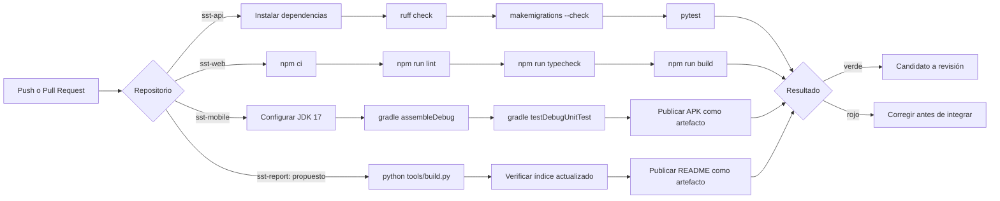

**Componentes por repositorio**

| Repositorio | Workflow | Pasos |
|---|---|---|
| `sst-api` | `ci.yml` | Checkout → Python 3.11 con caché de pip → instalar `requirements-dev.txt` → `ruff check .` → `makemigrations --check --dry-run` → `pytest -q` |
| `sst-api` | `commitlint.yml` | Validar el formato de todos los commits del PR |
| `sst-web` | `ci.yml` | Checkout → Node 20 con caché de npm → `npm ci` → `npm run lint` → `npm run typecheck` → `npm run build` |
| `sst-web` | `commitlint.yml` | Validar el formato de los commits del PR |
| `sst-mobile` | `ci.yml` | Checkout → JDK 17 Temurin → Gradle → `assembleDebug` → `testDebugUnitTest` → publicar `app-debug.apk` como artefacto |
| `sst-mobile` | `commitlint.yml` | Validar el formato de los commits del PR |
| `sst-report` | Propuesto: `informe.yml` | No localizado en este checkout; se dispone de `tools/build.py` para regenerar el índice localmente |
| `sst-report` | Propuesto: `commitlint.yml` | No localizado en este checkout; el hook local sí está presente |

<!-- IMAGEN REQUERIDA: capturas de la pestaña Actions de cada repositorio mostrando
     ejecuciones exitosas, en assets/img/pipeline-ci-<repo>.png -->

**Fuentes y alcance del pipeline.** Configuraciones consultadas:
[API](https://github.com/sst-peru/sst-api/blob/1b5e02e07108b4358f168133ee380563bf2da4c3/.github/workflows/ci.yml),
[web](https://github.com/sst-peru/sst-web/blob/2fd0a59df9465c464915b51894a60e5b5a9667c8/.github/workflows/ci.yml) y
[Android](https://github.com/sst-peru/sst-mobile/blob/aeef3a8b1170d1a4bda12631ae3b2c54e47d3368/.github/workflows/ci.yml).
El workflow móvil configura la publicación de un APK de depuración; no se ha descargado ni
verificado un artefacto de ejecución. El workflow web construye `dist/` sin un paso de
publicación del bundle, y el del API ejecuta controles sin empaquetado desplegable.

El registro de CI debe enlazar la ejecución y su SHA, indicar el resultado de cada job y
conservar logs de fallos. Para bloquear merges se necesita además configurar las
verificaciones como obligatorias en la protección de rama.

## 7.2. Continuous Delivery

**Estado: diseño de entrega continua.** Existe configuración de construcción, pero falta
acreditar almacenamiento de los artefactos web/API y promoción a un entorno de pruebas. Esta
sección define los componentes necesarios para completar TS28 y TS34.

### 7.2.1. Tools and Practices

La entrega continua asegura que cualquier commit integrado en `develop` esté en condiciones de
ser desplegado, sin trabajo manual adicional.

| Herramienta | Rol previsto |
|---|---|
| GitHub Actions | Construcción de artefactos desplegables |
| Artefactos de Actions | APK de depuración publicado en cada ejecución del pipeline móvil |
| Docker | Empaquetado propuesto del API; no se localizó Dockerfile en la versión consultada |
| Proveedor de backend por definir | Ejecutar API, base de datos y almacenamiento persistente |
| Proveedor de frontend por definir | Servir el bundle web mediante HTTPS |

**Prácticas propuestas**

1. **Cada artefacto se identifica por versión y SHA.** Se conserva el mismo artefacto cuando
   la configuración lo permite; los builds Vite con distintas URLs se identifican por entorno.
2. **Los secretos se inyectan al desplegar el backend.** La configuración pública de Vite se
   incorpora al construir, según la restricción explicada en 5.1.4.
3. **Toda migración de base de datos se ejecuta como parte del despliegue**, no manualmente.

### 7.2.2. Stages Deployment Pipeline Components

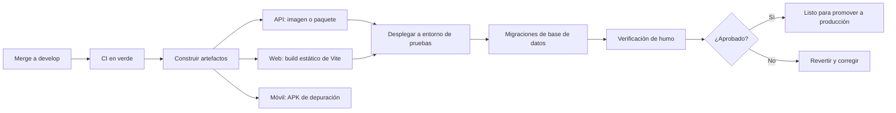

**Entradas, salidas y controles de la entrega propuesta.**

| Etapa | Entrada | Salida y condición de avance |
|---|---|---|
| Verificar | SHA integrado en `develop` | CI aprobada sobre ese mismo SHA |
| Empaquetar | Código y dependencias fijadas | Paquete API, bundle web y APK con identificación de versión |
| Preparar entorno | Configuración de pruebas y respaldo | Conexión a base, archivos persistentes y secretos disponibles |
| Migrar y desplegar | Artefactos compatibles | Migraciones aplicadas y servicios accesibles |
| Probar humo | URL del entorno y usuarios de prueba | Acceso, creación, consulta y cierre comprobados |
| Preparar promoción | Evidencias de los pasos anteriores | Versión candidata lista para decisión de publicación |

Si una migración o la prueba de humo falla, se detiene la promoción y se registra el incidente.
La reversión de código debe evaluar compatibilidad con el esquema; recuperar la base requiere
un procedimiento probado y no se presume automático.

## 7.3. Continuous Deployment

**Estado: flujo de producción propuesto, sin despliegue acreditado.** Se mantiene este
apartado para documentar la decisión de publicación del producto y los componentes que
faltan. La aprobación manual elegida corresponde a entrega continua; no se declara un
proceso de despliegue automático pleno.

### 7.3.1. Tools and Practices

El despliegue continuo lleva a producción, sin intervención manual, todo cambio integrado en
`main` que haya superado el pipeline.

**Decisión de alcance.** Para este proyecto se adopta **entrega continua con aprobación manual
para producción**, y no despliegue continuo pleno. La razón es de dominio, no técnica: el
sistema sostiene registros con valor legal ante una fiscalización, y un despliegue defectuoso
que corrompa la trazabilidad de un hallazgo tiene consecuencias que exceden la molestia de un
usuario. La promoción a producción requiere aprobación explícita.

| Herramienta | Rol previsto |
|---|---|
| GitHub Actions con *environments* | Despliegue a producción con regla de aprobación requerida |
| Migraciones de Django | Ejecutadas automáticamente antes de activar la nueva versión |
| Etiquetas de versión | Cada despliegue a producción corresponde a un tag en `main` |

La aprobación se puede configurar mediante un entorno de GitHub Actions con revisores,
según la [documentación de revisión de despliegues](https://docs.github.com/en/actions/how-tos/deploy/configure-and-manage-deployments/review-deployments).
Su disponibilidad debe verificarse para el repositorio y plan utilizados. No hay evidencia
adjunta de un entorno de producción configurado con esa protección.

### 7.3.2. Production Deployment Pipeline Components

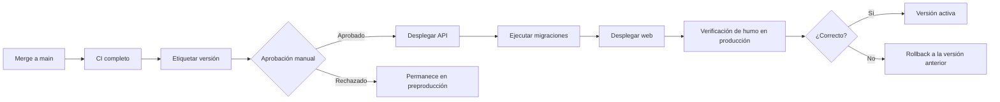

**Control de una publicación de producción.** La versión debe registrar tag, SHA de cada
componente, referencia del artefacto, aprobación, respaldo previo y resultado de la prueba de
humo. Para activar tráfico, las migraciones deben haber finalizado y ser compatibles con los
clientes publicados. El APK de depuración de CI no equivale a distribución Android de producción.

| Condición | Acción prevista |
|---|---|
| CI o revisión rechazada | Mantener la versión activa y corregir la candidata |
| Migración fallida | Detener la activación y evaluar el estado de la base antes de reintentar |
| Fallo funcional después de activar | Restaurar el artefacto anterior si es compatible con el esquema |
| Incompatibilidad de datos | Aplicar el procedimiento de recuperación ensayado y registrar el alcance |
| Publicación satisfactoria | Registrar URL, versión, hora, métricas iniciales y responsable |

La evidencia de cierre será una ejecución enlazada, las URLs activas y una recuperación
probada. Al no estar adjuntas, no se atribuyen disponibilidad o tiempos de recuperación reales.

## 7.4. Continuous Monitoring

### 7.4.1. Tools and Practices

El monitoreo continuo cumple aquí una doble función: vigilar la salud técnica del sistema y
alimentar el experimento con los datos de producto que la hipótesis necesita.

| Dimensión | Qué se observa | Herramienta prevista |
|---|---|---|
| Disponibilidad | El API responde correctamente | Verificación periódica de un endpoint de salud |
| Errores de aplicación | Excepciones no controladas en el backend y en los clientes | Sentry u otro agregador de errores |
| Rendimiento | Latencia de los endpoints más usados | Métricas del proveedor de despliegue |
| Sincronización móvil | Proporción de reportes que llegan marcados como `synced_offline` y reintentos fallidos | Consulta sobre el propio modelo de datos |
| Métricas de producto | Reportes por usuario y por variante, MTTR, cumplimiento de inspecciones | Endpoints `metrics/` y `experiments/{key}/results/` del propio sistema |

**Decisión de diseño.** Las métricas del experimento no dependen de una herramienta de analítica
externa: la variante del formulario se guarda en el propio reporte (`form_variant`) y los
indicadores se calculan sobre la base de datos. Esto evita la pérdida de eventos por bloqueadores
o por falta de conectividad —precisamente el escenario de uso del producto— y hace que el dato
del experimento sea tan confiable como el dato operativo.

### 7.4.2. Monitoring Pipeline Components

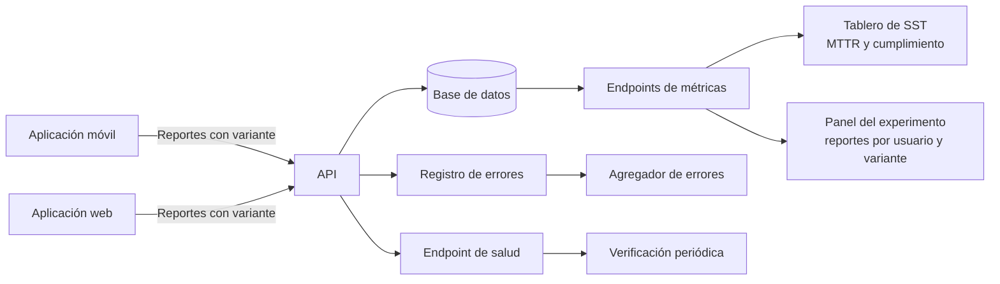

### 7.4.3. Alerting Pipeline Components

| Condición | Umbral propuesto | Canal | Destinatario |
|---|---|---|---|
| El API no responde | Dos verificaciones consecutivas fallidas | Correo | Equipo de desarrollo |
| Tasa de error 5xx elevada | Por encima del 1 % de las peticiones en 15 minutos | Correo | Equipo de desarrollo |
| Hallazgo crítico sin asignar | Más de 24 horas abierto con severidad crítica | Notificación en la aplicación | Supervisor de SST |
| Inspección vencida | La fecha programada pasó sin ejecución | Notificación en la aplicación | Responsable del programa |
| Acuerdo del comité vencido | Pasó el plazo sin cumplirse | Notificación en la aplicación | Responsable del acuerdo |

Las tres últimas condiciones son alertas **de dominio**, no de infraestructura, y son las que
convierten al sistema en una herramienta de gestión y no solo en un repositorio de registros.

### 7.4.4. Notification Pipeline Components

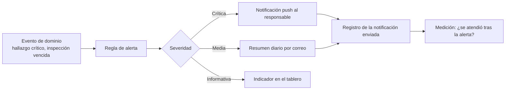

El último paso del diagrama es intencional: una notificación cuyo efecto no se mide es indistinguible
del ruido. Registrar si el hallazgo se atendió después de la alerta permite evaluar
experimentalmente si las notificaciones mejoran el MTTR, que es una hipótesis natural para el
siguiente ciclo.

---

# Capítulo VIII: Experiment-Driven Development

## 8.1. Experiment Planning

### 8.1.1. As-Is Summary

El producto implementado cubre el ciclo completo de gestión del SGSST: captura del hallazgo en
campo, seguimiento hasta el cierre, matriz IPERC, control de EPP, inspecciones periódicas,
comité con actas y acuerdos, indicadores y exportación de evidencia. Web y móvil consumen el
mismo API y ofrecen, para un mismo rol, las mismas capacidades.

Lo que el producto **todavía no sabe** es si su decisión de diseño más distintiva funciona. Todo
el planteamiento se apoya en una creencia: que la fricción del formulario es lo que determina
cuántas veces reporta un operario. Esa creencia gobierna la inversión de desarrollo más costosa
del proyecto —el flujo de tres pasos con operación sin conexión— y hasta ahora nadie la ha
puesto a prueba. Ese es el punto de partida del experimento.

### 8.1.2. Raw Material: Assumptions, Knowledge Gaps, Ideas, Claims

**Assumptions (supuestos que damos por ciertos sin evidencia)**

| ID | Supuesto | Riesgo si es falso |
|---|---|---|
| A1 | La fricción del formulario es la principal barrera para reportar | La inversión en el flujo rápido no produce retorno |
| A2 | El operario está dispuesto a usar su celular personal para tareas de la empresa | La adopción no ocurre y el sistema queda vacío |
| A3 | El temor a represalias no es la barrera dominante | Reducir la fricción no cambia nada porque el problema es otro |
| A4 | Más reportes se traducen en más peligros corregidos | El sistema genera ruido en lugar de gestión |
| A5 | El supervisor tiene capacidad de atender el volumen adicional | Los hallazgos se acumulan y el MTTR empeora |

**Knowledge gaps (lo que no sabemos y necesitamos saber)**

| ID | Vacío de conocimiento |
|---|---|
| K1 | Cuántas veces reporta hoy un operario, en promedio, con el proceso en papel |
| K2 | Cuánto tiempo transcurre hoy entre la detección y la corrección de un peligro |
| K3 | Qué proporción de peligros detectados nunca llega a reportarse, y por qué |
| K4 | Si la foto obligatoria acelera o frena el reporte |
| K5 | Cuál es la capacidad real de cierre del equipo de SST por semana |

**Ideas (soluciones candidatas)**

| ID | Idea |
|---|---|
| I1 | Formulario tipo asistente de tres pasos con foto |
| I2 | Reporte anónimo opcional para eliminar el temor a represalias |
| I3 | Notificación al operario cuando su hallazgo se cierra |
| I4 | Reporte por voz para quien trabaja con guantes |
| I5 | Ranking de áreas por hallazgos cerrados, como incentivo colectivo |

**Claims (afirmaciones que el equipo sostiene y que deberían verificarse)**

| ID | Afirmación |
|---|---|
| C1 | "Un formulario de tres pasos duplicará la frecuencia de reporte" |
| C2 | "Sin operación offline, el sistema no sirve en obra ni en mina" |
| C3 | "La evidencia exportable es el argumento que cierra la venta" |

### 8.1.3. Experiment-Ready Questions

Una pregunta está lista para experimentar cuando es específica, medible y su respuesta cambia
una decisión.

| ID | Pregunta | ¿Qué decisión cambia? |
|---|---|---|
| Q1 | ¿Un formulario de tres pasos aumenta el número de reportes por usuario frente a uno de diez campos? | Si no, se simplifica el producto eliminando la variante y se invierte en otra barrera |
| Q2 | ¿Qué proporción de reportes se origina sin conexión? | Determina si la inversión en la cola local y la sincronización se justifica |
| Q3 | ¿La foto obligatoria reduce la tasa de finalización del reporte? | Decide si la foto se mantiene obligatoria u opcional |
| Q4 | ¿El aumento de reportes se traduce en más hallazgos cerrados o solo en más cola? | Decide si hay que trabajar sobre la capacidad de cierre antes de escalar la captura |
| Q5 | ¿La posibilidad de reportar de forma anónima aumenta los reportes de actos inseguros de terceros? | Decide si se implementa el reporte anónimo |

### 8.1.4. Question Backlog

Priorización por el criterio de mayor incertidumbre combinada con mayor costo de equivocarse.

| Prioridad | ID | Pregunta | Incertidumbre | Costo de equivocarse | Puntaje |
|---|---|---|---|---|---|
| 1 | Q1 | Fricción del formulario | Alta | Alto | 9 |
| 2 | Q4 | Captura frente a capacidad de cierre | Alta | Alto | 9 |
| 3 | Q2 | Peso real del uso sin conexión | Media | Alto | 6 |
| 4 | Q3 | Foto obligatoria | Media | Medio | 4 |
| 5 | Q5 | Reporte anónimo | Alta | Bajo | 3 |

La pregunta Q1 encabeza el backlog y es la que se somete a experimento en este ciclo.

### 8.1.5. Experiment Cards

**Experiment Card — EXP-01**

| Campo | Contenido |
|---|---|
| **Pregunta** | Q1: ¿Un formulario de tres pasos aumenta el número de reportes por usuario frente al formulario tradicional de diez o más campos? |
| **Hipótesis** | Creemos que el grupo expuesto al formulario rápido registrará al menos el doble de reportes por usuario que el grupo expuesto al formulario largo, durante la ventana de medición |
| **Método** | Experimento controlado A/B con asignación determinística por usuario |
| **Variable independiente** | Variante del formulario de reporte: `rapido` o `largo` |
| **Variable dependiente** | Número de reportes por usuario en la ventana de medición |
| **Variables controladas** | El resto de la aplicación es idéntico para ambos grupos: mismo acceso, misma lista, misma operación sin conexión, mismo API |
| **Participantes** | Operarios de campo con cuenta activa |
| **Duración** | 14 días |
| **Criterio de éxito** | Diferencia estadísticamente significativa (α = 0.05) a favor del grupo `rapido` |
| **Criterio de refutación** | Ausencia de diferencia significativa, o diferencia a favor del formulario largo |
| **Decisión asociada** | Si se confirma, el flujo rápido se convierte en el único formulario del producto. Si se refuta, se elimina la variante, se conserva el formulario simple por coherencia de diseño y la inversión se redirige hacia la barrera que las entrevistas señalen como dominante |

**Experiment Card — EXP-02 (siguiente ciclo)**

| Campo | Contenido |
|---|---|
| **Pregunta** | Q4: ¿El aumento de reportes se traduce en hallazgos cerrados o solo en cola acumulada? |
| **Hipótesis** | Creemos que un aumento del volumen de reportes sin cambios en el proceso de cierre incrementará el MTTR |
| **Método** | Análisis observacional de la serie temporal de MTTR frente al volumen de reportes |
| **Medida** | MTTR semanal y número de hallazgos abiertos al cierre de cada semana |
| **Decisión asociada** | Si el MTTR se deteriora, priorizar funcionalidades de capacidad de respuesta (notificaciones, asignación automática) antes que funcionalidades de captura |

## 8.2. Experiment Design

### 8.2.1. Hypotheses

**Hipótesis nula (H₀).** No existe diferencia en la media de reportes por usuario entre el grupo
expuesto al formulario rápido y el expuesto al formulario largo.

> H₀: μ_rápido = μ_largo

**Hipótesis alterna (H₁).** La media de reportes por usuario del grupo expuesto al formulario
rápido es distinta de la del grupo expuesto al formulario largo.

> H₁: μ_rápido ≠ μ_largo

Se plantea la prueba **a dos colas** aunque la hipótesis de negocio sea direccional. La razón es
metodológica: un formulario más corto podría, en principio, producir reportes de menor calidad y
desalentar su uso al percibirse como poco serio. Cerrar esa posibilidad por anticipado sería
diseñar el experimento para confirmar lo que ya se cree.

### 8.2.2. Domain Business Metrics

| Métrica de negocio | Definición | Por qué importa |
|---|---|---|
| **Frecuencia de reporte** | Reportes creados por usuario activo en el periodo | Mide si el sistema captura lo que ocurre en campo; es la entrada de todo el resto |
| **MTTR de hallazgos** | Horas promedio entre la creación del reporte y su cierre | Mide la capacidad de respuesta: cuánto tiempo permanece expuesto el peligro |
| **Tasa de cumplimiento de inspecciones** | Inspecciones realizadas sobre programadas | Mide la disciplina preventiva, no solo la reactiva |
| **Tasa de cierre** | Hallazgos cerrados sobre hallazgos creados en el periodo | Detecta si la captura crece más rápido que la capacidad de atención |
| **Cobertura de evidencia** | Proporción de hallazgos con foto y con acción correctiva registrada | Mide la calidad del expediente ante una fiscalización |

### 8.2.3. Measures

| Medida | Operacionalización | Origen del dato |
|---|---|---|
| Reportes por usuario | Conteo de `Report` por `reported_by`, dividido entre los usuarios de la variante | `experiments/report_form/results/` |
| Variante asignada | Campo `form_variant` almacenado en cada reporte y `Assignment` del usuario | Base de datos |
| Reportes con foto | Conteo de reportes con `photo` no nulo | `experiments/report_form/results/` |
| MTTR por variante | Promedio de `closed_at − created_at` de los reportes cerrados de cada grupo | `experiments/report_form/results/` |
| Serie diaria | Conteo de reportes por día y variante | `experiments/report_form/results/` (campo `daily`) |
| Reportes sincronizados offline | Conteo de reportes con `synced_offline` verdadero | Base de datos |

Todas las medidas se obtienen del propio sistema. No se emplea una herramienta de analítica
externa, decisión justificada en el Capítulo VII: los eventos de una herramienta externa se
pierden cuando no hay conectividad, que es exactamente la condición de uso del producto.

### 8.2.4. Conditions

| Condición | Definición |
|---|---|
| **Unidad de asignación** | El usuario. No la sesión ni el reporte: si un mismo operario viera formularios distintos, la comparación dejaría de medir el formulario |
| **Mecanismo de asignación** | Hash SHA-256 estable de `clave_del_experimento + id_de_usuario`, con módulo sobre el número de variantes |
| **Grupo de control** | Variante `largo`: formulario tradicional con todos los campos visibles y obligatorios |
| **Grupo de tratamiento** | Variante `rapido`: asistente de tres pasos con foto y descripción opcional |
| **Elementos controlados** | Acceso, navegación, lista de reportes, operación sin conexión, API y permisos son idénticos en ambos grupos |
| **Criterio de inclusión** | Usuarios con rol operario y cuenta activa durante toda la ventana |
| **Criterio de exclusión** | Usuarios creados para pruebas o demostración; usuarios con rol de gestión |
| **Ventana de medición** | 14 días corridos, iniciando el mismo día para ambos grupos |
| **Contaminación** | No hay comunicación entre variantes dentro de la aplicación; el riesgo residual es que dos operarios comparen sus pantallas entre sí, lo que se registra como amenaza a la validez |

**Por qué la asignación es determinística y no aleatoria.** Un `random()` produciría una
asignación distinta en cada consulta, de modo que un mismo usuario podría ver un formulario
distinto cada día. El hash estable garantiza tres propiedades necesarias: el usuario conserva su
variante durante todo el experimento, la aplicación puede recalcularla sin conexión, y la
asignación es reproducible por un tercero que quiera auditar los resultados.

### 8.2.5. Scale Calculations and Decisions

**Parámetros del diseño**

| Parámetro | Valor | Justificación |
|---|---|---|
| Nivel de significancia (α) | 0.05, dos colas | Estándar del curso: minimiza los errores atribuibles al azar (Tipo I) |
| Potencia estadística (1 − β) | 0.80 | Rango recomendado de 80 % a 95 %; con 80 % se acota la probabilidad de error Tipo II a 20 % |
| Efecto mínimo detectable (MDE) | +100 % | Es la magnitud que afirma la hipótesis de negocio ("el doble") |
| Ventana de medición | 14 días | Suficiente para cubrir dos ciclos semanales de trabajo, incluidos los turnos de fin de semana |
| Tasa base supuesta | 0.15 reportes por usuario y por día | **Supuesto a calibrar con el piloto.** Equivale a un reporte cada siete días por operario |

**Modelo estadístico.** Se compara la media de reportes por usuario entre dos grupos
independientes mediante la aproximación normal para diferencia de medias:

> n por grupo = 2 · (Z(α/2) + Z(β))² · σ² / Δ²

Se asume que el conteo de reportes por usuario sigue aproximadamente una distribución de
Poisson, por lo que la varianza se estima igual a la media. Es una aproximación declarada: si la
dispersión real resulta mayor —algo frecuente en conteos de comportamiento humano, donde unos
pocos usuarios concentran la mayoría de los reportes—, el tamaño requerido será mayor y debe
recalcularse con la varianza observada.

**Resultados del cálculo**

El cálculo es reproducible ejecutando `python tools/tamano-muestra.py` en el repositorio del
informe. Con una media esperada de 2.10 reportes por usuario en el control y 4.20 en el
tratamiento:

| Potencia | Usuarios por grupo | Total |
|---|---|---|
| 80 % | 12 | **24** |
| 90 % | 16 | 32 |
| 95 % | 19 | 38 |

**Efecto mínimo detectable según la muestra disponible**

Este es el análisis que determina si el experimento puede ejecutarse con los participantes que
realmente se consigan:

| Usuarios por grupo | Total | Solo se podrían detectar efectos de |
|---|---|---|
| 3 | 6 | +232 % o mayores |
| 5 | 10 | +166 % o mayores |
| 8 | 16 | +123 % o mayores |
| 12 | 24 | +97 % o mayores |
| 20 | 40 | +72 % o mayores |

**Decisión de escala y su consecuencia honesta.** El diseño requiere **24 participantes** para
detectar el efecto que la hipótesis afirma, con α = 0.05 y potencia del 80 %. Si el piloto se
ejecuta con menos participantes —por ejemplo, seis—, el experimento queda **subpotenciado**: solo
podría detectar un efecto superior al 232 %, muy por encima del que se busca. En ese escenario,
un resultado no significativo **no permite concluir que el formulario no funciona**, y debe
reportarse explícitamente como una limitación del estudio y no como una refutación de la
hipótesis. Esta distinción es la diferencia entre un experimento y una demostración.

### 8.2.6. Methods Selection

| Aspecto | Método elegido | Justificación |
|---|---|---|
| Tipo de estudio | Experimento controlado A/B con asignación entre sujetos | Permite atribuir la diferencia a la variable manipulada y no a características de los usuarios |
| Asignación | Determinística por hash estable, 50/50 | Estabilidad, reproducibilidad y funcionamiento sin conexión |
| Prueba estadística principal | Prueba t de Welch para dos muestras independientes sobre reportes por usuario | No asume varianzas iguales, supuesto que rara vez se cumple con conteos |
| Prueba alternativa | Prueba U de Mann-Whitney | Se aplica si la distribución de conteos resulta muy asimétrica o el tamaño de muestra es pequeño, donde la normalidad no es razonable |
| Métrica de efecto | Diferencia de medias y diferencia relativa porcentual (*lift*) | El *lift* es la forma en que la hipótesis de negocio está formulada |
| Intervalo de confianza | 95 % sobre la diferencia de medias | Comunica la precisión de la estimación, no solo si hay o no significancia |
| Análisis complementario | Serie diaria por variante | Permite detectar efectos de novedad: un pico inicial que se desvanece |

**Amenazas a la validez identificadas**

| Amenaza | Tipo | Mitigación |
|---|---|---|
| Muestra pequeña | Validez estadística | Declarar el efecto mínimo detectable y no interpretar la ausencia de significancia como refutación |
| Efecto de novedad | Validez interna | Analizar la serie diaria además del total del periodo |
| Usuarios que comparan pantallas entre sí | Validez interna | Registrar la amenaza; no es controlable en un piloto presencial |
| Distinta exposición al riesgo entre áreas | Validez interna | Verificar que la asignación no quede desbalanceada por área; reportar la composición de cada grupo |
| Participantes que saben que están siendo observados | Validez externa | Reconocer el efecto Hawthorne como limitación del piloto |
| Población de estudiantes en lugar de operarios reales | Validez externa | Declararlo explícitamente: los resultados indican tendencia, no se generalizan a operarios en obra |

### 8.2.7. Data Analytics: Goals, KPIs and Metrics Selection

Estructura Goal–Question–Metric:

| Goal | Question | KPI / Metric | Fuente |
|---|---|---|---|
| Capturar en el sistema lo que ocurre en campo | ¿Cuánto reporta cada operario? | Reportes por usuario activo | `experiments/report_form/results/` |
| | ¿Qué formulario produce más reportes? | *Lift* porcentual entre variantes | Mismo endpoint |
| Responder rápido al peligro detectado | ¿Cuánto tarda un hallazgo en cerrarse? | MTTR total y por severidad | `metrics/mttr/` |
| | ¿Se acumulan hallazgos sin atender? | Hallazgos abiertos al cierre de la semana | `metrics/mttr/` |
| Sostener la prevención programada | ¿Se cumplen las inspecciones? | Tasa de cumplimiento, total y por área | `metrics/inspection-compliance/` |
| Producir evidencia defendible | ¿Los hallazgos tienen evidencia completa? | Proporción con foto y con acción correctiva | `metrics/reports-summary/` |
| Sostener la operación sin conexión | ¿Cuántos reportes nacen sin señal? | Proporción de reportes con `synced_offline` | Base de datos |

### 8.2.8. Web and Mobile Tracking Plan

El plan de seguimiento se implementa sobre el modelo de datos del propio producto. Cada fila
indica el evento, su disparador y dónde queda registrado.

| Evento | Disparador | Datos registrados | Plataforma | Dónde se almacena |
|---|---|---|---|---|
| `variante_asignada` | Primer inicio de sesión tras activarse el experimento | Usuario, experimento, variante, fecha | Web y móvil | Tabla `experiments_assignment` |
| `reporte_creado` | El usuario envía el reporte | Usuario, tipo, categoría, área, severidad, variante del formulario, con o sin foto, con o sin GPS, fecha de ocurrencia y de recepción | Web y móvil | Tabla `reports_report` |
| `reporte_sincronizado_offline` | El worker sube un reporte de la cola local | Marca `synced_offline` y diferencia entre ocurrencia y recepción | Móvil | Campo del mismo reporte |
| `reporte_asignado` | El supervisor asigna responsable | Autor, responsable, fecha, estado resultante | Web y móvil | Tabla `reports_reportaction` |
| `reporte_cerrado` | El supervisor cierra el hallazgo | Fecha de cierre, acción correctiva, tiempo de resolución | Web y móvil | Campos del reporte y bitácora |
| `inspeccion_realizada` | Se completa una inspección | Programa, fecha programada, fecha de ejecución, resultados del checklist | Web y móvil | Tabla `inspections_inspection` |
| `epp_conformidad` | El trabajador da conformidad | Entrega, trabajador, fecha | Web y móvil | Tabla `epp_eppdelivery` |
| `evidencia_exportada` | Se descarga un archivo de evidencia | Usuario, recurso exportado, filtros aplicados | Web | <!-- COMPLETAR: hoy la exportación no deja registro; agregar un log de auditoría --> |

**Consideración de privacidad.** El plan registra datos personales —DNI, fotografías,
geolocalización— de trabajadores identificables. Su tratamiento queda sujeto a la Ley N° 29733
de Protección de Datos Personales y se analiza en la matriz ética de la sección 8.8.

## 8.3. Experimentation

### 8.3.1. To-Be User Stories

| ID | Título | Descripción | Criterios de aceptación |
|---|---|---|---|
| TB01 | Aviso de datos de demostración | **Como** evaluador del sistema **quiero** distinguir los datos de demostración de los reales **para** no interpretar resultados simulados como evidencia. | **Dado** que los datos provienen de la carga de demostración<br>**Cuando** abro el panel del experimento<br>**Entonces** el sistema muestra un aviso visible que lo declara |
| TB02 | Intervalo de confianza en los resultados | **Como** analista **quiero** ver el intervalo de confianza de la diferencia **para** comunicar la precisión y no solo el promedio. | **Cuando** consulto los resultados del experimento<br>**Entonces** veo la diferencia estimada con su intervalo al 95 % |
| TB03 | Registro de auditoría de exportaciones | **Como** responsable de datos personales **quiero** saber quién exportó evidencia y cuándo **para** rendir cuentas del tratamiento de datos. | **Cuando** un usuario exporta un archivo<br>**Entonces** queda registrado el usuario, el recurso y la fecha |
| TB04 | Notificación de hallazgo crítico | **Como** supervisor **quiero** recibir aviso de un hallazgo crítico sin asignar **para** que no quede esperando en la bandeja. | **Dado** un hallazgo crítico abierto por más de 24 horas<br>**Entonces** el sistema notifica al supervisor y registra el envío |
| TB05 | Aviso de cierre al reportante | **Como** operario **quiero** enterarme cuando mi hallazgo se cierra **para** sostener el hábito de reportar. | **Cuando** se cierra un hallazgo que yo reporté<br>**Entonces** recibo la notificación con la acción correctiva aplicada |

### 8.3.2. To-Be Product Backlog

| # | ID | Historia | Story Points | Justificación de la prioridad |
|---|---|---|---|---|
| 1 | TB01 | Aviso de datos de demostración | 2 | Requisito de integridad: impide que datos simulados se lean como resultados |
| 2 | TB02 | Intervalo de confianza en los resultados | 5 | Sin él, el panel comunica una diferencia sin su precisión |
| 3 | TB05 | Aviso de cierre al reportante | 5 | Cierra el circuito de retroalimentación que las entrevistas señalan como causa del abandono |
| 4 | TB04 | Notificación de hallazgo crítico | 5 | Ataca el MTTR, la segunda métrica del curso |
| 5 | TB03 | Registro de auditoría de exportaciones | 3 | Obligación derivada del tratamiento de datos personales |

### 8.3.3. Pipeline-supported, Experiment-Driven To-Be Software Platform Lifecycle

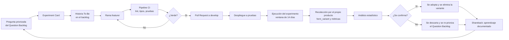

El ciclo es cerrado: la salida del experimento vuelve a alimentar el backlog de preguntas. Lo que
hace que el pipeline sea parte del experimento y no solo de la construcción es que la
instrumentación —el campo `form_variant`— viaja en el mismo artefacto que se despliega y se
verifica con las mismas pruebas.

### 8.3.4. To-Be Sprint Backlogs

### 8.3.5. Implemented To-Be Landing Page Evidence

### 8.3.6. Implemented To-Be Frontend-Web Application Evidence

### 8.3.7. Implemented To-Be Native-Mobile Application Evidence

### 8.3.8. Implemented To-Be RESTful API and/or Serverless Backend Evidence

### 8.3.9. Team Collaboration Insights

## 8.4. To-Be Validation Interviews

### 8.4.1. Diseño de Entrevistas

Entrevistas posteriores a la ejecución del experimento, orientadas a explicar el **porqué** del
resultado cuantitativo. El número dice qué pasó; la entrevista, por qué.

**Para participantes del grupo `rapido`**

1. Cuéntame de la última vez que reportaste con la aplicación. ¿Qué hiciste exactamente?
2. ¿Hubo alguna vez que quisiste reportar y no lo hiciste? ¿Qué te detuvo?
3. ¿Qué te pareció tener que tomar la foto?
4. ¿Qué harías distinto si tú diseñaras la pantalla?

**Para participantes del grupo `largo`**

1. Cuéntame de la última vez que reportaste. ¿Cuánto te tomó?
2. ¿Qué parte del formulario te resultó más pesada?
3. ¿Dejaste reportes a medias? ¿Por qué?
4. ¿Qué campos te parecieron innecesarios?

**Pregunta común a ambos grupos**

5. Fuera de la aplicación, ¿qué otra cosa hace que alguien no reporte un peligro que vio?

Esta última pregunta busca deliberadamente evidencia en contra del supuesto A1: si los
participantes señalan mayoritariamente el temor a represalias o la desconfianza en que algo
cambie, entonces la fricción del formulario no es la barrera principal, y ese hallazgo vale más
que el resultado del A/B.

### 8.4.2. Registro de Entrevistas

## 8.5. Experiment Aftermath & Analysis

### 8.5.1. Analysis and Interpretation of Results

### 8.5.2. Re-scored and Re-prioritized Question Backlog

## 8.6. Continuous Learning

### 8.6.1. Shareback Session Artifacts: Learning Workflow

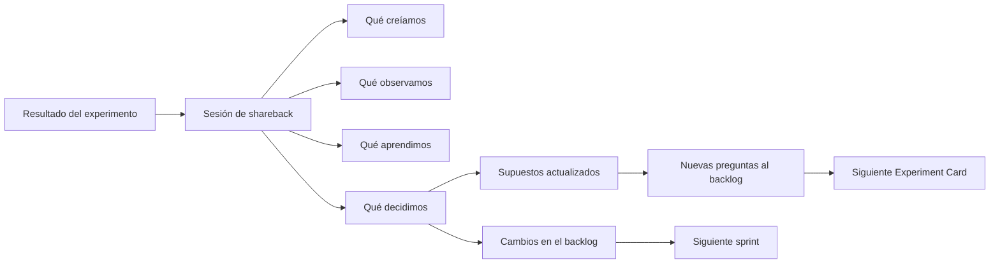

**Artefactos de la sesión de shareback**

| Artefacto | Contenido |
|---|---|
| Resumen de una página | Pregunta, hipótesis, método, resultado y decisión |
| Tabla de supuestos actualizada | Cada supuesto del apartado 8.1.2 marcado como confirmado, refutado o aún sin evidencia |
| Question Backlog repriorizado | Con las preguntas nuevas surgidas del experimento |
| Registro de decisión | Qué se decidió, quién decidió y con qué evidencia |

## 8.7. To-Be Software Platform Pre-launch

### 8.7.1. About-the-Product Intro Video

### 8.7.2. Resumen usando Gees Framework

## 8.8. Matriz de Evaluación Ética y de Impacto

La matriz permite demostrar la capacidad de reconocer las responsabilidades éticas y
profesionales, y emitir juicios informados considerando el impacto de la solución de ingeniería
de software. Busca evitar el "sentido mercenario de la ingeniería" —donde solo se busca lograr
un fin contratado sin cuestionarse el fin en sí mismo— y evidenciar pensamiento crítico.

| Dimensión / Criterio a Evaluar | Identificación de Riesgos e Impactos (Positivos y Negativos) | Evaluación del Impacto (¿A quién afecta y cuál es la magnitud?) | Estrategias de Mitigación y Acciones de Diseño |
|---|---|---|---|
| **1. Salud Pública y Seguridad** | *Positivo:* acortar el tiempo entre la detección de un peligro y su corrección reduce la exposición al riesgo de todos los trabajadores del frente.<br><br>*Negativo:* si la empresa usa el sistema como sustituto de la inspección presencial, podría reducirse la supervisión en campo. Un registro digital ordenado puede dar una falsa sensación de control mientras el peligro sigue existiendo. | *Afectados:* trabajadores de campo, con riesgo físico grave. La magnitud es alta: un peligro no corregido puede causar una lesión incapacitante o la muerte. | El cierre del hallazgo exige describir la acción correctiva aplicada, no basta marcarlo como resuelto. El tablero expone los hallazgos críticos abiertos y las inspecciones vencidas, de modo que el incumplimiento sea visible y no quede enterrado. En la documentación del producto se establece explícitamente que el sistema no reemplaza la inspección presencial. |
| **2. Inclusión y Accesibilidad** | *Negativo:* la aplicación requiere un teléfono Android propio con cámara y espacio de almacenamiento. Un trabajador sin ese equipo queda excluido del canal principal de reporte. La interfaz asume alfabetización funcional y visión adecuada.<br><br>*Positivo:* el flujo por iconos y pocos toques baja la barrera frente a un formulario en papel denso. | *Afectados:* trabajadores de menores ingresos, trabajadores mayores y personas con discapacidad visual o baja alfabetización. La exclusión no es menor: quien no puede reportar queda sin voz en el sistema de seguridad que lo protege. | Se mantiene el reporte desde la web para que cualquier equipo compartido de la empresa sirva como canal alternativo, y el registro por parte del supervisor a nombre del trabajador. Objetivos táctiles de 48 dp, textos cortos y descripción opcional. *Acciones pendientes:* verificar compatibilidad con TalkBack, y evaluar el reporte por voz (idea I4) para quien trabaja con guantes o no lee con fluidez. |
| **3. Impacto Social y Cultural** | *Negativo, y es el riesgo más serio del producto:* el registro de "actos inseguros" identifica por nombre a quien comete la falta. Mal usado, el sistema se convierte en una herramienta de vigilancia y sanción entre compañeros, deteriora la confianza en la cuadrilla y desincentiva el reporte por temor a represalias.<br><br>*Positivo:* da voz formal y trazable al trabajador, que hoy depende de que su aviso verbal sea recordado. | *Afectados:* la relación entre trabajadores y con sus supervisores; la cohesión de la cuadrilla. Magnitud alta, porque determina si el sistema se usa o se sabotea. | El modelo registra quién reporta y qué se reportó, pero el producto no expone rankings individuales de faltas ni indicadores punitivos por persona. Se prioriza la idea I2 —reporte anónimo opcional para actos inseguros de terceros— como historia del siguiente ciclo. La pregunta común de la entrevista 8.4.1 está diseñada específicamente para detectar si el temor a represalias está operando. |
| **4. Impacto Económico** | *Positivo:* reduce el costo administrativo de consolidar registros y la exposición a multas, lo que para una empresa mediana puede ser significativo.<br><br>*Negativo:* un modelo de suscripción por número de trabajadores encarece la herramienta justo para las empresas con más personal y menos margen, que suelen ser las de mayor riesgo. Quedarían fuera las que más lo necesitan. | *Afectados:* pequeñas y medianas empresas peruanas y sus trabajadores. La consecuencia de excluirlas por precio es que el beneficio de seguridad se concentra en quienes ya pueden pagarlo. | Escalonamiento del precio que no penalice linealmente el número de trabajadores, y evaluación de un plan gratuito acotado para empresas por debajo del umbral de comité (20 trabajadores), que son las de menor capacidad de pago. Se deja constancia de que el diseño comercial es una decisión con consecuencias sobre la seguridad de terceros, no solo sobre los ingresos. |
| **5. Impacto Ambiental (Antrópico)** | *Positivo:* sustituye formatos en papel de uso intensivo y evita desplazamientos para consolidar información.<br><br>*Negativo:* el almacenamiento de fotografías a resolución completa multiplica el consumo de almacenamiento y el tráfico de datos, con su correlato energético; además consume el plan de datos del trabajador. | *Afectados:* el medio ambiente por el consumo de cómputo y almacenamiento; y el bolsillo del trabajador, que paga sus propios datos. | Comprimir las imágenes en el dispositivo antes de subirlas y sincronizar preferentemente por Wi-Fi cuando esté disponible. Definir una política de retención que conserve el registro obligatorio y descarte las imágenes de hallazgos cerrados y verificados pasado el plazo legal de conservación. |
| **6. Enfoque Global** | *Negativo:* el sistema almacena datos personales sensibles —DNI, fotografía del lugar de trabajo, geolocalización precisa del trabajador en el momento del reporte— que, alojados en infraestructura de terceros en el extranjero, quedan sujetos a legislaciones distintas de la peruana.<br><br>*Positivo:* la arquitectura basada en un API estándar facilita la adaptación a la normativa de otros países de la región. | *Afectados:* la privacidad de todos los trabajadores registrados. La geolocalización asociada a una persona identificada permite inferir dónde estuvo y cuándo. | Cumplimiento de la Ley N° 29733 de Protección de Datos Personales: finalidad declarada, consentimiento informado y derecho de acceso y rectificación. La ubicación es opcional y se solicita en el momento de tomar la foto, no al abrir la aplicación; si el trabajador la niega, el reporte se envía igual. Se registra en el SLA la ubicación de los servidores y la política de retención. |
| **7. Revelación de Peligros y Responsabilidad** | *Riesgo identificado durante el desarrollo:* el endpoint de registro público aceptaba el campo de rol, de modo que cualquiera podía registrarse como supervisor y cerrar sus propios hallazgos, rompiendo la separación de responsabilidades que la ley exige.<br><br>*Riesgo conocido y no resuelto:* los tokens de sesión se almacenan en `localStorage` en la aplicación web, lo que los expone ante un ataque XSS. | *Afectados:* la integridad de todo el registro de seguridad de la empresa, y con ella la validez de la evidencia ante una fiscalización. | La vulnerabilidad de escalada de privilegios se corrigió y se cubrió con una prueba automatizada que impide su regresión (`test_el_registro_publico_no_permite_elegir_rol`). El riesgo de `localStorage` se documenta explícitamente como deuda técnica en la sección 6.2.1.2, con la mitigación identificada —mover el refresh token a una cookie `httpOnly`— en lugar de omitirlo. Conforme al código de ética del ingeniero, ambos se revelan en este informe aun cuando exhibirlos no favorezca la presentación del trabajo. |

---

# Conclusiones


## Avance de conclusiones

El avance permite definir un ciclo de gestión trazable del hallazgo y una planificación de
162 elementos. La revisión de código confirma componentes de captura, sincronización,
gestión web y API, pero también diferencias respecto del alcance declarado. Por ello, los
estados históricos de los sprints no bastan para concluir que todas las capacidades están
aceptadas ni que existe paridad completa entre plataformas.

La separación entre fecha de ocurrencia y recepción, junto con un UUID persistente, responde
al contexto de trabajo sin conexión. Su aceptación requiere pruebas integradas de Android y
API, además de resolver el alcance entre empresas de la búsqueda por UUID. Compartir backend
facilita la consistencia de las reglas; no garantiza por sí solo la consistencia de las interfaces.

Los workflows localizados proporcionan una base de integración continua. El despliegue, los
respaldos, la disponibilidad SaaS y la recuperación siguen como diseño hasta que existan
registros de ejecución. Las ocho funciones de prueba localizadas tampoco permiten afirmar
cobertura total o una suite aprobada sin ejecutar y conservar sus resultados.

No se concluye todavía que Resguardo reduzca accidentes, MTTR o abandono del reporte: faltan
mediciones y validación con usuarios. La prioridad para el siguiente avance es conciliar las
versiones del informe y del código, completar la evidencia del flujo principal y ejecutar la
validación propuesta usando datos reales separados de los datos de demostración.
## Conclusiones y recomendaciones

**Sobre la arquitectura y la paridad entre plataformas.** Concentrar la totalidad de la lógica de
negocio en un único API REST consumido por ambos clientes resultó ser la decisión más
consecuente del proyecto. Reduce la duplicación de reglas entre clientes. La paridad sigue requiriendo verificar
interfaces y contratos; la corrección del registro público descrita anteriormente no aparece
en el commit del API consultado y no puede darse por validada en este avance.

**Sobre el diseño para el contexto real de uso.** La operación sin conexión no es una
funcionalidad adicional sino una condición de existencia del producto. Un sistema de reporte de
peligros que exige conectividad no sirve en una obra o en una mina, que es exactamente donde los
peligros son mayores. La consecuencia técnica —guardar localmente antes de intentar el envío, e
identificar cada reporte con un UUID generado en el dispositivo para que el reintento no
duplique— nace de una restricción del dominio, no de una preferencia de ingeniería.

**Sobre la separación de responsabilidades.** El producto requiere reservar las acciones de
gestión a roles autorizados. Se localizó una prueba del rechazo del cierre por un operario;
su existencia no permite certificar todas las vías de autorización. La aceptación del rol en
el registro público y el aislamiento en reintentos requieren corrección y pruebas adicionales.

**Sobre la medición como parte del producto.** Instrumentar el experimento dentro del propio
modelo de datos, en lugar de delegarlo a una herramienta de analítica externa, resultó coherente
con el contexto de uso: los eventos de una herramienta externa se pierden justamente cuando no
hay conectividad. El costo es un campo adicional en la tabla de reportes; el beneficio es que el
dato del experimento es tan confiable como el dato operativo.

**Sobre el rigor experimental y sus límites.** El cálculo de tamaño de muestra determinó que se
requieren 24 participantes para detectar, con significancia del 5 % y potencia del 80 %, el
efecto que la hipótesis afirma. Ese número es la conclusión metodológica más importante del
trabajo, porque define cuándo un resultado es interpretable y cuándo no. Un experimento
ejecutado con seis participantes solo podría detectar efectos superiores al 232 %: un resultado
no significativo en esas condiciones no refuta nada.

**Recomendaciones para la continuidad del producto**

1. Ejecutar el experimento con el número de participantes que el cálculo exige, o declarar
   explícitamente la limitación y reportar el estudio como no concluyente.
2. Implementar el circuito de retroalimentación al operario —avisarle cuando su hallazgo se
   cierra—, porque la evidencia del dominio sugiere que la ausencia de consecuencia visible es
   una causa central del abandono del reporte.
3. Priorizar el reporte anónimo opcional para actos inseguros de terceros, que ataca la barrera
   que la reducción de fricción no puede resolver.
4. Completar el pipeline hasta el despliegue automatizado y añadir notificaciones, que hoy están
   diseñadas pero no implementadas.
5. Mover el refresh token a una cookie `httpOnly` antes de cualquier uso en producción.

## Video App Validation

## Video About-the-Team

---

# Bibliografía

Este avance conserva las referencias de dominio y metodología e incorpora fuentes técnicas
consultadas para los capítulos V–VII. Los enlaces de código del Anexo G fijan las versiones
inspeccionadas. Una referencia bibliográfica respalda el método o la herramienta, no acredita
que el producto haya ejecutado una prueba o cumplido un nivel de servicio.

GitHub. (s.f.). *Understanding GitHub Actions*. GitHub Docs.
https://docs.github.com/en/actions/get-started/understand-github-actions

GitHub. (s.f.). *Reviewing deployments*. GitHub Docs.
https://docs.github.com/en/actions/how-tos/deploy/configure-and-manage-deployments/review-deployments

Vite. (s.f.). *Env Variables and Modes*.
https://vite.dev/guide/env-and-mode

pytest. (s.f.). *Managing pytest’s output*.
https://docs.pytest.org/en/stable/how-to/output.html

drf-spectacular. (s.f.). *Client generation*.
https://drf-spectacular.readthedocs.io/en/latest/client_generation.html

Las cinco fuentes técnicas anteriores se consultaron el 6 de octubre de 2026.

Congreso de la República del Perú. (2011). *Ley N° 29783, Ley de Seguridad y Salud en el
Trabajo*. Diario Oficial El Peruano.

Congreso de la República del Perú. (2011). *Ley N° 29733, Ley de Protección de Datos
Personales*. Diario Oficial El Peruano.

Ministerio de Trabajo y Promoción del Empleo. (2012). *Decreto Supremo N° 005-2012-TR,
Reglamento de la Ley N° 29783, Ley de Seguridad y Salud en el Trabajo*. Diario Oficial
El Peruano.

Ministerio de Trabajo y Promoción del Empleo. (s.f.). *Boletín estadístico: Notificaciones de
accidentes de trabajo, incidentes peligrosos y enfermedades ocupacionales*. Plataforma del
Estado Peruano. https://www.gob.pe/institucion/mtpe/informes-publicaciones/292368-boletin-estadistico-notificaciones-de-accidentes-de-trabajo

Ministerio de Trabajo y Promoción del Empleo. (s.f.). *Notificaciones de accidentes de trabajo
mortales — Registro Único de Accidentes de Trabajo, Incidentes Peligrosos y Enfermedades
Ocupacionales* [Conjunto de datos]. Plataforma Nacional de Datos Abiertos.
https://www.datosabiertos.gob.pe/dataset/notificaciones-de-accidentes-de-trabajo-mortales-fuente-registro-%C3%BAnico-de-accidentes-de

SELERIA. (2026). *Software de salud y seguridad en el trabajo*.
https://seleria.com/software-de-salud-y-seguridad-en-el-trabajo (consultado el 15 de septiembre
de 2026)

GISSAT Perú. (2026). *Plataforma para la gestión integral de Seguridad y Salud en el Trabajo*.
https://www.gissat.com.pe/ (consultado el 15 de septiembre de 2026)

SG-SST APP. (2026). *Software para el diseño e implementación del SG-SST*.
https://appsgsst.com/ (consultado el 15 de septiembre de 2026)

Evans, E. (2003). *Domain-Driven Design: Tackling Complexity in the Heart of Software*.
Addison-Wesley.

Gothelf, J., & Seiden, J. (2016). *Lean UX: Designing Great Products with Agile Teams*
(2.ª ed.). O'Reilly Media.

Kohavi, R., Tang, D., & Xu, Y. (2020). *Trustworthy Online Controlled Experiments: A Practical
Guide to A/B Testing*. Cambridge University Press.

Humble, J., & Farley, D. (2010). *Continuous Delivery: Reliable Software Releases through Build,
Test, and Deployment Automation*. Addison-Wesley.

Nielsen, J. (1994). *Enhancing the explanatory power of usability heuristics*. Proceedings of the
SIGCHI Conference on Human Factors in Computing Systems, 152–158.

Brown, S. (2018). *The C4 model for visualising software architecture*. https://c4model.com/

Conventional Commits. (2023). *Conventional Commits 1.0.0*.
https://www.conventionalcommits.org/es/v1.0.0/

Driessen, V. (2010). *A successful Git branching model*.
https://nvie.com/posts/a-successful-git-branching-model/

---

# Anexos

Los anexos reúnen accesos, material de demostración y trazabilidad técnica. Los videos y
URLs de despliegue que aún no se han incorporado se identifican expresamente como no
disponibles; los enlaces a repositorios no sustituyen esos entregables.

## Anexo A. Videos de Exposiciones

| Entrega | Enlace del video | Duración |
|---|---|---|
| Trabajo Final (TF) | No incorporado en este avance | Sin duración registrada |

## Anexo B. Enlaces del proyecto

| Recurso | Enlace |
|---|---|
| Organización GitHub | https://github.com/sst-peru |
| Repositorio del informe | https://github.com/sst-peru/sst-report |
| API (backend) | https://github.com/sst-peru/sst-api |
| Aplicación web | https://github.com/sst-peru/sst-web |
| Aplicación móvil Android | https://github.com/sst-peru/sst-mobile |
| Landing page desplegada | Sin URL acreditada en este avance |
| Aplicación web desplegada | Sin URL acreditada en este avance |
| Documentación del API (Swagger) | Ruta local `/api/docs/`; sin URL pública acreditada |

## Anexo C. Credenciales de demostración

Usuarios generados por el comando `python manage.py seed_demo` del repositorio `sst-api`. Todos
comparten la contraseña `demo12345`.

| Usuario | Rol | Qué permite demostrar |
|---|---|---|
| `supervisor` | Supervisor de SST | Acceso completo: tablero, gestión de hallazgos, IPERC, inspecciones, EPP, comité, usuarios y exportaciones |
| `comite1`, `comite2` | Miembro del comité | Mismas capacidades que el supervisor |
| `operario1` … `operario6` | Operario | Menú reducido, visibilidad limitada a sus propios reportes, y las dos variantes del formulario del experimento |

> **Advertencia.** Los datos que genera `seed_demo` son simulados, incluida la diferencia entre
> variantes del experimento. Sirven para demostrar el funcionamiento del sistema y **no
> constituyen evidencia experimental**.

## Anexo D. Cálculo del tamaño de muestra

El cálculo de la sección 8.2.5 es reproducible ejecutando, en el repositorio del informe:

```bash
python tools/tamano-muestra.py
```

El script documenta los parámetros del diseño, el modelo estadístico empleado y sus supuestos, y
calcula tanto el tamaño de muestra requerido para distintos niveles de potencia como el efecto
mínimo detectable para muestras menores.

## Anexo E. Estructura del repositorio del informe

| Ruta | Contenido |
|---|---|
| `README.md` | Informe completo, incluidos los ocho capítulos, conclusiones, bibliografía y anexos |
| `assets/img/` | Imágenes: capturas, diagramas exportados, fotografías |
| `assets/diagrams/` | Fuentes editables de los diagramas |
| `tools/build.py` | Actualiza el índice del README e informa las marcas pendientes |
| `tools/tamano-muestra.py` | Cálculo del tamaño de muestra del experimento |
| `CONTRIBUTING.md` | GitFlow y Conventional Commits aplicados al informe |

## Anexo F. Student Outcome

Ver la sección [Student Outcome](#student-outcome) de este informe.


## Anexo G. Corte de evidencia técnica

Inspección de las ramas públicas `develop` al 6 de octubre de 2026. Se consultó código y
configuración; no se ejecutaron las aplicaciones, sus suites ni sus despliegues en esta
actualización del informe.

| Componente | Commit consultado | Evidencia disponible |
|---|---|---|
| API | [`1b5e02e`](https://github.com/sst-peru/sst-api/tree/1b5e02e07108b4358f168133ee380563bf2da4c3) | Rutas, serializadores, modelos, ocho funciones de prueba y workflows |
| Web | [`2fd0a59`](https://github.com/sst-peru/sst-web/tree/2fd0a59df9465c464915b51894a60e5b5a9667c8) | Rutas e interfaces React, cliente HTTP y workflow de construcción |
| Android | [`aeef3a8`](https://github.com/sst-peru/sst-mobile/tree/aeef3a8b1170d1a4bda12631ae3b2c54e47d3368) | Login, lista, formularios, persistencia local, worker y workflow APK |
| Informe | `c5bb93c` como base local previa a esta edición | Markdown, herramientas de generación del índice y hook de commits |

| Diferencia encontrada | Consecuencia para la aceptación |
|---|---|
| El backend consultado no registra comité, exportaciones ni `auth/users/` | Las pantallas y contratos asociados requieren una versión compatible o implementación adicional |
| El serializador de registro acepta `role` | La restricción del alta pública no queda acreditada; requiere corrección y prueba |
| La búsqueda de reintento por UUID no filtra empresa | La no duplicación dentro de una empresa no demuestra aislamiento entre empresas |
| La navegación Android contiene tres destinos | No queda acreditada la paridad de detalle, gestión, IPERC, EPP, inspecciones y tablero |
| Se localizaron ocho pruebas frente al catálogo más amplio del informe | Los casos restantes son especificación sin código localizado; no hay resultados de corrida adjuntos |
| No existe `.github/workflows/` en el checkout del informe | Sus pipelines se documentan como propuestos, aunque el generador local sí existe |

Este corte no descarta cambios en otras ramas o versiones no aportadas. Una evidencia posterior
debe actualizar el commit y el dictamen correspondiente, conservando la trazabilidad.

## Anexo H. Matriz de evidencias del avance

| Sección | Artefacto disponible | Evidencia restante |
|---|---|---|
| 3.1–3.4 | Mapas Mermaid, historias y backlog | Validación de los escenarios con usuarios |
| 5.1–5.2.1 | Configuración y planificación por work-items | Registro de aceptación por incremento y combinación de versiones |
| 5.2.2 | Criterios de la landing page | Sitio, URL, commit y capturas |
| 5.2.3 | Código de rutas web y protocolo de demostración | Capturas de ejecución y validación integrada |
| 5.2.4 | Propuesta de acuerdo SaaS | Medición operativa y formalización del servicio |
| 5.2.5 | Código Android y protocolo sin conexión | APK, dispositivo y grabación del ciclo |
| 5.2.6–5.2.7 | Rutas, ejemplos y diferencias de contrato | Esquema validado y documentación de una versión desplegada |
| 5.2.8 | Enlaces de colaboración e historial local | Capturas de Insights y relación de aportes revisada por el equipo |
| 5.3 | Guion de demostración | Video publicado, duración y versión |
| 6.1 | Catálogo, ocho pruebas localizadas y escenarios BDD | JUnit XML, resultados de sistema y validación con usuarios |
| 7.1 | Tres workflows de CI de producto | Ejecuciones exitosas enlazadas y protecciones verificadas |
| 7.2–7.3 | Diseño de promoción y recuperación | Entornos, artefactos, despliegue y restauración ensayados |

Para incorporar una evidencia se registrarán ID, sección, historia, commit, entorno, fecha,
responsable, enlace y resultado observado. Las capturas se guardarán en `assets/img/` y los
registros de ejecución se enlazarán al commit que prueban. Los nombres de archivos sugeridos
en el informe no representan archivos ya existentes.
