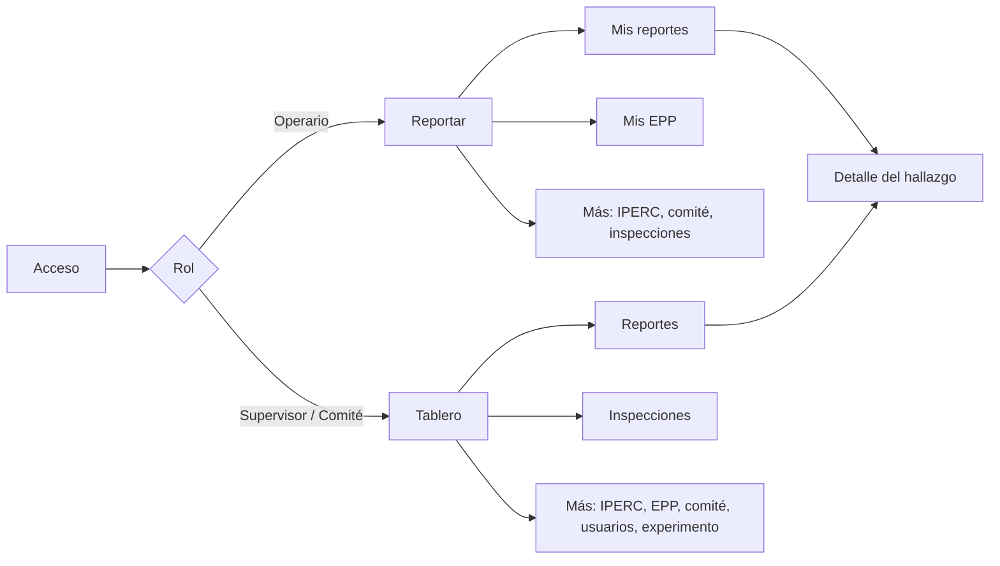
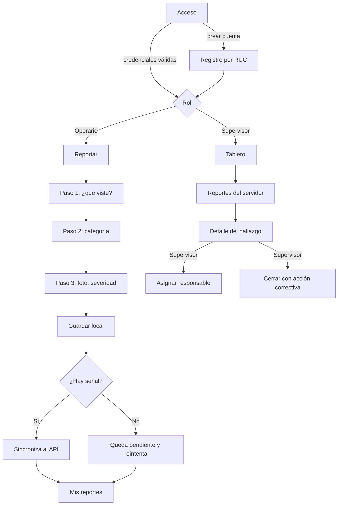
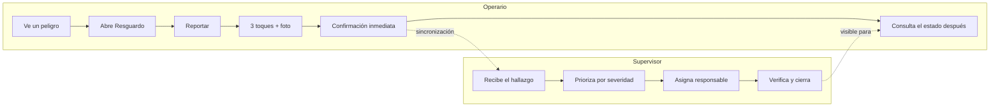

# Capítulo IV: Product Design

## 4.1. Style Guidelines

### 4.1.1. General Style Guidelines

**Marca.** El producto se llama **Resguardo**. El nombre se eligió porque reúne los dos sentidos
que definen al sistema: proteger y dejar constancia. Se escribe en versalitas en la barra lateral
y acompañado siempre del descriptor "Sistema de Gestión de Seguridad y Salud en el Trabajo".

**Principio rector.** La interfaz es institucional, no comercial. El usuario que la abre está
gestionando riesgos laborales y respondiendo ante una autoridad fiscalizadora; el producto debe
transmitir formalidad y precisión, no entusiasmo. De ahí tres reglas que atraviesan todo el
diseño:

1. **El color solo aparece cuando significa algo.** El azul es la institución; el gris, la
   estructura. Verde, ámbar y rojo se reservan para estados: cerrado, en proceso, vencido o
   crítico. No hay color decorativo.
2. **Sin gradientes, sin sombras de color y con esquinas de 4 píxeles.** Es lo que separa
   visualmente una herramienta corporativa de una aplicación de consumo.
3. **La densidad es una función, no un defecto.** El supervisor revisa decenas de hallazgos por
   sesión; las tablas son compactas a propósito.

**Paleta cromática**

| Token | Valor | Uso |
|---|---|---|
| `--navy-900` | `#0c1d33` | Títulos y textos de mayor jerarquía |
| `--navy-800` | `#12304f` | Barra lateral, fondo de la pantalla de acceso |
| `--navy-700` | `#1b4570` | Acciones primarias, filetes superiores de tarjetas |
| `--navy-600` | `#24578a` | Estados hover, enlaces |
| `--blue-500` | `#2f6db0` | Indicador de la opción de menú activa |
| `--blue-100` | `#e7eff7` | Realce de fila de tabla, halo de foco |
| `--blue-050` | `#f2f6fa` | Filas alternadas de tabla |
| `--gray-900` | `#1c2530` | Texto base |
| `--gray-500` | `#5e6a78` | Texto secundario |
| `--gray-200` | `#dce1e7` | Bordes |
| `--gray-100` | `#eaeef2` | Cabeceras de tabla, separadores |
| `--gray-050` | `#f4f6f8` | Fondo de trabajo |
| `--ok-700` | `#1f6b47` | Estado cerrado / conforme |
| `--warn-700` | `#8a6100` | Estado en proceso |
| `--danger-700` | `#a02a2a` | Vencido, crítico, acciones destructivas |

**Tipografía**

| Rol | Familia | Justificación |
|---|---|---|
| Títulos y cifras de indicadores | Serif del sistema (`ui-serif`, Georgia, Palatino) | Aporta el peso de documento formal, sin cargar una fuente externa que retrase la carga en conexiones lentas |
| Texto de interfaz | Sans del sistema (Segoe UI, system-ui) | Legibilidad en pantalla y cero descarga adicional |
| Etiquetas y cabeceras de tabla | Sans en versalitas, 11 px, `letter-spacing` 0.06em | Jerarquía sin recurrir al color |

**Espaciado e iconografía.** Radio de esquina uniforme de 4 px; bordes de 1 px; separación base
de 8 px con múltiplos de 4. No se usan emojis ni iconos decorativos en la web; en la aplicación
móvil los iconos provienen de Material Icons, limitados a la navegación inferior.

**Tono de voz.** Español peruano formal pero directo. Se prefiere el vocabulario del dominio
("hallazgo", "acción correctiva", "quórum") sobre el vocabulario genérico de software
("ítem", "elemento"). Los mensajes de error explican qué hacer, no solo qué falló.

<!-- IMAGEN REQUERIDA: captura de la paleta y la tipografía aplicadas, o tabla de color
     exportada desde Figma, en assets/img/style-guide-paleta.png -->

### 4.1.2. Web Style Guidelines

| Elemento | Definición |
|---|---|
| Estructura | Barra lateral fija de 236 px, barra superior de 52 px con razón social y fecha, contenido con ancho máximo de 1320 px y pie de página con la referencia normativa |
| Navegación | Vertical en la barra lateral, filtrada por rol; la opción activa se marca con filete azul a la izquierda |
| Tablas | Cabecera gris en versalitas, filas alternadas, realce al pasar el cursor, desbordamiento horizontal contenido en el propio bloque |
| Indicadores | Tarjeta con filete superior azul, etiqueta en versalitas y cifra en serif de 32 px; el filete se vuelve rojo cuando el valor exige atención |
| Formularios | Etiqueta en versalitas sobre el control, rejilla que se adapta de una a varias columnas, controles de elección con estilo propio (la casilla se llena de azul marino con el check en blanco) |
| Modales | Superficie blanca con filete superior azul sobre fondo azul marino translúcido |
| Estados | Píldoras rectangulares de 2 px de radio, con fondo y borde del color del estado |
| Puntos de quiebre | 980 px: la barra lateral pasa a barra horizontal superior; 720 px: las rejillas colapsan a una columna |

### 4.1.3. Mobile Style Guidelines

| Elemento | Definición |
|---|---|
| Sistema de diseño | Material 3 (Jetpack Compose), con esquema de color propio derivado de la paleta institucional |
| Navegación | Barra inferior de cuatro destinos, distinta según rol, más una pantalla "Más" que agrupa el resto |
| Objetivos táctiles | Mínimo 48 dp; en el formulario rápido, tarjetas de selección de ancho completo y 56 dp de alto en las acciones principales |
| Tipografía | Escala tipográfica de Material 3, sin fuentes externas |
| Retroalimentación | Confirmación inmediata al guardar un reporte, con indicador visible de cuántos quedan pendientes de envío |
| Modo sin conexión | Estado explícito en la lista: "Enviado" o "Pendiente", nunca un error silencioso |

#### 4.1.3.1. iOS Mobile Style Guidelines

Fuera del alcance del proyecto. La decisión se sustenta en el segmento objetivo: el operario de
campo peruano usa mayoritariamente dispositivos Android de gama media o baja, y desarrollar
para iOS habría consumido la mitad del presupuesto de desarrollo del ciclo sin atender a ese
usuario. Se documenta como decisión consciente y no como omisión.

<!-- COMPLETAR: respaldar la afirmación sobre distribución de sistemas operativos con una
     fuente citable (OSIPTEL, StatCounter Perú o similar). -->

#### 4.1.3.2. Android Mobile Style Guidelines

| Elemento | Definición |
|---|---|
| Color primario | Azul marino institucional, consistente con la web |
| Modo oscuro | Soportado mediante el esquema oscuro de Material 3 |
| Icono de aplicación | Icono adaptativo con triángulo de advertencia, símbolo universal de peligro en SST |
| Componentes | `Card`, `FilterChip`, `NavigationBar`, `AlertDialog` y `Checkbox` de Material 3, sin componentes personalizados innecesarios |
| Permisos | Cámara y ubicación se solicitan en el momento de uso, no al abrir la aplicación |

## 4.2. Information Architecture

### 4.2.1. Organization Systems

La información se organiza por **proceso del sistema de gestión**, no por tipo de dato: el
usuario piensa en "reportar", "inspeccionar" o "revisar la matriz", no en "entidades". Dentro de
cada proceso, el orden es cronológico descendente para lo operativo (los hallazgos más recientes
primero) y por severidad cuando la prioridad manda.

| Esquema | Aplicación |
|---|---|
| Secuencial | Formulario rápido de reporte: tres pasos con avance explícito |
| Cronológico | Bandeja de hallazgos, bitácora, actas del comité |
| Por tópico | Menú principal: reportes, IPERC, inspecciones, EPP, comité |
| Por audiencia | El menú se filtra por rol: el operario ve cuatro opciones, el supervisor nueve |

### 4.2.2. Labeling Systems

Las etiquetas usan el vocabulario del dominio definido en el Ubiquitous Language, no traducciones
literales del inglés técnico.

| En la interfaz | En el modelo | Por qué esa etiqueta |
|---|---|---|
| Reportar | `Report.create` | Verbo de la acción del operario, no "nuevo registro" |
| Hallazgo | `Report` gestionado | Es el término que usa el profesional de SST |
| Matriz IPERC | `IpercMatrix` | Nombre normativo, reconocible sin explicación |
| Equipos de protección | `EppItem` / `EppDelivery` | Se evita la sigla en el menú y se usa en el detalle |
| Comité de SST | `Committee` | Nombre normativo |
| Acta N° | `Meeting.number` | Formato documental esperado por el auditor |
| Cerrar hallazgo | `Report.close` | Acción con consecuencia explícita |

### 4.2.3. SEO Tags and Meta Tags

Aplican a la landing page y a la pantalla de acceso de la aplicación web; el interior del panel
no se indexa por requerir autenticación.

| Etiqueta | Contenido |
|---|---|
| `<title>` | Resguardo — Sistema de Gestión de SST |
| `<meta name="description">` | Resguardo — Sistema de Gestión de Seguridad y Salud en el Trabajo (Ley N° 29783) |
| `<html lang>` | `es-PE` |
| `<meta name="viewport">` | `width=device-width, initial-scale=1.0` |
| Open Graph | <!-- COMPLETAR en la landing page: og:title, og:description, og:image, og:url --> |

### 4.2.4. Searching Systems

El sistema no ofrece un buscador global. La búsqueda es **contextual y por filtros**, porque el
usuario no busca texto libre sino subconjuntos: los hallazgos abiertos de un área, las
inspecciones vencidas, las entregas de EPP de un trabajador.

| Pantalla | Mecanismo |
|---|---|
| Bandeja de hallazgos | Filtros por estado, tipo y área; ordenamiento por fecha y severidad |
| API | Filtros por campo, búsqueda textual en descripción y nota de cierre, y ordenamiento, provistos por el backend |
| Matriz IPERC | Búsqueda por peligro, riesgo y puesto |

### 4.2.5. Navigation Systems

La navegación es idéntica en concepto entre web y móvil para un mismo rol: lo que un rol puede
hacer en una plataforma puede hacerlo en la otra. Cambia solo el mecanismo —barra lateral en
web, barra inferior en móvil— por convención de cada entorno.

## 4.3. Landing Page UI Design

### 4.3.1. Landing Page Wireframe

<!-- IMAGEN REQUERIDA: wireframe de la landing page (Figma o Adobe XD) en
     assets/img/landing-wireframe.png -->

> **PENDIENTE.** Estructura propuesta, de arriba hacia abajo: barra de navegación con logo y
> acceso; encabezado con la propuesta de valor en una frase y llamada a la acción; bloque del
> problema con las cifras del MTPE; bloque de funcionalidades en tres columnas (reporte en
> campo, seguimiento, evidencia); bloque de cumplimiento normativo citando la Ley N° 29783;
> planes; formulario de contacto; pie con datos de la empresa.

### 4.3.2. Landing Page Mock-up

<!-- IMAGEN REQUERIDA: mock-up de la landing page en assets/img/landing-mockup.png -->

## 4.4. Mobile Applications UX/UI Design

### 4.4.1. Mobile Applications Wireframes

<!-- IMAGEN REQUERIDA: wireframes de las pantallas móviles en
     assets/img/mobile-wireframes.png. Pantallas: acceso, registro, formulario rápido
     (3 pasos), formulario largo, lista de reportes, detalle del hallazgo, IPERC, mis EPP,
     inspecciones, tablero. -->

### 4.4.2. Mobile Applications Wireflow Diagrams

### 4.4.3. Mobile Applications Mock-ups

<!-- IMAGEN REQUERIDA: capturas reales de la aplicación Android en ejecución en
     assets/img/mobile-mockup-*.png -->

### 4.4.4. Mobile Applications User Flow Diagrams

## 4.5. Mobile Applications Prototyping

### 4.5.1. Android Mobile Applications Prototyping

<!-- COMPLETAR: enlace al prototipo navegable en Figma. Si el prototipo se sustituye por la
     aplicación real compilada, dejarlo indicado y enlazar el APK de depuración generado por
     el pipeline. -->

### 4.5.2. iOS Mobile Applications Prototyping

Fuera del alcance, conforme a lo justificado en 4.1.3.1.

## 4.6. Web Applications UX/UI Design

### 4.6.1. Web Applications Wireframes

<!-- IMAGEN REQUERIDA: wireframes del panel web en assets/img/web-wireframes.png.
     Pantallas: acceso, registro, tablero, bandeja de hallazgos, detalle, matriz IPERC,
     inspecciones, EPP, comité, usuarios, experimento. -->

