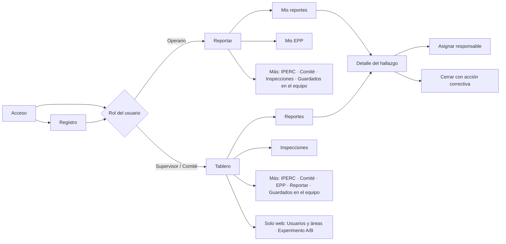
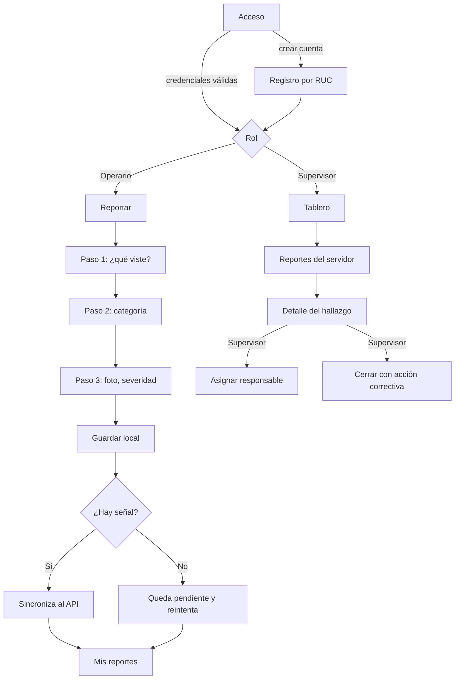
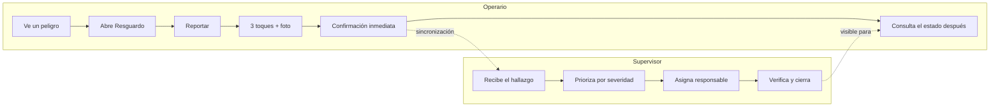
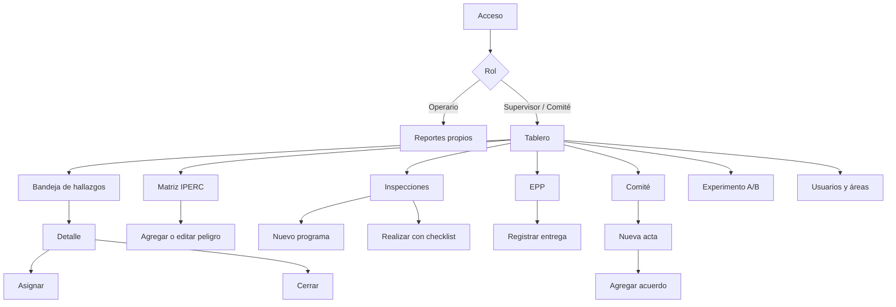
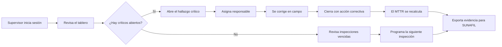
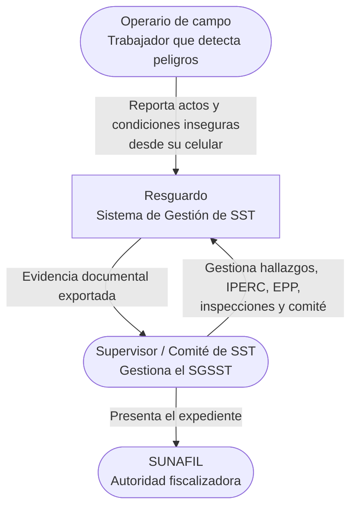
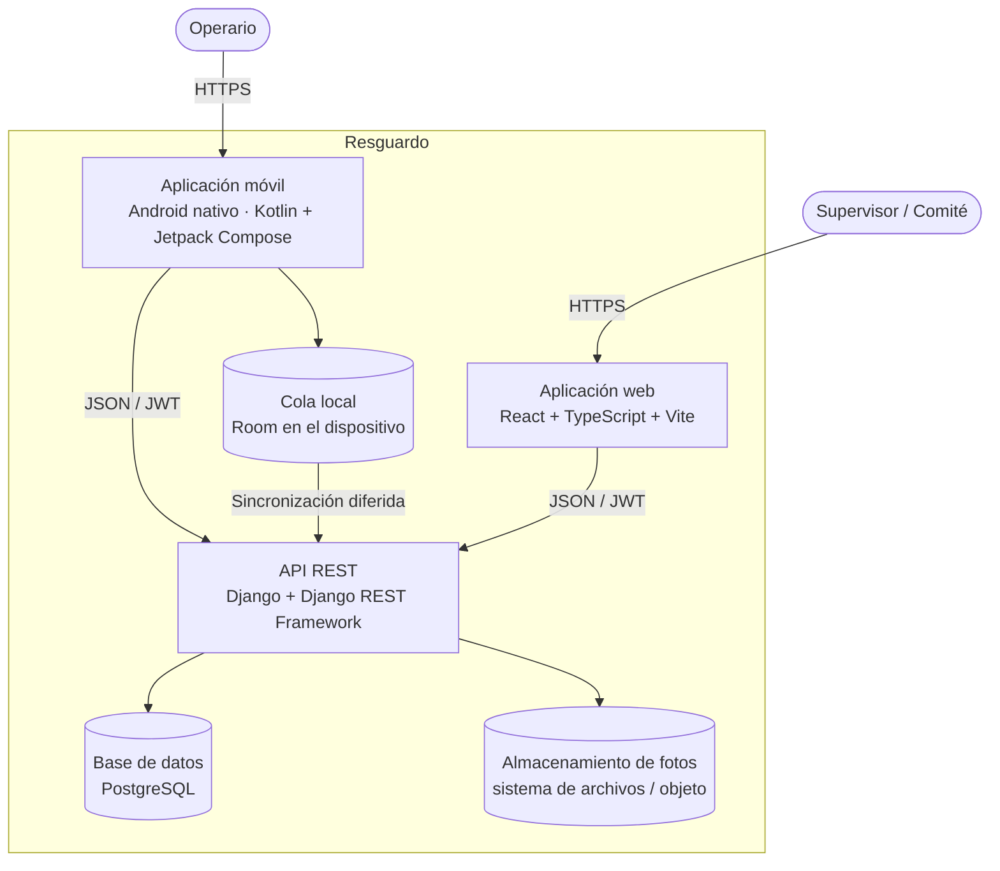
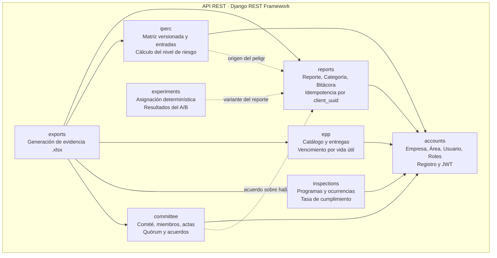
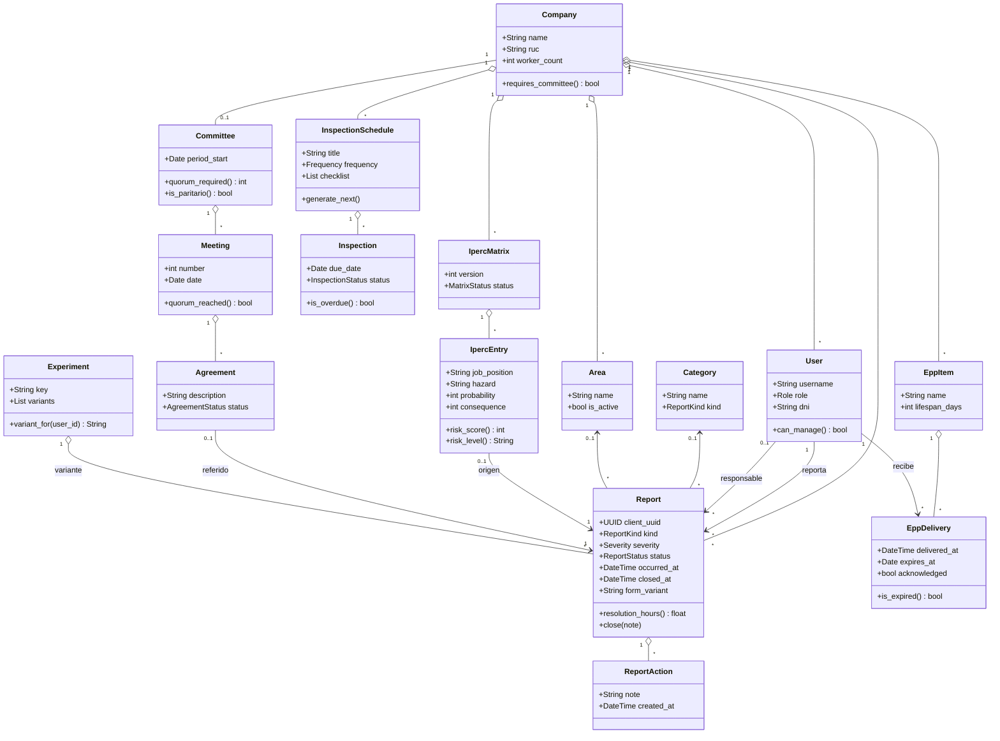
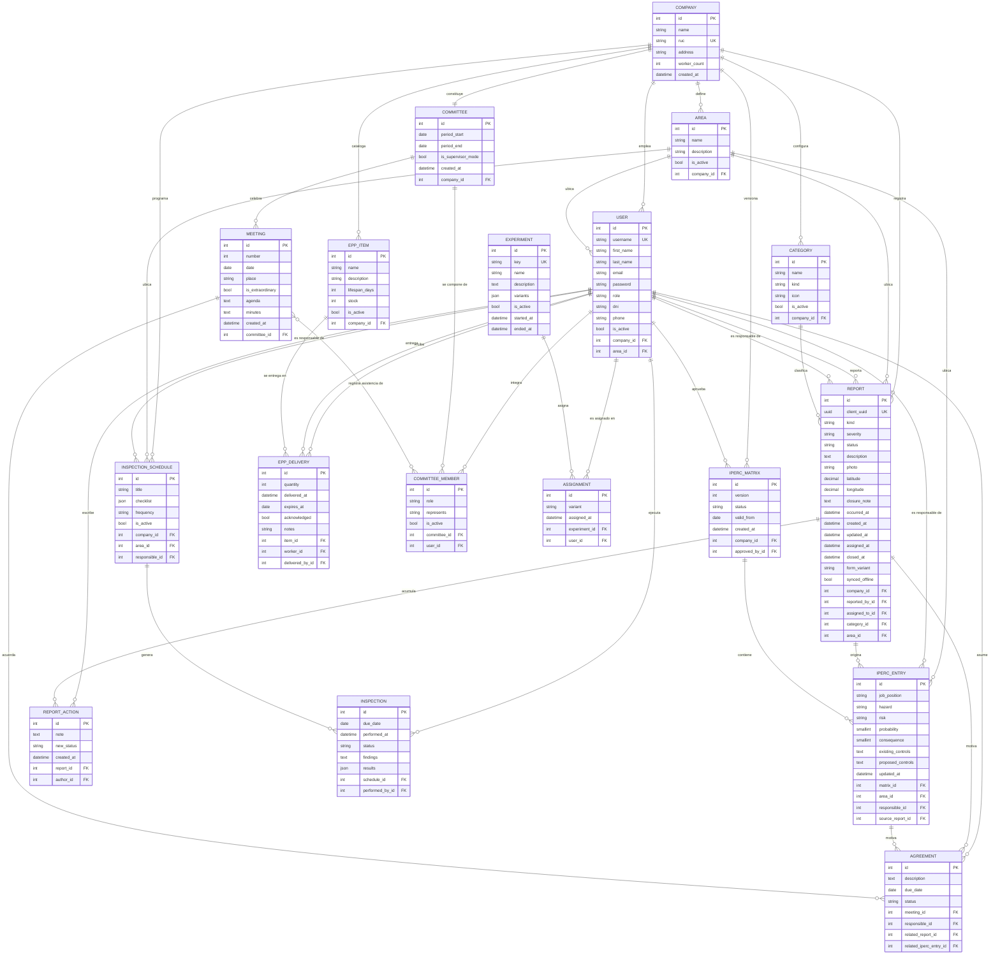

# Capítulo IV: Product Design

## 4.1. Style Guidelines

### 4.1.1. General Style Guidelines

**Marca.** El producto se llama **Resguardo**. El nombre se eligió porque reúne los dos sentidos
que definen al sistema: proteger y dejar constancia. Se escribe en versalitas en la barra lateral
y acompañado siempre del descriptor "Sistema de Gestión de Seguridad y Salud en el Trabajo".

**Principio rector.** La interfaz es institucional, no comercial. El usuario que la abre está
gestionando riesgos laborales y respondiendo ante una autoridad fiscalizadora; el producto debe
transmitir formalidad y precisión, no entusiasmo. De ahí tres reglas que atraviesan todo el
diseño:

1. **El color solo aparece cuando significa algo.** El azul es la institución; el gris, la
   estructura. Verde, ámbar y rojo se reservan para estados: cerrado, en proceso, vencido o
   crítico. No hay color decorativo.
2. **Sin gradientes, sin sombras de color y con esquinas de 4 píxeles.** Es lo que separa
   visualmente una herramienta corporativa de una aplicación de consumo.
3. **La densidad es una función, no un defecto.** El supervisor revisa decenas de hallazgos por
   sesión; las tablas son compactas a propósito.

**Paleta cromática**

| Token | Valor | Uso |
|---|---|---|
| `--navy-900` | `#0c1d33` | Títulos y textos de mayor jerarquía |
| `--navy-800` | `#12304f` | Barra lateral, fondo de la pantalla de acceso |
| `--navy-700` | `#1b4570` | Acciones primarias, filetes superiores de tarjetas |
| `--navy-600` | `#24578a` | Estados hover, enlaces |
| `--blue-500` | `#2f6db0` | Indicador de la opción de menú activa |
| `--blue-100` | `#e7eff7` | Realce de fila de tabla, halo de foco |
| `--blue-050` | `#f2f6fa` | Filas alternadas de tabla |
| `--gray-900` | `#1c2530` | Texto base |
| `--gray-500` | `#5e6a78` | Texto secundario |
| `--gray-200` | `#dce1e7` | Bordes |
| `--gray-100` | `#eaeef2` | Cabeceras de tabla, separadores |
| `--gray-050` | `#f4f6f8` | Fondo de trabajo |
| `--ok-700` | `#1f6b47` | Estado cerrado / conforme |
| `--warn-700` | `#8a6100` | Estado en proceso |
| `--danger-700` | `#a02a2a` | Vencido, crítico, acciones destructivas |

**Tipografía**

| Rol | Familia | Justificación |
|---|---|---|
| Títulos y cifras de indicadores | Serif del sistema (`ui-serif`, Georgia, Palatino) | Aporta el peso de documento formal, sin cargar una fuente externa que retrase la carga en conexiones lentas |
| Texto de interfaz | Sans del sistema (Segoe UI, system-ui) | Legibilidad en pantalla y cero descarga adicional |
| Etiquetas y cabeceras de tabla | Sans en versalitas, 11 px, `letter-spacing` 0.06em | Jerarquía sin recurrir al color |

**Espaciado e iconografía.** Radio de esquina uniforme de 4 px; bordes de 1 px; separación base
de 8 px con múltiplos de 4. No se usan emojis ni iconos decorativos en la web; en la aplicación
móvil los iconos provienen de Material Icons, limitados a la navegación inferior.

**Tono de voz.** Español peruano formal pero directo. Se prefiere el vocabulario del dominio
("hallazgo", "acción correctiva", "quórum") sobre el vocabulario genérico de software
("ítem", "elemento"). Los mensajes de error explican qué hacer, no solo qué falló.

<!-- IMAGEN REQUERIDA: captura de la paleta y la tipografía aplicadas, o tabla de color
     exportada desde Figma, en assets/img/style-guide-paleta.png -->

### 4.1.2. Web Style Guidelines

| Elemento | Definición |
|---|---|
| Estructura | Barra lateral fija de 236 px, barra superior de 52 px con razón social y fecha, contenido con ancho máximo de 1320 px y pie de página con la referencia normativa |
| Navegación | Vertical en la barra lateral, filtrada por rol; la opción activa se marca con filete azul a la izquierda |
| Tablas | Cabecera gris en versalitas, filas alternadas, realce al pasar el cursor, desbordamiento horizontal contenido en el propio bloque |
| Indicadores | Tarjeta con filete superior azul, etiqueta en versalitas y cifra en serif de 32 px; el filete se vuelve rojo cuando el valor exige atención |
| Formularios | Etiqueta en versalitas sobre el control, rejilla que se adapta de una a varias columnas, controles de elección con estilo propio (la casilla se llena de azul marino con el check en blanco) |
| Modales | Superficie blanca con filete superior azul sobre fondo azul marino translúcido |
| Estados | Píldoras rectangulares de 2 px de radio, con fondo y borde del color del estado |
| Puntos de quiebre | 980 px: la barra lateral pasa a barra horizontal superior; 720 px: las rejillas colapsan a una columna |

### 4.1.3. Mobile Style Guidelines

| Elemento | Definición |
|---|---|
| Sistema de diseño | Material 3 (Jetpack Compose), con esquema de color propio derivado de la paleta institucional |
| Navegación | Barra inferior de cuatro destinos, distinta según rol, más una pantalla "Más" que agrupa el resto |
| Objetivos táctiles | Mínimo 48 dp; en el formulario rápido, tarjetas de selección de ancho completo y 56 dp de alto en las acciones principales |
| Tipografía | Escala tipográfica de Material 3, sin fuentes externas |
| Retroalimentación | Confirmación inmediata al guardar un reporte, con indicador visible de cuántos quedan pendientes de envío |
| Modo sin conexión | Estado explícito en la lista: "Enviado" o "Pendiente", nunca un error silencioso |

#### 4.1.3.1. iOS Mobile Style Guidelines

Fuera del alcance del proyecto. La decisión se sustenta en el segmento objetivo: el operario de
campo peruano usa mayoritariamente dispositivos Android de gama media o baja, y desarrollar
para iOS habría consumido la mitad del presupuesto de desarrollo del ciclo sin atender a ese
usuario. Se documenta como decisión consciente y no como omisión.

<!-- COMPLETAR: respaldar la afirmación sobre distribución de sistemas operativos con una
     fuente citable (OSIPTEL, StatCounter Perú o similar). -->

#### 4.1.3.2. Android Mobile Style Guidelines

| Elemento | Definición |
|---|---|
| Color primario | Azul marino institucional, consistente con la web |
| Modo oscuro | Soportado mediante el esquema oscuro de Material 3 |
| Icono de aplicación | Icono adaptativo con triángulo de advertencia, símbolo universal de peligro en SST |
| Componentes | `Card`, `FilterChip`, `NavigationBar`, `AlertDialog` y `Checkbox` de Material 3, sin componentes personalizados innecesarios |
| Permisos | Cámara y ubicación se solicitan en el momento de uso, no al abrir la aplicación |

## 4.2. Information Architecture

### 4.2.1. Organization Systems

La información se organiza por **proceso del sistema de gestión**, no por tipo de dato: el
usuario piensa en "reportar", "inspeccionar" o "revisar la matriz", no en "entidades". Dentro de
cada proceso, el orden es cronológico descendente para lo operativo (los hallazgos más recientes
primero) y por severidad cuando la prioridad manda.

| Esquema | Aplicación |
|---|---|
| Secuencial | Formulario rápido de reporte: tres pasos con avance explícito |
| Cronológico | Bandeja de hallazgos, bitácora, actas del comité |
| Por tópico | Menú principal: reportes, IPERC, inspecciones, EPP, comité |
| Por audiencia | El menú se filtra por rol: en la web el operario ve seis opciones y el supervisor nueve; en el móvil, cuatro destinos en la barra inferior más una pantalla "Más" |

### 4.2.2. Labeling Systems

Las etiquetas usan el vocabulario del dominio definido en el Ubiquitous Language, no traducciones
literales del inglés técnico.

| En la interfaz | En el modelo | Por qué esa etiqueta |
|---|---|---|
| Reportar | `Report.create` | Verbo de la acción del operario, no "nuevo registro" |
| Hallazgo | `Report` gestionado | Es el término que usa el profesional de SST |
| Matriz IPERC | `IpercMatrix` | Nombre normativo, reconocible sin explicación |
| Equipos de protección | `EppItem` / `EppDelivery` | Se evita la sigla en el menú y se usa en el detalle |
| Comité de SST | `Committee` | Nombre normativo |
| Acta N° | `Meeting.number` | Formato documental esperado por el auditor |
| Cerrar hallazgo | `Report.close` | Acción con consecuencia explícita |

### 4.2.3. SEO Tags and Meta Tags

Aplican a la landing page y a la pantalla de acceso de la aplicación web; el interior del panel
no se indexa por requerir autenticación.

| Etiqueta | Contenido |
|---|---|
| `<title>` | Resguardo — Sistema de Gestión de SST |
| `<meta name="description">` | Resguardo — Sistema de Gestión de Seguridad y Salud en el Trabajo (Ley N° 29783) |
| `<html lang>` | `es-PE` |
| `<meta name="viewport">` | `width=device-width, initial-scale=1.0` |
| Open Graph | <!-- COMPLETAR en la landing page, que vive en su propio repositorio: og:title, og:description, og:image, og:url -->

Las etiquetas `title`, `description`, `lang` y `viewport` están declaradas en el `index.html` de `sst-web`. Las de Open Graph y Twitter Card corresponden a la landing page y se declararán en su repositorio.

### 4.2.4. Searching Systems

El sistema no ofrece un buscador global. La búsqueda es **contextual y por filtros**, porque el
usuario no busca texto libre sino subconjuntos: los hallazgos abiertos de un área, las
inspecciones vencidas, las entregas de EPP de un trabajador.

| Pantalla | Mecanismo |
|---|---|
| Bandeja de hallazgos | Filtros por estado, tipo y área; ordenamiento por fecha y severidad |
| API | Filtros por campo, búsqueda textual en descripción y nota de cierre, y ordenamiento, provistos por el backend |
| Matriz IPERC | Búsqueda por peligro, riesgo y puesto |

### 4.2.5. Navigation Systems

La navegación responde a una sola pregunta: **qué puede hacer este rol, aquí y ahora**. No hay un
menú universal que luego deshabilite opciones; cada rol recibe únicamente los destinos que le
corresponden, y esa filtración ocurre en el mismo lugar en las dos plataformas.

#### Niveles de navegación

| Nivel | Web | Móvil | Propósito |
|---|---|---|---|
| **Global** | Barra lateral fija de 236 px, siempre visible | Barra inferior de cuatro destinos más una pantalla "Más" | Moverse entre procesos del sistema de gestión |
| **Local** | Acciones dentro de la pantalla: *Asignar*, *Cerrar*, *Nueva versión*, *Registrar entrega* | Las mismas acciones, como botones de ancho completo | Actuar sobre el registro que se está viendo |
| **Contextual** | Filtros de la bandeja (estado, tipo, área) y selector de versión de la matriz | Filtros equivalentes en chips | Reducir un listado sin cambiar de pantalla |
| **De retorno** | El título del detalle enlaza a su listado; el logotipo lleva al inicio del rol | Botón de retroceso del sistema y de la barra superior | Volver sin perder el contexto |

No hay migas de pan (*breadcrumbs*): la jerarquía tiene como máximo dos niveles —listado y
detalle—, y un rastro de migas de dos escalones ocupa espacio sin aportar orientación.

#### Destinos por rol y plataforma

La tabla siguiente es la verificación de la paridad exigida al proyecto. Cada fila es un destino
real del código: la barra lateral de la web se arma desde una lista con marca `managerOnly`, y la
barra inferior del móvil desde dos listas de pestañas, una por rol.

| Destino | Ruta web | Operario (web) | Operario (móvil) | Supervisor y comité (web) | Supervisor y comité (móvil) |
|---|---|---|---|---|---|
| Tablero de indicadores | `/` | — | — | Barra lateral | Barra inferior |
| Reportar un hallazgo | `/reportes/nuevo` | Barra lateral | Barra inferior | Barra lateral | Menú "Más" |
| Reportes | `/reportes` | Barra lateral | Barra inferior | Barra lateral | Barra inferior |
| Detalle del hallazgo | `/reportes/:id` | Desde el listado | Desde el listado | Desde el listado | Desde el listado |
| Matriz IPERC | `/iperc` | Barra lateral | Menú "Más" | Barra lateral | Menú "Más" |
| Inspecciones | `/inspecciones` | Barra lateral | Menú "Más" | Barra lateral | Barra inferior |
| Equipos de protección | `/epp` | Barra lateral | Barra inferior ("Mis EPP") | Barra lateral | Menú "Más" |
| Comité de SST | `/comite` | Barra lateral | Menú "Más" | Barra lateral | Menú "Más" |
| Reportes guardados en el equipo | — | — | Menú "Más" | — | Menú "Más" |
| Experimento A/B | `/experimento` | — | — | Barra lateral | — |
| Usuarios y áreas | `/usuarios` | — | — | Barra lateral | — |

Tres lecturas de esa tabla:

1. **Para el operario la paridad es completa.** Los seis destinos que ve en la web son los
   mismos que alcanza en el móvil. Cambia dónde está cada uno: lo que hace todos los días
   —reportar, ver sus reportes, ver sus EPP— ocupa la barra inferior, y lo que consulta de vez en
   cuando queda un toque más adentro, en "Más". Priorizar por frecuencia de uso es el criterio
   de una barra de cuatro destinos; ocultar capacidades no lo es.
2. **Para el supervisor hay dos destinos solo en la web**, *Usuarios y áreas* y *Experimento A/B*.
   No es un pendiente: son las historias US04, US05, US41 y US40, especificadas como web desde el
   Capítulo III. Dar de alta usuarios, definir áreas y leer los resultados de un experimento son
   tareas de escritorio, con formularios largos y tablas comparativas; nadie las hace con una mano
   mientras sostiene un casco con la otra. La regla de paridad aplica a las capacidades de campo
   y de gestión del hallazgo, y estas dos quedan documentadas como excepción razonada.
3. **Un destino existe solo en el móvil**, *Reportes guardados en el equipo*, porque solo el móvil
   tiene una cola local: es la lista de lo que se capturó sin señal y aún no se ha sincronizado.
   En la web no tendría contenido que mostrar.

#### Reglas de comportamiento

| Regla | Comportamiento | Por qué |
|---|---|---|
| Destino inicial según rol | El operario entra a *Reportar*; el supervisor y el comité, al *Tablero* | La primera pantalla debe ser la tarea más probable de ese rol, no una bienvenida |
| Ruta no autorizada | Un operario que escriba `/usuarios` es redirigido a sus reportes | Un 403 en pantalla no le sirve de nada a quien no puede estar ahí |
| Ruta inexistente | Cualquier otra ruta redirige al inicio del rol | Evita pantallas en blanco por un enlace viejo o un error de tipeo |
| Sesión no iniciada | El acceso a una ruta privada lleva a la pantalla de acceso, no a un error | Quien llega por un enlace sin sesión debe poder iniciarla y continuar |
| Opción activa | Filete azul a la izquierda en la web; destino resaltado en la barra inferior del móvil | Ubicación permanente sin recurrir a migas de pan |
| Estado al volver | El móvil conserva el estado de cada pestaña al cambiar entre ellas | Volver a una lista y encontrarla al inicio obliga a repetir el trabajo de búsqueda |
| Cierre de sesión | Siempre en el pie de la barra lateral y en la pantalla "Más" | Una acción con consecuencia se coloca lejos de la navegación frecuente |

#### Mapa de navegación

El diagrama vale para las dos plataformas: lo que cambia es el mecanismo —barra lateral en la web,
barra inferior más pantalla "Más" en el móvil—, no el conjunto de destinos ni el camino entre
ellos. Un supervisor que aprendió a moverse en la web no tiene que volver a aprender nada al
abrir el celular.

## 4.3. Landing Page UI Design

La página pública **no forma parte de la aplicación web**. Vive en su propio repositorio, separada
del panel de gestión, por dos razones que conviene declarar:

| Razón | Consecuencia |
|---|---|
| Audiencias distintas | La landing se dirige a quien todavía no es cliente; el panel, a quien ya lo es y trabaja en él todos los días. Son dos productos con métricas y ritmos de cambio diferentes |
| Despliegue independiente | Un cambio de texto comercial no debería obligar a reconstruir y volver a desplegar la aplicación de gestión, ni arrastrar su código al navegador de un visitante |

Comparte, eso sí, la identidad visual definida en 4.1: los mismos tokens de color, la misma
tipografía y el mismo tono institucional, de modo que quien pase de la página al acceso no sienta
que entró a otro producto.

> **PENDIENTE — fuera del alcance de este ciclo.** La landing page se construye en un repositorio
> aparte. Esta sección documenta su diseño previsto; las capturas se incorporan cuando esté
> publicada.

### 4.3.1. Landing Page Wireframe

Estructura prevista de arriba hacia abajo, con la intención de cada bloque:

| # | Bloque | Contenido | Qué debe lograr |
|---|---|---|---|
| 1 | Barra de navegación | Logotipo, anclas a las secciones y botón *Ingresar* | Que el usuario que ya es cliente llegue al acceso en un clic, sin leer nada |
| 2 | Encabezado | Referencia normativa, titular, propuesta de valor y dos llamadas a la acción | Decir en una frase qué resuelve y para quién |
| 3 | Recorrido del hallazgo | Los cinco pasos: se detecta, se registra, se asigna, se cierra, se documenta | Mostrar el producto como un proceso completo, no como una lista de pantallas |
| 4 | El problema | Tres bloques: el reporte no llega, el peligro sigue ahí, no hay cómo demostrarlo | Que el visitante se reconozca antes de que se le ofrezca nada |
| 5 | El sistema | Reporte en campo, seguimiento, evidencia, IPERC, EPP e inspecciones, comité | Responder qué hace, con el vocabulario del dominio |
| 6 | Cumplimiento | Tabla obligación → base normativa → dónde queda registrado | Convertir la promesa en trazabilidad verificable |
| 7 | Planes | Tres niveles según número de trabajadores | Que el visitante se ubique sin pedir una cotización |
| 8 | Contacto | Vía de contacto y solicitud de demostración | Cerrar con una acción concreta |
| 9 | Pie | Referencia a la Ley N° 29783 y su Reglamento | Reforzar el encuadre institucional |

**Restricciones autoimpuestas al contenido**

| Restricción | Razón |
|---|---|
| Solo se anuncian capacidades implementadas | Ninguna historia marcada *Propuesta* en el Capítulo III puede aparecer en la página: publicitar lo que no existe es la forma más rápida de perder al primer cliente |
| Sin precios publicados en los planes | El precio depende del número de trabajadores y del acompañamiento; una cifra inventada es peor que ninguna |
| Sin formulario que no envíe a ningún servidor | Un formulario que no llega a nadie es una promesa falsa; mientras no haya backend de contacto, se usa una vía de contacto directa |
| La cifra del MTPE solo se publica con su fuente | Mismo criterio que el Capítulo I: antes que un número sin respaldo, ninguno |
| La tabla de cumplimiento cita el artículo | Un responsable de SST evalúa el producto por su cobertura normativa, no por adjetivos |

<!-- IMAGEN REQUERIDA: wireframe de la landing page en assets/img/landing-wireframe.png.
     Puede dibujarse en Figma sobre la estructura de nueve bloques de la tabla anterior. -->

### 4.3.2. Landing Page Mock-up

<!-- IMAGEN REQUERIDA: mock-up o capturas de la landing page en
     assets/img/landing-mockup-*.png, una vez construida en su repositorio. -->

> **PENDIENTE.** Incorporar el mock-up cuando la landing page esté construida, junto con la URL
> de su despliegue.

**Aplicación de la guía de estilo.** La página debe reutilizar los tokens definidos en 4.1 sin
introducir colores nuevos: azul marino para la marca, las acciones y el bloque de contacto; gris
para estructura y texto secundario; blanco para las superficies. El titular y los nombres de los
planes, en la serif del sistema, igual que los títulos del panel.

## 4.4. Mobile Applications UX/UI Design

### 4.4.1. Mobile Applications Wireframes

<!-- IMAGEN REQUERIDA: wireframes de las pantallas móviles en
     assets/img/mobile-wireframes.png. Pantallas: acceso, registro, formulario rápido
     (3 pasos), formulario largo, lista de reportes, detalle del hallazgo, IPERC, mis EPP,
     inspecciones, tablero. -->

### 4.4.2. Mobile Applications Wireflow Diagrams

### 4.4.3. Mobile Applications Mock-ups

<!-- IMAGEN REQUERIDA: capturas reales de la aplicación Android en ejecución en
     assets/img/mobile-mockup-*.png -->

### 4.4.4. Mobile Applications User Flow Diagrams

## 4.5. Mobile Applications Prototyping

### 4.5.1. Android Mobile Applications Prototyping

<!-- COMPLETAR: enlace al prototipo navegable en Figma. Si el prototipo se sustituye por la
     aplicación real compilada, dejarlo indicado y enlazar el APK de depuración generado por
     el pipeline. -->

### 4.5.2. iOS Mobile Applications Prototyping

Fuera del alcance, conforme a lo justificado en 4.1.3.1.

## 4.6. Web Applications UX/UI Design

### 4.6.1. Web Applications Wireframes

<!-- IMAGEN REQUERIDA: wireframes del panel web en assets/img/web-wireframes.png.
     Pantallas: acceso, registro, tablero, bandeja de hallazgos, detalle, matriz IPERC,
     inspecciones, EPP, comité, usuarios, experimento. -->

### 4.6.2. Web Applications Wireflow Diagrams

### 4.6.3. Web Applications Mock-ups

<!-- IMAGEN REQUERIDA: capturas reales del panel web en assets/img/web-mockup-*.png -->

### 4.6.4. Web Applications User Flow Diagrams

## 4.7. Web Applications Prototyping

<!-- COMPLETAR: enlace al prototipo navegable en Figma, o indicación de que el prototipo se
     sustituye por la aplicación web desplegada, con su URL. -->

## 4.8. Domain-Driven Software Architecture

La arquitectura sigue el enfoque C4. El sistema se organiza en **bounded contexts** que
corresponden a los procesos del sistema de gestión: identidad y organización, reportes,
IPERC, EPP, inspecciones, comité y experimentación.

### 4.8.1. Software Architecture Context Diagram

### 4.8.2. Software Architecture Container Diagrams

**Decisión de arquitectura.** Ambos clientes consumen exactamente el mismo API. Esto no es un
detalle de implementación: es lo que garantiza la paridad funcional exigida, porque no existen
dos implementaciones de la misma regla de negocio que puedan divergir. La lógica —qué puede
hacer cada rol, cómo se calcula el nivel de riesgo, cuándo se considera cerrado un hallazgo—
vive una sola vez, en el backend.

### 4.8.3. Software Architecture Components Diagrams

## 4.9. Software Object-Oriented Design

### 4.9.1. Class Diagrams

### 4.9.2. Class Dictionary

| Clase | Responsabilidad | Atributos y métodos destacados |
|---|---|---|
| `Company` | Empresa obligada por la Ley N° 29783. Raíz de agregado de todo el sistema: nada existe fuera de una empresa. | `ruc` único; `requires_committee()` devuelve verdadero desde 20 trabajadores, umbral que la ley fija para exigir comité paritario |
| `Area` | Área, sede o frente de trabajo donde se ubican los peligros. | Único por nombre dentro de la empresa |
| `User` | Usuario del sistema. El rol determina qué puede hacer, en web y en móvil por igual. | `role` en {OPERARIO, SUPERVISOR, COMITE, ADMIN}; `can_manage()` centraliza la regla de quién puede asignar y cerrar |
| `Category` | Categoría de peligro configurable por empresa, asociada al tipo de hallazgo. | `kind` restringe qué categorías aplican a actos y cuáles a condiciones |
| `Report` | Reporte de un acto o condición insegura. Entidad central del sistema. | `client_uuid` habilita la sincronización sin duplicados; `occurred_at` separa la fecha del hecho de la de recepción; `resolution_hours()` es el insumo del MTTR |
| `ReportAction` | Entrada de la bitácora del hallazgo. | Registra autor, nota, estado resultante y fecha; es la evidencia de trazabilidad |
| `IpercMatrix` | Versión de la matriz IPERC. | `version` correlativa por empresa; `status` en {BORRADOR, VIGENTE, HISTORICA} |
| `IpercEntry` | Fila de la matriz: peligro de un puesto y sus controles. | `risk_score()` = probabilidad × consecuencia; `risk_level()` traduce el puntaje a la escala normativa; `source_report` documenta el origen en campo |
| `EppItem` | EPP del catálogo de la empresa. | `lifespan_days` determina el vencimiento de cada entrega |
| `EppDelivery` | Entrega de un EPP a un trabajador. Registro obligatorio. | Calcula `expires_at` al guardar; `acknowledged` guarda la conformidad del trabajador |
| `InspectionSchedule` | Programa de inspecciones: qué, cada cuánto y quién. | `checklist` en JSON; `generate_next()` crea la siguiente ocurrencia según la frecuencia |
| `Inspection` | Ocurrencia concreta de una inspección programada. | `is_overdue()` marca el incumplimiento cuando pasó la fecha sin ejecución |
| `Committee` | Comité de SST de la empresa, o supervisor único si tiene menos de 20 trabajadores. | `quorum_required()` = mitad más uno de los titulares; `is_paritario()` verifica la igualdad de representaciones |
| `Meeting` | Acta de reunión del comité. | `number` correlativo asignado por el servidor; `quorum_reached()` determina la validez del acta |
| `Agreement` | Acuerdo adoptado en una reunión, con responsable y plazo. | Puede referenciar el hallazgo o la entrada IPERC que lo originó |
| `Experiment` / `Assignment` | Experimento A/B y la asignación de cada usuario. | `variant_for()` usa un hash estable de clave + identificador de usuario, de modo que la asignación es reproducible y calculable sin conexión |

## 4.10. Database Design

### 4.10.1. Relational/Non-Relational Database Diagram

Base de datos relacional **PostgreSQL** en despliegue y SQLite en desarrollo, con el mismo
esquema: no se usa ninguna característica propietaria de PostgreSQL más allá del tipo JSON, que
SQLite emula. El esquema no se escribe a mano; lo generan las migraciones de Django a partir de
los modelos, de modo que el diagrama siguiente es un reflejo del código y no un documento
paralelo que pueda desactualizarse.

Son **quince tablas**, más la tabla intermedia de asistencia a las reuniones del comité.

**Restricciones de integridad declaradas en la base de datos**

No son validaciones de formulario: son restricciones del motor, de modo que ni un error de la
aplicación ni una carga directa pueden dejar el dato inconsistente.

| Restricción | Tabla | Qué impide |
|---|---|---|
| `ruc` único | `COMPANY` | Dos empresas con el mismo RUC |
| `client_uuid` único | `REPORT` | Que un reintento de sincronización cree un hallazgo duplicado |
| `(company, name)` único | `AREA` | Dos áreas con el mismo nombre en una empresa |
| `(company, version)` único | `IPERC_MATRIX` | Dos matrices con la misma versión |
| `(committee, number)` único | `MEETING` | Dos actas con el mismo número correlativo |
| `(committee, user)` único | `COMMITTEE_MEMBER` | Que una persona figure dos veces en el mismo comité |
| `(experiment, user)` único | `ASSIGNMENT` | Que un usuario quede asignado a dos variantes |
| `company` uno a uno | `COMMITTEE` | Más de un comité vigente por empresa |
| Índices `(company, status)` y `(company, -created_at)` | `REPORT` | No impiden nada: aceleran las dos consultas más frecuentes del panel |

**Comportamiento al borrar**

| Relación | Regla | Razón |
|---|---|---|
| `REPORT.reported_by`, `REPORT_ACTION.author`, `EPP_DELIVERY.delivered_by` | `PROTECT` | Un usuario con evidencia asociada no se puede borrar: eso destruiría la trazabilidad que la ley exige conservar |
| `EPP_DELIVERY.item` | `PROTECT` | Un EPP entregado no puede desaparecer del catálogo |
| `REPORT.assigned_to`, `REPORT.area`, `REPORT.category`, `IPERC_ENTRY.source_report`, `AGREEMENT.responsible` | `SET NULL` | El registro sobrevive aunque el dato referenciado deje de existir; se pierde el enlace, no el hallazgo |
| Todo lo que cuelga de `COMPANY`, y `MEETING` de `COMMITTEE` | `CASCADE` | Son partes de un agregado: sin su raíz no significan nada |

**Decisiones de diseño de datos**

| Decisión | Justificación |
|---|---|
| `client_uuid` único en `REPORT` | Permite que el cliente móvil reintente el envío sin crear duplicados: la unicidad la garantiza la base de datos, no la lógica de aplicación |
| `occurred_at` separado de `created_at` | Un reporte creado sin conexión conserva su fecha real; sin esta separación el MTTR quedaría distorsionado |
| `latitude` y `longitude` con `decimal(9,6)` | Seis decimales dan precisión de unos 11 cm, suficiente para ubicar un peligro dentro de una planta; `float` introduciría error de redondeo en un dato que puede ser evidencia |
| `source_report_id` en `IPERC_ENTRY` | Documenta que la matriz se alimenta de hallazgos reales, que es la diferencia entre una matriz viva y una de escritorio |
| `related_report_id` y `related_iperc_entry_id` en `AGREEMENT` | El acuerdo del comité queda trazado hasta el hallazgo o el peligro que lo originó, que es justo lo que hoy se pierde en el cuaderno de actas |
| `results` y `checklist` como JSON | El checklist varía por programa de inspección; normalizarlo exigiría dos tablas más sin ninguna consulta que lo aproveche |
| `variants` como JSON en `EXPERIMENT` | El número de variantes es propiedad del experimento, no del esquema; así se puede correr un experimento de tres variantes sin migrar |
| `form_variant` en `REPORT` | La atribución del experimento queda en el propio dato, no en un sistema de analítica externo |
| Sin borrado físico de hallazgos | El estado `DESCARTADO` reemplaza al borrado: la decisión de descartar también es evidencia |
| `risk_score` y `risk_level` no se almacenan | Se calculan desde `probability` y `consequence`; guardarlos crearía un dato que puede contradecir a su origen |

**Nota sobre lo no relacional.** El sistema no usa base de datos documental. La información de
SST es fuertemente relacional —un hallazgo pertenece a una empresa, un área, una categoría y un
responsable, y debe poder consultarse por cualquiera de ellos— y los recuentos del tablero son
agregaciones que el motor relacional resuelve mejor. Los dos casos con forma libre, el checklist
de la inspección y las variantes del experimento, se resuelven con columnas JSON dentro del mismo
esquema, sin introducir un segundo motor que habría que respaldar, migrar y mantener consistente.
