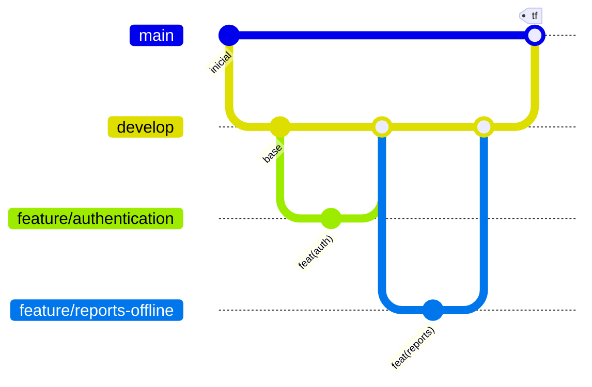

# Capítulo V: Product Implementation

## 5.1. Software Configuration Management

### 5.1.1. Software Development Environment Configuration

| Propósito | Herramienta | Versión | Justificación |
|---|---|---|---|
| Control de versiones | Git | 2.45 | Estándar del curso; requerido para GitFlow y Conventional Commits |
| Alojamiento y colaboración | GitHub (organización pública `sst-peru`) | — | Exigido por el enunciado: organización pública con evidencia de commits |
| Automatización | GitHub Actions | — | Integrado al repositorio, sin infraestructura adicional |
| Backend | Python | 3.13 | Soportado por Django 5.1 |
| Framework backend | Django + Django REST Framework | 5.1.4 / 3.15.2 | Django aporta ORM, migraciones, autenticación y panel de administración; DRF añade el API REST |
| Documentación del API | drf-spectacular | 0.28.0 | Genera OpenAPI desde el código, evitando que el contrato se desactualice |
| Autenticación | djangorestframework-simplejwt | 5.3.1 | JWT consumido igual por web y móvil |
| Exportación de evidencia | openpyxl | 3.1.5 | Generación de .xlsx sin dependencias externas |
| Base de datos | PostgreSQL / SQLite | 16 / 3 | PostgreSQL en despliegue; SQLite en desarrollo local |
| Frontend web | React + TypeScript + Vite | 18.3 / 5.7 / 6.0 | TypeScript da verificación estática del contrato del API; Vite acelera el ciclo de desarrollo |
| Estado del servidor en la web | TanStack Query | 5.62 | Manejo de caché e invalidación sin escribir un reducer por pantalla |
| Cliente HTTP web | Axios | 1.7 | Interceptores para JWT y renovación de token |
| Móvil | Kotlin + Jetpack Compose | 2.0.21 / BOM 2024.12 | Android nativo con interfaz declarativa |
| Persistencia local móvil | Room | 2.6.1 | Cola de reportes pendientes de envío |
| Sincronización móvil | WorkManager | 2.10.0 | Reintento con backoff al recuperar la conectividad |
| Red móvil | Retrofit + OkHttp | 2.11 / 4.12 | Cliente HTTP con interceptor de autenticación |
| Entorno de desarrollo | Visual Studio Code / Android Studio | — | Edición del backend y la web; compilación y emulación Android |
| Pruebas backend | pytest + pytest-django | 8.3 / 4.9 | Suite de pruebas del API |
| Análisis estático | ruff / ESLint / TypeScript | 0.8 / 9.17 / 5.7 | Verificación sin ejecutar el código |

### 5.1.2. Source Code Management

**Repositorios.** El producto se organiza en tres repositorios independientes más el del informe,
todos dentro de la organización pública `sst-peru`:

| Repositorio | Contenido |
|---|---|
| `sst-api` | API REST en Django; concentra el modelo de dominio y las reglas de negocio |
| `sst-web` | Panel web en React |
| `sst-mobile` | Aplicación Android nativa |
| `sst-report` | Este informe |

La separación responde a que cada uno tiene su propio ciclo de construcción, su propio pipeline
y su propio lenguaje; un monorepo habría obligado a ejecutar los tres pipelines ante cualquier
cambio.

**GitFlow.** Se aplica el flujo de ramas en los cuatro repositorios:



| Rama | Propósito | Sale de | Vuelve a |
|---|---|---|---|
| `main` | Solo versiones entregables, etiquetadas | — | — |
| `develop` | Integración del trabajo en curso | main | — |
| `feature/*` | Nueva funcionalidad | develop | develop |
| `fix/*` | Corrección de defecto | develop | develop |
| `docs/*` | Redacción del informe | develop | develop |
| `chore/*` | Infraestructura y configuración | develop | develop |

Reglas de protección aplicadas en GitHub: `main` y `develop` no aceptan push directo ni
force push; la integración ocurre exclusivamente por Pull Request; `develop` es la rama por
defecto, de modo que los PR apuntan ahí sin intervención.

**Conventional Commits.** Todos los mensajes siguen `tipo(alcance): descripción`. Ejemplos
reales del historial del proyecto:

```
feat(auth): agregar empresa, areas, usuario con roles y endpoints de registro y login
feat(reports): agregar reportes de actos y condiciones inseguras con cierre y bitacora
feat(sync): subir reportes pendientes con workmanager cuando vuelve la red
fix(reports): redondear la latitud y longitud del gps antes de validar
fix(auth)!: impedir que el registro publico elija su propio rol y agregar endpoint de usuarios
test(reports): cubrir creacion offline, permisos por rol y calculo de mttr
ci: agregar workflows de tests, lint y validacion de conventional commits
```

El signo `!` marca un cambio que rompe el contrato del API, como ocurrió al retirar el campo
`role` del registro público.

La convención se verifica en dos momentos: un hook `commit-msg` local la rechaza antes de crear
el commit, y un workflow de GitHub Actions la valida sobre todos los commits del Pull Request.
Tener ambas capas importa porque el hook local puede no estar instalado en una máquina nueva.

### 5.1.3. Source Code Style Guide & Conventions

| Ámbito | Convención | Verificación |
|---|---|---|
| Python | PEP 8 con línea de 100 caracteres; `ruff` con las reglas E, F, I, UP, B y DJ | `ruff check .` en CI |
| Nombres en Python | `snake_case` para funciones y variables, `PascalCase` para clases, español para el vocabulario de dominio y inglés para los nombres del framework | Revisión en PR |
| TypeScript | ESLint con reglas recomendadas más `react-hooks`; modo estricto de TypeScript con `noUnusedLocals` y `noUnusedParameters` | `npm run lint` y `npm run typecheck` en CI |
| Nombres en TypeScript | `camelCase` para variables y funciones, `PascalCase` para componentes y tipos | Revisión en PR |
| Kotlin | Estilo oficial de Kotlin (`kotlin.code.style=official`); composables en `PascalCase` | Compilación en CI |
| CSS | Propiedades personalizadas para toda la paleta; sin valores de color literales fuera de `:root` | Revisión en PR |
| Comentarios | Se comenta el **porqué**, no el qué. Un comentario que repite el código se elimina en revisión | Revisión en PR |
| Fin de línea | LF en el repositorio, forzado por `.gitattributes`; CRLF solo en `.bat`, `.cmd` y `.ps1` | `.gitattributes` |
| Idioma | Código y mensajes de commit sin tildes ni eñes; interfaz y documentación en español correcto | Revisión en PR |

### 5.1.4. Software Deployment Configuration

| Componente | Configuración |
|---|---|
| API | Variables de entorno mediante archivo `.env` (`DEBUG`, `SECRET_KEY`, `ALLOWED_HOSTS`, `DATABASE_URL`, `CORS_ALLOWED_ORIGINS`). `DATABASE_URL` vacío usa SQLite; con valor, PostgreSQL |
| Web | `VITE_API_URL` define el API consumido. En desarrollo, Vite hace proxy de `/api` al backend, evitando CORS |
| Móvil | `API_BASE_URL` se inyecta como `buildConfigField` en Gradle. En emulador, `http://10.0.2.2:8000/api/v1/`, que es la dirección con la que el emulador alcanza el `localhost` del anfitrión |
| Tráfico en claro | `network_security_config.xml` permite HTTP sin cifrar únicamente contra direcciones de desarrollo; en producción el API va por HTTPS |
| Secretos | Ningún secreto se versiona: `.env` está en `.gitignore` y se distribuye `.env.example` con los nombres de variable |

> **PENDIENTE — despliegue.** Documentar aquí el despliegue real cuando esté hecho: proveedor
> (Render, Railway, Fly.io o similar para el API; Vercel o Netlify para la web), URL pública de
> cada entorno, y procedimiento de migración de base de datos en el despliegue.

