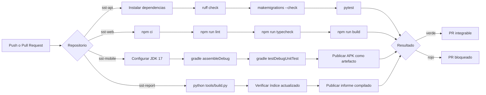

# Capítulo VII: DevOps Practices

## 7.1. Continuous Integration

### 7.1.1. Tools and Practices

| Herramienta | Rol en el pipeline |
|---|---|
| GitHub Actions | Orquestador de la integración continua en los cuatro repositorios |
| pytest + pytest-django | Suite de pruebas del API |
| ruff | Análisis estático de Python |
| ESLint + TypeScript | Análisis estático y verificación de tipos de la aplicación web |
| Gradle | Compilación y pruebas unitarias de la aplicación Android |
| Hook `commit-msg` + workflow de commitlint | Verificación de Conventional Commits |
| Reglas de protección de rama | Impiden integrar sin pasar por Pull Request |

**Prácticas adoptadas**

1. **Integración frecuente en ramas cortas.** Cada funcionalidad vive en una rama `feature/`
   que se integra a `develop` mediante Pull Request, en lugar de acumular semanas de trabajo.
2. **El pipeline se ejecuta en cada push y en cada Pull Request** hacia `main` y `develop`.
3. **Ningún PR se integra con el pipeline en rojo.**
4. **La convención de commits se verifica dos veces**: localmente en el hook, que da
   retroalimentación inmediata, y en CI, que es la verificación que no se puede omitir.
5. **Las migraciones pendientes rompen la construcción.** El API ejecuta
   `makemigrations --check --dry-run`: si alguien cambió un modelo sin generar la migración, el
   PR falla. Sin esta verificación, el error aparece en el despliegue.

### 7.1.2. Build & Test Suite Pipeline Components

**Componentes por repositorio**

| Repositorio | Workflow | Pasos |
|---|---|---|
| `sst-api` | `ci.yml` | Checkout → Python 3.11 con caché de pip → instalar `requirements-dev.txt` → `ruff check .` → `makemigrations --check --dry-run` → `pytest -q` |
| `sst-api` | `commitlint.yml` | Validar el formato de todos los commits del PR |
| `sst-web` | `ci.yml` | Checkout → Node 20 con caché de npm → `npm ci` → `npm run lint` → `npm run typecheck` → `npm run build` |
| `sst-web` | `commitlint.yml` | Validar el formato de los commits del PR |
| `sst-mobile` | `ci.yml` | Checkout → JDK 17 Temurin → Gradle → `assembleDebug` → `testDebugUnitTest` → publicar `app-debug.apk` como artefacto |
| `sst-mobile` | `commitlint.yml` | Validar el formato de los commits del PR |
| `sst-report` | `informe.yml` | Compilar el informe, verificar que el índice esté actualizado y publicar `informe-completo.md` |
| `sst-report` | `commitlint.yml` | Validar el formato de los commits del PR |

<!-- IMAGEN REQUERIDA: capturas de la pestaña Actions de cada repositorio mostrando
     ejecuciones exitosas, en assets/img/pipeline-ci-<repo>.png -->

