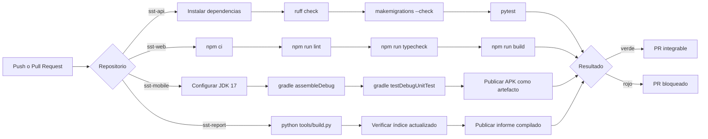
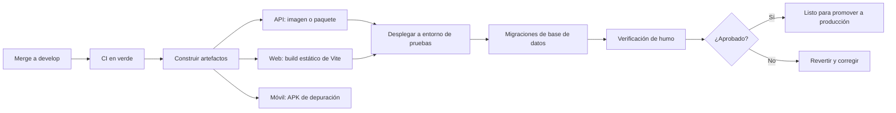
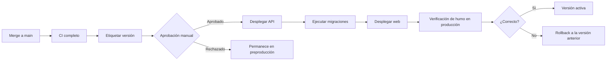

# Capítulo VII: DevOps Practices

## 7.1. Continuous Integration

### 7.1.1. Tools and Practices

| Herramienta | Rol en el pipeline |
|---|---|
| GitHub Actions | Orquestador de la integración continua en los cuatro repositorios |
| pytest + pytest-django | Suite de pruebas del API |
| ruff | Análisis estático de Python |
| ESLint + TypeScript | Análisis estático y verificación de tipos de la aplicación web |
| Gradle | Compilación y pruebas unitarias de la aplicación Android |
| Hook `commit-msg` + workflow de commitlint | Verificación de Conventional Commits |
| Reglas de protección de rama | Impiden integrar sin pasar por Pull Request |

**Prácticas adoptadas**

1. **Integración frecuente en ramas cortas.** Cada funcionalidad vive en una rama `feature/`
   que se integra a `develop` mediante Pull Request, en lugar de acumular semanas de trabajo.
2. **El pipeline se ejecuta en cada push y en cada Pull Request** hacia `main` y `develop`.
3. **Ningún PR se integra con el pipeline en rojo.**
4. **La convención de commits se verifica dos veces**: localmente en el hook, que da
   retroalimentación inmediata, y en CI, que es la verificación que no se puede omitir.
5. **Las migraciones pendientes rompen la construcción.** El API ejecuta
   `makemigrations --check --dry-run`: si alguien cambió un modelo sin generar la migración, el
   PR falla. Sin esta verificación, el error aparece en el despliegue.

### 7.1.2. Build & Test Suite Pipeline Components

**Componentes por repositorio**

| Repositorio | Workflow | Pasos |
|---|---|---|
| `sst-api` | `ci.yml` | Checkout → Python 3.11 con caché de pip → instalar `requirements-dev.txt` → `ruff check .` → `makemigrations --check --dry-run` → `pytest -q` |
| `sst-api` | `commitlint.yml` | Validar el formato de todos los commits del PR |
| `sst-web` | `ci.yml` | Checkout → Node 20 con caché de npm → `npm ci` → `npm run lint` → `npm run typecheck` → `npm run build` |
| `sst-web` | `commitlint.yml` | Validar el formato de los commits del PR |
| `sst-mobile` | `ci.yml` | Checkout → JDK 17 Temurin → Gradle → `assembleDebug` → `testDebugUnitTest` → publicar `app-debug.apk` como artefacto |
| `sst-mobile` | `commitlint.yml` | Validar el formato de los commits del PR |
| `sst-report` | `informe.yml` | Compilar el informe, verificar que el índice esté actualizado y publicar `informe-completo.md` |
| `sst-report` | `commitlint.yml` | Validar el formato de los commits del PR |

<!-- IMAGEN REQUERIDA: capturas de la pestaña Actions de cada repositorio mostrando
     ejecuciones exitosas, en assets/img/pipeline-ci-<repo>.png -->

## 7.2. Continuous Delivery

### 7.2.1. Tools and Practices

La entrega continua asegura que cualquier commit integrado en `develop` esté en condiciones de
ser desplegado, sin trabajo manual adicional.

| Herramienta | Rol previsto |
|---|---|
| GitHub Actions | Construcción de artefactos desplegables |
| Artefactos de Actions | APK de depuración publicado en cada ejecución del pipeline móvil |
| Docker | <!-- COMPLETAR: empaquetado del API si se adopta --> |
| Render / Railway / Fly.io | Entorno de despliegue del API |
| Vercel / Netlify | Entorno de despliegue de la aplicación web |

**Prácticas adoptadas**

1. **El artefacto se construye una sola vez** y es el mismo que se promueve entre entornos; no
   se reconstruye por entorno.
2. **La configuración viaja por variables de entorno**, no dentro del artefacto, de modo que el
   mismo build sirve para desarrollo y producción.
3. **Toda migración de base de datos se ejecuta como parte del despliegue**, no manualmente.

### 7.2.2. Stages Deployment Pipeline Components

> **PENDIENTE — implementación.** Los pipelines de construcción existen y publican artefactos;
> el despliegue automatizado a un entorno de pruebas está diseñado pero **no implementado
> todavía**. Debe documentarse honestamente como tal hasta que se ejecute, indicando después el
> proveedor elegido y adjuntando la evidencia del despliegue.

## 7.3. Continuous Deployment

### 7.3.1. Tools and Practices

El despliegue continuo lleva a producción, sin intervención manual, todo cambio integrado en
`main` que haya superado el pipeline.

**Decisión de alcance.** Para este proyecto se adopta **entrega continua con aprobación manual
para producción**, y no despliegue continuo pleno. La razón es de dominio, no técnica: el
sistema sostiene registros con valor legal ante una fiscalización, y un despliegue defectuoso
que corrompa la trazabilidad de un hallazgo tiene consecuencias que exceden la molestia de un
usuario. La promoción a producción requiere aprobación explícita.

| Herramienta | Rol previsto |
|---|---|
| GitHub Actions con *environments* | Despliegue a producción con regla de aprobación requerida |
| Migraciones de Django | Ejecutadas automáticamente antes de activar la nueva versión |
| Etiquetas de versión | Cada despliegue a producción corresponde a un tag en `main` |

### 7.3.2. Production Deployment Pipeline Components

> **PENDIENTE — implementación.** Documentar el despliegue real cuando se ejecute: URL de
> producción, proveedor, procedimiento de rollback probado y evidencia de al menos un despliegue
> completo. <!-- IMAGEN REQUERIDA: captura del despliegue exitoso en
> assets/img/pipeline-deploy.png -->

## 7.4. Continuous Monitoring

### 7.4.1. Tools and Practices

El monitoreo continuo cumple aquí una doble función: vigilar la salud técnica del sistema y
alimentar el experimento con los datos de producto que la hipótesis necesita.

| Dimensión | Qué se observa | Herramienta prevista |
|---|---|---|
| Disponibilidad | El API responde correctamente | Verificación periódica de un endpoint de salud |
| Errores de aplicación | Excepciones no controladas en el backend y en los clientes | Sentry u otro agregador de errores |
| Rendimiento | Latencia de los endpoints más usados | Métricas del proveedor de despliegue |
| Sincronización móvil | Proporción de reportes que llegan marcados como `synced_offline` y reintentos fallidos | Consulta sobre el propio modelo de datos |
| Métricas de producto | Reportes por usuario y por variante, MTTR, cumplimiento de inspecciones | Endpoints `metrics/` y `experiments/{key}/results/` del propio sistema |

**Decisión de diseño.** Las métricas del experimento no dependen de una herramienta de analítica
externa: la variante del formulario se guarda en el propio reporte (`form_variant`) y los
indicadores se calculan sobre la base de datos. Esto evita la pérdida de eventos por bloqueadores
o por falta de conectividad —precisamente el escenario de uso del producto— y hace que el dato
del experimento sea tan confiable como el dato operativo.

